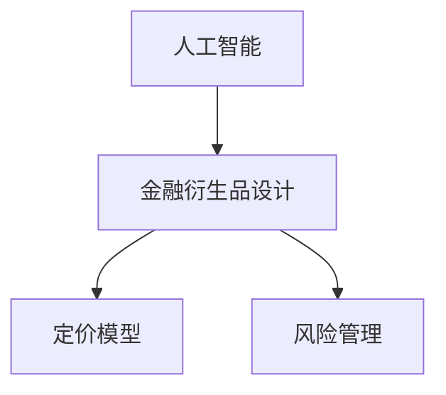
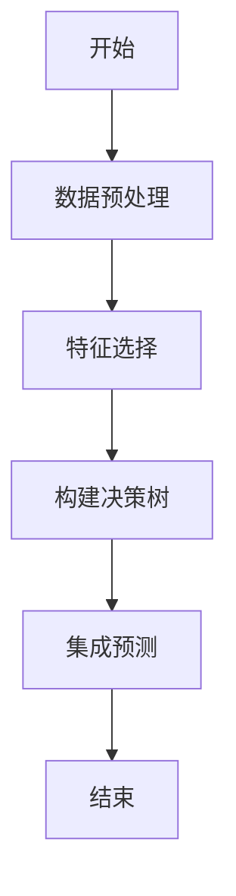
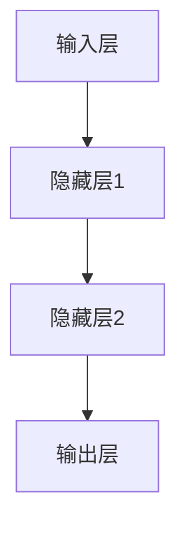
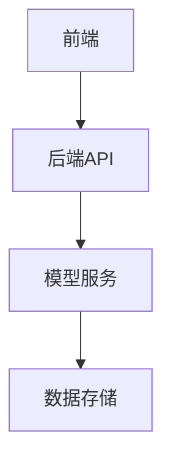
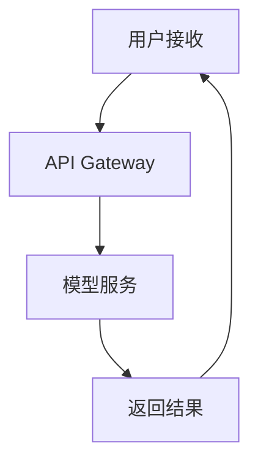

                 


# AI在金融衍生品设计中的创新应用

## 关键词：人工智能、金融衍生品、机器学习、风险管理、量化交易、神经网络

## 摘要：
随着人工智能技术的迅速发展，其在金融领域的应用也愈发广泛。本文将探讨AI在金融衍生品设计中的创新应用，涵盖背景介绍、核心概念、算法原理、系统架构、项目实战以及总结等部分。通过详细分析，本文旨在揭示AI如何优化金融衍生品的设计流程，提升定价模型的准确性，加强风险控制，并为读者提供实际的项目案例和最佳实践建议。

---

# 第一部分：背景介绍

## 第1章：AI与金融衍生品概述

### 1.1 人工智能的基本概念

#### 1.1.1 人工智能的定义与特点
人工智能（Artificial Intelligence, AI）是指通过模拟人类智能的计算机系统，具备学习、推理、感知和决策的能力。其特点包括数据驱动、自动化决策、自适应优化等。

#### 1.1.2 人工智能的核心技术
- 机器学习（Machine Learning）
- 深度学习（Deep Learning）
- 自然语言处理（NLP）
- 计算机视觉（Computer Vision）
- 强化学习（Reinforcement Learning）

#### 1.1.3 人工智能在金融领域的应用现状
人工智能在金融领域的应用包括量化交易、风险评估、客户画像、欺诈检测等。AI技术的引入显著提高了金融市场的效率和准确性。

### 1.2 金融衍生品的基本概念

#### 1.2.1 金融衍生品的定义与分类
金融衍生品是以基础资产为标的的金融工具，包括期权、期货、掉期和互换等。它们可以用于对冲风险或投机获利。

#### 1.2.2 金融衍生品的功能与作用
- 价格发现
- 风险管理
- 流动性提供
- 投资多样化

#### 1.2.3 金融衍生品的市场现状
金融衍生品市场规模庞大，且随着市场波动的加剧，其在金融体系中的作用日益重要。

### 1.3 AI在金融衍生品中的创新应用

#### 1.3.1 AI在金融衍生品设计中的优势
AI能够处理海量数据，发现复杂模式，从而优化衍生品的设计流程。

#### 1.3.2 AI在金融衍生品定价中的应用
通过机器学习模型，AI能够预测市场价格波动，优化定价策略。

#### 1.3.3 AI在金融衍生品风险管理中的作用
AI能够实时监控市场风险，识别潜在的系统性风险，帮助制定有效的风险管理策略。

---

## 第2章：AI与金融衍生品的核心概念与联系

### 2.1 AI在金融衍生品设计中的核心概念

#### 2.1.1 机器学习模型在金融衍生品设计中的应用
机器学习模型能够分析历史数据，预测未来价格走势，帮助设计更合理的衍生品。

#### 2.1.2 大数据分析在金融衍生品设计中的作用
大数据分析能够提取市场信息，识别潜在风险，优化衍生品的定价模型。

#### 2.1.3 AI算法在金融衍生品定价中的原理
AI算法通过学习市场数据，构建定价模型，优化定价策略。

### 2.2 AI与金融衍生品设计的核心联系

#### 2.2.1 AI如何优化金融衍生品的设计流程
AI能够自动化处理数据，发现潜在模式，缩短设计周期。

#### 2.2.2 AI如何提升金融衍生品的风险评估能力
AI通过实时数据分析，识别市场风险，提高风险评估的准确性。

#### 2.2.3 AI如何提高金融衍生品的市场流动性
AI能够优化定价模型，提高市场参与度，增强流动性。

### 2.3 AI与金融衍生品设计的实体关系图



---

## 第3章：AI算法原理与数学模型

### 3.1 随机森林算法原理

#### 3.1.1 随机森林的定义
随机森林是一种基于决策树的集成学习方法，通过构建多棵决策树并进行投票或平均来提高预测准确率。

#### 3.1.2 随机森林的工作流程



#### 3.1.3 随机森林在金融衍生品定价中的应用
通过随机森林模型，可以分析多个影响价格的因素，构建高精度的定价模型。

#### 3.1.4 Python代码实现

```python
import pandas as pd
from sklearn.ensemble import RandomForestRegressor

# 加载数据
data = pd.read_csv('derivative_data.csv')

# 定义特征和目标变量
X = data.drop('price', axis=1)
y = data['price']

# 创建随机森林回归模型
model = RandomForestRegressor(n_estimators=100, random_state=42)
model.fit(X, y)

# 预测价格
predicted_price = model.predict(X)
```

#### 3.1.5 数学模型与公式
随机森林模型的预测公式可以表示为多个决策树的集成结果：

$$
y = \frac{1}{n} \sum_{i=1}^{n} T_i(x)
$$

其中，$T_i(x)$表示第i棵决策树的预测值，$n$为决策树的数量。

### 3.2 神经网络算法原理

#### 3.2.1 神经网络的定义
神经网络是一种模拟人脑神经元结构的计算模型，能够通过多层的非线性变换来学习数据特征。

#### 3.2.2 神经网络的工作流程



#### 3.2.3 神经网络在金融衍生品风险管理中的应用
通过神经网络模型，可以实时监控市场风险，预测潜在的极端事件。

#### 3.2.4 Python代码实现

```python
import numpy as np
import tensorflow as tf

# 定义神经网络模型
model = tf.keras.Sequential([
    tf.keras.layers.Dense(64, activation='relu'),
    tf.keras.layers.Dense(1, activation='linear')
])

# 编译模型
model.compile(optimizer='adam', loss='mean_squared_error')

# 训练模型
model.fit(X_train, y_train, epochs=100, batch_size=32)
```

#### 3.2.5 数学模型与公式
神经网络的输出可以表示为输入向量与权重矩阵的非线性变换：

$$
y = W_2 \cdot \sigma(W_1 \cdot x + b_1) + b_2
$$

其中，$W_1$和$W_2$为权重矩阵，$b_1$和$b_2$为偏置项，$\sigma$为激活函数。

---

## 第4章：系统分析与架构设计

### 4.1 系统架构设计

#### 4.1.1 系统功能需求
- 数据采集与处理
- 模型训练与优化
- 风险评估与预警
- 结果展示与报告

#### 4.1.2 系统架构图



### 4.2 系统接口设计

#### 4.2.1 API接口定义
- 数据接口：`GET /data`
- 模型接口：`POST /predict`
- 报告接口：`GET /report`

#### 4.2.2 接口交互流程



---

## 第5章：项目实战

### 5.1 环境搭建与数据准备

#### 5.1.1 环境安装
- 安装Python和必要的库：`pip install numpy pandas scikit-learn tensorflow`

#### 5.1.2 数据准备
加载金融衍生品的历史数据，包括价格、波动率、市场指数等。

### 5.2 系统核心实现

#### 5.2.1 数据预处理
- 数据清洗：处理缺失值、异常值
- 特征工程：提取有用的特征，如移动平均线、相对强弱指数等。

#### 5.2.2 模型训练
选择合适的机器学习模型（如随机森林或神经网络），进行训练和优化。

### 5.3 案例分析与结果解读

#### 5.3.1 案例分析
以期权定价为例，使用随机森林模型进行预测。

#### 5.3.2 结果解读
通过模型预测结果，分析市场的波动趋势，优化定价策略。

### 5.4 项目总结

#### 5.4.1 项目成果
成功构建了基于AI的金融衍生品设计系统，提高了定价模型的准确性。

#### 5.4.2 项目经验
数据质量和模型选择对系统性能有重要影响，需谨慎处理。

---

## 第6章：总结与展望

### 6.1 最佳实践 tips
- 数据质量是AI模型性能的基础，需确保数据的完整性和准确性。
- 模型选择需结合实际业务需求，合理配置计算资源。
- 定期更新模型，适应市场环境的变化。

### 6.2 小结
本文详细探讨了AI在金融衍生品设计中的创新应用，从理论到实践，为读者提供了系统的知识和实际操作的经验。

### 6.3 注意事项
- 风险管理是金融衍生品设计的核心，需严格控制模型风险。
- 法律法规的合规性是金融项目的重要考量，需遵守相关监管要求。

### 6.4 拓展阅读
- 推荐阅读《机器学习在金融中的应用》和《深度学习与金融衍生品定价》等书籍，深入学习相关知识。

---

# 结语

AI技术正在深刻改变金融衍生品的设计与交易方式，通过创新的应用，AI能够为金融市场带来更高的效率和准确性。未来，随着技术的不断发展，AI在金融衍生品中的应用将更加广泛和深入，为金融行业注入新的活力。

