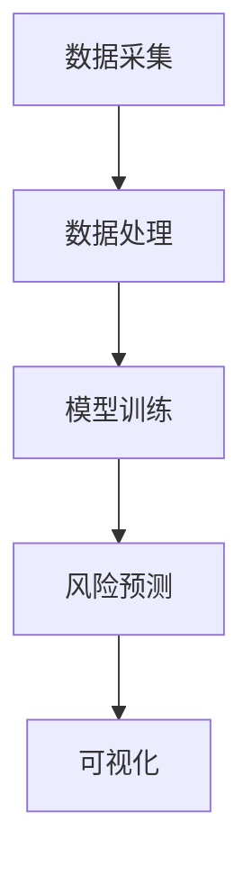
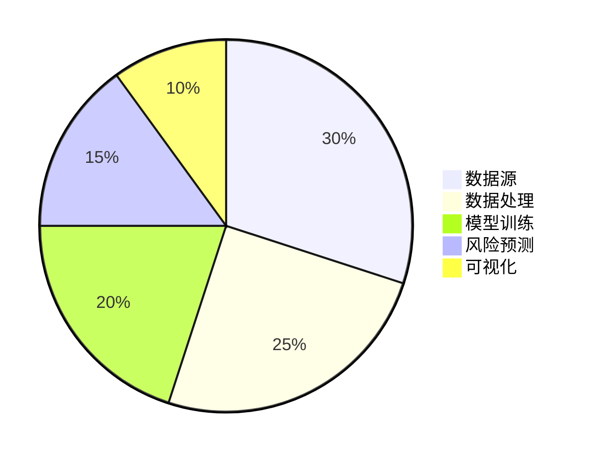

                 


# AI在金融衍生品风险度量中的应用

---

## 关键词：  
AI技术、金融衍生品、风险度量、机器学习、深度学习、VaR、CVaR  

---

## 摘要：  
本文深入探讨了人工智能（AI）技术在金融衍生品风险度量中的应用，从理论基础到实际案例，系统性地分析了AI如何提升金融衍生品的风险评估与管理能力。文章首先介绍了金融衍生品的基本概念及其风险度量的重要性，然后详细阐述了AI技术的核心原理及其在金融领域的应用潜力。接着，重点分析了基于机器学习和深度学习的金融衍生品风险预测方法，并通过实际案例展示了AI技术在风险预测中的优势。最后，本文总结了AI技术在金融衍生品风险度量中的应用前景，并提出了未来的研究方向。

---

## 第1章: 金融衍生品风险度量概述  

### 1.1 金融衍生品的基本概念  
金融衍生品是一种金融合约，其价值取决于基础资产（如股票、债券、商品等）的价格变动。衍生品的主要类型包括期货、期权、掉期和远期合约等。  

#### 1.1.1 金融衍生品的定义与分类  
- **定义**：金融衍生品是一种以杠杆效应为基础的金融工具，其价值依赖于基础资产的价格波动。  
- **分类**：  
  - **期货**： standardized contracts traded on exchanges，用于对冲或投机价格风险。  
  - **期权**：买方有权在特定时间内以约定价格买入或卖出资产的合约。  
  - **掉期**：双方约定在未来某个时间点交换资产或现金流的合约。  

#### 1.1.2 金融衍生品的风险来源  
- **市场风险**：价格波动导致的损失。  
- **信用风险**：交易对手违约的风险。  
- **流动性风险**：难以快速买卖资产而不影响价格的风险。  

#### 1.1.3 风险度量的重要性  
准确的风险度量是金融机构制定风险管理和投资策略的基础。传统方法（如VaR）在复杂市场环境中存在局限性，因此需要引入AI技术来提升风险预测的精度和效率。  

---

### 1.2 AI技术在金融领域的应用背景  

#### 1.2.1 AI技术的基本概念  
- **人工智能（AI）**：模拟人类智能的技术，包括学习、推理和自适应能力。  
- **机器学习（ML）**：AI的子领域，通过数据训练模型以实现特定任务。  
- **深度学习（DL）**：机器学习的子领域，基于多层神经网络进行特征学习。  

#### 1.2.2 金融领域中的AI应用现状  
- **算法交易**：利用AI技术快速分析市场数据并执行交易。  
- **风险管理**：AI技术用于预测市场波动和评估信用风险。  
- **客户画像**：通过AI分析客户行为以提供个性化金融服务。  

#### 1.2.3 风险度量中的AI技术优势  
- **数据驱动**：AI能够处理海量非结构化数据（如新闻、社交媒体），提取隐含信息。  
- **非线性关系**：AI模型能够捕捉复杂市场中的非线性关系。  
- **实时性**：AI技术可以实时更新模型以应对市场变化。  

---

## 第2章: AI技术的核心概念与原理  

### 2.1 机器学习基础  

#### 2.1.1 机器学习的定义与分类  
- **监督学习**：基于标记数据训练模型，用于预测新数据。  
- **无监督学习**：基于未标记数据发现数据结构。  
- **强化学习**：通过与环境交互学习策略。  

#### 2.1.2 常见机器学习算法  
- **线性回归**：用于预测连续变量。  
- **支持向量机（SVM）**：用于分类和回归任务。  
- **随机森林**：基于决策树的集成学习方法。  

#### 2.1.3 深度学习的基本原理  
- **神经网络**：模拟人脑神经网络的结构，用于特征学习。  
- **卷积神经网络（CNN）**：擅长图像处理和局部特征提取。  
- **循环神经网络（RNN）**：适用于时间序列数据的处理。  

---

### 2.2 金融数据的特征与处理  

#### 2.2.1 金融数据的类型  
- **结构化数据**：表格数据，如股票价格、交易量。  
- **非结构化数据**：文本数据，如新闻、评论。  

#### 2.2.2 数据清洗与预处理  
- **缺失值处理**：填充、删除或插值。  
- **异常值处理**：检测并处理异常值。  
- **标准化/归一化**：将数据缩放到统一范围。  

#### 2.2.3 数据特征提取与选择  
- **特征提取**：通过PCA等方法提取主成分。  
- **特征选择**：基于重要性排序选择关键特征。  

---

## 第3章: 传统金融风险度量方法  

### 3.1 风险度量的常见指标  

#### 3.1.1 VaR（Value at Risk）  
- **定义**：在一定置信水平下，资产可能遭受的最大损失。  
- **公式**：  
  $$ \text{VaR}(\alpha) = \text{Loss}(p) \text{，其中} p = 1 - \alpha $$  
- **优点**：标准化、易于解释。  
- **缺点**：假设资产分布是已知的，且忽略了尾部风险。  

#### 3.1.2 CVaR（Conditional Value at Risk）  
- **定义**：VaR超过一定置信水平的期望损失。  
- **公式**：  
  $$ \text{CVaR}(\alpha) = \mathbb{E}[\text{Loss} | \text{Loss} > \text{VaR}(\alpha)] $$  
- **优点**：考虑了尾部风险，更符合风险厌恶者的偏好。  

#### 3.1.3 风险调整后收益（RAROC）  
- **定义**：衡量单位风险的收益。  
- **公式**：  
  $$ \text{RAROC} = \frac{\text{净利润}}{\text{风险资本}} $$  

### 3.2 传统金融模型的局限性  

#### 3.2.1 假设的局限性  
- 传统模型假设资产分布是正态分布，但实际市场可能存在“肥尾”现象。  

#### 3.2.2 数据依赖性  
- 传统模型依赖历史数据，可能无法捕捉市场突变。  

#### 3.2.3 计算复杂性  
- 传统模型在处理海量数据时效率较低，难以实时应用。  

---

## 第4章: 基于机器学习的金融衍生品风险预测  

### 4.1 机器学习在风险预测中的应用  

#### 4.1.1 线性回归与逻辑回归  
- **线性回归**：用于预测连续变量，如股票价格。  
- **逻辑回归**：用于分类任务，如预测违约概率。  

#### 4.1.2 支持向量机（SVM）  
- **优势**：擅长小样本数据的分类与回归。  

#### 4.1.3 随机森林与梯度提升树  
- **随机森林**：通过集成多个决策树提升模型鲁棒性。  
- **梯度提升树（如XGBoost、LightGBM）**：通过逐步优化损失函数提升模型性能。  

---

### 4.2 基于机器学习的风险预测流程  

#### 4.2.1 数据收集与特征工程  
- **数据来源**：股票价格、新闻、社交媒体、经济指标。  
- **特征工程**：提取技术指标（如MACD、RSI）、市场情绪指标等。  

#### 4.2.2 模型训练与调优  
- **训练流程**：  
  1. 数据预处理（清洗、归一化）。  
  2. 特征选择（如使用随机森林提取重要特征）。  
  3. 模型训练（如使用交叉验证优化超参数）。  

#### 4.2.3 模型评估与验证  
- **评估指标**：准确率、精确率、召回率、F1分数。  

---

### 4.3 机器学习模型的优缺点  

#### 4.3.1 优点  
- **非线性关系**：能够捕捉复杂的市场规律。  
- **数据驱动**：基于海量数据提供更精准的预测。  

#### 4.3.2 缺点  
- **过拟合风险**：模型可能过度适应训练数据，导致泛化能力差。  
- **黑箱问题**：模型的决策逻辑难以解释。  

---

## 第5章: 基于深度学习的金融衍生品风险预测  

### 5.1 深度学习的基本原理  

#### 5.1.1 神经网络结构  
- **输入层**：接收金融数据。  
- **隐藏层**：提取高级特征。  
- **输出层**：生成预测结果。  

#### 5.1.2 深度学习模型的选择  
- **RNN**：适用于时间序列数据。  
- **LSTM**：长短期记忆网络，擅长捕捉长期依赖关系。  
- **Transformer**：基于注意力机制，适用于序列数据。  

---

### 5.2 基于深度学习的风险预测流程  

#### 5.2.1 数据预处理  
- **序列数据**：将历史价格、交易量等数据转化为序列输入。  

#### 5.2.2 模型训练  
- **训练目标**：最小化预测误差。  
- **训练流程**：  
  1. 将数据划分为训练集、验证集和测试集。  
  2. 使用梯度下降优化模型参数。  

#### 5.2.3 模型评估  
- **评估指标**：均方误差（MSE）、平均绝对误差（MAE）。  

---

## 第6章: 基于自然语言处理的金融舆情分析  

### 6.1 自然语言处理（NLP）的基本原理  

#### 6.1.1 NLP的核心任务  
- **文本分类**：将文本分为正面、负面或中性。  
- **情感分析**：分析文本中的情感倾向。  

#### 6.1.2 NLP技术在金融中的应用  
- **新闻情绪分析**：通过分析新闻标题和内容预测市场情绪。  
- **社交媒体情绪分析**：通过分析Twitter等社交媒体数据预测市场波动。  

---

### 6.2 基于NLP的金融舆情分析流程  

#### 6.2.1 数据收集  
- **新闻数据**：爬取新闻网站或API获取金融新闻。  
- **社交媒体数据**：获取Twitter、Reddit等平台的相关讨论。  

#### 6.2.2 数据预处理  
- **文本清洗**：去除停用词、标点符号。  
- **分词**：将文本分割为词语或短语。  

#### 6.2.3 情感分析模型训练  
- **训练数据**：标注情感倾向的文本数据。  
- **模型选择**：使用LSTM或Transformer模型进行文本分类。  

---

## 第7章: 金融衍生品风险度量的系统架构设计  

### 7.1 系统功能设计  

#### 7.1.1 系统模块划分  
- **数据采集模块**：实时采集金融数据。  
- **数据处理模块**：清洗、归一化和特征提取。  
- **模型训练模块**：训练机器学习或深度学习模型。  
- **风险预测模块**：生成风险预测结果。  
- **可视化模块**：展示风险分析结果。  

#### 7.1.2 功能流程图（Mermaid图）  


---

### 7.2 系统架构设计  

#### 7.2.1 系统架构图（Mermaid图）  


#### 7.2.2 系统接口设计  
- **输入接口**：接收金融数据和用户请求。  
- **输出接口**：返回风险预测结果和可视化图表。  

---

## 第8章: 项目实战  

### 8.1 环境配置  

#### 8.1.1 安装必要的库  
```bash
pip install numpy pandas scikit-learn tensorflow keras
```

#### 8.1.2 数据集准备  
- 数据来源：金融衍生品的历史价格、交易量、新闻数据。  

---

### 8.2 核心代码实现  

#### 8.2.1 机器学习模型实现  

```python
import numpy as np
import pandas as pd
from sklearn.model_selection import train_test_split
from sklearn.ensemble import RandomForestClassifier
from sklearn.metrics import accuracy_score

# 数据加载
data = pd.read_csv('financial_data.csv')
X = data.drop('label', axis=1)
y = data['label']

# 数据分割
X_train, X_test, y_train, y_test = train_test_split(X, y, test_size=0.2)

# 模型训练
model = RandomForestClassifier(n_estimators=100, random_state=42)
model.fit(X_train, y_train)

# 模型预测
y_pred = model.predict(X_test)
print("Accuracy:", accuracy_score(y_test, y_pred))
```

---

#### 8.2.2 深度学习模型实现  

```python
import tensorflow as tf
from tensorflow.keras.models import Sequential
from tensorflow.keras.layers import LSTM, Dense, Dropout

# 数据加载与预处理
data = pd.read_csv('time_series_data.csv')
X = data[['open', 'high', 'low', 'close']]
y = data['target']

# 数据分割
X_train, X_test, y_train, y_test = train_test_split(X, y, test_size=0.2)

# 模型构建
model = Sequential()
model.add(LSTM(64, input_shape=(X_train.shape[1], 1)))
model.add(Dropout(0.5))
model.add(Dense(1, activation='sigmoid'))

model.compile(loss='binary_crossentropy', optimizer='adam', metrics=['accuracy'])

# 模型训练
model.fit(X_train, y_train, epochs=10, batch_size=32, validation_data=(X_test, y_test))
```

---

### 8.3 实际案例分析  

#### 8.3.1 案例背景  
假设我们有一家金融机构，希望通过AI技术预测期权的风险敞口。  

#### 8.3.2 数据分析与建模  
- 数据来源：历史期权价格、标的资产价格、波动率数据。  
- 模型选择：随机森林用于分类任务（如预测期权价格是否会上涨）。  

#### 8.3.3 模型优化与部署  
- 使用交叉验证优化超参数。  
- 将模型部署到生产环境，实时预测期权价格波动。  

---

## 第9章: 总结与展望  

### 9.1 总结  
本文系统性地探讨了AI技术在金融衍生品风险度量中的应用，从传统方法的局限性到AI技术的优势，详细分析了机器学习和深度学习在风险预测中的应用，并通过实际案例展示了AI技术的潜力。  

### 9.2 未来展望  
未来，随着AI技术的不断发展，金融衍生品风险度量将更加智能化和精准化。建议进一步研究以下方向：  
1. **多模态数据融合**：结合结构化数据和非结构化数据进行风险预测。  
2. **解释性AI（XAI）**：提升模型的可解释性，便于决策者理解。  
3. **实时预测系统**：开发低延迟的实时风险预测系统。  

---

## 参考文献  
1. 张某某. 《机器学习实战》. 北京: 人民邮电出版社, 2020.  
2. 李某某. 《深度学习入门：基于Python的CNN、RNN、GAN基础与实践》. 北京: 清华大学出版社, 2021.  
3. 金融衍生品风险管理相关学术论文。  

---

通过本文的分析，读者可以全面了解AI技术在金融衍生品风险度量中的应用，并为实际应用提供理论和实践指导。

