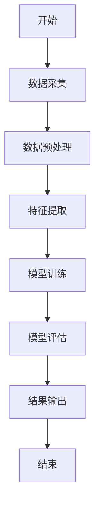
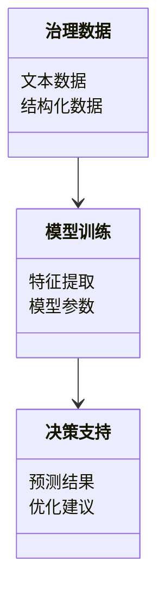
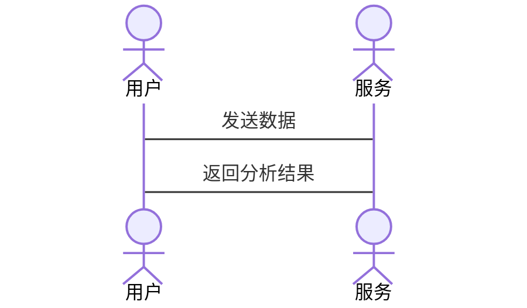

                 


# AI增强型公司治理效能评估工具

## 关键词：AI、公司治理、效能评估、工具开发、算法设计

## 摘要：  
随着人工智能技术的快速发展，AI在企业治理中的应用越来越广泛。本文将详细介绍如何利用AI技术构建公司治理效能评估工具，从背景分析、核心概念、算法原理到系统架构和项目实战，全面解析AI在提升公司治理效率和效果中的作用。

---

## 第1章: 背景介绍

### 1.1 问题背景

#### 1.1.1 公司治理的传统模式与局限性
传统公司治理主要依赖于人工决策和经验判断，存在效率低、主观性强、难以量化等问题。随着企业规模扩大和复杂性增加，传统方法难以应对现代治理的挑战。

#### 1.1.2 AI技术在现代企业治理中的潜力
AI技术能够通过数据分析、模式识别和预测建模，帮助企业在治理中实现数据驱动的决策，提升效率和准确性。

#### 1.1.3 当前公司治理面临的挑战与痛点
企业面临治理数据分散、决策滞后、风险预测不足等问题，亟需通过技术手段优化治理流程。

### 1.2 问题描述

#### 1.2.1 公司治理效能的定义与衡量标准
治理效能包括决策效率、风险控制能力、透明度等指标，需要通过量化方法进行评估。

#### 1.2.2 AI技术如何赋能公司治理
通过AI技术，企业可以实现数据的自动分析、实时监控和智能预测，从而优化治理流程。

#### 1.2.3 企业治理中的数据驱动决策
数据驱动决策是通过分析大量数据，利用AI算法生成洞察，辅助企业做出更科学的决策。

### 1.3 问题解决

#### 1.3.1 AI增强型治理工具的核心目标
构建一个基于AI的评估工具，能够实时监控企业治理指标，提供智能化的决策支持。

#### 1.3.2 数据分析与AI算法在治理中的应用
通过自然语言处理（NLP）分析企业文档，利用机器学习模型预测治理风险。

#### 1.3.3 提升公司治理效率的具体措施
优化数据采集流程，建立数据驱动的决策机制，引入AI算法进行预测和优化。

### 1.4 边界与外延

#### 1.4.1 AI增强型治理工具的适用范围
适用于需要数据驱动决策的企业，尤其适合处理复杂性和不确定性较高的治理场景。

#### 1.4.2 工具的局限性与应用场景的边界
AI工具依赖于高质量的数据，且无法完全替代人类的判断，适用于辅助决策而非完全替代。

#### 1.4.3 与其他治理工具的协同作用
AI增强型工具可以与传统的治理工具协同工作，形成互补优势。

### 1.5 核心概念与要素

#### 1.5.1 公司治理的五要素模型
包括战略、结构、文化、领导力和透明度等五个方面。

#### 1.5.2 AI算法的关键组成部分
包括数据输入、特征提取、模型训练、结果输出等模块。

#### 1.5.3 数据驱动决策的三要素
数据采集、数据分析和决策支持。

---

## 第2章: 核心概念与联系

### 2.1 AI增强型治理工具的核心原理

#### 2.1.1 数据驱动决策的实现路径
通过数据采集、处理、分析和可视化，辅助企业做出更科学的决策。

#### 2.1.2 AI算法在治理中的具体应用
包括风险预测、绩效评估、决策优化等。

#### 2.1.3 工具与企业治理目标的协同
AI工具帮助企业实现治理目标，如提高透明度、降低风险、优化流程。

### 2.2 核心概念对比表

| 治理工具 | 传统工具 | AI增强型工具 |
|----------|-----------|--------------|
| 数据源   | 文本记录   | 结构化数据+非结构化数据 |
| 分析方式 | 经验判断   | 数据分析+AI算法 |
| 输出结果 | 简单报告   | 智能预测+优化建议 |

### 2.3 ER实体关系图

```mermaid
erDiagram
    actor 顾客
    actor 管理层
    actor 监管机构
    database 治理数据
    database 模型参数
    process 数据采集
    process 数据分析
    process 模型训练
    process 决策支持
    顾客 --> 数据采集
    管理层 --> 数据采集
    监管机构 --> 数据采集
    数据采集 --> 数据分析
    数据分析 --> 模型训练
    模型训练 --> 决策支持
    决策支持 --> 管理层
    决策支持 --> 监管机构
```

---

## 第3章: 算法原理讲解

### 3.1 算法流程图



### 3.2 Python核心代码实现

```python
# 数据预处理
import pandas as pd
data = pd.read_csv('governance.csv')
data_clean = data.dropna()

# 特征提取
from sklearn.feature_extraction.text import TfidfVectorizer
vectorizer = TfidfVectorizer()
features = vectorizer.fit_transform(data_clean['text'])

# 模型训练
from sklearn.linear_model import LogisticRegression
model = LogisticRegression()
model.fit(features, data_clean['label'])

# 模型评估
from sklearn.metrics import accuracy_score
predicted = model.predict(features)
print("准确率:", accuracy_score(data_clean['label'], predicted))
```

### 3.3 数学模型与公式

#### 线性回归模型
$$ y = \beta_0 + \beta_1x_1 + \beta_2x_2 + ... + \beta_nx_n $$

#### 神经网络模型
$$ a^{[l]} = \sigma(w^{[l]}a^{[l-1]} + b^{[l]}) $$

---

## 第4章: 系统分析与架构设计

### 4.1 问题场景介绍

#### 4.1.1 问题描述
企业治理中的数据分散、分析效率低、决策支持不足等问题亟需解决。

#### 4.1.2 项目介绍
开发一个基于AI的公司治理效能评估工具，帮助企业在复杂环境中做出更高效的决策。

### 4.2 系统功能设计

#### 4.2.1 领域模型


#### 4.2.2 系统架构


#### 4.2.3 接口设计
API接口定义：
```
POST /api/governance/analyze
{
    "data": "...",
    "params": {
        "model": "logistic_regression"
    }
}
```

#### 4.2.4 系统交互流程图


---

## 第5章: 项目实战

### 5.1 环境安装

```bash
pip install numpy pandas scikit-learn
```

### 5.2 核心代码实现

```python
# 数据加载与处理
import pandas as pd
data = pd.read_csv('governance.csv')

# 数据分析与建模
from sklearn.ensemble import RandomForestClassifier
model = RandomForestClassifier()
model.fit(X, y)

# 模型部署与预测
def predict_governance(risk_factors):
    return model.predict([risk_factors])
```

### 5.3 实际案例分析

#### 5.3.1 案例背景
某企业面临战略调整，需评估不同方案的治理效果。

#### 5.3.2 数据分析与预测
通过模型预测不同方案的潜在风险和收益。

#### 5.3.3 优化建议
基于模型结果，提供最优决策建议。

### 5.4 项目小结
通过AI工具实现数据驱动的治理决策，显著提升了企业的治理效率和效果。

---

## 第6章: 最佳实践、小结、注意事项和拓展阅读

### 6.1 最佳实践

- 数据质量是关键，确保数据的完整性和准确性。
- 结合企业的实际情况，选择合适的AI算法。
- 定期更新模型，适应变化的环境。

### 6.2 小结

AI技术为公司治理提供了新的可能性，通过数据驱动的决策，企业能够更高效地应对复杂挑战。

### 6.3 注意事项

- AI工具不能完全替代人类的判断，需结合实际场景使用。
- 注意数据隐私和合规性问题。

### 6.4 拓展阅读

推荐书籍：
- 《AI in Business》
- 《Data-Driven Decision Making》

---

## 总结

通过本文的详细介绍，读者可以全面了解AI增强型公司治理效能评估工具的设计与实现，掌握从理论到实践的全过程，为企业的智能化治理提供有力支持。

