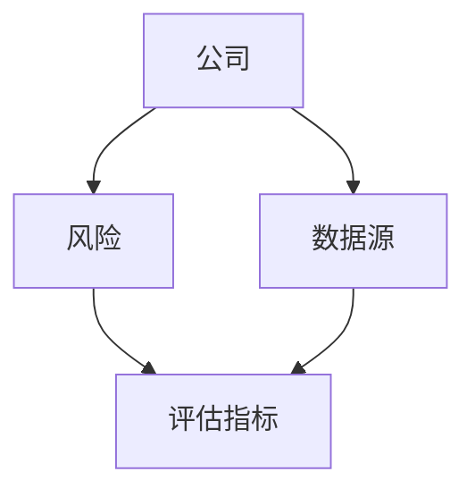
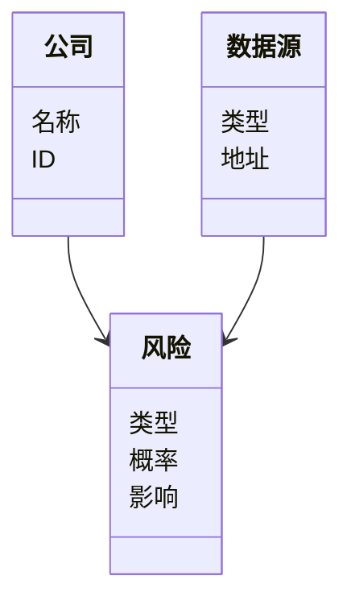
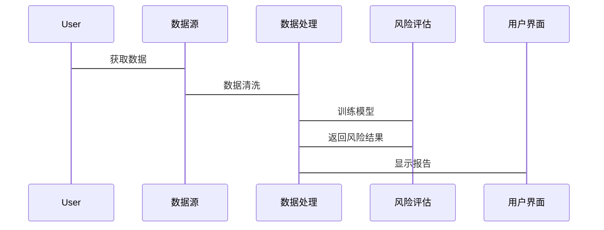

                 


# AI增强型公司治理风险评估

> 关键词：AI增强、公司治理、风险评估、算法原理、系统架构、项目实战

> 摘要：本文深入探讨了AI技术在公司治理风险评估中的应用，从背景、核心概念、算法原理、系统架构到项目实战，全面解析了如何利用AI技术提升公司治理的效率与准确性。通过详细的技术分析和实际案例，展示了AI增强型公司治理风险评估的实现过程和实际价值。

---

# 第一部分: AI增强型公司治理风险评估基础

# 第1章: AI增强型公司治理风险评估概述

## 1.1 公司治理风险评估的背景与意义

### 1.1.1 问题背景
公司治理是企业管理的核心，涉及股东、董事会、管理层和利益相关者之间的关系。传统公司治理依赖于财务报表和人工分析，存在以下问题：
- 数据维度有限：传统方法主要依赖财务数据，难以捕捉非财务风险（如声誉风险、合规风险）。
- 分析效率低：人工分析耗时长，且容易受到主观因素影响。
- 风险滞后性：传统方法难以实时监控风险，导致风险发现和应对较慢。

### 1.1.2 问题解决
AI技术的引入，通过大数据分析和机器学习模型，可以实时捕捉多维度数据，快速识别潜在风险，显著提升风险评估的效率和准确性。

### 1.1.3 边界与外延
AI增强型公司治理风险评估主要关注企业内部风险，如财务风险、运营风险和合规风险。其外延包括企业外部风险（如市场风险）和行业风险，但本文重点聚焦于企业内部治理。

## 1.2 AI增强型公司治理风险评估的定义与特点

### 1.2.1 核心定义
AI增强型公司治理风险评估是指利用人工智能技术（如机器学习、自然语言处理）对企业的财务数据、文本数据和行为数据进行分析，构建风险评估模型，以识别、量化和缓解企业风险。

### 1.2.2 核心特点
- 数据驱动：基于多源异构数据进行分析。
- 实时性：可以实时监控企业风险。
- 预测性：通过机器学习模型预测潜在风险。
- 自适应性：模型可以根据新数据动态优化。

## 1.3 公司治理风险评估的价值与应用场景

### 1.3.1 价值
- 提升风险识别能力：通过AI技术发现传统方法难以察觉的风险。
- 降低风险成本：通过早期预警和干预，减少风险对企业的影响。
- 提高治理效率：自动化分析和决策支持。

### 1.3.2 应用场景
- 财务风险评估：识别财务造假、预测财务危机。
- 运营风险评估：监控供应链风险、优化资源配置。
- 合规风险评估：识别合规漏洞、预测监管风险。

---

# 第二部分: AI增强型公司治理风险评估的核心概念与联系

# 第2章: 核心概念与原理

## 2.1 AI增强型公司治理风险评估的核心概念

### 2.1.1 数据源
AI技术可以从以下数据源中提取信息：
- 财务数据：收入、利润、资产负债表等。
- 文本数据：企业公告、新闻报道、社交媒体。
- 行为数据：员工行为、供应链数据。

### 2.1.2 风险类型
- 财务风险：如财务造假、流动性风险。
- 运营风险：如供应链中断、产品质量问题。
- 合规风险：如法律违规、监管处罚。

## 2.2 核心概念对比与ER实体关系图

### 2.2.1 核心概念属性特征对比表
```markdown
| 概念      | 属性                     | 特征                                                     |
|-----------|--------------------------|----------------------------------------------------------|
| 风险      | 类型                     | 财务风险、运营风险、合规风险等                            |
| AI算法    | 类型                     | 逻辑回归、随机森林、神经网络等                           |
| 数据源    | 类型                     | 财务数据、文本数据、行为数据等                            |

### 2.2.2 ER实体关系图


---

# 第三部分: AI增强型公司治理风险评估的算法原理

# 第3章: 算法原理与实现

## 3.1 算法原理概述

### 3.1.1 常用算法
- 逻辑回归：适用于二分类问题，如财务风险预测。
- 随机森林：适用于多分类问题，如风险类型识别。
- 神经网络：适用于复杂非线性关系，如文本数据的情感分析。

### 3.1.2 算法选择与优化
- 根据数据类型选择算法：文本数据适合神经网络，结构化数据适合逻辑回归。
- 超参数优化：使用网格搜索或随机搜索优化模型性能。

---

## 3.2 算法实现流程

### 3.2.1 数据预处理
```python
import pandas as pd
import numpy as np

# 数据加载与清洗
df = pd.read_csv('data.csv')
df = df.dropna()
```

### 3.2.2 模型训练
```python
from sklearn.model_selection import train_test_split
from sklearn.linear_model import LogisticRegression

X = df[['revenue', 'profit']]
y = df['risk_flag']

X_train, X_test, y_train, y_test = train_test_split(X, y, test_size=0.2)

model = LogisticRegression()
model.fit(X_train, y_train)
```

### 3.2.3 模型评估
```python
from sklearn.metrics import accuracy_score

y_pred = model.predict(X_test)
print('Accuracy:', accuracy_score(y_test, y_pred))
```

---

### 3.2.4 算法数学公式

#### 3.2.4.1 逻辑回归
$$ P(Y=1 | X) = \frac{e^{\beta X}}{1 + e^{\beta X}} $$

#### 3.2.4.2 神经网络
$$ f(x) = \sigma(w \cdot x + b) $$

其中，σ为sigmoid函数：
$$ \sigma(x) = \frac{1}{1 + e^{-x}} $$

---

## 3.3 通俗易懂的例子

### 3.3.1 逻辑回归案例
假设某企业财务数据如下：
- 营业收入：1000万
- 净利润：100万

模型预测该企业财务风险概率为：
$$ P = \frac{e^{0.1 \cdot 1000 + 0.05 \cdot 100}}{1 + e^{0.1 \cdot 1000 + 0.05 \cdot 100}} \approx 0.95 $$

这意味着该企业财务风险较高的概率为95%。

---

# 第四部分: AI增强型公司治理风险评估的系统架构设计

# 第4章: 系统架构设计

## 4.1 系统目标
构建一个实时、多维度的公司治理风险评估系统，支持企业内部和外部数据的整合分析。

## 4.2 系统功能设计

### 4.2.1 领域模型


### 4.2.2 系统架构
```mermaid
rectangle 数据源 {
    财务数据
    文本数据
    行为数据
}
rectangle 数据处理 {
    数据清洗
    数据转换
}
rectangle 风险评估 {
    模型训练
    风险预测
}
rectangle 用户界面 {
    风险报告
    可视化
}

数据源 --> 数据处理
数据处理 --> 风险评估
风险评估 --> 用户界面
```

---

## 4.3 接口设计与交互流程

### 4.3.1 接口设计
- 数据接口：从数据库获取数据。
- 模型接口：接受输入数据，返回风险评估结果。
- 报告接口：生成风险报告并推送。

### 4.3.2 交互流程


---

## 4.4 本章小结
本章通过系统架构设计，展示了AI增强型公司治理风险评估的实现方式，包括数据处理、模型训练和用户界面设计。

---

# 第五部分: AI增强型公司治理风险评估的项目实战

# 第5章: 项目实战

## 5.1 环境搭建

### 5.1.1 安装依赖
```bash
pip install pandas numpy scikit-learn
```

---

## 5.2 数据收集与预处理

### 5.2.1 数据加载
```python
import pandas as pd

df = pd.read_csv('data.csv')
df.head()
```

### 5.2.2 数据清洗
```python
df = df.dropna()
df = df.drop_duplicates()
```

---

## 5.3 系统核心实现

### 5.3.1 模型实现
```python
from sklearn.model_selection import train_test_split
from sklearn.ensemble import RandomForestClassifier

X = df[['revenue', 'profit', 'employees']]
y = df['risk_flag']

X_train, X_test, y_train, y_test = train_test_split(X, y, test_size=0.2)

model = RandomForestClassifier()
model.fit(X_train, y_train)
```

### 5.3.2 模型评估
```python
from sklearn.metrics import classification_report

y_pred = model.predict(X_test)
print(classification_report(y_test, y_pred))
```

---

## 5.4 实际案例分析

### 5.4.1 案例背景
某科技公司面临财务危机，希望通过AI技术预测风险。

### 5.4.2 数据分析
- 营业收入：持续下降。
- 利润：大幅亏损。
- 供应链：供应商延迟交付。

### 5.4.3 模型预测
模型预测该企业财务危机的概率为85%，建议采取以下措施：
- 减少研发投入。
- 优化供应链管理。
- 申请银行贷款。

---

## 5.5 项目小结
通过本项目，展示了AI技术在公司治理风险评估中的实际应用，验证了模型的有效性。

---

# 第六部分: 总结与展望

# 第6章: 最佳实践与总结

## 6.1 最佳实践

### 6.1.1 数据质量管理
确保数据的准确性和完整性，避免噪声数据影响模型。

### 6.1.2 模型解释性
选择可解释性较强的模型（如随机森林），便于决策者理解。

### 6.1.3 持续优化
定期更新模型，适应企业动态变化。

## 6.2 本章小结

---

# 第七部分: 参考文献与拓展阅读

## 7.1 参考文献
1. Goodfellow, I., Bengio, Y., & Courville, A. (2016). Deep Learning.
2. Hastie, T., Tibshirani, R., & Friedman, J. (2009). The Elements of Statistical Learning.

## 7.2 拓展阅读
- 《机器学习实战》
- 《企业风险管理》
- 《AI在金融领域的应用》

---

通过以上内容，我们全面解析了AI增强型公司治理风险评估的核心思想、实现方法和实际应用。希望本文能为读者提供有价值的参考和启发，推动公司治理领域的数字化转型。

