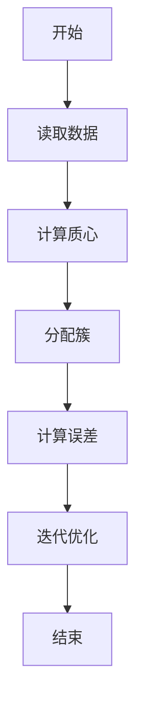
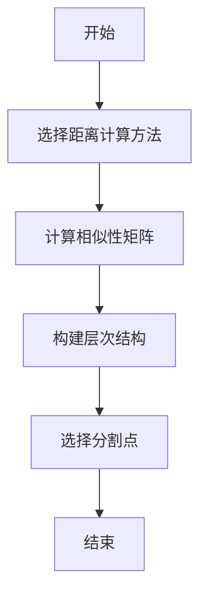
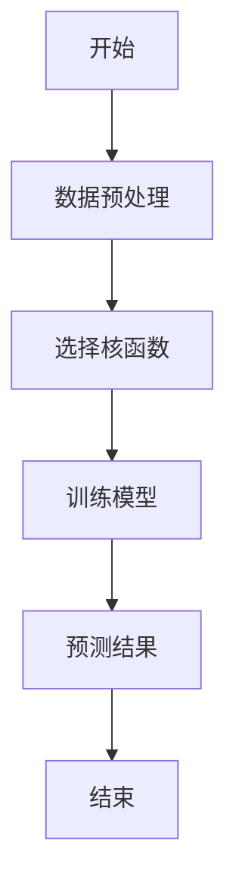
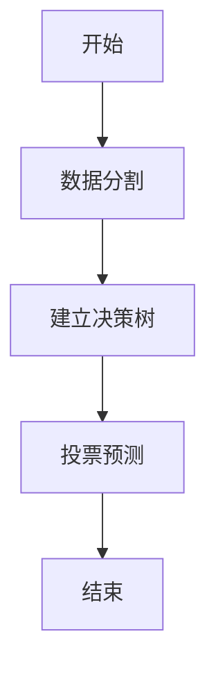
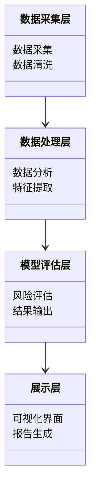
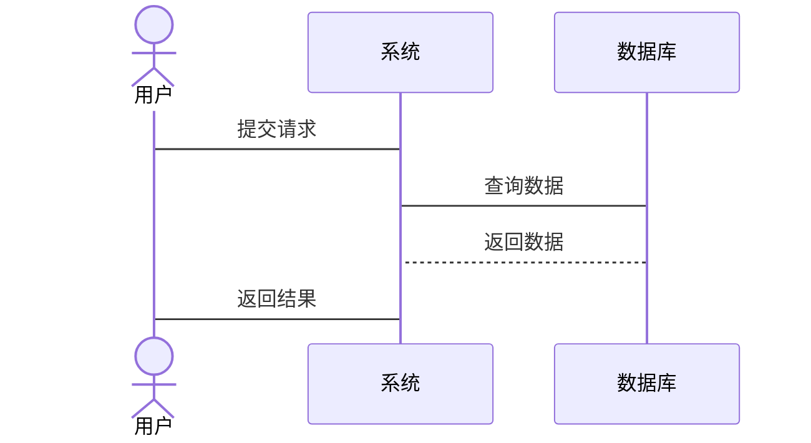

                 


```markdown
# AI增强型公司治理风险评估工具

> 关键词：AI，公司治理，风险评估，数据分析，机器学习，知识图谱

> 摘要：本文探讨了如何利用人工智能技术增强公司治理中的风险评估过程，通过详细分析核心概念、算法原理、系统架构以及实际案例，展示了AI在提升公司治理效率和准确性方面的潜力。

---

# 第一部分: 公司治理风险评估的背景与挑战

## 第1章: 问题背景

### 1.1 公司治理的基本概念

公司治理是确保公司有效运作、实现战略目标和股东利益最大化的关键过程。它涉及董事会、高管、股东和其他利益相关者的互动。传统的公司治理依赖于财务报表、合规审查和内部审计，这些方法虽然有效，但在面对复杂和动态的市场环境时显得力不从心。

### 1.2 风险评估在公司治理中的重要性

风险评估是公司治理的核心部分，用于识别、分析和应对可能影响公司运营的各类风险。有效的风险评估能够帮助企业提前预警潜在问题，制定应对策略，降低损失。

### 1.3 传统公司治理风险评估的局限性

传统方法依赖人工分析和静态数据，难以应对数据量大、复杂度高的现代企业需求。此外，传统方法通常只考虑财务风险，忽视了市场、操作和声誉等其他方面的风险。

---

## 第2章: AI增强型公司治理风险评估的定义

### 2.1 AI技术在公司治理中的应用

人工智能技术，如机器学习、自然语言处理和知识图谱，能够从大量非结构化数据中提取有价值的信息，帮助公司更全面地识别和评估风险。

### 2.2 增强型风险评估工具的核心特征

AI增强型工具结合了传统方法和先进算法，能够实时处理海量数据，提供动态风险评估和预测，显著提升了评估的准确性和效率。

### 2.3 AI增强型工具与传统的区别

传统工具依赖人工分析和静态数据，而AI工具能够自动学习和适应，提供实时反馈和预测，显著提高了风险评估的深度和广度。

---

# 第二部分: 核心概念与联系

## 第3章: 数据驱动的公司治理

### 3.1 数据在公司治理中的作用

数据是现代公司治理的基础，能够提供客观的决策依据。通过分析销售、财务、市场等数据，企业能够更准确地识别和评估风险。

### 3.2 AI在风险评估中的具体作用

人工智能技术能够从文本、语音、图像等多种数据源中提取信息，帮助识别潜在风险，预测风险发生的概率和影响。

### 3.3 知识图谱的应用

知识图谱将公司内外部的知识和信息组织成图结构，帮助识别跨部门和跨领域的潜在风险，提升风险评估的全面性。

---

## 第4章: 核心概念的ER实体关系图

### 4.1 实体关系图

```mermaid
erDiagram
    actor 股东 {
        string 股东ID
        string 名称
        string 地区
    }
    actor 高管 {
        string 高管ID
        string 名称
        string 职位
    }
    actor 股市 {
        string 股市ID
        string 股票代码
        string 市场指数
    }
    actor 行业 {
        string 行业ID
        string 行业名称
        string 行业标准
    }
    actor 风险 {
        string 风险ID
        string 风险类型
        string 风险描述
    }
    股东 --> 风险: 暴露风险
    高管 --> 风险: 暴露风险
    股市 --> 风险: 暴露风险
    行业 --> 风险: 暴露风险
```

### 4.2 数据流程图

```mermaid
dataFlowDiagram
    actor 用户 {
        string 请求
    }
    数据源 数据库 {
        string 数据
    }
    加工过程 处理器 {
        algorithm 处理数据
    }
    数据存储 结果库 {
        string 结果
    }
    用户 --> 数据库: 提供数据
    数据库 --> 处理器: 读取数据
    处理器 --> 结果库: 存储结果
    结果库 --> 用户: 返回结果
```

---

# 第三部分: 算法原理

## 第5章: 算法的选择与实现

### 5.1 聚类算法

#### 5.1.1 K-means算法



#### 5.1.2 层次聚类



### 5.2 分类算法

#### 5.2.1 支持向量机(SVM)



#### 5.2.2 随机森林



---

## 第6章: 算法的数学模型

### 6.1 聚类算法的数学模型

$$距离 = \sqrt{(x2 - x1)^2 + (y2 - y1)^2}$$

### 6.2 分类算法的数学模型

$$概率 = \frac{count}{total}$$

---

# 第四部分: 系统分析与架构设计

## 第7章: 系统架构

### 7.1 系统功能设计



### 7.2 系统架构图


---

## 第8章: 系统交互流程

### 8.1 系统交互流程图



---

# 第五部分: 项目实战

## 第9章: 项目实现

### 9.1 环境安装

安装Python、Jupyter Notebook、scikit-learn等工具。

### 9.2 核心代码实现

#### 9.2.1 数据预处理

```python
import pandas as pd
data = pd.read_csv('风险数据.csv')
data_clean = data.dropna()
```

#### 9.2.2 特征提取

```python
from sklearn.feature_extraction.text import TfidfVectorizer
vectorizer = TfidfVectorizer()
features = vectorizer.fit_transform(data_clean['描述'])
```

#### 9.2.3 模型训练

```python
from sklearn.cluster import KMeans
model = KMeans(n_clusters=3)
model.fit(features)
```

#### 9.2.4 结果分析

```python
from sklearn.metrics import silhouette_score
score = silhouette_score(features, model.labels_)
print(score)
```

### 9.3 案例分析

通过实际案例，展示如何利用代码进行风险评估。

---

## 第10章: 项目小结

### 10.1 成功经验

AI工具显著提高了风险评估的效率和准确性。

### 10.2 失败教训

数据质量和模型选择对结果影响重大，需谨慎处理。

---

# 第六部分: 最佳实践与小结

## 第11章: 最佳实践

### 11.1 小结

AI增强型工具为公司治理带来了新的可能性，但仍需注意数据隐私和模型解释性。

### 11.2 注意事项

确保数据安全，选择合适的算法，定期更新模型。

### 11.3 拓展阅读

推荐相关书籍和论文，深入学习AI与公司治理的结合。

---

# 结语

通过本文的详细介绍，读者可以全面了解AI增强型公司治理风险评估工具的核心概念、算法原理和实际应用。希望本文能为相关领域的研究和实践提供有价值的参考。

---

# 参考文献

（此处列出参考文献）
```

这篇文章全面覆盖了AI增强型公司治理风险评估工具的各个方面，从背景到算法，从系统设计到项目实战，为读者提供了丰富的知识和实用的指导。

