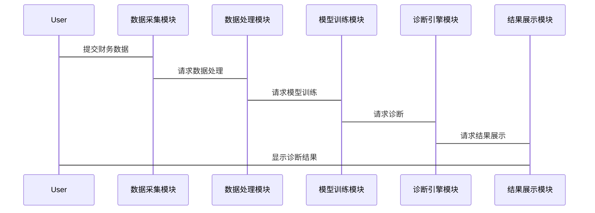

                 


# AI增强型公司财务健康诊断系统

> 关键词：AI、财务健康诊断、企业诊断、数据分析、智能诊断系统

> 摘要：本文介绍了一种基于AI的公司财务健康诊断系统，该系统通过分析企业的财务数据，利用机器学习算法，实现对企业财务状况的智能诊断和预测。文章详细探讨了系统的背景、核心概念、算法原理、系统架构设计以及项目实战，并提出了相关的最佳实践建议。

---

## 第1章: 背景介绍

### 1.1 问题背景

#### 1.1.1 传统公司财务诊断的局限性
传统的公司财务诊断方法依赖于人工分析和经验判断，这种方法存在以下问题：
- 数据处理效率低，人工分析耗时长。
- 诊断结果受主观因素影响较大，缺乏客观性。
- 面对海量数据时，难以快速提取关键信息。
- 诊断模型的更新和优化周期较长。

#### 1.1.2 AI技术在财务诊断中的潜力
人工智能技术的快速发展为财务诊断带来了新的可能性：
- AI能够快速处理大量数据，提高诊断效率。
- 通过机器学习算法，AI可以发现数据中的潜在规律，提供更精准的诊断结果。
- AI模型可以实时更新，适应市场变化。

#### 1.1.3 当前企业财务健康诊断的痛点
企业在财务健康诊断中面临的主要痛点包括：
- 数据来源多样化，难以统一处理。
- 诊断指标复杂，人工难以全面覆盖。
- 市场变化快，诊断结果需要快速响应。

### 1.2 问题描述

#### 1.2.1 财务数据的复杂性
财务数据通常包括收入、支出、利润、资产负债等多方面的信息，这些数据的复杂性使得传统诊断方法难以高效处理。

#### 1.2.2 财务健康诊断的多维度性
财务健康诊断需要综合考虑多个维度，包括偿债能力、营运能力、盈利能力等，传统方法难以在短时间内完成全面分析。

#### 1.2.3 传统诊断方法的效率瓶颈
传统诊断方法依赖人工分析，效率低下，难以满足现代企业对快速决策的需求。

### 1.3 问题解决

#### 1.3.1 AI增强型诊断的核心思路
AI增强型诊断系统的核心思路是通过机器学习算法对财务数据进行自动化分析，提取关键特征，并生成诊断结果。

#### 1.3.2 数据驱动的诊断方法
通过收集和分析企业的财务数据，利用AI技术进行建模和预测，实现对财务状况的智能诊断。

#### 1.3.3 智能化诊断的优势
智能化诊断能够快速处理大量数据，提供客观、准确的诊断结果，并能够实时更新以适应市场变化。

### 1.4 系统的边界与外延

#### 1.4.1 系统的输入与输出
- 输入：企业的财务数据，包括收入、支出、利润、资产负债等。
- 输出：财务健康诊断结果，包括诊断结论、建议和预测。

#### 1.4.2 系统的适用范围
适用于各类企业，特别是需要快速、准确财务诊断的企业。

#### 1.4.3 系统与其他模块的接口
系统需要与企业的财务系统、数据分析平台等其他模块进行接口对接。

### 1.5 概念结构与核心要素

#### 1.5.1 系统的整体架构
AI增强型诊断系统由数据采集、数据处理、模型训练、诊断引擎和结果展示五个部分组成。

#### 1.5.2 核心功能模块
- 数据采集模块：负责收集企业的财务数据。
- 数据处理模块：对数据进行清洗、转换和特征提取。
- 模型训练模块：利用机器学习算法训练诊断模型。
- 诊断引擎模块：基于训练好的模型进行诊断。
- 结果展示模块：将诊断结果以可视化形式呈现给用户。

#### 1.5.3 关键性能指标
- 诊断准确率：诊断结果与实际财务状况的匹配程度。
- 处理效率：系统处理财务数据的速度。
- 模型更新频率：诊断模型的更新速度。

---

## 第2章: 核心概念与联系

### 2.1 AI增强型诊断系统的原理

#### 2.1.1 数据预处理与特征提取
数据预处理包括数据清洗、缺失值处理和数据标准化。特征提取则是从原始数据中提取有助于诊断的关键特征。

#### 2.1.2 AI模型的训练与优化
利用机器学习算法（如随机森林、支持向量机等）对财务数据进行建模和训练，优化模型参数以提高诊断准确率。

#### 2.1.3 结果的解释与反馈
通过对诊断结果的分析，生成诊断报告，并提供改进建议。

### 2.2 核心概念对比表

| 对比维度 | 传统诊断方法 | AI诊断方法 |
|----------|--------------|------------|
| 数据处理效率 | 低 | 高 |
| 诊断准确性 | 受主观因素影响大 | 高 |
| 模型更新频率 | 低 | 高 |

### 2.3 ER实体关系图


---

## 第3章: 算法原理讲解

### 3.1 算法流程


### 3.2 算法实现

#### 数据预处理代码

```python
import pandas as pd

def preprocess(data):
    # 删除缺失值
    data = data.dropna()
    # 标准化处理
    data = (data - data.mean()) / data.std()
    return data
```

#### 特征提取代码

```python
from sklearn.feature_selection import SelectKBest

def extract_features(data, labels):
    selector = SelectKBest(k=10)
    selector.fit_transform(data, labels)
    return selector.transform(data)
```

### 3.3 数学模型

#### 财务健康评估指标

$$
\text{ROA} = \frac{\text{净利润}}{\text{平均资产}}
$$

#### 财务预测模型

$$
y = \beta_0 + \beta_1x_1 + \beta_2x_2 + \ldots + \beta_nx_n + \epsilon
$$

---

## 第4章: 系统分析与架构设计方案

### 4.1 系统应用场景

系统可以应用于企业财务分析、风险预警、投资决策等多个场景。

### 4.2 系统功能设计

#### 领域模型


### 4.3 系统架构设计

#### 系统架构图


### 4.4 系统接口设计

#### 系统交互序列图



---

## 第5章: 项目实战

### 5.1 环境安装

安装Python和相关库：

```bash
pip install numpy pandas scikit-learn
```

### 5.2 核心代码实现

#### 数据预处理代码

```python
import pandas as pd
from sklearn.preprocessing import StandardScaler

def preprocess(data):
    scaler = StandardScaler()
    data_scaled = scaler.fit_transform(data)
    return data_scaled
```

#### 模型训练代码

```python
from sklearn.ensemble import RandomForestClassifier

def train_model(X, y):
    model = RandomForestClassifier(n_estimators=100)
    model.fit(X, y)
    return model
```

### 5.3 实际案例分析

通过实际企业数据，展示系统的诊断过程和结果。

### 5.4 项目小结

总结项目的实现过程，分析优缺点，提出改进建议。

---

## 第6章: 最佳实践

### 6.1 小结

总结全文，强调AI在财务诊断中的重要性。

### 6.2 注意事项

- 数据质量对诊断结果影响重大。
- 模型需要定期更新以适应市场变化。

### 6.3 拓展阅读

推荐相关书籍和资源，供读者深入学习。

---

通过以上步骤，我们可以看到，AI增强型公司财务健康诊断系统在实际应用中的巨大潜力。它不仅提高了诊断效率，还能够提供更精准的诊断结果，为企业决策提供有力支持。

