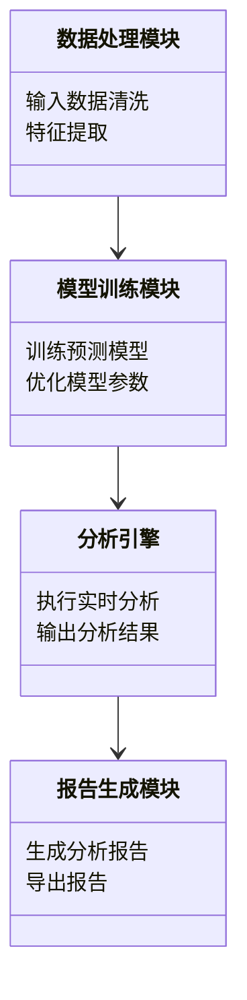
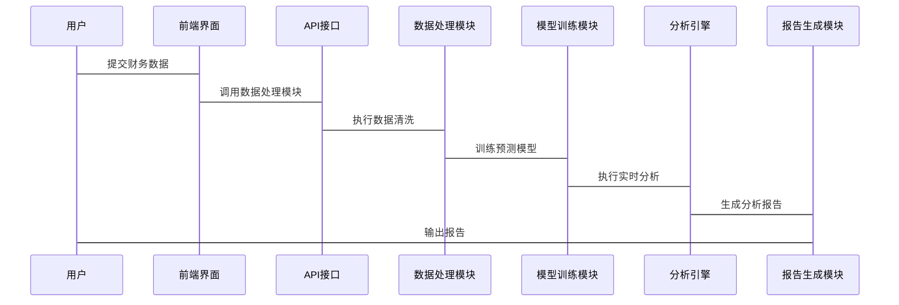

                 


# AI增强型公司财务报表分析工具

> 关键词：AI，财务报表分析，机器学习，NLP，深度学习，系统架构

> 摘要：本文探讨了如何利用人工智能技术增强公司财务报表分析工具的功能与效率。通过结合机器学习、自然语言处理和深度学习等技术，我们提出了一套创新的解决方案，能够自动解析财务数据、预测财务风险并生成智能报告。本文从技术背景、核心算法、系统架构到项目实战，全面分析了AI在财务报表分析中的应用，为相关领域的从业者提供了实用的参考与启示。

---

# 第一部分: AI与公司财务报表分析的结合

## 第1章: AI增强型公司财务报表分析工具概述

### 1.1 问题背景与目标
#### 1.1.1 财务报表分析的传统挑战
财务报表分析是企业财务管理的核心环节，传统的分析方法依赖于人工经验，存在以下挑战：
- 数据量大：企业财务数据日益复杂，人工分析效率低下。
- 易错性高：人为判断容易受到主观因素影响，导致分析结果偏差。
- 实时性不足：传统分析难以满足实时监控的需求。

#### 1.1.2 AI技术如何解决这些挑战
人工智能技术（AI）通过自动化、智能化的处理方式，能够显著提升财务报表分析的效率与准确性。AI技术的应用包括：
- **自动化数据处理**：快速解析结构化和非结构化数据。
- **智能预测**：基于历史数据预测未来财务趋势。
- **实时监控**：实时识别财务异常情况，及时预警风险。

#### 1.1.3 增强型工具的核心目标
AI增强型公司财务报表分析工具的核心目标是实现以下几点：
1. 提供智能化的财务数据处理能力。
2. 自动生成财务分析报告。
3. 实现实时的财务风险预警。

### 1.2 核心概念与边界
#### 1.2.1 AI增强型工具的定义
AI增强型公司财务报表分析工具是一种结合人工智能技术的软件系统，能够通过机器学习、自然语言处理（NLP）等技术，自动解析财务报表数据，并生成智能分析结果。

#### 1.2.2 工具的功能边界与外延
- **功能边界**：
  - 数据输入与解析。
  - 财务指标计算与分析。
  - 风险预测与预警。
  - 报告生成与输出。
- **外延**：
  - 与企业ERP系统集成。
  - 支持多语言、多格式的财务报表输入。

#### 1.2.3 核心要素与组成结构
AI增强型工具的核心要素包括：
1. 数据处理模块：负责数据的清洗与预处理。
2. 模型训练模块：基于历史数据训练预测模型。
3. 分析引擎：执行实时分析任务。
4. 报告生成模块：输出结构化分析报告。

---

## 第2章: AI在财务报表分析中的核心概念与联系

### 2.1 核心概念原理
#### 2.1.1 机器学习在财务预测中的应用
机器学习（ML）通过训练模型识别财务数据中的模式，从而实现财务预测。例如：
- **线性回归**：用于预测销售收入。
- **随机森林**：用于分类财务风险等级。

#### 2.1.2 自然语言处理（NLP）在文本分析中的应用
NLP技术可以解析财务报告中的非结构化文本信息，例如：
- 从管理层 commentary 中提取关键信息。
- 识别财务风险相关的关键词。

#### 2.1.3 数据挖掘在模式识别中的作用
数据挖掘技术能够从海量财务数据中提取有价值的模式，例如：
- 发现销售趋势。
- 识别潜在的财务舞弊行为。

### 2.2 核心概念对比表格
以下表格对比了传统财务分析与AI增强型分析的主要区别：

| **对比维度**       | **传统财务分析**                     | **AI增强型分析**                     |
|--------------------|--------------------------------------|--------------------------------------|
| 数据处理效率       | 低                                   | 高                                   |
| 分析深度           | 浅                                   | 深                                   |
| 预测能力           | 无                                   | 强                                   |
| 人工干预需求       | 高                                   | 低                                   |

### 2.3 ER实体关系图
以下是一个简化的ER实体关系图，展示了AI增强型工具的主要实体及其关系：


---

## 第3章: AI增强型工具的算法原理

### 3.1 算法原理概述
#### 3.1.1 机器学习算法在财务预测中的应用
- **线性回归**：用于预测销售收入。
- **支持向量机（SVM）**：用于分类财务风险等级。

#### 3.1.2 深度学习在图像识别中的应用
- **卷积神经网络（CNN）**：用于识别财务报表中的图像信息。

#### 3.1.3 NLP技术在文本分析中的应用
- **词嵌入（Word Embedding）**：用于处理财务报告中的文本信息。

### 3.2 算法流程图
以下是一个机器学习算法的流程图：


### 3.3 数学模型与公式
#### 3.3.1 线性回归模型
$$ y = \beta_0 + \beta_1x + \epsilon $$

#### 3.3.2 支持向量机
$$ \text{最大化} \quad \frac{1}{2}\|w\|^2 $$
$$ \text{约束} \quad y_i(w \cdot x_i + b) \geq 1 $$

### 3.4 举例说明
例如，使用线性回归模型预测公司销售收入：
- 数据输入：销售收入、销售成本、管理费用。
- 特征提取：提取销售收入作为自变量。
- 模型训练：训练线性回归模型。
- 预测输出：预测未来的销售收入。

---

## 第4章: 系统架构设计

### 4.1 系统功能设计
以下是系统的主要功能模块：



### 4.2 系统架构设计
以下是系统的架构图：


### 4.3 系统接口设计
系统主要接口包括：
1. 数据输入接口。
2. 模型训练接口。
3. 分析结果输出接口。

### 4.4 系统交互序列图
以下是系统交互的序列图：



---

## 第5章: 项目实战

### 5.1 环境搭建
- **Python环境**：安装Python 3.8及以上版本。
- **依赖库安装**：安装`numpy`、`pandas`、`scikit-learn`、`tensorflow`等库。

### 5.2 核心代码实现
以下是核心代码示例：

```python
import pandas as pd
from sklearn.linear_model import LinearRegression
from sklearn.metrics import mean_squared_error

# 数据加载
data = pd.read_csv('financial_data.csv')

# 特征提取
X = data[['revenue', 'cost', 'expenses']]
y = data['net_income']

# 模型训练
model = LinearRegression()
model.fit(X, y)

# 预测输出
y_pred = model.predict(X)
print('均方误差:', mean_squared_error(y, y_pred))
```

### 5.3 案例分析
以某公司2022年的财务数据为例，分析销售收入与利润的关系。

### 5.4 实践总结
- **代码实现**：通过代码实现AI增强型工具的核心功能。
- **案例分析**：通过实际案例验证工具的有效性。

---

## 第6章: 总结与展望

### 6.1 总结
本文详细探讨了AI增强型公司财务报表分析工具的核心概念、算法原理和系统架构，并通过项目实战展示了工具的具体实现。AI技术的应用显著提升了财务分析的效率与准确性。

### 6.2 展望
未来，随着AI技术的不断发展，财务报表分析工具将更加智能化和自动化。例如：
- 更加复杂的深度学习模型。
- 与区块链技术的结合，实现数据的可信度验证。

---

## 第7章: 最佳实践与注意事项

### 7.1 最佳实践
- **数据质量管理**：确保输入数据的准确性和完整性。
- **模型优化**：定期更新模型参数，提升预测精度。

### 7.2 注意事项
- **数据隐私**：确保财务数据的安全性。
- **模型解释性**：保持模型的可解释性，便于用户理解。

### 7.3 拓展阅读
- 推荐阅读《机器学习实战》、《深度学习》等书籍。

---

## 附录

### 附录A: 数据集
提供一个示例数据集，供读者实践使用。

### 附录B: 代码仓库
提供GitHub仓库链接，包含本文的所有代码实现。

---

通过以上内容，我们可以看到，AI增强型公司财务报表分析工具在现代企业财务管理中的巨大潜力。未来，随着技术的不断进步，这类工具将变得更加智能和高效，为企业创造更大的价值。

