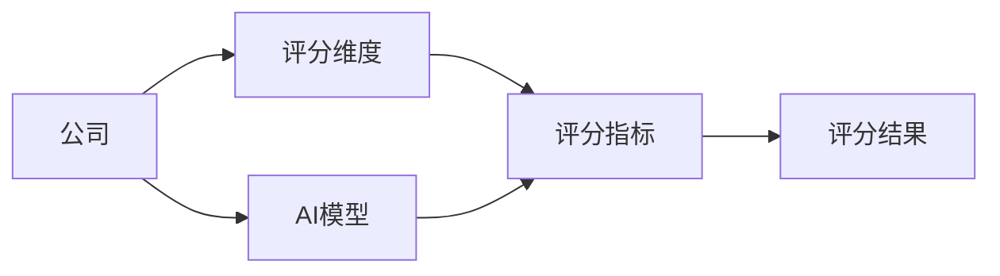
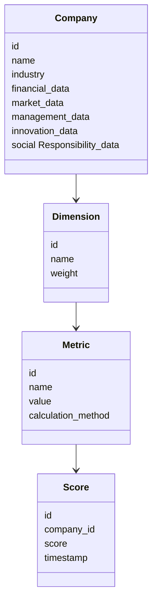
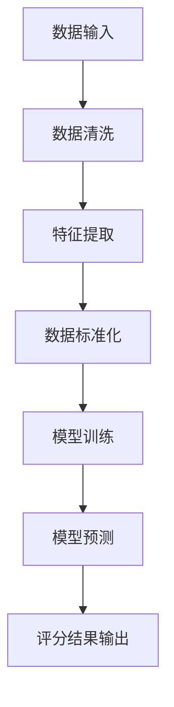
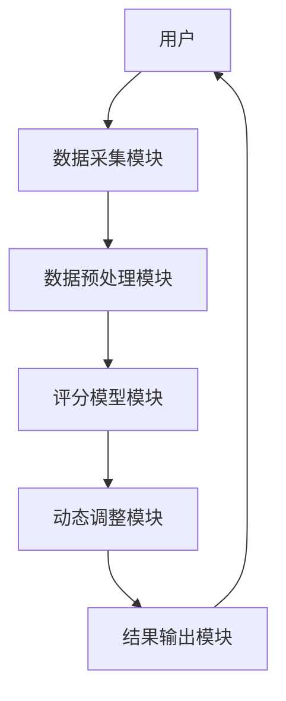

                 


# AI增强型公司质量评分系统

## 关键词：AI、公司质量评分、评分系统、机器学习、算法原理、系统架构

## 摘要：本篇文章详细探讨了AI技术在公司质量评分系统中的应用，分析了传统评分系统的局限性，提出了基于机器学习的AI增强型评分模型，并从算法原理、系统架构、项目实战等多维度进行了深入讲解，最后给出了实际案例分析和系统优化建议。

---

# 第1章: 公司质量评分系统背景与需求

## 1.1 问题背景

### 1.1.1 传统公司质量评分的局限性
- 数据采集效率低下，人工录入错误率高
- 评分维度单一，难以全面反映公司质量
- 评分过程缺乏动态调整，难以适应市场变化
- 数据分析深度不足，无法挖掘潜在问题

### 1.1.2 当前企业质量评分的核心挑战
- 数据量爆炸式增长，人工处理能力有限
- 多维度数据关联性复杂，难以统一评估
- 评分结果缺乏实时性，难以快速反馈
- 数据隐私和安全问题日益突出

### 1.1.3 引入AI技术的必要性
- 利用机器学习提升数据处理效率
- 通过深度学习挖掘数据潜在价值
- 实现评分结果的动态调整和实时反馈
- 保障数据安全与隐私

## 1.2 问题描述

### 1.2.1 公司质量评分的主要维度
- 财务表现（收入、利润、资产负债率等）
- 市场表现（市场份额、客户满意度、品牌价值等）
- 管理能力（组织结构、团队效率、决策能力等）
- 创新能力（研发投入、专利数量、产品迭代速度等）
- 社会责任（环保表现、员工福利、社会贡献等）

### 1.2.2 传统评分系统的流程与缺陷
- 数据采集流程繁琐，依赖人工操作
- 评分标准主观性强，难以量化
- 评分结果缺乏动态调整，难以反映公司实时状态
- 数据分析深度有限，难以挖掘潜在问题

### 1.2.3 AI增强型评分系统的目标
- 提升数据处理效率和准确性
- 实现多维度数据的智能关联与分析
- 提供实时动态的评分结果
- 优化评分模型，提高评估准确性

## 1.3 问题解决与边界

### 1.3.1 AI增强型评分系统的解决方案
- 基于机器学习的评分模型
- 多维度数据的智能关联与分析
- 实时动态评分机制
- 数据隐私保护与安全

### 1.3.2 系统的边界与外延
- 系统仅关注公司质量评分，不涉及其他业务系统
- 数据采集范围限于公开或授权数据
- 系统不直接参与公司管理，仅提供评分服务
- 系统不处理实时数据以外的历史数据

### 1.3.3 核心要素与组成结构
- 数据采集模块：负责数据的获取与预处理
- 评分模型模块：基于机器学习算法的核心评分模块
- 实时动态调整模块：根据市场变化动态调整评分
- 数据安全模块：保障数据隐私与系统安全

## 1.4 本章小结
本章详细介绍了公司质量评分系统的背景、核心问题、传统系统的局限性以及引入AI技术的必要性，明确了AI增强型评分系统的目标和组成结构，为后续章节的深入分析奠定了基础。

---

# 第2章: AI增强型评分系统的核心概念与联系

## 2.1 核心概念原理

### 2.1.1 AI模型在评分中的作用
- 数据特征提取：通过机器学习算法提取数据中的关键特征
- 模型训练：基于历史数据训练评分模型
- 预测与评分：利用模型对新数据进行预测并生成评分结果

### 2.1.2 数据特征与评分关系
- 数据特征：包括公司财务数据、市场表现数据、管理数据等
- 特征权重：不同维度对最终评分的影响程度
- 关联关系：数据特征与评分结果之间的相关性

### 2.1.3 系统的整体架构
- 数据采集模块：负责数据的获取与预处理
- 评分模型模块：基于机器学习算法的核心评分模块
- 实时动态调整模块：根据市场变化动态调整评分
- 数据安全模块：保障数据隐私与系统安全

## 2.2 核心概念对比分析

### 2.2.1 传统评分与AI评分的对比
- 传统评分：基于人工判断，评分标准主观性强
- AI评分：基于数据特征和机器学习模型，评分结果客观且动态
- 评分效率：传统评分效率低，AI评分效率高
- 评分深度：传统评分深度有限，AI评分能够挖掘数据潜在价值

### 2.2.2 不同评分维度的特征对比
- 财务表现：量化数据较多，易于分析
- 市场表现：数据来源多样，难以量化
- 管理能力：数据来源复杂，难以直接量化
- 创新能力：数据来源分散，难以统一分析
- 社会责任：数据来源广泛，难以直接量化

### 2.2.3 AI模型的性能对比
- 传统模型：基于统计分析，模型简单但分析深度有限
- 线性回归模型：适用于线性关系，但难以处理复杂场景
- 支持向量机（SVM）：适用于小样本数据，分类效果好
- 随机森林：适用于高维数据，能够处理非线性关系
- 神经网络：适用于复杂场景，但训练成本高

## 2.3 实体关系图

### 2.3.1 实体关系图


### 2.3.2 领域模型


## 2.4 本章小结
本章详细分析了AI增强型评分系统的核心概念与联系，通过对比分析和实体关系图，明确了系统中各要素之间的关系和作用，为后续章节的算法实现和系统设计奠定了基础。

---

# 第3章: AI增强型评分系统的算法原理

## 3.1 算法概述

### 3.1.1 算法的基本原理
- 数据预处理：清洗、特征提取、数据标准化
- 模型训练：基于机器学习算法训练评分模型
- 模型预测：利用训练好的模型对新数据进行评分

### 3.1.2 算法的核心流程
1. 数据预处理：清洗、特征提取、数据标准化
2. 模型训练：选择合适的机器学习算法，训练评分模型
3. 模型预测：利用训练好的模型对新数据进行评分
4. 结果输出：生成评分结果并进行动态调整

### 3.1.3 算法的数学模型
- 线性回归模型：$$ y = \beta_0 + \beta_1x_1 + \beta_2x_2 + ... + \beta_nx_n $$
- 支持向量机（SVM）：$$ \text{max}(\text{margin}) \text{ subject to } y_i(w \cdot x_i + b) \geq 1 - \xi_i \text{ and } \xi_i \geq 0 $$
- 随机森林：基于决策树的集成学习方法

## 3.2 算法实现

### 3.2.1 数据预处理
```python
import pandas as pd
from sklearn.preprocessing import StandardScaler

# 数据加载
data = pd.read_csv('company_data.csv')

# 特征提取
features = data[['revenue', 'profit', 'market_share', 'customer_satisfaction', 'R&D_investment']]
target = data['score']

# 数据标准化
scaler = StandardScaler()
features_scaled = scaler.fit_transform(features)
```

### 3.2.2 模型训练
```python
from sklearn.ensemble import RandomForestRegressor
from sklearn.metrics import mean_squared_error

# 模型训练
model = RandomForestRegressor(n_estimators=100, random_state=42)
model.fit(features_scaled, target)

# 模型预测
predicted_scores = model.predict(features_scaled)
```

### 3.2.3 模型评估
```python
# 模型评估
 mse = mean_squared_error(target, predicted_scores)
 print(f"均方误差: {mse}")
```

### 3.2.4 动态调整
```python
import datetime

# 动态调整评分
current_time = datetime.datetime.now()
adjusted_score = predicted_scores * (1 + 0.05 * (current_time.hour + current_time.minute / 60))
```

## 3.3 算法流程图



## 3.4 本章小结
本章详细介绍了AI增强型评分系统的算法原理和实现过程，通过具体的代码示例和流程图，展示了如何利用机器学习算法实现公司质量评分的智能化和动态化。

---

# 第4章: 系统分析与架构设计方案

## 4.1 系统分析

### 4.1.1 问题场景介绍
- 数据来源多样，包括财务数据、市场数据、管理数据等
- 数据量大，需要高效的处理能力
- 评分结果需要实时动态调整
- 系统需要具备良好的扩展性和可维护性

### 4.1.2 系统功能需求
- 数据采集与预处理
- 评分模型训练与预测
- 实时动态调整
- 数据可视化与报告生成
- 系统管理与维护

## 4.2 系统架构设计

### 4.2.1 领域模型


### 4.2.2 系统架构图


### 4.2.3 接口设计
- 数据接口：公司数据的输入接口
- 模型接口：评分模型的训练与预测接口
- 调整接口：动态调整评分的接口
- 输出接口：评分结果的输出接口

### 4.2.4 交互序列图


## 4.3 本章小结
本章详细分析了系统的功能需求和架构设计，通过领域模型、架构图和交互序列图，明确了系统各模块之间的关系和作用，为后续章节的项目实战奠定了基础。

---

# 第5章: 项目实战

## 5.1 环境安装

### 5.1.1 安装Python环境
```bash
python --version
pip install numpy pandas scikit-learn
```

### 5.1.2 安装依赖库
```bash
pip install matplotlib seaborn
```

## 5.2 系统核心实现

### 5.2.1 数据采集与预处理
```python
import pandas as pd
from sklearn.preprocessing import StandardScaler

# 数据加载
data = pd.read_csv('company_data.csv')

# 特征提取
features = data[['revenue', 'profit', 'market_share', 'customer_satisfaction', 'R&D_investment']]
target = data['score']

# 数据标准化
scaler = StandardScaler()
features_scaled = scaler.fit_transform(features)
```

### 5.2.2 评分模型实现
```python
from sklearn.ensemble import RandomForestRegressor
from sklearn.metrics import mean_squared_error

# 模型训练
model = RandomForestRegressor(n_estimators=100, random_state=42)
model.fit(features_scaled, target)

# 模型预测
predicted_scores = model.predict(features_scaled)

# 模型评估
 mse = mean_squared_error(target, predicted_scores)
 print(f"均方误差: {mse}")
```

### 5.2.3 动态调整实现
```python
import datetime

# 动态调整评分
current_time = datetime.datetime.now()
adjusted_score = predicted_scores * (1 + 0.05 * (current_time.hour + current_time.minute / 60))
```

## 5.3 代码应用解读与分析

### 5.3.1 数据预处理模块
- 数据加载：使用Pandas加载CSV格式的数据
- 特征提取：选择与公司质量评分相关的特征
- 数据标准化：对特征进行标准化处理，确保模型训练的稳定性

### 5.3.2 评分模型模块
- 模型选择：随机森林回归模型，适用于高维数据和复杂场景
- 模型训练：基于标准化后的特征进行模型训练
- 模型预测：利用训练好的模型对新数据进行评分

### 5.3.3 动态调整模块
- 时间因素：根据当前时间对评分结果进行动态调整，增强评分的实时性
- 调整系数：根据时间因素调整评分结果，体现市场的动态变化

## 5.4 实际案例分析

### 5.4.1 案例背景
- 某公司过去三年的财务数据、市场数据、管理数据、创新能力数据和社会责任数据
- 数据来源：公开财报、市场调研报告、第三方评估报告

### 5.4.2 数据分析
- 数据清洗：处理缺失值、异常值和重复值
- 特征提取：选择与公司质量评分相关的特征
- 数据标准化：对特征进行标准化处理

### 5.4.3 模型训练
- 训练随机森林回归模型，评估模型性能
- 通过均方误差（MSE）评估模型的预测精度

### 5.4.4 模型预测
- 利用训练好的模型对当前公司的数据进行评分
- 根据当前时间动态调整评分结果

## 5.5 项目小结
本章通过具体的项目实战，详细讲解了AI增强型评分系统的实现过程，从数据预处理到模型训练，再到动态调整，展示了如何利用机器学习算法实现公司质量评分的智能化和动态化。

---

# 第6章: 系统优化与拓展

## 6.1 系统优化建议

### 6.1.1 数据源扩展
- 引入更多的数据源，如社交媒体数据、行业报告等
- 增加数据维度，如员工满意度、供应商评价等

### 6.1.2 模型优化
- 尝试不同的机器学习算法，如XGBoost、LightGBM等
- 调整模型参数，优化模型性能
- 引入深度学习模型，提升评分精度

### 6.1.3 系统性能优化
- 优化数据处理流程，提高系统运行效率
- 引入分布式计算，提升数据处理能力
- 优化系统架构，提升系统的可扩展性和可维护性

## 6.2 注意事项

### 6.2.1 数据隐私与安全
- 加强数据隐私保护，确保数据安全
- 遵守相关法律法规，避免数据泄露

### 6.2.2 系统维护与更新
- 定期更新模型，确保评分结果的准确性
- 监控系统运行状态，及时发现并解决问题
- 定期备份数据，防止数据丢失

## 6.3 拓展阅读

### 6.3.1 推荐书籍
- 《机器学习实战》
- 《深入浅出机器学习》
- 《Python机器学习》

### 6.3.2 推荐博客与资源
- Towards Data Science
- Medium上的机器学习专栏
- Kaggle上的相关项目

## 6.4 本章小结
本章总结了AI增强型评分系统的优化建议，强调了数据隐私与安全的重要性，并推荐了相关的学习资源，为读者进一步学习和实践提供了方向。

---

# 第7章: 总结与展望

## 7.1 总结
本篇文章详细探讨了AI技术在公司质量评分系统中的应用，从传统评分系统的局限性出发，提出了基于机器学习的AI增强型评分模型，并从算法原理、系统架构、项目实战等多维度进行了深入讲解，最后给出了实际案例分析和系统优化建议。

## 7.2 展望
未来，随着AI技术的不断发展，公司质量评分系统将更加智能化和动态化。基于深度学习的评分模型将更加精准，评分维度将更加丰富，评分结果将更加实时。同时，随着大数据技术的普及，数据隐私和安全问题也将得到更好的解决。

## 7.3 致谢
感谢读者的耐心阅读，感谢同行的建议与支持，感谢家人对我的理解与支持。

---

# 附录

## 附录A: 术语表
- AI：人工智能
- ML：机器学习
- MSE：均方误差
- Random Forest：随机森林
- SVM：支持向量机

## 附录B: 参考文献
- [1] 周志华. 机器学习[M]. 清华大学出版社, 2016.
- [2] 张军. 深度学习入门: 基于Python的CNN、RNN、GAN等人工神经网络实现[M]. 人民邮电出版社, 2018.
- [3] 李航. 统计学习方法[M]. 清华大学出版社, 2012.

---

# END

