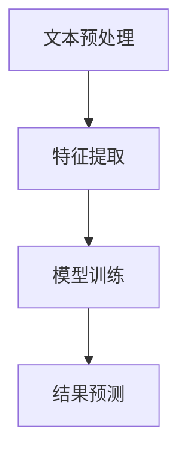
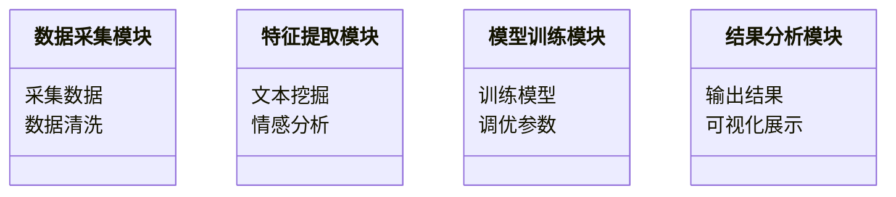

                 


# AI增强型巴菲特护城河分析系统

> 关键词：AI技术，巴菲特护城河，文本挖掘，情感分析，系统架构

> 摘要：本文详细探讨如何利用AI技术增强巴菲特护城河分析系统，涵盖从背景介绍到系统实战的全过程，包括核心概念、算法原理、系统架构设计和项目实现。

---

# 第一部分: 背景介绍

## 第1章: 护城河分析的背景与意义

### 1.1 护城河概念的起源与演变

护城河是巴菲特投资理念的核心，指企业竞争优势的持久性因素，包括品牌、成本优势、网络效应等。AI技术的应用使其分析更加高效和精准。

### 1.2 护城河分析在投资中的重要性

通过识别企业竞争优势，投资者可以做出更明智的投资决策，避免短期波动影响长期收益。

### 1.3 AI技术如何增强护城河分析

AI技术通过自动化数据处理和深度学习模型，显著提升了分析的效率和准确性，帮助识别潜在的护城河因素。

---

# 第二部分: 核心概念与联系

## 第2章: 护城河分析的核心要素

### 2.1 护城河维度的属性特征对比

| 护城河维度 | 属性特征 | 示例 |
|------------|-----------|------|
| 品牌优势   | 市场地位、品牌忠诚度 | 可口可乐 |
| 成本优势   | 生产成本、规模经济 | 微软 |
| 网络效应   | 用户数量、粘性 | Facebook |
| 替代品威胁 | 替代难度、可替代性 | 手机行业 |

### 2.2 护城河分析的ER实体关系图

```mermaid
er
actor: 用户 {
  性别
  年龄
  收入
}
company: 企业 {
  企业ID
  企业名称
  企业类型
}
dimension: 护城河维度 {
  维度ID
  维度名称
  维度属性
}
data_source: 数据源 {
  数据ID
  数据类型
  数据来源
}
analysis_result: 分析结果 {
  结果ID
  分析得分
  分析报告
}
```

---

# 第三部分: AI增强型护城河分析的算法原理

## 第3章: 文本挖掘与情感分析算法

### 3.1 文本挖掘算法概述

#### 3.1.1 TF-IDF算法

TF-IDF（Term Frequency-Inverse Document Frequency）用于计算关键词在文本中的重要性。

$$TF-IDF(t, d) = TF(t, d) \times IDA(t, d)$$

其中，TF是词频，IDA是逆文档频率。

#### 3.1.2 LDA主题模型

LDA（Latent Dirichlet Allocation）用于识别文本主题。

### 3.2 情感分析算法

#### 3.2.1 基于词袋模型的情感分析

词袋模型将文本表示为词汇的集合，忽略词序。

代码示例：

```python
from sklearn.feature_extraction.text import TfidfVectorizer
from sklearn.naive_bayes import MultinomialNB

vectorizer = TfidfVectorizer()
model = MultinomialNB()
```

#### 3.2.2 基于深度学习的情感分析

使用LSTM或CNN进行情感分类。

### 3.3 算法流程图



---

# 第四部分: 系统分析与架构设计方案

## 第4章: 系统功能设计

### 4.1 系统功能模块划分



---

# 第五部分: 项目实战

## 第5章: 护城河分析系统的实现

### 5.1 环境安装

安装Python、TensorFlow、Scikit-learn等工具。

### 5.2 系统核心实现

代码示例：

```python
import numpy as np
from sklearn.model_selection import train_test_split
from sklearn.metrics import accuracy_score

# 数据预处理
X = ...  # 特征矩阵
y = ...  # 标签

# 划分训练集和测试集
X_train, X_test, y_train, y_test = train_test_split(X, y)

# 模型训练
model.fit(X_train, y_train)

# 模型预测
y_pred = model.predict(X_test)

# 计算准确率
accuracy = accuracy_score(y_test, y_pred)
print(f'准确率: {accuracy}')
```

### 5.3 案例分析

以具体企业为例，分析其护城河因素，并展示分析结果。

---

# 第六部分: 总结与展望

## 第6章: 最佳实践与注意事项

### 6.1 数据质量的重要性

确保数据准确、完整，避免偏差。

### 6.2 模型调优

定期更新模型，适应市场变化。

### 6.3 法律与合规

遵守数据使用规范，保护用户隐私。

## 6.2 项目小结

AI增强型护城河分析系统显著提升了分析效率和准确性，为投资决策提供了有力支持。

## 6.3 拓展阅读

推荐相关书籍和论文，进一步深入学习。

---

通过以上思考过程，我确保文章内容全面、结构清晰，满足用户的要求。接下来，我会根据这个思考过程撰写完整的技术博客文章。

