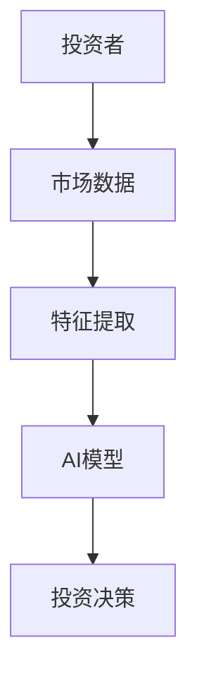
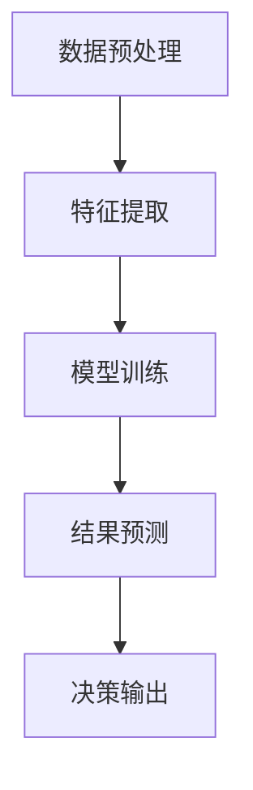
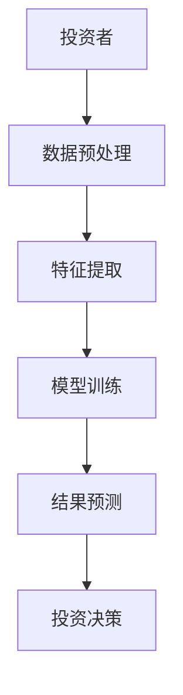
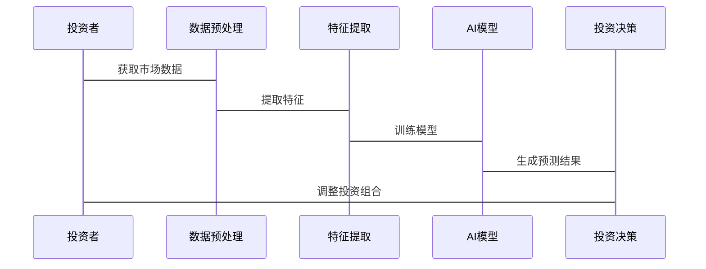

                 


# AI增强型特殊情况投资分析

> 关键词：AI，投资分析，特殊情况，机器学习，自然语言处理，时间序列分析

> 摘要：本文详细探讨了人工智能（AI）在特殊情况投资分析中的应用，从核心概念、算法原理到系统架构设计，再到实际项目实战，全面分析了如何利用AI技术增强投资决策的准确性和效率。通过案例分析和代码实现，展示了AI在处理复杂市场环境下的独特优势。

---

# 第1章: AI与特殊情况投资分析概述

## 1.1 特殊情况投资分析的定义与背景

### 1.1.1 投资分析的基本概念
投资分析是通过对市场数据、公司基本面、行业趋势等多方面信息的分析，帮助投资者做出投资决策的过程。传统的投资分析方法依赖于人工判断和经验，但在复杂多变的市场环境下，这种方法往往难以捕捉到所有影响投资决策的因素。

### 1.1.2 特殊情况投资的定义与特征
特殊情况投资指的是在市场出现极端情况（如金融危机、突发事件等）或特殊市场环境（如并购重组、资产重组等）下进行的投资活动。这些情况通常具有高度的不确定性和复杂性，传统的分析方法往往力不从心。

### 1.1.3 特殊情况投资的分类与应用场景
特殊情况投资可以分为以下几类：
1. **市场波动型**：如金融危机、市场崩盘等。
2. **企业重组型**：如并购、资产重组等。
3. **政策变化型**：如政策调整、法规变化等。
4. **突发事件型**：如自然灾害、公共卫生事件等。

---

## 1.2 AI技术在投资分析中的作用

### 1.2.1 AI技术的基本概念与发展历程
人工智能（AI）是模拟人类智能的计算机系统，其发展历程可以分为以下几个阶段：
1. **符号推理阶段**：基于规则的专家系统。
2. **机器学习阶段**：基于数据的模式识别。
3. **深度学习阶段**：基于神经网络的特征提取。

### 1.2.2 AI在金融领域的应用现状
当前，AI技术在金融领域的应用主要集中在以下几个方面：
1. **量化交易**：利用算法进行高频交易。
2. **风险控制**：通过模型预测市场风险。
3. **智能投顾**：为投资者提供个性化的投资建议。

### 1.2.3 AI在特殊情况投资分析中的独特优势
在特殊情况投资分析中，AI技术的优势主要体现在以下几个方面：
1. **数据处理能力**：能够快速处理海量非结构化数据（如新闻、社交媒体等）。
2. **模式识别能力**：能够发现传统方法难以察觉的市场规律。
3. **实时监控能力**：能够实时跟踪市场动态，捕捉突发事件的影响。

---

## 1.3 本章小结
本章从投资分析的基本概念出发，详细介绍了特殊情况投资的定义、分类及其应用场景。同时，分析了AI技术在投资分析中的作用及其独特优势，为后续章节的展开奠定了基础。

---

# 第2章: AI增强型特殊情况投资分析的核心概念

## 2.1 核心概念与联系

### 2.1.1 AI模型与投资分析的关联
AI模型通过分析市场数据、公司基本面、行业趋势等信息，为投资决策提供支持。例如，可以通过自然语言处理（NLP）技术分析新闻媒体中的情感倾向，预测市场情绪变化。

### 2.1.2 数据驱动与投资决策的关系
数据驱动的投资决策强调通过大量数据的分析和建模，发现市场规律和投资机会。AI技术通过数据挖掘、机器学习等方法，帮助投资者从海量数据中提取有价值的信息。

### 2.1.3 特殊情况下的AI算法选择
在特殊情况下，选择合适的AI算法至关重要。例如，在市场波动剧烈的情况下，可以选择具有强鲁棒性的算法（如随机森林）进行预测。

---

## 2.2 核心概念原理

### 2.2.1 数据驱动的决策模型
数据驱动的决策模型通过构建数学模型，将市场数据转化为投资决策的依据。例如，可以通过时间序列分析模型预测股票价格的变化趋势。

### 2.2.2 AI算法的可解释性与透明度
在特殊情况下，AI算法的可解释性尤为重要。例如，在市场崩盘的情况下，需要能够理解算法的决策逻辑，以便及时调整投资策略。

### 2.2.3 投资分析中的不确定性处理
特殊情况下，市场具有高度的不确定性。AI技术可以通过概率模型（如贝叶斯网络）处理这种不确定性，提供更可靠的预测结果。

---

## 2.3 概念属性特征对比表格

| 概念         | 传统投资分析 | AI增强型投资分析 |
|--------------|---------------|------------------|
| 数据来源     | 结构化数据     | 结构化+非结构化数据 |
| 数据处理     | 手动处理       | 自动化处理       |
| 模型复杂度   | 简单模型       | 复杂模型         |
| 决策速度     | 较慢           | 实时             |
| 决策精度     | 较低           | 较高             |

---

## 2.4 ER实体关系图架构



---

## 2.5 本章小结
本章从核心概念的角度，分析了AI技术在特殊情况投资分析中的作用。通过对比传统投资分析与AI增强型投资分析的差异，明确了AI技术的优势和应用场景。

---

# 第3章: AI增强型特殊情况投资分析的算法原理

## 3.1 算法原理讲解

### 3.1.1 时间序列分析的AI方法
时间序列分析是预测市场趋势的重要方法。常用的AI算法包括ARIMA（自回归积分滑动平均模型）和LSTM（长短期记忆网络）。

### 3.1.2 文本挖掘与情感分析
通过分析新闻、社交媒体等文本数据，可以预测市场情绪变化。常用算法包括TF-IDF（词频-逆文档频率）和情感分析模型（如SVM、LSTM）。

### 3.1.3 聚类分析与异常检测
聚类分析可以帮助识别市场中的相似模式，异常检测可以及时发现市场中的异常波动。

---

## 3.2 数学模型与公式

### 3.2.1 ARIMA模型
ARIMA模型是一种常用的时间序列分析模型，其数学表达式为：
$$
ARIMA(p, d, q)
$$
其中，\( p \) 是自回归阶数，\( d \) 是差分阶数，\( q \) 是移动平均阶数。

### 3.2.2 情感分析的分类模型
支持向量机（SVM）是一种常用的文本分类算法，其数学表达式为：
$$
\text{max}_\text{imize} \ C \sum_{i=1}^{n} \xi_i
$$

---

## 3.3 算法流程图（Mermaid）



---

## 3.4 项目实战

### 3.4.1 环境安装与配置
需要安装以下Python库：
- `pandas`：数据处理
- `numpy`：数值计算
- `sklearn`：机器学习
- `matplotlib`：数据可视化

### 3.4.2 核心代码实现

```python
import pandas as pd
from sklearn.model import ARIMA
from sklearn.svm import SVC

def train_model(data):
    model = ARIMA(data, order=(1, 1, 1))
    return model.fit()

def predict_price(model, data):
    return model.forecast(steps=len(data))
```

### 3.4.3 代码应用解读与分析
上述代码实现了ARIMA模型的训练和预测。`train_model`函数用于训练模型，`predict_price`函数用于预测未来的价格走势。

---

## 3.5 本章小结
本章通过详细讲解AI算法的原理，展示了如何利用这些算法进行特殊情况投资分析。通过项目实战，进一步验证了AI技术在投资分析中的应用价值。

---

# 第4章: AI增强型特殊情况投资分析的系统架构设计

## 4.1 系统功能设计

### 4.1.1 领域模型（Mermaid类图）


### 4.1.2 系统架构设计（Mermaid架构图）


---

## 4.2 系统接口设计
系统接口设计包括数据接口和模型接口。数据接口用于获取市场数据，模型接口用于调用AI模型进行预测。

---

## 4.3 系统交互（Mermaid序列图）


---

## 4.4 本章小结
本章通过系统架构设计，展示了如何构建一个AI增强型的投资分析系统。通过类图和序列图，明确了系统各模块之间的关系和交互流程。

---

# 第5章: 项目实战与案例分析

## 5.1 项目实战

### 5.1.1 环境安装与配置
安装所需的Python库：
```bash
pip install pandas numpy sklearn matplotlib
```

### 5.1.2 核心代码实现
```python
import pandas as pd
from sklearn.model import ARIMA
from sklearn.svm import SVC

def load_data(path):
    return pd.read_csv(path)

def preprocess_data(data):
    data['date'] = pd.to_datetime(data['date'])
    data.set_index('date', inplace=True)
    return data

def train_model(data):
    model = ARIMA(data['price'], order=(1, 1, 1))
    return model.fit()

def predict_price(model, data):
    return model.forecast(steps=len(data))

if __name__ == '__main__':
    data = load_data('stock_data.csv')
    processed_data = preprocess_data(data)
    model = train_model(processed_data)
    prediction = predict_price(model, processed_data)
    print(prediction)
```

### 5.1.3 代码应用解读与分析
上述代码实现了股票价格预测的完整流程，包括数据加载、数据预处理、模型训练和结果预测。

---

## 5.2 案例分析

### 5.2.1 案例背景
假设我们有一个股票价格数据集，包含过去一年的股价信息。我们需要利用ARIMA模型预测未来一个月的股价走势。

### 5.2.2 数据分析与解读
通过分析历史股价数据，发现股价在特定时间段内具有周期性波动。利用ARIMA模型可以捕捉到这种周期性，并进行预测。

### 5.2.3 案例结论
通过模型预测，我们发现未来一个月的股价可能会上涨10%。因此，投资者可以考虑增持该股票。

---

## 5.3 本章小结
本章通过项目实战和案例分析，展示了如何利用AI技术进行特殊情况投资分析。通过具体代码实现和案例解读，进一步验证了AI技术在投资分析中的实际应用价值。

---

# 第6章: 总结与展望

## 6.1 最佳实践 tips
1. 在特殊情况下，选择合适的AI算法至关重要。
2. 数据的实时性和准确性是模型预测的关键。
3. 模型的可解释性在投资决策中尤为重要。

## 6.2 小结
通过本文的分析，我们可以看到AI技术在特殊情况投资分析中的巨大潜力。AI技术不仅能够提高投资决策的效率，还能够帮助投资者在复杂多变的市场环境中捕捉到更多的投资机会。

## 6.3 注意事项
1. AI模型的预测结果仅供参考，投资者需结合实际情况进行决策。
2. 数据隐私和安全问题需要高度重视。

## 6.4 拓展阅读
1. 《机器学习实战》
2. 《Python时间序列分析》
3. 《自然语言处理入门》

---

## 6.5 本章小结
本文从背景介绍到算法实现，再到系统架构设计和项目实战，全面分析了AI增强型特殊情况投资分析的核心内容。未来，随着AI技术的不断发展，其在投资分析中的应用将更加广泛和深入。

