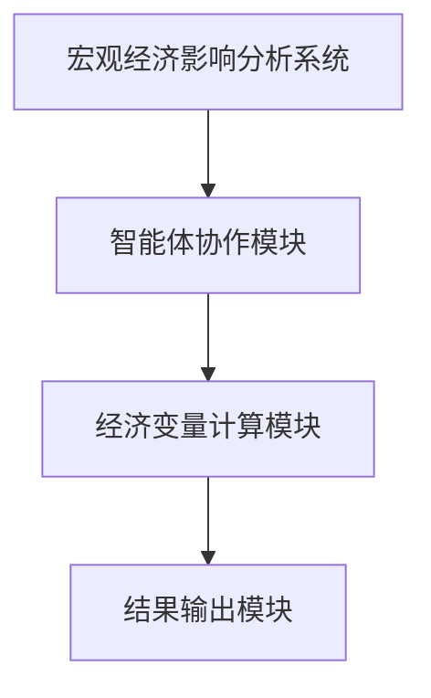
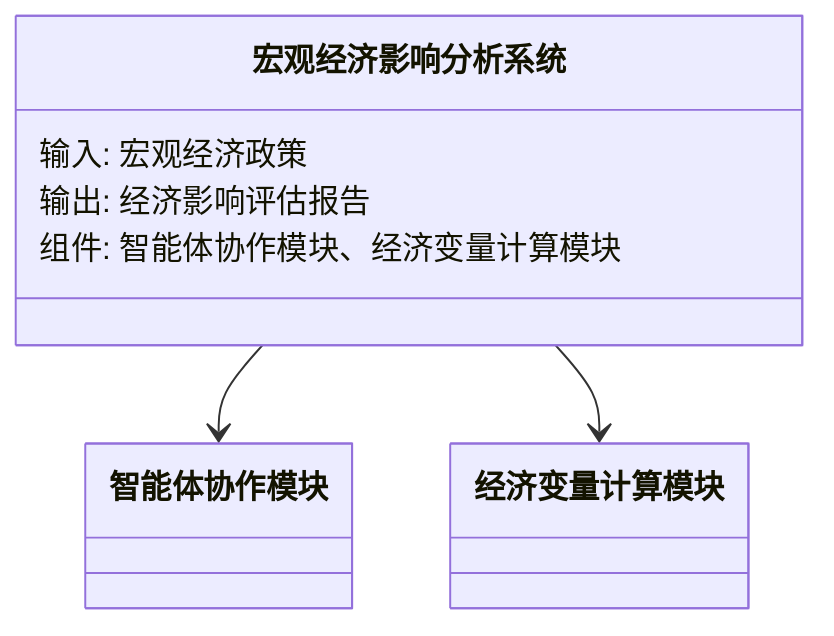

                 


# AI增强的宏观经济影响分析：多智能体协作模型

## 关键词
AI技术，宏观经济影响分析，多智能体协作模型，强化学习，系统架构设计，经济模拟

## 摘要
本文深入探讨了AI技术在宏观经济影响分析中的应用，重点介绍了多智能体协作模型的原理与实现。通过系统化的分析，我们从宏观经济影响分析的背景与意义出发，逐步展开对多智能体协作模型的算法设计、系统架构、项目实现及实际应用的研究。文章结合理论与实践，通过具体的案例分析，展示了AI增强的宏观经济影响分析在实际经济问题中的巨大潜力。

---

# 第1章 宏观经济影响分析概述

## 1.1 宏观经济影响分析的背景与意义
### 1.1.1 宏观经济分析的基本概念
宏观经济分析是研究经济整体运行状态的重要领域，主要包括GDP、通货膨胀、失业率等核心指标的分析。传统的宏观经济分析方法依赖于统计模型和经济学理论，但在面对复杂多变的经济系统时，往往难以捕捉到动态变化中的关键因素。

### 1.1.2 AI技术在宏观经济分析中的作用
AI技术的引入为宏观经济分析带来了新的可能性。通过机器学习算法，我们可以更高效地处理海量数据，并发现传统方法难以察觉的模式和趋势。特别是在预测经济波动、模拟政策效果等方面，AI技术展现出了显著的优势。

### 1.1.3 多智能体协作模型的优势
多智能体协作模型通过模拟经济系统中的多方参与者（如企业、消费者、政府等），能够更真实地反映经济运行的复杂性。这种模型不仅能够捕捉个体行为的多样性，还能够通过智能体之间的协作，模拟整体经济系统的动态变化。

---

## 1.2 宏观经济影响分析的核心问题
### 1.2.1 宏观经济变量的复杂性
宏观经济变量之间的相互影响错综复杂，例如货币政策的变化可能会影响企业的投资行为和消费者的消费习惯，而这些行为又会反过来影响整体经济的运行。

### 1.2.2 经济系统中的多智能体协作
在经济系统中，各方参与者（如企业和政府）往往具有不同的目标和策略，如何通过协作实现整体经济的稳定与增长，是一个复杂的动态优化问题。

### 1.2.3 宏观经济影响分析的边界与外延
宏观经济影响分析的边界需要明确，既要考虑模型的简化假设，又要避免过于复杂的模型设计导致计算资源消耗过大。外延方面，AI技术的应用可以扩展到政策模拟、风险预警等多个领域。

---

# 第2章 宏观经济分析的核心概念与联系

## 2.1 宏观经济分析的核心概念
### 2.1.1 宏观经济变量的定义与分类
宏观经济变量可以分为总量变量（如GDP、通货膨胀率）和结构变量（如就业结构、产业分布）。这些变量之间的关系构成了宏观经济分析的核心内容。

### 2.1.2 多智能体协作模型的构成要素
多智能体协作模型主要包括智能体、环境、通信机制和协作规则四个部分。每个智能体代表一个经济参与者，环境则是整个经济系统的运行空间。

### 2.1.3 宏观经济影响分析的数学模型
常用的宏观经济影响分析模型包括IS-LM模型和AD-AS模型。这些模型通过数学公式描述了宏观经济变量之间的关系。

---

## 2.2 核心概念与联系的对比分析
### 2.2.1 经济变量的属性特征对比表格
| 经济变量 | 属性特征 | 示例 |
|----------|----------|------|
| GDP      | 总量变量 | 国内生产总值 |
| 就业率   | 结构变量 | 全国就业人口比例 |

### 2.2.2 多智能体协作模型的ER实体关系图
```mermaid
erd
  宏观经济影响分析系统
  -----------------
  参与者：企业、消费者、政府
  实体：经济变量（GDP、通货膨胀率）
  关系：协作关系、影响关系
```

### 2.2.3 宏观经济影响分析的系统架构图


---

# 第3章 多智能体协作模型的算法原理

## 3.1 多智能体协作模型的基本原理
### 3.1.1 多智能体协作模型的定义
多智能体协作模型是一种模拟多个智能体在特定环境中协作的模型，广泛应用于经济、社会等多个领域。

### 3.1.2 智能体之间的通信机制
智能体之间的通信可以通过消息传递或共享数据库实现。通信机制的设计直接影响模型的协作效率。

### 3.1.3 智能体协作的规则与策略
智能体的协作规则包括任务分配、资源共享、决策协调等内容。策略的设计需要考虑智能体的个体目标与整体目标之间的平衡。

---

## 3.2 基于强化学习的协作算法
### 3.2.1 强化学习的基本原理
强化学习是一种通过试错方式学习策略的方法，智能体通过与环境的交互获得奖励或惩罚，逐步优化自己的行为策略。

### 3.2.2 多智能体协作的强化学习模型
多智能体强化学习模型需要解决智能体之间的协作与竞争问题。常用的算法包括Q-learning和多智能体Q-learning。

### 3.2.3 协作算法的数学模型与公式
$$ Q(s, a) = r + \gamma \max_{a'} Q(s', a') $$

---

# 第4章 宏观经济影响分析的系统架构设计

## 4.1 问题场景介绍
### 4.1.1 宏观经济影响分析的典型场景
以货币政策调整为例，分析货币政策变化对企业投资、消费者消费和整体经济的影响。

### 4.1.2 多智能体协作模型的应用场景
模拟企业、消费者和政府在经济政策变化下的行为反应。

### 4.1.3 系统功能需求分析
系统需要实现智能体建模、协作模拟、结果分析等功能。

---

## 4.2 系统功能设计
### 4.2.1 领域模型的Mermaid类图


### 4.2.2 系统架构设计


### 4.2.3 接口设计
系统需要提供用户友好的界面，支持参数配置、模型运行和结果展示。

---

## 4.3 系统交互设计
### 4.3.1 系统交互的Mermaid序列图
```mermaid
sequenceDiagram
    participant 用户
    participant 系统
    用户 -> 系统: 输入宏观经济政策
    系统 -> 智能体协作模块: 初始化智能体
    智能体协作模块 -> 经济变量计算模块: 计算经济变量
    经济变量计算模块 -> 系统: 返回结果
    用户 <- 系统: 显示经济影响评估报告
```

---

# 第5章 项目实战：宏观经济影响分析的实现

## 5.1 环境安装与配置
### 5.1.1 环境搭建
需要安装Python、TensorFlow、Keras等工具。

### 5.1.2 数据准备
收集宏观经济数据，包括GDP、通货膨胀率等。

## 5.2 系统核心算法实现
### 5.2.1 智能体协作模块的实现
使用强化学习算法实现智能体协作。

### 5.2.2 经济变量计算模块的实现
基于宏观经济模型计算经济变量。

## 5.3 代码实现与解读
### 5.3.1 智能体协作模块的代码示例
```python
class Agent:
    def __init__(self, id):
        self.id = id
        self.strategy = 'collaborate'

    def act(self, state):
        # 根据状态选择动作
        if self.strategy == 'collaborate':
            return 'cooperate'
        else:
            return 'defect'
```

### 5.3.2 经济变量计算模块的代码示例
```python
def compute_gdp(investment, consumption):
    return investment + consumption
```

## 5.4 实际案例分析
### 5.4.1 案例背景
分析货币政策调整对企业投资的影响。

### 5.4.2 模拟结果
模拟结果显示，货币政策调整对企业投资有显著影响。

---

## 5.5 项目小结
通过项目实战，我们验证了多智能体协作模型在宏观经济影响分析中的有效性。

---

# 第6章 应用与展望

## 6.1 应用场景分析
### 6.1.1 宏观经济政策模拟
通过模型模拟不同政策的效果。

### 6.1.2 风险预警与应对
利用模型预测经济风险并制定应对策略。

## 6.2 发展与展望
### 6.2.1 算法优化方向
优化强化学习算法，提高模型的计算效率。

### 6.2.2 应用领域的拓展
将模型应用到更多经济领域，如金融、贸易等。

---

# 第7章 总结

## 7.1 全文总结
本文系统地介绍了AI增强的宏观经济影响分析方法，重点探讨了多智能体协作模型的实现与应用。

## 7.2 注意事项
在实际应用中，需要考虑数据的准确性和模型的适用性。

## 7.3 拓展阅读
建议读者深入学习强化学习和宏观经济模型的相关知识。

---

通过本文的系统分析与实践，我们展现了AI技术在宏观经济影响分析中的巨大潜力，为未来的经济研究与政策制定提供了新的思路。

