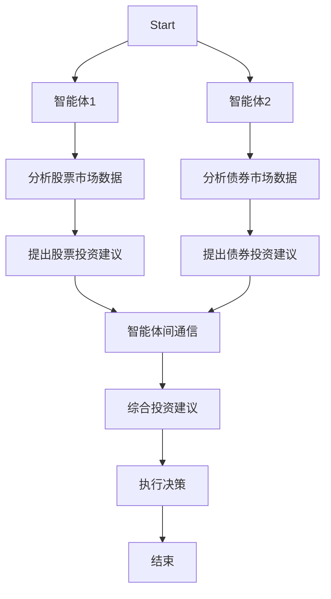
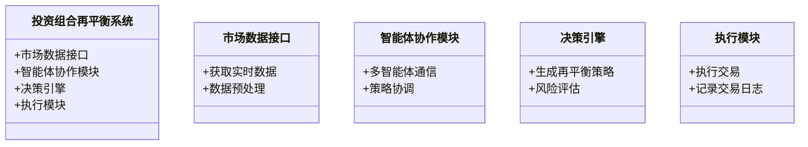
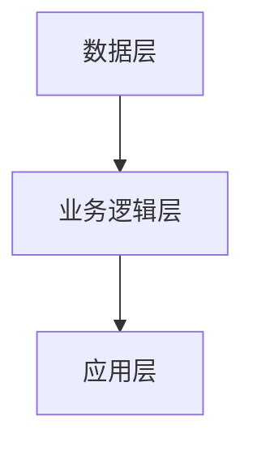
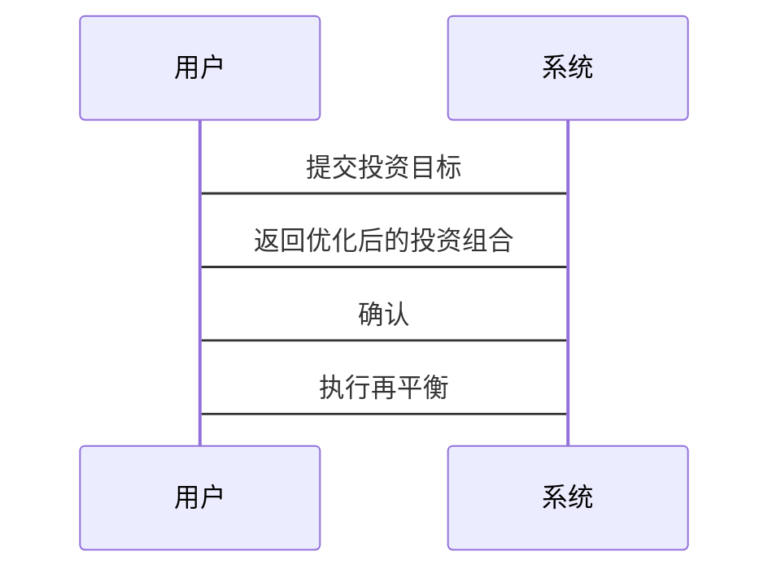
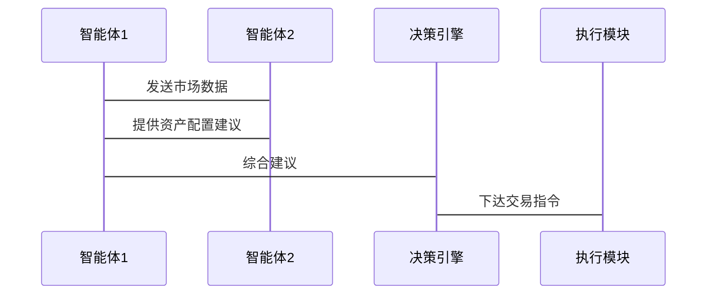

                 


# AI增强的投资组合再平衡策略：多智能体协作模型

## 关键词：
- AI增强
- 投资组合再平衡
- 多智能体协作模型
- 量化投资
- 系统架构设计
- 强化学习

## 摘要：
本文探讨了如何利用AI技术，特别是多智能体协作模型，来优化投资组合的再平衡策略。通过分析多智能体协作的原理和算法实现，结合实际案例，展示了如何构建高效的投资组合管理系统，为金融领域提供了新的思路。

---

## 第三部分: 多智能体协作模型的算法实现

# 第3章: 多智能体协作算法原理

## 3.1 强化学习在多智能体协作中的应用

### 3.1.1 强化学习的基本原理
强化学习（Reinforcement Learning，RL）是一种机器学习范式，通过智能体在环境中的交互，学习策略以最大化累计奖励。其核心在于通过试错过程优化决策。

### 3.1.2 多智能体强化学习的挑战
多智能体强化学习（Multi-Agent Reinforcement Learning，MARL）面临通信开销大、协调困难等挑战。智能体需通过协作实现全局目标，同时保持各自的策略优化。

### 3.1.3 基于强化学习的多智能体协作模型
#### 案例分析：
假设两个智能体分别负责股票和债券的投资决策。每个智能体通过强化学习优化自己的策略，同时通过通信机制进行协作。



## 3.2 分布式优化算法在多智能体协作中的应用

### 3.2.1 分布式优化的基本原理
分布式优化算法允许智能体在不共享所有信息的情况下，通过局部信息更新全局模型。这在多智能体协作中尤为重要，因为它减少了通信开销。

### 3.2.2 分布式优化算法的具体实现
使用分布式优化算法，如异步梯度下降，优化投资组合中的权重分配。

#### 数学模型：
假设投资组合包含n种资产，每个智能体负责优化一部分资产。目标是最小化风险（方差）的同时最大化收益。

$$
\min_{w} \frac{1}{2}w^T \Sigma w + \lambda |w|^2
$$
其中，$\Sigma$为协方差矩阵，$\lambda$为正则化参数，$w$为权重向量。

## 3.3 算法实现步骤

### 3.3.1 环境搭建
- 使用Python的强化学习库如OpenAI Gym进行环境模拟。
- 数据预处理：将历史价格数据转化为智能体可读的输入格式。

### 3.3.2 智能体实现
编写智能体类，实现以下功能：
1. 状态观测：接收市场数据和当前投资组合信息。
2. 动作选择：基于观测数据做出投资决策。
3. 奖励计算：根据收益和风险计算奖励。

### 3.3.3 算法实现代码示例

```python
class MultiAgentRL:
    def __init__(self, num_agents):
        self.num_agents = num_agents
        self.agents = [Agent(i) for i in range(num_agents)]
        
    def step(self, state):
        actions = []
        for agent in self.agents:
            action = agent.act(state)
            actions.append(action)
        return actions

class Agent:
    def __init__(self, id):
        self.id = id
        self.model = self._build_model()
        
    def _build_model(self):
        # 简单的神经网络模型
        model = Sequential()
        model.add(Dense(64, activation='relu'))
        model.add(Dense(1))
        model.compile(optimizer='adam', loss='mse')
        return model
        
    def act(self, state):
        # 假设state为市场数据
        prediction = self.model.predict(state)
        return prediction[0][0]  # 返回动作
```

## 3.4 算法优化与调优

### 3.4.1 参数调整
- 调整学习率（learning rate）、奖励函数的设计。
- 增加经验回放（experience replay）以提高学习效率。

### 3.4.2 并行计算
使用多线程或分布式计算框架（如MPI）加速智能体的训练过程。

---

## 第四部分: 系统分析与架构设计

# 第4章: 投资组合再平衡系统的系统架构设计

## 4.1 系统功能设计

### 4.1.1 领域模型设计
使用Mermaid类图展示系统的功能模块。



## 4.2 系统架构设计

### 4.2.1 分层架构设计
系统分为数据层、业务逻辑层和应用层。



### 4.2.2 微服务架构设计
采用微服务架构，各模块独立运行，便于扩展和维护。

## 4.3 系统接口设计

### 4.3.1 API接口设计
定义RESTful API接口，用于与其他系统的集成。

### 4.3.2 智能体通信接口
定义智能体间的通信协议，如使用WebSocket进行实时通信。

## 4.4 系统交互设计

### 4.4.1 用户交互流程


### 4.4.2 智能体协作流程


---

## 第五部分: 项目实战

# 第5章: 项目实战：基于多智能体协作的投资组合再平衡系统

## 5.1 项目环境安装

### 5.1.1 安装Python环境
- 使用Anaconda安装Python 3.8以上版本。

### 5.1.2 安装依赖库
- 安装TensorFlow、Keras、OpenAI Gym、Plotly等库。

## 5.2 核心系统实现

### 5.2.1 数据获取与预处理
使用Yahoo Finance获取历史数据，并进行标准化处理。

```python
import pandas as pd
import numpy as np

def get_data(tickers, start_date, end_date):
    data = pd.DataFrame()
    for ticker in tickers:
        df = yfinance.download(ticker, start=start_date, end=end_date)
        data[ticker] = df['Close']
    return data

data = get_data(['AAPL', 'MSFT', 'GOOGL'], '2020-01-01', '2023-12-31')
data = data.apply(lambda x: (x - x.mean())/x.std())  # 标准化
```

### 5.2.2 多智能体协作实现
实现多智能体协作模型，训练智能体进行投资决策。

```python
class MultiAgentSystem:
    def __init__(self, num_agents=3):
        self.agents = [Agent(i) for i in range(num_agents)]
        self.current_weights = np.array([1/num_agents]*num_agents)
        
    def step(self, state):
        actions = []
        for agent in self.agents:
            action = agent.act(state)
            actions.append(action)
        return actions

    def update_weights(self, rewards):
        # 使用分布式优化更新权重
        for i, reward in enumerate(rewards):
            self.agents[i].model.optimizer.lr = max(0.001, reward*0.1)
```

### 5.2.3 决策引擎实现
根据智能体的建议生成最终的再平衡策略。

```python
class DecisionEngine:
    def __init__(self, agents):
        self.agents = agents
        
    def generate_strategy(self, state):
        actions = [agent.act(state) for agent in self.agents]
        return actions

    def evaluate_risk(self, portfolio):
        # 计算投资组合的风险
        return np.sqrt(np.dot(portfolio, portfolio))
```

### 5.2.4 系统执行与监控
实现交易执行模块，并监控系统的运行情况。

## 5.3 项目实战案例分析

### 5.3.1 数据分析与可视化
使用Plotly进行数据可视化，分析投资组合的收益和风险。

```python
import plotly.express as px

def visualize_portfolio(weights, returns):
    fig = px.pie(weights, names=['股票', '债券', '现金'], title='投资组合构成')
    fig.show()
    
    fig = px.line(returns, title='投资组合收益曲线')
    fig.show()
```

### 5.3.2 系统运行结果分析
通过回测分析系统的性能，比较传统方法与AI增强方法的差异。

## 5.4 项目小结

### 5.4.1 项目总结
本项目成功实现了基于多智能体协作的投资组合再平衡系统，验证了AI技术在金融领域的有效性。

### 5.4.2 实践中的注意事项
- 数据质量对系统性能影响重大，需确保数据的准确性和及时性。
- 智能体间的通信机制需设计合理，避免信息过载。
- 系统需具备良好的容错机制，防止单点故障。

---

## 第六部分: 总结与展望

# 第6章: 总结与展望

## 6.1 全文总结
本文详细探讨了AI增强的投资组合再平衡策略，特别是多智能体协作模型的应用。通过理论分析和实际案例，展示了如何利用AI技术优化投资决策。

## 6.2 未来展望
未来的研究方向包括：
1. 提升多智能体协作的效率，降低通信开销。
2. 结合区块链技术，确保系统的安全性和透明性。
3. 拓展应用场景，如风险管理、智能投顾等。

---

## 参考文献
[在此列出参考文献]

---

## 致谢
感谢读者的关注与支持，感谢在写作过程中给予帮助的各位专家和同事。

