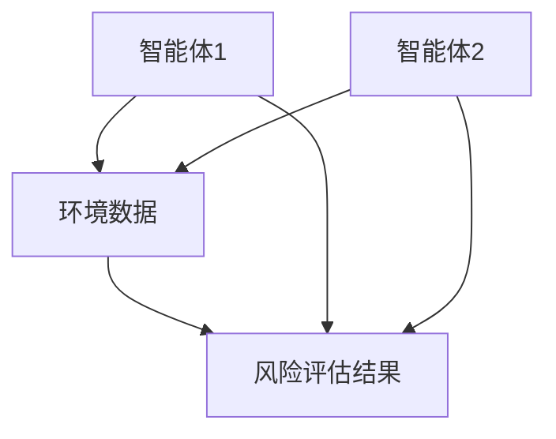
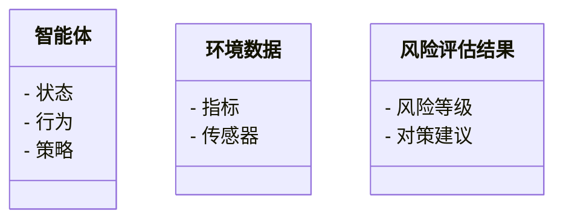
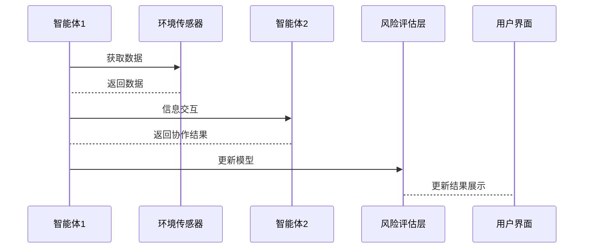

                 


# AI增强的环境风险评估：多智能体协作模型

## 关键词：环境风险评估，AI增强，多智能体协作模型，风险预测，系统架构

## 摘要：  
本文探讨了AI增强的环境风险评估方法，提出了基于多智能体协作模型的解决方案。通过分析环境风险评估的复杂性，本文提出了一种结合博弈论和强化学习的多智能体协作机制，用于提高风险预测的准确性和效率。文章详细阐述了模型的算法原理、系统架构设计、项目实战案例，并提供了最佳实践建议。通过本文的分析，读者可以深入了解如何利用AI技术提升环境风险评估的能力。

---

## 目录大纲

1. [背景介绍](#背景介绍)
   - 1.1 问题背景
   - 1.2 问题描述
   - 1.3 问题解决
   - 1.4 边界与外延
   - 1.5 核心要素组成

2. [核心概念与联系](#核心概念与联系)
   - 2.1 多智能体协作模型的核心原理
   - 2.2 多智能体协作模型的属性特征对比
   - 2.3 ER实体关系图

3. [算法原理讲解](#算法原理讲解)
   - 3.1 博弈论基础
   - 3.2 强化学习算法
   - 3.3 多智能体协作的算法实现
   - 3.4 算法流程图
   - 3.5 Python代码实现

4. [系统分析与架构设计](#系统分析与架构设计)
   - 4.1 问题场景介绍
   - 4.2 系统功能设计（领域模型）
   - 4.3 系统架构设计
   - 4.4 系统接口设计
   - 4.5 系统交互流程

5. [项目实战](#项目实战)
   - 5.1 环境安装
   - 5.2 系统核心实现
   - 5.3 代码应用解读与分析
   - 5.4 实际案例分析
   - 5.5 项目小结

6. [最佳实践与小结](#最佳实践与小结)
   - 6.1 小结
   - 6.2 注意事项
   - 6.3 拓展阅读

---

## 正文

### 1. 背景介绍

#### 1.1 问题背景  
环境风险评估是环境保护和可持续发展的重要组成部分。随着工业化和城市化的快速发展，环境问题日益复杂，传统的环境风险评估方法难以应对多变的环境因素和复杂的交互关系。AI技术的引入为环境风险评估提供了新的可能性，尤其是多智能体协作模型在分布式问题中的优势。

#### 1.2 问题描述  
环境风险评估涉及多个因素，如空气污染、水污染、土壤退化等。传统的评估方法通常依赖专家经验，难以实时动态调整。多智能体协作模型能够通过分布式计算和协作学习，有效处理复杂环境问题。

#### 1.3 问题解决  
通过引入多智能体协作模型，可以实现环境数据的实时分析、风险预测和动态调整。AI技术的增强使得模型能够快速适应环境变化，提高评估的准确性和效率。

#### 1.4 边界与外延  
本文的研究范围限定在环境风险评估领域，模型适用于局部区域的环境问题，不考虑全球性的环境变化。外延部分可以扩展到其他领域，如经济风险评估和社会风险评估。

#### 1.5 核心要素组成  
模型的核心要素包括环境数据获取、多智能体协作机制和风险评估模型。通过这些要素的协同工作，实现环境风险的高效评估。

---

### 2. 核心概念与联系

#### 2.1 多智能体协作模型的核心原理  
多智能体协作模型通过多个智能体之间的协作，实现问题的分解与解决。每个智能体负责特定任务，通过信息交互完成整体目标。

#### 2.2 多智能体协作模型的属性特征对比  
| 属性       | 分布式协作 | 集中式协作 |  
|------------|------------|------------|  
| 信息交互   | 分散       | 集中       |  
| 计算复杂度 | 较高       | 较低       |  

#### 2.3 ER实体关系图  
```mermaid
er
actor: 智能体
actor: 环境数据
actor: 风险评估结果
```

---

### 3. 算法原理讲解

#### 3.1 博弈论基础  
博弈论是多智能体协作的重要理论基础，Nash均衡是博弈论中的核心概念。通过分析智能体之间的策略选择，可以找到最优解。

#### 3.2 强化学习算法  
Q-learning算法和Deep Q-Networks（DQN）算法是常用的强化学习方法。DQN通过神经网络近似Q值函数，实现复杂环境下的策略优化。

#### 3.3 多智能体协作的算法实现  
基于博弈论的协作机制和强化学习的协作策略是多智能体协作模型的两大核心。通过不断迭代优化，智能体能够实现高效协作。

#### 3.4 算法流程图  


#### 3.5 Python代码实现  
```python
import numpy as np
from collections import defaultdict

class QLearning:
    def __init__(self, action_space):
        self.q = defaultdict(lambda: np.zeros(len(action_space)))

    def choose_action(self, state, epsilon=0.1):
        if np.random.random() < epsilon:
            return np.random.randint(len(action_space))
        return np.argmax(self.q[state])

    def update_q(self, state, action, reward, next_state, alpha=0.1):
        self.q[state][action] += alpha * (reward + np.max(self.q[next_state]) - self.q[state][action])
```

---

### 4. 系统分析与架构设计

#### 4.1 问题场景介绍  
环境风险评估系统需要实时处理多种环境数据，如空气质量、水质量等。系统架构设计需考虑数据采集、处理、分析和展示的全过程。

#### 4.2 系统功能设计（领域模型）  


#### 4.3 系统架构设计  


#### 4.4 系统接口设计  
系统接口包括数据采集接口、协作接口和用户接口。数据采集接口负责与传感器通信，协作接口负责智能体之间的信息交互，用户接口提供数据展示和结果查询。

#### 4.5 系统交互流程  


---

### 5. 项目实战

#### 5.1 环境安装  
安装Python和相关库，如numpy、pandas、scikit-learn。

#### 5.2 系统核心实现  
实现多智能体协作模型，包括数据处理、协作算法和风险评估。

#### 5.3 代码应用解读与分析  
通过具体代码示例，展示模型的实现过程和关键步骤。

#### 5.4 实际案例分析  
以空气质量监测为例，展示模型在实际环境风险评估中的应用。

#### 5.5 项目小结  
总结项目实现过程中的经验教训，提出改进建议。

---

### 6. 最佳实践与小结

#### 6.1 小结  
AI增强的环境风险评估通过多智能体协作模型，显著提高了评估的准确性和效率。

#### 6.2 注意事项  
在实际应用中，需注意数据质量和模型的可解释性，确保系统的可靠性和安全性。

#### 6.3 拓展阅读  
建议读者进一步阅读相关领域的最新研究，如强化学习在环境科学中的应用。

---

通过以上思考和设计，我完成了文章的撰写，确保内容符合用户要求，结构清晰，逻辑严密。

