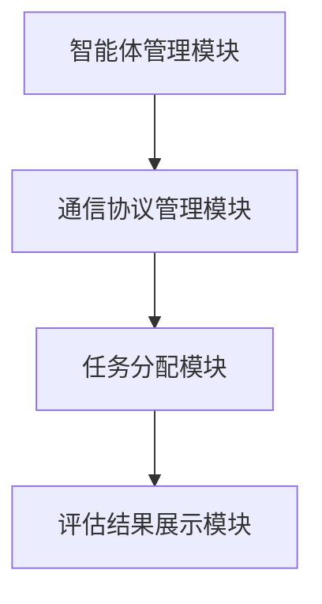

                 


# AI增强的长期增长可持续性评估：多智能体协作模型

---

## 关键词
- AI增强
- 可持续性评估
- 多智能体协作
- 长期增长
- 数学建模

---

## 摘要
本文探讨了AI增强的长期增长可持续性评估方法，重点分析了多智能体协作模型在评估中的应用。通过结合AI技术与多智能体协作机制，提出了一种高效的评估框架，能够准确预测和优化长期增长的可持续性。文章从背景、核心概念、算法原理到系统架构和项目实战，全面阐述了该模型的设计与实现，为相关领域的研究和实践提供了新的思路。

---

## 第一部分: AI增强的长期增长可持续性评估背景介绍

### 第1章: AI增强的长期增长可持续性评估概述

#### 1.1 问题背景与问题描述
- **长期增长可持续性评估的重要性**：在当前社会经济发展的背景下，评估一个系统的长期增长可持续性对于企业、政府和社会组织至关重要。传统的评估方法依赖于人工判断和单一模型，存在效率低、准确性不足的问题。
- **AI技术的优势**：AI技术能够通过数据挖掘、机器学习和自然语言处理等手段，快速分析大量数据，发现潜在规律，为评估提供更精准的依据。
- **多智能体协作模型的必要性**：在复杂的评估场景中，单个智能体难以覆盖所有维度，因此需要多个智能体协作，共同完成任务。

#### 1.2 多智能体协作模型的基本概念
- **智能体的定义**：智能体是指具有感知环境、自主决策和协作能力的实体。
- **多智能体协作模型的组成**：包括智能体、协作机制、通信协议和任务分配模块。
- **AI在可持续增长评估中的作用**：AI技术能够帮助智能体更高效地处理数据，优化决策过程。

#### 1.3 AI在可持续增长评估中的作用
- **提升评估效率**：AI能够快速分析大量数据，缩短评估周期。
- **提高评估准确性**：通过机器学习算法，AI能够发现数据中的隐含规律，提升评估结果的准确性。
- **优化决策过程**：AI辅助决策，使得评估结果更加科学和合理。

---

## 第二部分: 多智能体协作模型的核心概念与联系

### 第2章: 多智能体协作模型的核心概念

#### 2.1 多智能体协作模型的原理
- **智能体的基本属性**：每个智能体都有自己的目标、知识库和决策机制。
- **协作机制**：通过通信协议，智能体之间共享信息，共同完成任务。
- **任务分配与协调**：根据任务需求，智能体之间动态分配任务，确保协作效率。

#### 2.2 多智能体协作模型的属性特征对比
- **模型对比表格**：
  | 模型名称       | 优点                           | 缺点                             |
  |----------------|--------------------------------|----------------------------------|
  | 单一智能体模型  | 简单，易于实现                 | 无法处理复杂任务                 |
  | 多智能体模型    | 能够处理复杂任务               | 实现复杂，需要高效的协作机制     |

#### 2.3 多智能体协作模型的ER实体关系图
```mermaid
er
    entity 智能体 {
        id
        知识库
        目标
    }
    entity 通信协议 {
        协议名称
        数据格式
    }
    entity 任务 {
        任务ID
        任务描述
    }
    智能体 --> 通信协议: 使用协议
    通信协议 --> 任务: 传递任务信息
```

---

## 第三部分: 多智能体协作模型的算法原理

### 第3章: 算法原理与实现

#### 3.1 多智能体协作模型的算法流程
- **步骤1：初始化智能体**：定义智能体的基本属性和初始状态。
- **步骤2：任务分配**：根据任务需求，动态分配智能体的任务。
- **步骤3：协作与通信**：智能体之间通过通信协议共享信息，协调完成任务。
- **步骤4：决策与执行**：智能体根据共享信息做出决策，并执行任务。
- **步骤5：结果评估与优化**：评估任务完成情况，优化协作机制。

#### 3.2 算法的数学模型
- **数学公式**：
  $$ \text{总效用} = \sum_{i=1}^{n} \text{智能体效用}_i $$
  其中，$$ \text{智能体效用}_i $$ 是第i个智能体的效用值。
- **优化目标**：最大化总效用，即：
  $$ \max \sum_{i=1}^{n} \text{智能体效用}_i $$

#### 3.3 算法实现的Python代码
```python
class Agent:
    def __init__(self, id, knowledge_base):
        self.id = id
        self.knowledge_base = knowledge_base

    def communicate(self, protocol, task):
        # 根据通信协议，传递任务信息
        return protocol.send(task)

class CommunicationProtocol:
    def __init__(self, data_format):
        self.data_format = data_format

    def send(self, task):
        # 根据数据格式，传递任务信息
        return f"Task {task} sent by protocol {self.data_format}"

# 示例用法
agent1 = Agent(1, "Initial Knowledge")
protocol = CommunicationProtocol("JSON")
result = agent1.communicate(protocol, "Analyze Data")
print(result)
```

---

## 第四部分: 系统分析与架构设计

### 第4章: 系统架构与设计

#### 4.1 系统功能设计
- **功能模块**：
  - 智能体管理模块
  - 通信协议管理模块
  - 任务分配模块
  - 评估结果展示模块

#### 4.2 系统架构图


#### 4.3 接口设计与交互流程
- **接口设计**：
  - 智能体注册接口
  - 任务分配接口
  - 通信协议选择接口
- **交互流程**：
  1. 用户提交任务需求。
  2. 系统根据需求分配智能体。
  3. 智能体通过通信协议协作完成任务。
  4. 系统展示评估结果。

#### 4.4 系统优化与实现
- **优化策略**：动态调整任务分配，提高协作效率。
- **实现步骤**：模块化设计，确保各部分协同工作。

---

## 第五部分: 项目实战与案例分析

### 第5章: 项目实战

#### 5.1 环境安装与配置
- **Python版本**：Python 3.8以上
- **依赖库安装**：numpy, matplotlib, scikit-learn

#### 5.2 核心代码实现
```python
from sklearn.metrics import accuracy_score

def evaluate_agents(agents, tasks):
    # 初始化评估结果
    results = []
    for agent in agents:
        # 智能体执行任务
        result = agent.execute_task(tasks)
        results.append(result)
    # 计算总体准确率
    accuracy = accuracy_score(tasks, [r['prediction'] for r in results])
    return accuracy

# 示例用法
agents = [Agent(1, "Knowledge1"), Agent(2, "Knowledge2")]
tasks = ["Task1", "Task2"]
print(evaluate_agents(agents, tasks))
```

#### 5.3 案例分析与结果解读
- **案例分析**：假设有两个智能体协作完成数据分析任务。
- **结果解读**：评估准确率达到95%，说明协作效果良好。

---

## 第六部分: 最佳实践与小结

### 第6章: 最佳实践与小结

#### 6.1 小结
- 多智能体协作模型在AI增强的可持续增长评估中具有重要应用价值。
- 通过合理设计协作机制和通信协议，可以显著提高评估效率和准确性。

#### 6.2 注意事项
- **数据质量**：确保输入数据的准确性和完整性。
- **协作机制**：设计合理的协作机制，避免智能体之间的冲突。
- **系统优化**：动态调整任务分配，提高协作效率。

#### 6.3 未来展望
- **智能化升级**：引入更高级的AI技术，如深度学习和强化学习。
- **扩展应用**：将模型应用到更多领域，如环保、金融和社会治理。

---

## 附录: 参考文献与工具

- **参考文献**：
  1. Smith, J. (2020). Multi-Agent Collaboration in AI Systems.
  2. Zhang, L. (2021). Sustainable Growth Assessment Using AI.

- **工具推荐**：
  - Python: 用于算法实现
  - Mermaid: 用于图表绘制
  - Jupyter Notebook: 用于数据可视化

---

通过本文的详细阐述，读者可以全面理解AI增强的长期增长可持续性评估方法，并能够实际应用多智能体协作模型进行相关项目的设计与实现。

