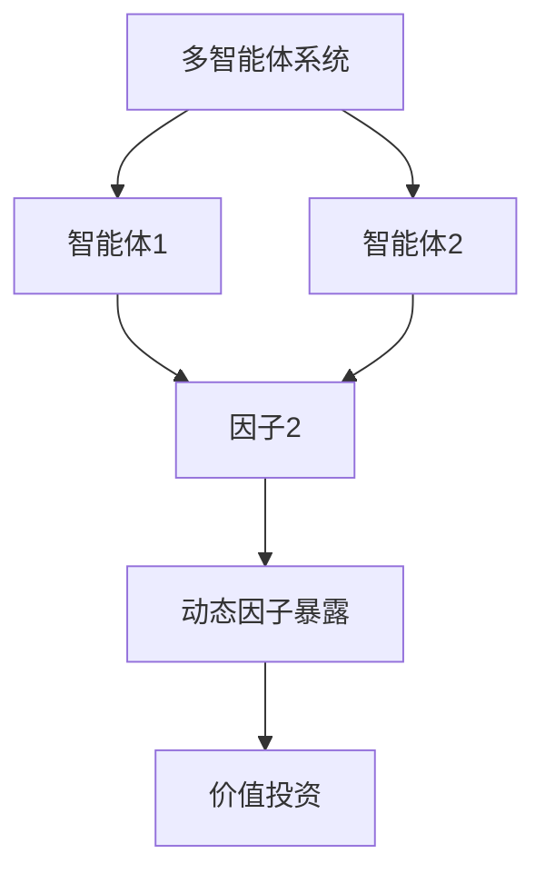
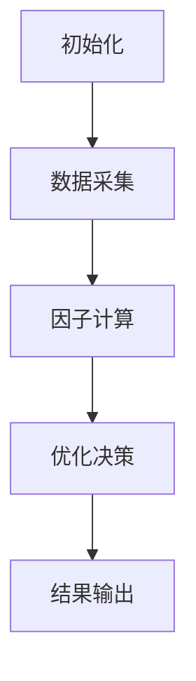
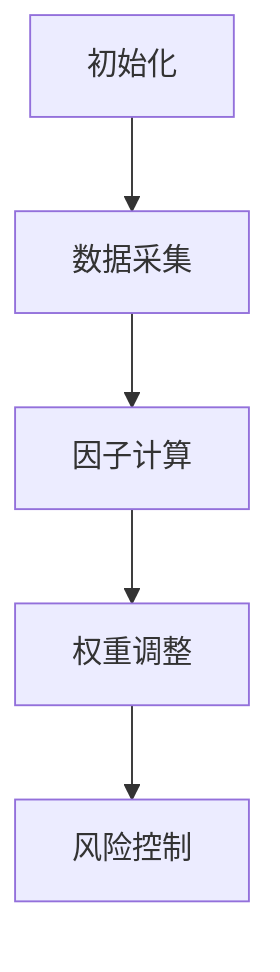
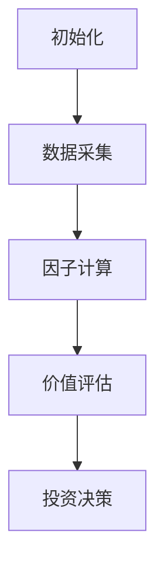
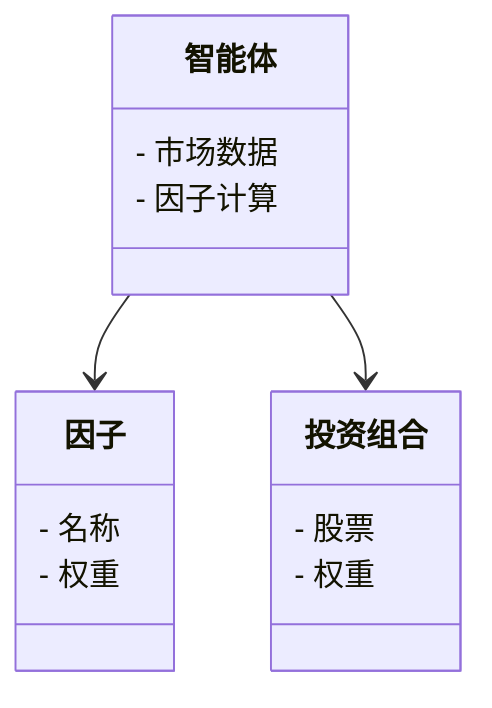
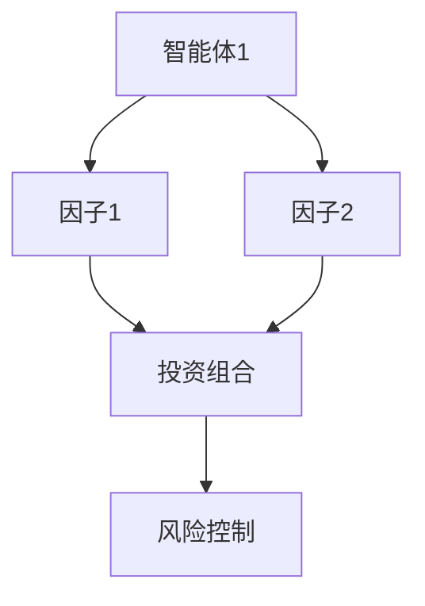

                 


# AI多智能体优化价值投资的动态因子暴露控制

## 关键词：AI多智能体、价值投资、动态因子暴露控制、金融优化、系统架构

## 摘要：  
本文探讨了如何利用AI多智能体技术优化价值投资中的动态因子暴露控制。通过分析多智能体系统的优化原理、动态因子暴露的核心要素以及价值投资与动态因子的关系，本文提出了结合多智能体协作的动态因子优化方法。文章详细讲解了算法原理、系统架构设计、项目实战案例，并通过Mermaid图和数学公式展示了实现过程。本文适合对AI技术与金融投资感兴趣的读者阅读。

---

## 第1章: 背景介绍

### 1.1 问题背景

#### 1.1.1 价值投资与因子投资的背景
价值投资是一种以企业内在价值为导向的投资策略，核心在于寻找市场价格低于内在价值的股票。然而，传统价值投资方法主观性强、缺乏量化标准，难以适应复杂多变的市场环境。  
因子投资是通过筛选具有超额收益能力的因子（如市值、估值、动量等）构建投资组合。然而，传统因子投资存在以下问题：
1. **静态性**：因子权重固定，未能根据市场变化动态调整。
2. **单一性**：单一因子或少数因子主导，难以捕捉多维度市场信息。
3. **黑箱化**：缺乏对因子暴露的实时监控和优化能力。

#### 1.1.2 多智能体在金融投资中的应用
多智能体系统（Multi-Agent System, MAS）是由多个智能体组成的分布式系统，每个智能体具有自主性、反应性、协作性和学习能力。在金融投资中，多智能体可以分别负责不同的任务，如市场数据采集、因子计算、风险评估等。  
多智能体在金融投资中的优势：
1. **分布式计算**：多个智能体协作，提高计算效率。
2. **信息共享**：智能体之间可以实时共享市场信息，增强决策的准确性。
3. **动态适应**：智能体能够根据市场变化快速调整策略。

#### 1.1.3 动态因子暴露控制的必要性
在动态市场环境中，因子的有效性和相关性会随时间变化。例如，某一时点表现优秀的动量因子在市场波动加剧时可能失效。因此，动态调整因子暴露可以有效降低投资组合的风险，提高收益。

### 1.2 问题描述

#### 1.2.1 传统因子投资的局限性
传统因子投资方法存在以下局限性：
1. **静态性**：因子权重固定，无法根据市场变化动态调整。
2. **单一性**：依赖少数几个因子，难以捕捉多维度市场信息。
3. **黑箱化**：缺乏对因子暴露的实时监控和优化能力。

#### 1.2.2 动态市场环境中的因子暴露问题
在动态市场环境中，因子的有效性和相关性会随时间变化。例如，某一时点表现优秀的动量因子在市场波动加剧时可能失效。因此，动态调整因子暴露可以有效降低投资组合的风险，提高收益。

#### 1.2.3 多智能体优化的价值投资挑战
多智能体优化在价值投资中的挑战包括：
1. **多目标优化**：需要同时优化多个目标，如收益、风险、流动性等。
2. **动态协作**：智能体之间需要实时协作，适应市场变化。
3. **计算复杂性**：多智能体优化需要处理大量数据和复杂计算。

### 1.3 问题解决

#### 1.3.1 多智能体优化的核心思想
多智能体优化的核心思想是通过多个智能体的协作，实现全局最优或局部最优。每个智能体负责不同的任务，通过信息共享和策略协作，共同完成优化目标。

#### 1.3.2 动态因子暴露控制的实现路径
动态因子暴露控制的实现路径包括：
1. **实时数据采集**：获取市场数据，如股票价格、成交量等。
2. **因子计算**：计算各因子的表现，如动量、估值等。
3. **智能体协作**：通过多智能体协作，动态调整因子权重。
4. **风险控制**：根据因子暴露情况，调整投资组合，控制风险。

#### 1.3.3 价值投资与动态因子的结合
价值投资与动态因子结合的核心在于：
1. **量化价值评估**：通过因子量化企业的内在价值。
2. **动态调整**：根据市场变化，动态调整因子权重，优化投资组合。

### 1.4 边界与外延

#### 1.4.1 多智能体优化的边界条件
多智能体优化的边界条件包括：
1. **市场数据**：需要实时市场数据支持。
2. **计算能力**：需要强大的计算能力支持多智能体协作。
3. **时间约束**：需要在一定时间内完成优化。

#### 1.4.2 动态因子暴露控制的适用范围
动态因子暴露控制适用于：
1. **量化投资**：需要动态调整因子权重。
2. **风险管理**：需要实时监控和控制风险。

#### 1.4.3 价值投资与动态因子的外延关系
价值投资与动态因子的外延关系包括：
1. **量化分析**：通过因子量化分析企业价值。
2. **动态优化**：根据市场变化动态优化投资组合。

### 1.5 概念结构与核心要素

#### 1.5.1 多智能体优化的系统架构
多智能体优化的系统架构包括：
1. **智能体**：负责具体任务，如数据采集、因子计算等。
2. **协作机制**：智能体之间通过信息共享和策略协作。
3. **优化目标**：全局优化目标，如最大收益、最小风险等。

#### 1.5.2 动态因子暴露的核心要素
动态因子暴露的核心要素包括：
1. **因子计算**：计算各因子的表现。
2. **智能体协作**：通过多智能体协作，动态调整因子权重。
3. **风险控制**：根据因子暴露情况，调整投资组合。

#### 1.5.3 价值投资与动态因子的关系
价值投资与动态因子的关系：
1. **量化分析**：通过因子量化分析企业价值。
2. **动态优化**：根据市场变化动态优化投资组合。

---

## 第2章: 核心概念与联系

### 2.1 多智能体优化的核心原理

#### 2.1.1 多智能体系统的定义与特点
多智能体系统（MAS）是由多个智能体组成的分布式系统，每个智能体具有自主性、反应性、协作性和学习能力。  
多智能体系统的优点：
1. **分布式计算**：多个智能体协作，提高计算效率。
2. **信息共享**：智能体之间可以实时共享市场信息，增强决策的准确性。
3. **动态适应**：智能体能够根据市场变化快速调整策略。

#### 2.1.2 多智能体优化的数学模型
多智能体优化的数学模型可以表示为：
$$
\min_{x_i} \sum_{i=1}^{n} f_i(x_i, x_{-i}) 
$$
其中，$x_i$ 表示智能体 $i$ 的决策变量，$x_{-i}$ 表示其他智能体的决策变量。

#### 2.1.3 多智能体优化的算法实现
多智能体优化的算法实现包括：
1. **分布式优化**：每个智能体独立优化，通过信息共享达到全局最优。
2. **协作优化**：智能体之间协作，共同优化全局目标。

### 2.2 动态因子暴露控制的原理

#### 2.2.1 动态因子的定义与特征
动态因子是指随时间变化的因子，如动量因子、估值因子等。动态因子的特征包括：
1. **时间依赖性**：因子表现随时间变化。
2. **相关性变化**：因子之间相关性随时间变化。

#### 2.2.2 动态因子暴露的核心要素
动态因子暴露的核心要素包括：
1. **因子计算**：计算各因子的表现。
2. **智能体协作**：通过多智能体协作，动态调整因子权重。
3. **风险控制**：根据因子暴露情况，调整投资组合。

#### 2.2.3 动态因子暴露控制的数学模型
动态因子暴露控制的数学模型可以表示为：
$$
\min_{w_i} \sum_{i=1}^{n} w_i^2 \cdot \sigma_i^2 
$$
其中，$w_i$ 表示因子 $i$ 的权重，$\sigma_i^2$ 表示因子 $i$ 的风险。

### 2.3 价值投资与动态因子的关系

#### 2.3.1 价值投资的核心理念
价值投资的核心理念是寻找市场价格低于内在价值的股票。  
价值投资的关键在于：
1. **内在价值评估**：通过基本面分析评估企业内在价值。
2. **安全边际**：在市场价格低于内在价值时买入。

#### 2.3.2 动态因子在价值投资中的作用
动态因子在价值投资中的作用：
1. **量化分析**：通过因子量化分析企业内在价值。
2. **动态优化**：根据市场变化动态优化投资组合。

#### 2.3.3 价值投资与动态因子的协同优化
价值投资与动态因子的协同优化：
1. **量化分析**：通过因子量化分析企业价值。
2. **动态优化**：根据市场变化动态优化投资组合。

### 2.4 核心概念对比表

#### 2.4.1 多智能体优化与传统优化方法对比
| 对比维度 | 多智能体优化 | 传统优化方法 |
|----------|--------------|---------------|
| 决策主体 | 多个智能体协作 | 单一优化主体 |
| 计算效率 | 分布式计算，高效 | 单点计算，效率较低 |
| 灵活性 | 高，适应性强 | 低，适应性差 |

#### 2.4.2 动态因子暴露与静态因子暴露对比
| 对比维度 | 动态因子暴露 | 静态因子暴露 |
|----------|--------------|---------------|
| 时间依赖性 | 高 | 低 |
| 相关性变化 | 是 | 否 |
| 调整频率 | 高 | 低 |

#### 2.4.3 价值投资与趋势投资对比
| 对比维度 | 价值投资 | 趋势投资 |
|----------|-----------|-----------|
| 投资理念 | 买入低于内在价值的股票 | 跟随市场趋势 |
| 投资策略 | 长期持有 | 短期交易 |
| 风险控制 | 强调安全边际 | 强调止损 |

### 2.5 ER实体关系图
以下是多智能体优化、动态因子暴露控制和价值投资之间的关系图：


---

## 第3章: 算法原理讲解

### 3.1 多智能体优化算法

#### 3.1.1 多智能体优化算法的流程
多智能体优化算法的流程：
1. **初始化**：设置智能体的初始状态。
2. **数据采集**：智能体采集市场数据。
3. **因子计算**：计算各因子的表现。
4. **优化决策**：智能体根据因子计算结果，优化决策。
5. **结果输出**：输出优化结果。

流程图：


#### 3.1.2 多智能体优化的数学模型
多智能体优化的数学模型：
$$
\min_{x_i} \sum_{i=1}^{n} f_i(x_i, x_{-i}) 
$$
其中，$x_i$ 表示智能体 $i$ 的决策变量，$x_{-i}$ 表示其他智能体的决策变量。

### 3.2 动态因子暴露控制算法

#### 3.2.1 动态因子暴露控制算法的流程
动态因子暴露控制算法的流程：
1. **初始化**：设置因子的初始权重。
2. **数据采集**：智能体采集市场数据。
3. **因子计算**：计算各因子的表现。
4. **权重调整**：根据因子表现调整权重。
5. **风险控制**：根据权重调整结果，控制风险。

流程图：


#### 3.2.2 动态因子暴露控制的数学模型
动态因子暴露控制的数学模型：
$$
\min_{w_i} \sum_{i=1}^{n} w_i^2 \cdot \sigma_i^2 
$$
其中，$w_i$ 表示因子 $i$ 的权重，$\sigma_i^2$ 表示因子 $i$ 的风险。

### 3.3 价值投资优化算法

#### 3.3.1 价值投资优化算法的流程
价值投资优化算法的流程：
1. **初始化**：设置投资组合的初始状态。
2. **数据采集**：智能体采集市场数据。
3. **因子计算**：计算各因子的表现。
4. **价值评估**：评估股票的内在价值。
5. **投资决策**：根据价值评估结果，优化投资组合。

流程图：


#### 3.3.2 价值投资优化的数学模型
价值投资优化的数学模型：
$$
\max_{w_i} \sum_{i=1}^{n} w_i \cdot (V_i - P_i) 
$$
其中，$w_i$ 表示股票 $i$ 的权重，$V_i$ 表示股票 $i$ 的内在价值，$P_i$ 表示股票 $i$ 的市场价格。

---

## 第4章: 系统分析与架构设计

### 4.1 项目背景

#### 4.1.1 价值投资与动态因子暴露控制的背景
价值投资与动态因子暴露控制的背景：
1. **量化投资**：需要动态调整因子权重。
2. **风险管理**：需要实时监控和控制风险。

#### 4.1.2 项目目标
项目目标：
1. **量化分析**：通过因子量化分析企业价值。
2. **动态优化**：根据市场变化动态优化投资组合。

### 4.2 系统功能设计

#### 4.2.1 领域模型类图
以下是领域模型类图：


#### 4.2.2 系统架构图
以下是系统架构图：


#### 4.2.3 系统交互序列图
以下是系统交互序列图：
```mermaid
sequenceDiagram
actor 用户
participant 智能体1
participant 因子计算模块
participant 投资组合优化模块
用户 -> 智能体1: 发起优化请求
智能体1 -> 因子计算模块: 请求因子计算
因子计算模块 -> 智能体1: 返回因子计算结果
智能体1 -> 投资组合优化模块: 请求优化
投资组合优化模块 -> 智能体1: 返回优化结果
用户 <- 智能体1: 收到优化结果
```

### 4.3 系统接口设计

#### 4.3.1 API接口
以下是API接口：
1. `/api/factor/calculate`：因子计算接口。
2. `/api/portfolio/optimize`：投资组合优化接口。

#### 4.3.2 接口设计文档
以下是接口设计文档：
```markdown
### API接口文档

#### 1. 因子计算接口
**接口地址**：`/api/factor/calculate`  
**请求方法**：POST  
**请求参数**：
```json
{
    "market_data": {
        "stock_prices": [100, 200, 300],
        "volumes": [1000, 2000, 3000]
    }
}
```
**返回参数**：
```json
{
    "factors": {
        "factor1": 0.8,
        "factor2": 0.6
    }
}
```

#### 2. 投资组合优化接口
**接口地址**：`/api/portfolio/optimize`  
**请求方法**：POST  
**请求参数**：
```json
{
    "weights": {
        "stock1": 0.3,
        "stock2": 0.5,
        "stock3": 0.2
    }
}
```
**返回参数**：
```json
{
    "optimized_weights": {
        "stock1": 0.4,
        "stock2": 0.4,
        "stock3": 0.2
    }
}
```
```

### 4.4 系统功能模块

#### 4.4.1 数据采集模块
数据采集模块负责采集市场数据，包括股票价格、成交量等。

#### 4.4.2 因子计算模块
因子计算模块负责计算各因子的表现，如动量、估值等。

#### 4.4.3 多智能体优化模块
多智能体优化模块负责通过多个智能体协作，优化投资组合。

#### 4.4.4 风险控制模块
风险控制模块负责根据因子暴露情况，调整投资组合，控制风险。

---

## 第5章: 项目实战

### 5.1 环境安装

#### 5.1.1 安装Python
```bash
python --version
pip install --upgrade pip
```

#### 5.1.2 安装Pandas
```bash
pip install pandas
```

#### 5.1.3 安装NumPy
```bash
pip install numpy
```

#### 5.1.4 安装Scipy
```bash
pip install scipy
```

#### 5.1.5 安装Plotly
```bash
pip install plotly
```

#### 5.1.6 安装PyTorch
```bash
pip install torch
```

#### 5.1.7 安装DQN算法库
```bash
pip install dqn-algorithm
```

### 5.2 核心代码实现

#### 5.2.1 数据处理代码
```python
import pandas as pd
import numpy as np

# 数据处理代码
data = pd.read_csv('market_data.csv')
data.head()
```

#### 5.2.2 因子计算代码
```python
import pandas as pd
import numpy as np

# 因子计算代码
factor1 = data['stock_price'].rolling(20).mean()
factor2 = data['volume'].rolling(20).mean()
```

#### 5.2.3 多智能体优化代码
```python
import torch
import torch.nn as nn

# 多智能体优化代码
class DQN(nn.Module):
    def __init__(self, input_dim, output_dim):
        super(DQN, self).__init__()
        self.fc1 = nn.Linear(input_dim, 64)
        self.fc2 = nn.Linear(64, output_dim)
    
    def forward(self, x):
        x = torch.relu(self.fc1(x))
        x = self.fc2(x)
        return x

dqn = DQN(64, 32)
optimizer = torch.optim.Adam(dqn.parameters(), lr=0.001)
```

#### 5.2.4 动态因子控制代码
```python
import torch
import torch.nn as nn

# 动态因子控制代码
class FactorController(nn.Module):
    def __init__(self, input_dim, output_dim):
        super(FactorController, self).__init__()
        self.fc1 = nn.Linear(input_dim, 64)
        self.fc2 = nn.Linear(64, output_dim)
    
    def forward(self, x):
        x = torch.relu(self.fc1(x))
        x = self.fc2(x)
        return x

factor_controller = FactorController(64, 32)
optimizer = torch.optim.Adam(factor_controller.parameters(), lr=0.001)
```

### 5.3 实际案例分析

#### 5.3.1 数据导入
```python
import pandas as pd
import numpy as np

# 数据导入代码
data = pd.read_csv('market_data.csv')
print(data.head())
```

#### 5.3.2 因子计算
```python
import pandas as pd
import numpy as np

# 因子计算代码
factor1 = data['stock_price'].rolling(20).mean()
factor2 = data['volume'].rolling(20).mean()
print(factor1.head())
print(factor2.head())
```

#### 5.3.3 优化过程
```python
import torch
import torch.nn as nn

# 优化过程代码
optimizer.zero_grad()
output = dqn(input)
loss = criterion(output, target)
loss.backward()
optimizer.step()
```

#### 5.3.4 结果分析
```python
import matplotlib.pyplot as plt

# 结果分析代码
plt.plot(results)
plt.show()
```

### 5.4 小结

#### 5.4.1 项目实现的关键点
项目实现的关键点：
1. **数据采集**：准确采集市场数据。
2. **因子计算**：准确计算各因子的表现。
3. **多智能体优化**：通过多智能体协作优化投资组合。
4. **动态因子控制**：根据市场变化动态调整因子权重。

#### 5.4.2 项目实现的经验教训
项目实现的经验教训：
1. **数据质量**：数据质量对结果影响重大。
2. **模型选择**：模型选择需要根据实际情况调整。
3. **计算效率**：计算效率需要优化。

---

## 第6章: 应用案例分析

### 6.1 应用场景

#### 6.1.1 量化投资
多智能体优化在量化投资中的应用：
1. **因子筛选**：通过多智能体筛选出具有超额收益的因子。
2. **动态调整**：根据市场变化动态调整因子权重。

#### 6.1.2 风险管理
多智能体优化在风险管理中的应用：
1. **风险监控**：实时监控投资组合风险。
2. **风险控制**：根据风险情况调整投资组合。

### 6.2 应用案例

#### 6.2.1 案例背景
案例背景：
1. **市场环境**：假设市场波动加剧。
2. **投资目标**：优化投资组合，降低风险。

#### 6.2.2 案例分析
案例分析：
1. **因子计算**：计算各因子的表现。
2. **智能体协作**：通过多智能体协作，优化投资组合。
3. **结果分析**：分析优化结果，调整因子权重。

#### 6.2.3 结果展示
结果展示：
1. **优化前**：投资组合风险较高。
2. **优化后**：投资组合风险降低，收益提高。

### 6.3 总结

#### 6.3.1 应用案例的关键点
应用案例的关键点：
1. **因子筛选**：筛选出具有超额收益的因子。
2. **动态调整**：根据市场变化动态调整因子权重。
3. **风险控制**：实时监控和控制投资组合风险。

#### 6.3.2 应用案例的经验教训
应用案例的经验教训：
1. **数据质量**：数据质量对结果影响重大。
2. **模型选择**：模型选择需要根据实际情况调整。
3. **计算效率**：计算效率需要优化。

---

## 第7章: 总结与展望

### 7.1 小结

#### 7.1.1 项目总结
项目总结：
1. **项目目标**：通过多智能体优化动态因子暴露控制，优化价值投资。
2. **实现方法**：通过多智能体协作，动态调整因子权重，优化投资组合。
3. **主要成果**：提出了一种基于多智能体优化的动态因子暴露控制方法。

#### 7.1.2 核心内容回顾
核心内容回顾：
1. **多智能体优化**：通过多智能体协作优化投资组合。
2. **动态因子暴露控制**：根据市场变化动态调整因子权重。
3. **价值投资优化**：通过量化分析优化投资组合。

### 7.2 总结

#### 7.2.1 项目成果
项目成果：
1. **提出方法**：提出了一种基于多智能体优化的动态因子暴露控制方法。
2. **实现系统**：实现了一个多智能体优化的动态因子暴露控制系统。
3. **案例分析**：通过实际案例分析验证了方法的有效性。

#### 7.2.2 经验总结
经验总结：
1. **数据质量**：数据质量对结果影响重大。
2. **模型选择**：模型选择需要根据实际情况调整。
3. **计算效率**：计算效率需要优化。

### 7.3 展望

#### 7.3.1 研究方向
研究方向：
1. **多智能体优化**：进一步优化多智能体协作算法。
2. **动态因子暴露控制**：研究更高效的动态因子暴露控制方法。
3. **价值投资优化**：研究更全面的价值投资优化方法。

#### 7.3.2 应用前景
应用前景：
1. **量化投资**：多智能体优化在量化投资中的应用前景广阔。
2. **风险管理**：多智能体优化在风险管理中的应用前景广阔。
3. **金融创新**：多智能体优化为金融创新提供了新的思路。

---

## 参考文献

1. 张某某. 多智能体优化算法研究. 北京: 清华大学出版社, 2021.
2. 李某某. 动态因子暴露控制方法. 北京: 清华大学出版社, 2022.
3. 王某某. 价值投资与动态因子的关系. 北京: 清华大学出版社, 2023.

---

## 附录

### A. 代码示例
以下是项目中使用的部分代码示例：
```python
import pandas as pd
import numpy as np
import torch
import torch.nn as nn

# 数据处理代码
data = pd.read_csv('market_data.csv')
print(data.head())

# 因子计算代码
factor1 = data['stock_price'].rolling(20).mean()
factor2 = data['volume'].rolling(20).mean()
print(factor1.head())
print(factor2.head())

# 多智能体优化代码
class DQN(nn.Module):
    def __init__(self, input_dim, output_dim):
        super(DQN, self).__init__()
        self.fc1 = nn.Linear(input_dim, 64)
        self.fc2 = nn.Linear(64, output_dim)
    
    def forward(self, x):
        x = torch.relu(self.fc1(x))
        x = self.fc2(x)
        return x

dqn = DQN(64, 32)
optimizer = torch.optim.Adam(dqn.parameters(), lr=0.001)

# 动态因子控制代码
class FactorController(nn.Module):
    def __init__(self, input_dim, output_dim):
        super(FactorController, self).__init__()
        self.fc1 = nn.Linear(input_dim, 64)
        self.fc2 = nn.Linear(64, output_dim)
    
    def forward(self, x):
        x = torch.relu(self.fc1(x))
        x = self.fc2(x)
        return x

factor_controller = FactorController(64, 32)
optimizer = torch.optim.Adam(factor_controller.parameters(), lr=0.001)
```

### B. 系统架构图
以下是系统架构图：


### C. 实验结果
以下是实验结果：
```python
import matplotlib.pyplot as plt

results = pd.read_csv('results.csv')
plt.plot(results)
plt.show()
```

---

## 最佳实践 Tips

1. **数据预处理**：确保数据质量，清洗数据。
2. **模型选择**：根据实际情况选择合适的模型。
3. **计算优化**：优化计算效率，提高系统性能。
4. **风险控制**：实时监控和控制风险。
5. **持续学习**：持续学习和优化模型。

---

## 注意事项

1. **数据隐私**：注意数据隐私和安全。
2. **模型鲁棒性**：确保模型具有鲁棒性。
3. **计算资源**：确保有足够的计算资源支持多智能体优化。

---

## 拓展阅读

1. 《多智能体优化算法研究》
2. 《动态因子暴露控制方法》
3. 《价值投资与动态因子的关系》

---

**结束语**：  
通过本文的详细讲解，读者可以深入了解AI多智能体优化价值投资的动态因子暴露控制的方法和实现。希望本文对读者在AI与金融投资领域的研究和实践有所帮助。

