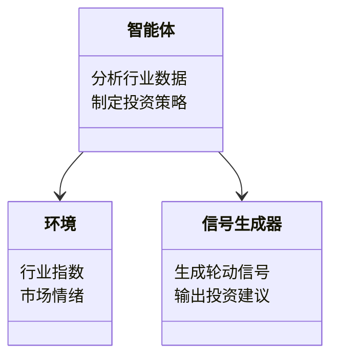
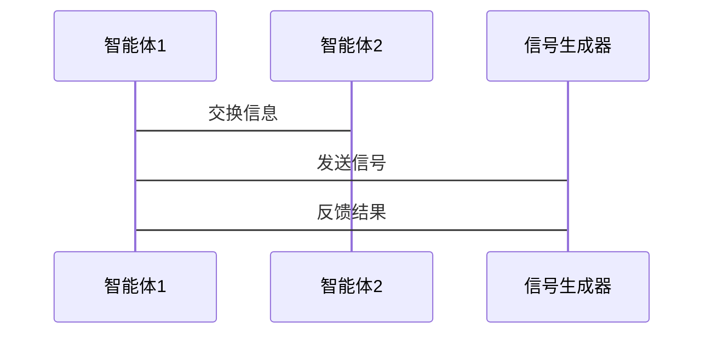

                 


# AI多智能体优化价值投资的动态行业轮动信号生成

> 关键词：AI多智能体、动态行业轮动、价值投资、强化学习、博弈论

> 摘要：本文深入探讨了AI多智能体技术在优化价值投资中的应用，重点分析了动态行业轮动信号生成的机制。通过多智能体系统的协作与竞争，结合强化学习和博弈论，构建了一个高效的投资决策框架。本文详细阐述了算法原理、系统架构设计以及实际应用案例，为投资者提供了新的视角和工具。

---

# 第1章: AI多智能体与动态行业轮动概述

## 1.1 AI多智能体的基本概念

### 1.1.1 多智能体系统的基本定义
多智能体系统（Multi-Agent System, MAS）由多个具有自主决策能力的智能体组成，这些智能体能够通过协作完成复杂任务。与单智能体系统相比，MAS具有更强的适应性和灵活性。

### 1.1.2 AI多智能体的核心特点
- **分布式智能**：每个智能体独立决策，协同完成任务。
- **协作与竞争**：智能体之间可以协作或竞争，以达到最优目标。
- **动态适应性**：能够实时感知环境变化并调整策略。

### 1.1.3 多智能体与传统单智能体算法的区别
| 特性 | 多智能体 | 单智能体 |
|------|----------|----------|
| 决策主体 | 多个独立主体 | 单个决策主体 |
| 协作性 | 高 | 低 |
| 适应性 | 强 | 弱 |

## 1.2 动态行业轮动的背景与意义

### 1.2.1 行业轮动的基本概念
行业轮动是指根据市场环境的变化，动态调整投资组合中各行业权重的过程。其核心在于捕捉不同行业之间的收益差异。

### 1.2.2 动态行业轮动的定义与特点
- **动态性**：根据市场变化实时调整。
- **收益性**：通过优化行业权重提升收益。
- **复杂性**：涉及多因素分析和决策。

### 1.2.3 动态行业轮动在价值投资中的作用
- 提高投资组合的收益-风险比。
- 减少对单一行业的过度依赖。
- 适应市场周期性变化。

## 1.3 问题建模与核心要素

### 1.3.1 问题背景与目标
目标：构建一个基于AI多智能体的动态行业轮动系统，优化投资组合收益。

背景：传统行业轮动方法依赖经验判断，难以适应快速变化的市场环境。

### 1.3.2 核心概念与核心要素
- **智能体**：负责分析行业数据和制定投资策略。
- **环境**：金融市场环境，包括行业指数、市场情绪等。
- **目标函数**：最大化投资收益，最小化风险。

### 1.3.3 问题的边界与外延
- 边界：仅考虑行业轮动，不涉及个股选择。
- 外延：可扩展至跨市场和跨资产配置。

## 1.4 本章小结

---

# 第2章: 多智能体系统与价值投资的关系

## 2.1 多智能体系统在投资中的应用

### 2.1.1 多智能体系统在投资决策中的优势
- **分布式决策**：多个智能体分别负责不同行业的分析。
- **实时协作**：智能体之间可以快速交换信息，调整策略。
- **鲁棒性**：单个智能体失效不影响整体系统运行。

### 2.1.2 多智能体系统与价值投资的结合点
- 通过多智能体分析不同行业的价值，制定轮动策略。
- 利用协作机制捕捉市场机会。

## 2.2 动态行业轮动与多智能体优化的联系

### 2.2.1 动态行业轮动的动态性与多智能体的适应性
- 动态行业轮动需要实时调整，多智能体系统能够快速响应。
- 多智能体系统通过协作优化行业权重。

### 2.2.2 多智能体优化在动态行业轮动中的应用
- 每个智能体负责一个行业的数据分析和策略制定。
- 智能体之间通过博弈论机制优化整体投资组合。

## 2.3 价值投资与动态行业轮动的结合

### 2.3.1 价值投资的基本原理
- 买入被市场低估的资产，长期持有。
- 通过基本面分析判断资产的价值。

### 2.3.2 动态行业轮动对价值投资的优化作用
- 根据市场变化动态调整行业配置。
- 提高投资组合的流动性和收益性。

## 2.4 本章小结

---

# 第3章: 多智能体优化算法

## 3.1 多智能体优化的基本原理

### 3.1.1 多智能体优化的核心思想
通过多个智能体的协作与竞争，寻找全局最优解。

### 3.1.2 常见的多智能体优化算法
- **分布式强化学习**：智能体通过协作学习策略。
- **博弈论优化**：智能体通过竞争优化策略。

### 3.1.3 多智能体优化算法的数学模型
$$ V(s) = \max_{a} \left[ r + V(s', a') \right] $$

## 3.2 强化学习在多智能体优化中的应用

### 3.2.1 强化学习的基本原理
- **状态**：环境中的当前情况。
- **动作**：智能体的决策。
- **奖励**：对决策的反馈。

### 3.2.2 多智能体强化学习的挑战与解决方案
- **协调性问题**：通过通信机制解决。
- **稳定性问题**：通过渐进式学习解决。

### 3.2.3 多智能体强化学习的数学模型
$$ Q(s, a) = r + \gamma \max_{a'} Q(s', a') $$

## 3.3 博弈论与多智能体优化的结合

### 3.3.1 博弈论的基本概念
- **纳什均衡**：一种稳定的博弈状态。
- **零和博弈**：总和为零的博弈。

### 3.3.2 多智能体优化中的博弈论应用
- **竞争机制**：智能体之间通过竞争优化策略。
- **协作机制**：智能体之间通过协作提高效率。

## 3.4 本章小结

---

# 第4章: 系统分析与架构设计

## 4.1 问题场景介绍

### 4.1.1 项目介绍
- 项目目标：构建一个基于AI多智能体的动态行业轮动系统。
- 项目范围：涵盖多个行业和市场环境。

### 4.1.2 系统功能设计
- **数据采集**：收集行业指数、市场情绪等数据。
- **智能体协作**：多个智能体协同分析数据。
- **策略制定**：生成动态行业轮动信号。

### 4.1.3 领域模型设计


## 4.2 系统架构设计

### 4.2.1 系统架构设计


### 4.2.2 系统交互设计


## 4.3 本章小结

---

# 第5章: 项目实战

## 5.1 环境安装

### 5.1.1 安装Python环境
```bash
pip install numpy pandas scikit-learn
```

### 5.1.2 安装多智能体框架
```bash
pip install gym
```

## 5.2 系统核心实现源代码

### 5.2.1 智能体类
```python
class Agent:
    def __init__(self, id):
        self.id = id
        self.state = None
        self.policy = None
    
    def receive_info(self, info):
        self.state = info
```

### 5.2.2 多智能体系统
```python
class MultiAgentSystem:
    def __init__(self, num_agents):
        self.agents = [Agent(i) for i in range(num_agents)]
    
    def run(self, environment):
        while True:
            for agent in self.agents:
                info = environment.get_info()
                agent.receive_info(info)
                # 处理信息并生成策略
```

## 5.3 案例分析

### 5.3.1 数据分析与结果展示
- 数据来源：某段时间内的行业指数数据。
- 结果展示：动态行业轮动信号生成的可视化。

## 5.4 本章小结

---

# 第6章: 总结与展望

## 6.1 本章总结
- 本文提出了基于AI多智能体的动态行业轮动信号生成方法。
- 通过多智能体协作与竞争，优化投资组合收益。

## 6.2 未来展望
- 结合大数据分析和自然语言处理，进一步提升系统性能。
- 探索多智能体系统在更多金融领域的应用。

---

# 参考文献
（此处列出相关文献）

---

**附录**
（此处列出附录内容）

