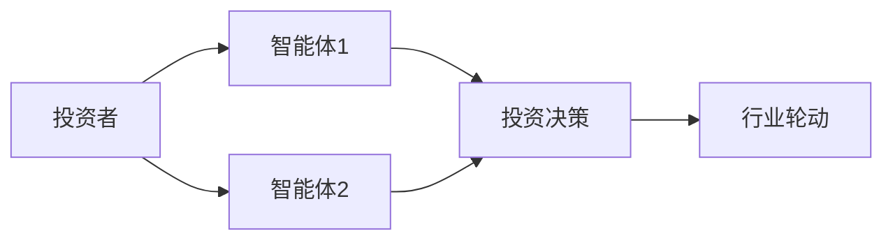
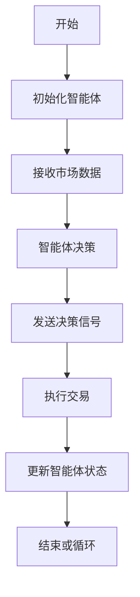
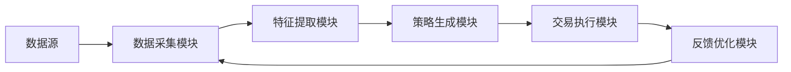

                 


# AI多智能体优化价值投资的动态行业轮动策略

## 关键词：AI多智能体、价值投资、动态行业轮动、优化策略、金融投资、强化学习

## 摘要：本文探讨了如何利用AI多智能体技术优化价值投资策略，并提出动态行业轮动的创新方法。通过系统分析和算法设计，结合强化学习和多智能体协作，构建高效的投资决策模型，实现长期稳健收益。文章涵盖背景、原理、架构、实战和最佳实践，为金融投资提供新思路。

---

## 第一部分: 背景介绍

### 第1章: 问题背景与核心概念

#### 1.1 问题背景
##### 1.1.1 传统投资策略的局限性
传统的投资策略依赖于人工分析和经验判断，存在主观性强、效率低下、难以应对市场快速变化等问题。市场波动、信息不对称和复杂多变的经济环境使得传统策略难以长期稳定收益。

##### 1.1.2 AI技术在金融投资中的应用潜力
人工智能技术，尤其是机器学习和深度学习，能够处理海量数据，识别复杂模式，提供实时分析，显著提升投资决策的效率和准确性。AI在金融领域的应用已涵盖量化交易、风险评估、市场预测等多个方面。

##### 1.1.3 多智能体协作在投资决策中的优势
多智能体系统通过分布式协作，能够模拟人类投资团队的决策过程，同时克服人为情绪干扰，提高决策的科学性和稳定性。多智能体协作能够处理复杂的投资环境，优化资产配置，提升投资收益。

#### 1.2 核心概念
##### 1.2.1 多智能体系统定义与特点
多智能体系统是由多个独立但协作的智能体组成的系统，每个智能体负责特定任务，通过通信和协作完成整体目标。其特点包括分布式性、协作性、自治性和响应性。

##### 1.2.2 价值投资的核心理念
价值投资强调购买低于内在价值的资产，长期持有，通过市场波动实现收益。核心在于基本面分析，寻找被市场低估的投资标的。

##### 1.2.3 动态行业轮动策略的定义与目标
动态行业轮动策略根据市场变化，实时调整投资组合的行业配置，捕捉不同行业的轮动机会，优化收益风险比。

#### 1.3 问题解决与边界
##### 1.3.1 多智能体优化价值投资的问题解决路径
通过多智能体协作，优化资产配置和行业选择，提升投资组合的收益和风险控制能力。

##### 1.3.2 动态行业轮动策略的边界与适用场景
适用于中长期投资，对市场波动敏感，适合在行业间存在显著轮动机会的情况下应用。

##### 1.3.3 系统设计的核心要素与组成
系统由数据采集、特征提取、策略生成、交易执行和反馈优化五个模块组成，各模块协同工作，形成闭环。

---

## 第2章: 核心概念与联系

### 2.1 核心概念原理
#### 2.1.1 多智能体协作机制
通过强化学习和分布式算法，智能体之间共享信息，协同决策，优化整体投资策略。

#### 2.1.2 价值投资的数学模型
基于财务指标和市场数据，构建资产定价模型，评估投资标的的内在价值。

#### 2.1.3 动态行业轮动的算法框架
采用时间序列分析和聚类算法，识别行业轮动的信号，指导投资组合的调整。

### 2.2 核心概念属性对比
表2.1-1: 多智能体、价值投资、动态行业轮动的属性对比

| 概念       | 输入数据类型 | 输出决策类型 | 目标 | 技术基础       |
|------------|--------------|--------------|------|----------------|
| 多智能体系统 | 结构化数据    | 分布式决策   | 最优解 | 强化学习、协作算法 |
| 价值投资   | 基本面数据    | 单一决策     | 最大化收益 | 资产定价模型    |
| 动态行业轮动 | 市场数据      | 行业调整      | 最优配置 | 时间序列分析    |

### 2.3 实体关系图


---

## 第三部分: 算法原理与数学模型

## 第3章: 多智能体优化算法

### 3.1 算法原理
#### 3.1.1 基于强化学习的多智能体协作
使用深度强化学习（DRL）框架，每个智能体学习策略，通过奖励机制优化协作行为。例如，使用多智能体Q-learning算法，智能体之间共享状态和动作，更新Q值，提升整体收益。

#### 3.1.2 分散决策与全局优化
每个智能体负责特定资产或行业的决策，通过局部优化实现全局最优。采用分布式优化算法，如联邦学习，确保数据隐私和模型协同。

#### 3.1.3 跨智能体通信与协调机制
智能体之间通过消息传递进行实时通信，共享市场信息和决策结果，协调动作。通信机制包括广播、点对点和订阅发布三种方式。

### 3.2 算法流程图


### 3.3 动态行业轮动策略
#### 3.3.1 动态行业轮动的算法框架
基于时间序列分析，识别行业轮动信号，指导投资组合的调整。采用马尔可夫链模型，预测未来行业表现，优化行业权重。

#### 3.3.2 实现步骤
1. 数据预处理：清洗和特征提取，提取行业相关指标。
2. 模型训练：训练聚类模型，识别行业轮动模式。
3. 策略生成：根据模型预测结果，生成行业轮动信号。
4. 交易执行：根据信号调整投资组合。
5. 反馈优化：根据市场反馈，优化模型参数。

---

## 第4章: 数学模型与公式

### 4.1 多智能体优化的数学模型
多智能体系统通过强化学习，优化各智能体的策略，最大化整体收益。Q-learning算法的更新公式为：
$$ Q(s, a) = (1-\alpha) Q(s, a) + \alpha (r + \gamma \max Q(s', a')) $$
其中，α是学习率，γ是折扣因子。

### 4.2 动态行业轮动的数学模型
动态行业轮动策略基于马尔可夫模型，预测未来行业状态。状态转移概率矩阵P表示从当前状态到下一状态的概率：
$$ P_{i,j} = P(S_{t+1}=j | S_t=i) $$
通过最大化期望收益，选择最优行业配置。

---

## 第四部分: 系统分析与架构设计

## 第5章: 系统架构设计

### 5.1 系统功能设计
系统由数据采集模块、特征提取模块、策略生成模块、交易执行模块和反馈优化模块组成，各模块协同工作，形成投资闭环。

### 5.2 系统架构图


### 5.3 接口设计与交互流程
系统通过API接口进行数据交互，采用RESTful风格，确保模块之间的高效通信。交互流程如下：
1. 数据采集模块接收市场数据。
2. 特征提取模块处理数据，生成特征向量。
3. 策略生成模块基于特征向量，生成投资策略。
4. 交易执行模块根据策略，执行交易。
5. 反馈优化模块收集市场反馈，优化系统参数。

---

## 第五部分: 项目实战

## 第6章: 项目实战与分析

### 6.1 项目背景
以股票投资为例，构建一个多智能体优化的价值投资模型，实现动态行业轮动策略。

### 6.2 核心代码实现
#### 6.2.1 环境安装
```bash
pip install numpy pandas tensorflow matplotlib scikit-learn
```

#### 6.2.2 核心代码
```python
import numpy as np
import pandas as pd
import tensorflow as tf
from sklearn.metrics import accuracy_score

# 数据预处理
def preprocess_data(data):
    # 提取特征和标签
    X = data.drop(columns=['label'])
    y = data['label']
    return X, y

# 多智能体Q-learning算法实现
class MultiAgentDQN:
    def __init__(self, state_space, action_space):
        self.state_space = state_space
        self.action_space = action_space
        self.q_table = tf.keras.Sequential([
            tf.keras.layers.Dense(64, activation='relu', input_dim=state_space),
            tf.keras.layers.Dense(action_space, activation='linear')
        ])
    
    def act(self, state):
        return self.q_table.predict(tf.constant(state, dtype=tf.float32)).numpy()[0]
    
    def update(self, state, action, reward, next_state):
        target = reward + 0.95 * tf.reduce_max(self.q_table.predict(tf.constant(next_state, dtype=tf.float32)))
        with tf.GradientTape() as tape:
            current = self.q_table(tf.constant(state, dtype=tf.float32))
            loss = tf.keras.losses.mean_squared_error(target, current)
        gradients = tape.gradient(loss, self.q_table.trainable_variables)
        optimizer = tf.keras.optimizers.Adam(learning_rate=0.01)
        optimizer.apply_gradients(zip(gradients, self.q_table.trainable_variables))

# 动态行业轮动策略实现
def dynamic_industry_rotation(data, window=30):
    # 移动平均线策略
    ma = data.rolling(window=window).mean()
    signals = np.where(data > ma, 'buy', 'sell')
    return signals

# 策略回测
def backtest策略(data, signals):
    profits = []
    for i in range(len(signals)):
        if signals[i] == 'buy':
            profits.append(data[i+1] - data[i])
        elif signals[i] == 'sell':
            profits.append(data[i] - data[i+1])
    return np.mean(profits)
```

#### 6.2.3 代码功能解读
- `preprocess_data`函数用于数据清洗和特征提取。
- `MultiAgentDQN`类实现了多智能体的Q-learning算法，通过神经网络进行策略优化。
- `dynamic_industry_rotation`函数基于移动平均线策略，生成行业轮动信号。
- `backtest`函数对生成的信号进行回测，评估策略的有效性。

### 6.3 实际案例分析
假设我们有某个行业的历史数据，使用上述代码进行策略回测，评估动态行业轮动策略的表现。通过回测结果，验证策略的有效性和稳定性，分析其在不同市场环境下的表现。

### 6.4 项目总结
总结项目成果，分析存在的不足，提出改进方向，为后续优化提供参考。

---

## 第六部分: 最佳实践与总结

## 第7章: 最佳实践与总结

### 7.1 最佳实践
- 定期更新模型，适应市场变化。
- 合理设置参数，避免过度拟合。
- 结合多种策略，提升鲁棒性。

### 7.2 小结
本文提出了一种基于AI多智能体的动态行业轮动策略，通过强化学习和分布式协作，优化投资决策，提升投资收益。

### 7.3 注意事项
- 数据质量对策略效果影响重大，需确保数据的完整性和准确性。
- 策略的收益与风险密切相关，需做好风险控制。
- 系统的实时性和稳定性是实际应用的关键，需优化系统架构。

### 7.4 拓展阅读
推荐进一步阅读相关领域的最新研究，如多智能体协作的最新算法，动态资产配置的优化方法，以及强化学习在金融中的创新应用。

---

## 结语
通过AI多智能体优化价值投资的动态行业轮动策略，投资者能够更好地应对复杂多变的市场环境，实现长期稳健的投资收益。本文为金融投资领域提供了新的思路和技术手段，未来随着技术的不断发展，该策略的应用前景将更加广阔。

