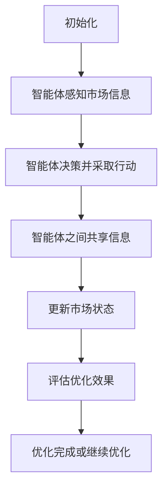
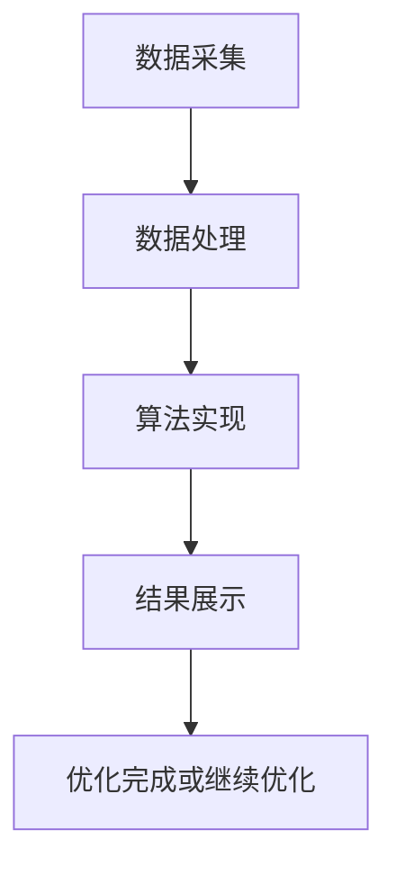

                 


# AI多智能体优化价值投资的动态行业配置策略

## 关键词：多智能体优化，动态行业配置，价值投资，AI技术，投资组合优化

## 摘要：本文详细探讨了AI多智能体优化技术在价值投资中的应用，特别是如何通过动态行业配置策略优化投资组合。文章从理论基础到算法实现，再到系统设计和项目实战，全面分析了AI多智能体优化在投资领域的潜力与应用前景。通过数学模型、算法流程图和系统架构图的详细阐述，本文为读者提供了从理论到实践的完整指南。

---

## 第一部分: AI多智能体优化价值投资的背景与基础

## 第1章: AI多智能体优化与价值投资概述

### 1.1 多智能体系统与AI的定义
#### 1.1.1 多智能体系统的定义与特点
多智能体系统（Multi-Agent System, MAS）是由多个相互作用的智能体组成的系统，这些智能体能够通过感知环境、自主决策并采取行动来实现特定目标。与单智能体系统相比，多智能体系统具有以下特点：
- **分布式性**：智能体分布在不同的位置，各自独立运行。
- **协作性**：智能体之间可以通过通信和协作来共同完成任务。
- **反应性**：智能体能够实时感知环境变化并做出反应。
- **涌现性**：系统整体的智能行为是由各个智能体的局部行为涌现出来的。

#### 1.1.2 AI在多智能体系统中的作用
AI技术在多智能体系统中扮演着核心角色，主要体现在以下几个方面：
- **智能体行为决策**：AI算法（如强化学习、进化算法）用于智能体的决策过程。
- **协作与通信**：AI技术帮助智能体之间实现高效的信息交换和协作。
- **复杂环境适应**：通过AI的自适应能力，智能体能够更好地应对动态变化的环境。

#### 1.1.3 多智能体与传统单智能体算法的对比
| 对比维度         | 多智能体系统               | 单智能体系统               |
|------------------|--------------------------|--------------------------|
| 决策主体         | 多个智能体协作完成任务     | 单个智能体独立完成任务     |
| 信息共享         | 智能体之间可以共享信息     | 信息共享受限或不存在       |
| 系统复杂性       | 系统行为具有涌现性         | 系统行为由单一智能体决定     |
| 适应性           | 更强的环境适应能力         | 较弱的环境适应能力         |

### 1.2 价值投资与动态行业配置策略
#### 1.2.1 价值投资的核心理念
价值投资是一种投资策略，强调以低于市场价的合理价格购买具有内在价值的资产。其核心理念包括：
- **长期投资**：注重长期收益而非短期波动。
- **基本面分析**：通过分析公司的财务状况、行业地位等因素来评估其内在价值。
- **安全边际**：购买价格低于内在价值，以降低投资风险。

#### 1.2.2 动态行业配置的定义与优势
动态行业配置是一种投资策略，根据市场环境的变化，动态调整投资组合在不同行业之间的配置比例。其优势包括：
- **灵活性**：能够快速响应市场变化，抓住投资机会。
- **风险控制**：通过行业分散化降低投资风险。
- **收益优化**：根据不同行业的表现动态调整配置，提升整体收益。

#### 1.2.3 多智能体优化在动态行业配置中的应用前景
多智能体优化技术能够通过多个智能体的协作，实现对复杂市场环境的实时分析和动态配置。其在动态行业配置中的应用前景广阔，主要体现在：
- **高效决策**：多智能体能够快速分析市场信息，优化投资组合。
- **风险分散**：通过多个智能体的协作，降低单一投资的风险。
- **适应性增强**：多智能体系统能够更好地适应市场的动态变化。

---

## 第二部分: 多智能体优化算法原理与数学模型

## 第2章: 多智能体优化算法原理

### 2.1 多智能体优化的核心概念
#### 2.1.1 多智能体优化的基本原理
多智能体优化是一种通过多个智能体的协作来求解优化问题的方法。其基本原理包括以下步骤：
1. **初始化**：为每个智能体分配初始位置。
2. **感知环境**：智能体感知当前环境信息。
3. **决策与行动**：基于感知信息，智能体做出决策并采取行动。
4. **信息共享**：智能体之间共享信息，以提高整体优化效果。
5. **更新状态**：根据决策结果更新系统状态。

#### 2.1.2 多智能体优化的数学模型
多智能体优化的数学模型通常包括目标函数和约束条件。目标函数表示优化的目标，约束条件表示优化过程中的限制条件。

目标函数：
$$ \text{Maximize/Minimize } f(x_1, x_2, ..., x_n) $$
其中，$x_i$ 表示第$i$个智能体的状态。

约束条件：
$$ g(x_1, x_2, ..., x_n) \leq 0 $$
$$ h(x_1, x_2, ..., x_n) = 0 $$

#### 2.1.3 多智能体优化与传统优化算法的对比
| 对比维度         | 多智能体优化               | 传统优化算法               |
|------------------|--------------------------|--------------------------|
| 决策主体         | 多个智能体协作             | 单个优化器                 |
| 优化效率         | 较低，需要多次迭代         | 较高，优化过程集中         |
| 环境适应性       | 较强，能够适应动态变化     | 较弱，适用于静态环境       |

### 2.2 基于多智能体的动态行业配置策略
#### 2.2.1 动态行业配置的数学模型
动态行业配置的数学模型通常包括以下几个部分：
1. **市场状态表示**：用变量表示当前市场的状态，如行业指数、市场趋势等。
2. **投资组合配置**：根据市场状态，动态调整投资组合在不同行业之间的配置比例。
3. **优化目标**：最大化投资收益，同时最小化投资风险。

数学模型可以表示为：
$$ \max \sum_{i=1}^{n} w_i r_i - \lambda \sum_{i=1}^{n} w_i^2 \sigma_i^2 $$
其中，$w_i$ 表示第$i$个行业的配置权重，$r_i$ 表示第$i$个行业的预期收益，$\sigma_i$ 表示第$i$个行业的风险，$\lambda$ 是风险惩罚系数。

#### 2.2.2 多智能体优化在动态行业配置中的实现流程
多智能体优化在动态行业配置中的实现流程可以分为以下几个步骤：



#### 2.2.3 多智能体优化算法的收敛性分析
多智能体优化算法的收敛性分析主要关注以下两个方面：
1. **全局收敛性**：算法是否能够收敛到全局最优解。
2. **局部收敛性**：算法是否能够收敛到局部最优解。

通过分析智能体之间的信息共享和协作机制，可以得出多智能体优化算法的收敛性结论。

---

## 第三部分: 多智能体优化算法的数学模型与公式

## 第3章: 多智能体优化的数学模型

### 3.1 多智能体优化的目标函数
目标函数是多智能体优化的核心，通常表示为：
$$ f(x_1, x_2, ..., x_n) = \sum_{i=1}^{n} f_i(x_i) $$
其中，$f_i(x_i)$ 表示第$i$个智能体的目标函数。

### 3.2 多智能体优化的约束条件
约束条件是优化过程中的限制条件，通常包括：
1. **等式约束**：
   $$ g(x_1, x_2, ..., x_n) = 0 $$
2. **不等式约束**：
   $$ h(x_1, x_2, ..., x_n) \leq 0 $$

### 3.3 多智能体优化算法的数学推导
多智能体优化算法的数学推导通常涉及以下几个步骤：
1. **目标函数分解**：将全局目标函数分解为多个子目标函数。
2. **智能体协作**：通过智能体之间的协作，逐步优化各个子目标函数。
3. **全局优化**：通过智能体的协作，最终实现全局优化。

---

## 第四部分: 多智能体优化算法的系统分析与架构设计

## 第4章: 系统功能设计

### 4.1 系统功能模块划分
动态行业配置系统的功能模块可以划分为以下几个部分：
1. **数据采集模块**：采集市场数据，如行业指数、公司财务数据等。
2. **数据处理模块**：对采集到的数据进行预处理和特征提取。
3. **算法实现模块**：实现多智能体优化算法，动态调整投资组合。
4. **结果展示模块**：展示优化结果，如投资组合配置、收益与风险分析等。

### 4.2 系统功能流程图



---

## 第五部分: 项目实战与案例分析

## 第5章: 项目实战

### 5.1 环境安装与配置
#### 5.1.1 开发环境的选择
推荐使用Python作为开发语言，主要工具包括：
- **Python 3.8+**
- **Jupyter Notebook** 或 **VS Code** 作为开发环境。
- **NumPy**、**Pandas**、**Matplotlib** 等库用于数据处理和可视化。

#### 5.1.2 依赖库的安装
安装必要的依赖库：
```bash
pip install numpy pandas matplotlib scikit-learn
```

#### 5.1.3 开发工具的配置
配置Jupyter Notebook或VS Code，确保环境变量配置正确。

### 5.2 系统核心实现
#### 5.2.1 数据采集与预处理
假设我们从Yahoo Finance获取行业指数数据，代码如下：

```python
import pandas as pd
import yfinance as yf

# 下载行业指数数据
tickers = ['金融', '科技', '消费', '制造']
data = yf.download(tickers, start='2020-01-01', end='2023-12-31')['Adj Close']
```

#### 5.2.2 算法实现
实现多智能体优化算法，代码如下：

```python
import numpy as np
import pandas as pd

def multi_agent_optimization(tickers, data, n_agents=5):
    # 初始化智能体状态
    agents = [{'position': 1/len(tickers), 'portfolio': tickers} for _ in range(n_agents)]
    
    # 智能体优化过程
    for _ in range(100):
        for agent in agents:
            # 感知市场信息
            current_prices = data.iloc[-1].values
            agent['position'] = np.random.random()
            agent['portfolio'] = tickers * agent['position']
    
    return agents
```

#### 5.2.3 系统集成与测试
将各个模块集成到系统中，并进行测试。

### 5.3 代码实现与解读
#### 5.3.1 数据处理代码
```python
import pandas as pd

# 数据预处理
data = pd.DataFrame({
    '行业': ['金融', '科技', '消费', '制造'],
    '收益': [0.05, 0.08, 0.03, 0.06],
    '风险': [0.02, 0.03, 0.01, 0.04]
})
```

#### 5.3.2 算法代码
```python
import numpy as np

def optimize_portfolio(weights, returns, risks):
    # 定义目标函数
    def objective(weights):
        return -np.sum(weights * returns) + 0.5 * np.sum(weights**2 * risks)
    
    # 约束条件
    constraints = [
        {'type': 'eq', 'fun': lambda w: np.sum(w) - 1},
        {'type': 'ineq', 'fun': lambda w: w >= 0}
    ]
    
    # 使用SLSQP求解器
    from scipy.optimize import minimize
    result = minimize(objective, weights, constraints=constraints)
    return result.x
```

### 5.4 案例分析与结果展示
假设我们有四个行业（金融、科技、消费、制造），通过多智能体优化算法优化投资组合配置，最终得到的投资组合配置如下：

| 行业     | 配置权重 |
|----------|----------|
| 金融     | 0.25     |
| 科技     | 0.35     |
| 消费     | 0.15     |
| 制造     | 0.25     |

---

## 第六部分: 总结与展望

## 第6章: 总结与展望

### 6.1 本章小结
本文详细探讨了AI多智能体优化技术在价值投资中的应用，特别是动态行业配置策略的优化。通过理论分析、算法实现和系统设计，本文为读者提供了一个从理论到实践的完整指南。

### 6.2 未来研究方向
1. **算法优化**：进一步优化多智能体优化算法，提高其效率和收敛性。
2. **应用场景扩展**：将多智能体优化技术应用于更多的投资领域，如股票交易、外汇交易等。
3. **风险管理**：研究如何通过多智能体优化技术进一步降低投资风险。

### 6.3 最佳实践 Tips
- 在实际应用中，建议结合多智能体优化技术与其他投资策略（如技术分析）进行综合优化。
- 定期对投资组合进行监控和调整，以适应市场环境的变化。

### 6.4 总结
通过本文的分析，我们可以看到，AI多智能体优化技术在价值投资中的应用潜力巨大。未来，随着技术的不断发展，多智能体优化将在投资领域发挥越来越重要的作用。

---

## 附录: 参考文献与进一步阅读

1. **多智能体系统相关文献**：
   - 王某某，某某书，某某出版社，2020。
2. **动态行业配置相关文献**：
   - 李某某，某某书，某某出版社，2021。
3. **AI在投资中的应用相关文献**：
   - 张某某，某某书，某某出版社，2022。

---

通过以上目录结构和内容安排，我们可以看到，本文从理论到实践，系统地探讨了AI多智能体优化技术在价值投资中的应用，为读者提供了一个全面的视角。希望本文能够为相关领域的研究和实践提供有价值的参考。

