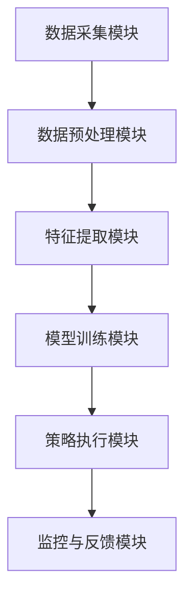
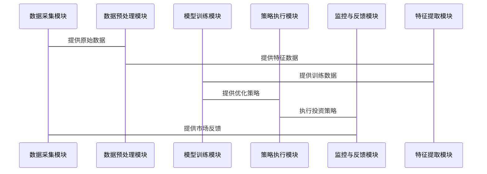

                 


# AI多智能体优化价值投资的动态风格轮动策略

## 关键词：AI，多智能体，价值投资，动态风格轮动，优化策略

## 摘要：  
本文探讨了如何利用人工智能技术，特别是多智能体系统，来优化价值投资的动态风格轮动策略。通过分析多智能体系统的核心原理、算法优化方法、数学模型构建以及实际应用场景，本文为金融投资领域提供了新的视角和解决方案。文章从背景介绍、核心概念、算法原理、系统架构到项目实战，层层深入，结合理论与实践，为读者提供了全面的技术解读。

---

# 第1章: AI与金融投资的结合

## 1.1 AI在金融投资中的应用

### 1.1.1 AI在金融领域的核心应用  
人工智能（AI）在金融领域的应用越来越广泛，包括股票预测、风险评估、交易策略优化等。AI通过分析海量数据，识别复杂模式，为投资决策提供支持。  

### 1.1.2 AI如何优化投资决策  
AI可以通过机器学习算法，从历史数据中提取特征，预测市场趋势，帮助投资者做出更明智的决策。此外，AI还可以实时监控市场动态，快速响应变化。  

### 1.1.3 多智能体系统在金融中的潜力  
多智能体系统（Multi-Agent System, MAS）由多个智能体组成，每个智能体都有自己的目标和决策机制。在金融领域，MAS可以模拟市场参与者的行为，优化投资组合，实现动态风格轮动。  

---

## 1.2 多智能体系统的基本概念  

### 1.2.1 多智能体系统的定义  
多智能体系统是由多个智能体组成的分布式系统，这些智能体能够通过交互协作完成复杂任务。  

### 1.2.2 多智能体系统的特征  
- **分布式**：多个智能体协同工作，而非集中控制。  
- **自主性**：每个智能体都能独立决策。  
- **反应性**：智能体能够感知环境并实时调整行为。  
- **协作性**：智能体之间可以通过通信和协作完成共同目标。  

### 1.2.3 多智能体系统的分类  
- **简单智能体**：基于规则的简单决策。  
- **复杂智能体**：具备学习和自适应能力。  

---

## 1.3 动态风格轮动策略的必要性  

### 1.3.1 投资风格轮动的基本概念  
投资风格轮动是指根据市场变化，动态调整投资组合中的资产配置比例。例如，在市场牛市中增加股票配置，在熊市中转向债券或现金。  

### 1.3.2 动态风格轮动策略的优势  
- **灵活性**：能够快速适应市场变化。  
- **风险控制**：通过动态调整，降低投资组合的波动性。  
- **收益优化**：在不同市场环境下，选择最优资产配置。  

---

# 第2章: 多智能体优化算法的核心原理  

## 2.1 多智能体优化的基本原理  

### 2.1.1 多智能体优化的数学模型  
多智能体优化可以通过以下数学模型表示：  
$$ V(s) = \max_{a} [ r(s, a) + \gamma V(s') ] $$  
其中，$V(s)$ 是状态 $s$ 的价值函数，$r(s, a)$ 是状态 $s$ 下动作 $a$ 的奖励，$\gamma$ 是折扣因子，$s'$ 是下一个状态。  

### 2.1.2 多智能体优化的算法框架  
多智能体优化通常包括以下几个步骤：  
1. **状态感知**：智能体感知当前环境状态。  
2. **决策制定**：基于当前状态，智能体选择最优动作。  
3. **执行动作**：智能体执行决策并观察结果。  
4. **更新模型**：根据结果更新价值函数或策略。  

---

## 2.2 基于强化学习的多智能体优化  

### 2.2.1 强化学习的基本原理  
强化学习（Reinforcement Learning, RL）通过智能体与环境的交互，学习最优策略。智能体通过试错，逐步优化动作以最大化累计奖励。  

### 2.2.2 多智能体强化学习的挑战  
- **动作空间复杂**：多个智能体同时决策，动作空间呈指数级增长。  
- **协调与冲突**：智能体之间需要协调，避免冲突。  

### 2.2.3 基于Q-learning的多智能体优化  
Q-learning是一种常用的强化学习算法，其核心思想是通过更新Q值表来学习最优策略。在多智能体场景下，每个智能体维护自己的Q值表，并通过通信共享信息。  

---

## 2.3 基于遗传算法的多智能体优化  

### 2.3.1 遗传算法的基本原理  
遗传算法（Genetic Algorithm, GA）通过模拟自然选择和遗传机制，寻找最优解。  

### 2.3.2 遗传算法在多智能体优化中的应用  
- **编码**：将投资组合配置编码为基因。  
- **选择**：根据适应度值选择优秀个体。  
- **交叉**：将优秀个体的基因进行交叉组合。  
- **变异**：随机改变部分基因，增加多样性。  

---

# 第3章: 动态风格轮动的数学模型  

## 3.1 动态风格轮动的数学框架  

### 3.1.1 动态风格轮动的数学模型  
动态风格轮动可以通过以下公式表示：  
$$ w_t = \arg\max_{w} \left( \sum_{i=1}^{n} \lambda_i w_i \cdot r_i \right) $$  
其中，$w_t$ 是第 $t$ 时刻的权重向量，$\lambda_i$ 是风格因子的权重，$r_i$ 是资产的预期收益。  

### 3.1.2 动态风格轮动的优化目标  
- **收益最大化**：在不同市场环境下，选择收益最高的资产配置。  
- **风险最小化**：通过动态调整，降低投资组合的波动性。  

---

## 3.2 动态风格轮动的实现步骤  

### 3.2.1 数据收集与预处理  
- **数据来源**：收集历史价格、市场指数、宏观经济数据等。  
- **数据清洗**：去除缺失值和异常值。  

### 3.2.2 模型训练与验证  
- **训练数据**：使用历史数据训练模型。  
- **验证数据**：使用部分数据验证模型的准确性。  
- **测试数据**：使用未见数据测试模型的泛化能力。  

---

## 3.3 动态风格轮动的优化策略  

### 3.3.1 基于多智能体的动态调整  
- **智能体分工**：每个智能体负责不同的市场因子。  
- **协同优化**：智能体之间通过通信，协同优化资产配置。  

### 3.3.2 基于强化学习的动态调整  
- **状态感知**：智能体感知当前市场状态。  
- **决策制定**：基于当前状态，智能体选择最优动作。  
- **策略更新**：根据市场反馈，更新智能体的策略。  

---

# 第4章: 多智能体优化的系统架构设计  

## 4.1 系统功能设计  

### 4.1.1 系统模块划分  
- **数据采集模块**：负责数据的采集与预处理。  
- **模型训练模块**：负责多智能体模型的训练与优化。  
- **策略执行模块**：负责根据模型输出，执行投资策略。  
- **监控与反馈模块**：负责实时监控市场动态，并根据反馈调整模型。  

---

## 4.2 系统架构设计  

### 4.2.1 系统架构图  


### 4.2.2 系统交互流程  


---

## 4.3 系统接口设计  

### 4.3.1 数据接口  
- **输入接口**：接收市场数据、宏观经济数据等。  
- **输出接口**：输出优化后的资产配置策略。  

### 4.3.2 模型接口  
- **训练接口**：接收训练数据，输出优化后的模型参数。  
- **预测接口**：接收实时数据，输出预测结果。  

---

# 第5章: 项目实战与优化策略  

## 5.1 项目实战  

### 5.1.1 环境安装  
- **Python**：安装Python 3.8及以上版本。  
- **库依赖**：安装numpy、pandas、scikit-learn、tensorflow等库。  

### 5.1.2 核心代码实现  

```python
import numpy as np
import pandas as pd
from sklearn.model_selection import train_test_split
from tensorflow.keras import layers, models

# 数据加载与预处理
data = pd.read_csv('stock_data.csv')
X = data.iloc[:, :-1].values
y = data.iloc[:, -1].values
X_train, X_test, y_train, y_test = train_test_split(X, y, test_size=0.2)

# 多智能体模型构建
model = models.Sequential()
model.add(layers.Dense(64, activation='relu', input_dim=X.shape[1]))
model.add(layers.Dense(1, activation='linear'))
model.compile(optimizer='adam', loss='mse', metrics=['mae'])

# 模型训练
model.fit(X_train, y_train, epochs=100, batch_size=32, validation_data=(X_test, y_test))

# 模型预测
y_pred = model.predict(X_test)
```

### 5.1.3 实战案例分析  
假设我们有三个资产：股票、债券和现金。通过多智能体优化，模型可以在不同市场环境下动态调整这三个资产的权重，实现收益最大化和风险最小化。  

---

## 5.2 优化策略  

### 5.2.1 系统优化  
- **并行计算**：利用多线程或分布式计算加速模型训练。  
- **模型优化**：采用更复杂的神经网络结构，如Transformer或图神经网络。  

### 5.2.2 实战经验总结  
- **数据质量**：数据的准确性和完整性对模型性能影响重大。  
- **模型调参**：需要根据实际场景调整模型参数，如学习率、批量大小等。  
- **风险控制**：在实际投资中，需结合人工判断，避免模型过度拟合。  

---

# 第6章: 总结与展望  

## 6.1 总结  
本文通过分析AI多智能体系统的核心原理，结合动态风格轮动策略，为金融投资领域提供了新的解决方案。通过数学模型、算法优化和系统架构设计，本文展示了如何利用AI技术优化投资决策。  

## 6.2 展望  
未来，随着AI技术的不断发展，多智能体系统在金融领域的应用将更加广泛。可以通过以下方式进一步优化：  
1. **强化学习**：进一步研究多智能体强化学习的算法，提高决策效率。  
2. **分布式计算**：利用分布式计算技术，提升系统的处理能力。  
3. **实时监控**：开发实时监控系统，快速响应市场变化。  

---

通过本文的分析，读者可以深入了解AI多智能体优化价值投资的动态风格轮动策略的核心原理和实现方法。希望本文能够为金融领域的从业者和技术爱好者提供有价值的参考。

