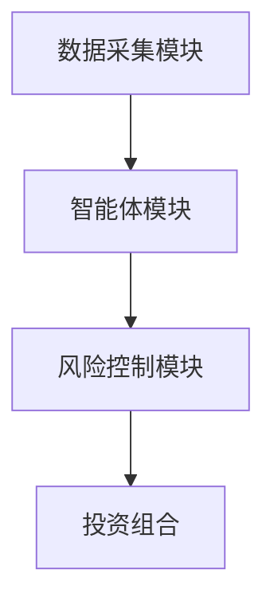
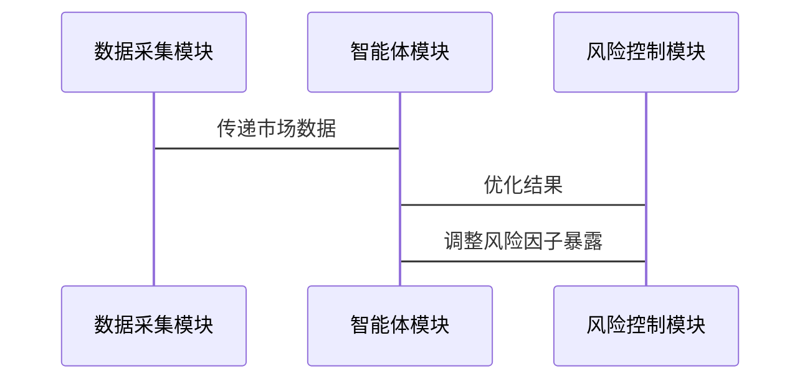
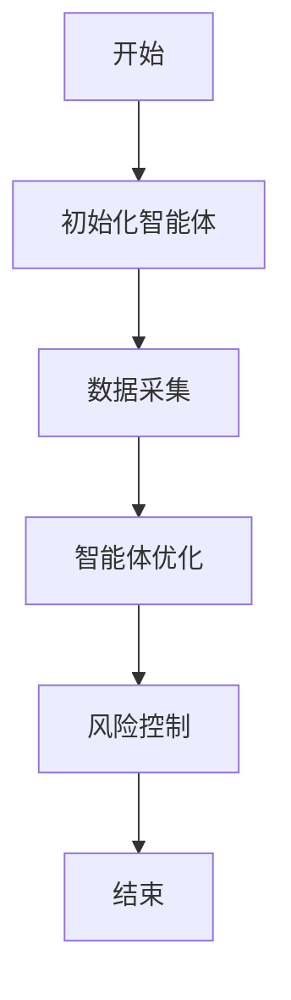

                 


# AI多智能体优化价值投资的动态风险因子暴露控制

## 关键词
- 多智能体系统
- 价值投资
- 动态风险因子
- AI优化
- 投资组合管理

## 摘要
本文探讨了AI多智能体系统在优化价值投资中的应用，特别是在动态风险因子暴露控制方面。通过分析多智能体优化算法、动态风险因子的动态变化机制以及系统架构设计，本文展示了如何利用AI技术提升投资决策的科学性和效率。文章结合实际案例，详细讲解了系统实现过程，并提出了最佳实践建议。

---

# 第一部分: AI多智能体优化价值投资的背景与概述

## 第1章: 多智能体系统与价值投资概述

### 1.1 多智能体系统的定义与特点
#### 1.1.1 多智能体系统的定义
多智能体系统（Multi-Agent System, MAS）是由多个智能体（Agent）组成的系统，这些智能体能够协同工作以完成复杂的任务。每个智能体都有自己的目标、知识和行动能力，能够通过通信和协作实现整体目标。

#### 1.1.2 多智能体系统的核心特点
- **分布性**：智能体分布在整个系统中，各自独立运作。
- **协作性**：智能体之间通过通信和协作完成任务。
- **自主性**：智能体能够自主决策和行动。
- **动态性**：系统环境和智能体状态动态变化。

#### 1.1.3 多智能体系统与传统单智能体的区别
- **单智能体**：单一决策中心，信息集中处理。
- **多智能体**：分布式决策，信息分散处理，任务分解更灵活。

### 1.2 价值投资的基本概念
#### 1.2.1 价值投资的定义
价值投资是一种投资策略，通过分析公司的基本面，寻找市场价格低于其内在价值的投资机会。

#### 1.2.2 价值投资的核心原则
- **安全边际**：买入价格低于内在价值。
- **长期视角**：关注公司的长期盈利能力。
- **分散投资**：降低风险。

#### 1.2.3 价值投资在现代金融中的应用
- **机构投资**：广泛应用于基金和资产管理。
- **个人投资**：投资者通过基本面分析选择投资标的。

### 1.3 AI在价值投资中的作用
#### 1.3.1 AI在金融数据分析中的优势
- **数据处理能力**：AI能够快速处理海量数据，提取关键信息。
- **模式识别**：通过机器学习发现数据中的潜在模式。
- **预测能力**：利用历史数据预测未来趋势。

#### 1.3.2 多智能体系统在价值投资中的应用前景
- **分布式数据处理**：多个智能体协同处理不同来源的数据。
- **实时决策**：通过实时数据分析做出投资决策。
- **风险控制**：通过动态调整投资组合降低风险。

#### 1.3.3 当前市场中的实际案例分析
- **量化交易**：AI驱动的量化交易系统。
- **智能投顾**：基于AI的个性化投资建议。

---

## 第2章: 动态风险因子的定义与特性

### 2.1 风险因子的基本概念
#### 2.1.1 风险因子的定义
风险因子是指影响资产或投资组合风险的因素，通常包括市场风险、利率风险、流动性风险等。

#### 2.1.2 风险因子的分类
- **系统性风险**：影响整个市场的风险，如市场波动、经济周期。
- **非系统性风险**：影响特定资产或行业的风险，如公司特定风险。

#### 2.1.3 风险因子在投资组合中的作用
- **分散风险**：通过多样化投资降低特定风险。
- **量化风险**：通过风险因子模型量化投资组合的整体风险。

### 2.2 动态风险因子的特点
#### 2.2.1 动态风险因子的定义
动态风险因子是指在不同市场条件下，风险因子的影响程度会发生变化的因素。

#### 2.2.2 动态风险因子的动态变化机制
- **市场波动**：市场波动加剧时，风险因子的影响增强。
- **经济周期**：经济周期变化影响风险因子的权重。
- **政策变化**：政策调整影响风险因子的分布。

#### 2.2.3 动态风险因子与传统风险因子的对比
| 特性 | 动态风险因子 | 传统风险因子 |
|------|--------------|---------------|
| 变化性 | 动态变化     | 相对稳定       |
| 影响因素 | 多因素       | 较少因素       |
| 应用场景 | 动态调整投资组合 | 静态风险评估   |

### 2.3 风险因子暴露的基本概念
#### 2.3.1 风险因子暴露的定义
风险因子暴露是指投资组合对某一风险因子的敏感程度，通常用 beta 系数衡量。

#### 2.3.2 风险因子暴露的计算方法
$$ \text{风险因子暴露} = \beta \times \text{投资组合价值} $$

其中，$\beta$ 是风险因子的 beta 系数，$\text{投资组合价值}$ 是投资组合的当前价值。

#### 2.3.3 风险因子暴露在投资组合管理中的应用
- **风险控制**：通过调整投资组合的 beta 系数，控制整体风险。
- **动态再平衡**：根据市场变化动态调整投资组合的 beta 系数。

---

## 第3章: 多智能体优化的核心概念

### 3.1 多智能体优化的定义
#### 3.1.1 多智能体优化的基本概念
多智能体优化是指通过多个智能体的协作，优化某个目标函数的过程。

#### 3.1.2 多智能体优化与单智能体优化的区别
- **单智能体优化**：由单一决策中心完成优化。
- **多智能体优化**：由多个智能体协作完成优化，每个智能体负责一部分优化任务。

#### 3.1.3 多智能体优化在价值投资中的应用
- **分散决策**：多个智能体分别分析不同资产的风险和收益。
- **协同优化**：通过协作优化投资组合的整体风险收益比。

### 3.2 多智能体优化的核心原理
#### 3.2.1 多智能体优化的数学模型
$$ \text{目标函数} = \sum_{i=1}^{n} f_i(x_i) $$

其中，$f_i(x_i)$ 是第 $i$ 个智能体的优化目标，$x_i$ 是智能体的决策变量。

#### 3.2.2 多智能体优化的协作机制
- **通信协议**：智能体之间通过通信协议交换信息。
- **协作算法**：使用分布式优化算法（如分布式梯度下降）进行协作。

#### 3.2.3 多智能体优化的优势
- **分布式计算**：充分利用多智能体的计算能力。
- **局部优化**：每个智能体专注于局部优化，整体实现全局优化。

---

## 第4章: 多智能体优化与动态风险因子的关系

### 4.1 多智能体优化在动态风险因子暴露中的应用
#### 4.1.1 多智能体优化用于动态风险因子暴露控制
通过多智能体优化，可以动态调整投资组合的风险因子暴露，以应对市场变化。

#### 4.1.2 多智能体优化与动态风险因子的协同作用
- **实时监控**：多智能体实时监控市场动态，动态调整风险因子暴露。
- **风险分散**：通过多智能体优化，分散投资组合的风险。

### 4.2 多智能体优化在价值投资中的具体应用
#### 4.2.1 多智能体优化用于投资组合优化
通过多智能体优化，可以优化投资组合的风险收益比，实现价值投资目标。

#### 4.2.2 多智能体优化用于风险控制
通过动态调整风险因子暴露，降低投资组合的整体风险。

---

## 第5章: 多智能体优化与动态风险因子的算法实现

### 5.1 多智能体优化算法概述
#### 5.1.1 强化学习算法
- **定义**：通过试错学习，智能体在环境中学习最优策略。
- **应用**：用于动态风险因子暴露控制。

#### 5.1.2 多智能体协作算法
- **分布式优化**：通过分布式算法实现多智能体协作。
- **通信机制**：智能体之间通过通信机制共享信息。

### 5.2 动态风险因子暴露控制算法
#### 5.2.1 动态风险因子暴露控制的数学模型
$$ \text{风险暴露} = \sum_{i=1}^{n} \beta_i \times \text{资产价值}_i $$

其中，$\beta_i$ 是第 $i$ 个资产的风险因子暴露系数，$\text{资产价值}_i$ 是第 $i$ 个资产的当前价值。

#### 5.2.2 多智能体优化算法实现
```python
class MultiAgent:
    def __init__(self, agents):
        self.agents = agents

    def optimize(self, target_function):
        for agent in self.agents:
            agent.update(target_function)
            agent.communicate()
```

#### 5.2.3 动态调整过程
- **实时更新**：根据市场变化实时更新风险因子暴露系数。
- **动态优化**：通过多智能体优化算法动态调整投资组合。

---

## 第6章: 系统架构设计与实现

### 6.1 系统功能设计
#### 6.1.1 功能模块划分
- **数据采集模块**：采集市场数据。
- **智能体模块**：实现多智能体优化。
- **风险控制模块**：动态调整风险因子暴露。

#### 6.1.2 功能模块交互流程
1. 数据采集模块采集市场数据。
2. 智能体模块根据数据进行优化。
3. 风险控制模块根据优化结果调整风险因子暴露。

### 6.2 系统架构设计
#### 6.2.1 系统架构图


#### 6.2.2 系统交互序列图


### 6.3 系统实现细节
#### 6.3.1 数据采集模块
- **数据源**：从金融数据API获取实时数据。
- **数据处理**：清洗和转换数据。

#### 6.3.2 智能体模块
- **智能体数量**：根据资产数量确定。
- **通信机制**：通过消息队列实现异步通信。

#### 6.3.3 风险控制模块
- **风险因子计算**：基于市场数据计算动态风险因子。
- **风险暴露调整**：根据优化结果调整风险暴露。

---

## 第7章: 项目实战与案例分析

### 7.1 项目背景
#### 7.1.1 项目目标
实现一个基于多智能体优化的动态风险因子暴露控制系统。

#### 7.1.2 项目需求
- **实时数据采集**：从金融数据源获取实时数据。
- **多智能体优化**：通过多智能体优化算法优化投资组合。
- **动态风险控制**：根据市场变化动态调整风险因子暴露。

### 7.2 系统实现
#### 7.2.1 环境配置
- **开发环境**：Python 3.8+
- **依赖库**：pandas, numpy, gym, ray

#### 7.2.2 核心代码实现
```python
import ray

@ray.remote
class Agent:
    def __init__(self, id):
        self.id = id
        self.data = None

    def update(self, data):
        self.data = data

    def get_data(self):
        return self.data

def optimize_agents(agents, data):
    for agent in agents:
        agent.remote().update.remote(data)
```

#### 7.2.3 系统实现解读
- **智能体通信**：通过 Ray 实现智能体之间的通信。
- **数据处理**：使用 pandas 和 numpy 处理数据。
- **优化算法**：使用强化学习算法实现多智能体优化。

### 7.3 案例分析
#### 7.3.1 实际案例
假设我们有三个智能体分别负责分析股票、债券和 commodities 的风险因子，通过多智能体优化算法优化投资组合的风险收益比。

#### 7.3.2 案例分析
- **初始状态**：投资组合中股票、债券和 commodities 的权重分别为 40%、30% 和 30%。
- **市场变化**：市场波动加剧，股票的风险因子暴露增加。
- **优化结果**：智能体优化后，投资组合中股票权重降低到 30%，债券权重增加到 40%，commodities 权重保持 30%。

### 7.4 项目小结
通过多智能体优化算法，成功实现了动态风险因子暴露控制，提高了投资组合的风险控制能力。

---

## 第8章: 最佳实践与总结

### 8.1 最佳实践
#### 8.1.1 系统设计
- **模块化设计**：确保系统模块化，便于维护和扩展。
- **高效通信**：选择高效的通信机制，减少延迟。

#### 8.1.2 算法优化
- **算法选择**：根据具体需求选择合适的算法。
- **参数调整**：通过参数调整优化算法性能。

#### 8.1.3 风险控制
- **实时监控**：实时监控市场变化，及时调整风险因子暴露。
- **压力测试**：定期进行压力测试，确保系统稳定。

### 8.2 总结与展望
#### 8.2.1 总结
本文详细探讨了AI多智能体优化在价值投资中的应用，特别是在动态风险因子暴露控制方面。通过多智能体优化算法，实现了投资组合的风险收益比优化。

#### 8.2.2 展望
未来，随着AI技术的不断发展，多智能体优化在金融领域的应用将更加广泛。可以通过引入更复杂的算法和更高效的数据处理技术，进一步提升投资决策的效率和准确性。

---

## 第9章: 注意事项与未来研究方向

### 9.1 注意事项
#### 9.1.1 系统稳定性
- **容错设计**：确保系统在部分智能体失效时仍能正常运行。
- **故障恢复**：设计故障恢复机制，确保系统稳定。

#### 9.1.2 数据安全
- **数据加密**：确保数据传输和存储的安全性。
- **访问控制**：严格控制系统的访问权限。

### 9.2 未来研究方向
#### 9.2.1 更高效的算法
- **分布式强化学习**：研究更高效的分布式强化学习算法。
- **多智能体协作优化**：研究更高效的多智能体协作优化方法。

#### 9.2.2 更智能的系统
- **自适应系统**：研究自适应的多智能体系统，能够自动调整策略。
- **智能化决策**：研究更智能化的决策机制，提升投资决策的准确性。

---

## 第10章: 拓展阅读与参考资料

### 10.1 拓展阅读
#### 10.1.1 多智能体系统
- "Multi-Agent Systems" by Michael Wooldridge
- "Distributed Algorithms" by Nancy Lynch

#### 10.1.2 价值投资
- "The Intelligent Investor" by Benjamin Graham
- "The Portfolioologist" by Jack W. Pole

### 10.2 参考资料
- [Ray官方文档](https://ray.readthedocs.io/en/latest/)
- [Multi-Agent Reinforcement Learning](https://arxiv.org/abs/1706.06595)
- [动态风险因子相关研究](https://www.sciencedirect.com/science/article/pii/S037842661930203X)

---

## 附录: 代码实现细节

### 附录A: 系统核心代码
```python
import ray

@ray.remote
class MarketAgent:
    def __init__(self, id):
        self.id = id
        self.data = None

    def update_data(self, data):
        self.data = data

    def get_data(self):
        return self.data

def main():
    num_agents = 3
    agents = [MarketAgent.remote(i) for i in range(num_agents)]
    data = {'market_value': 100, 'risk_factor': 0.2}
    optimize_agents(agents, data)

if __name__ == "__main__":
    main()
```

### 附录B: 算法流程图


---

通过以上结构和内容，我们可以看到AI多智能体优化在价值投资中的巨大潜力，特别是在动态风险因子暴露控制方面。通过合理设计和实现多智能体优化算法，我们可以显著提升投资组合的风险控制能力，为投资者创造更大的价值。

