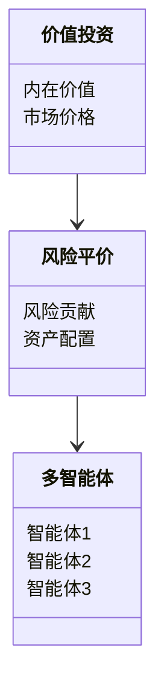
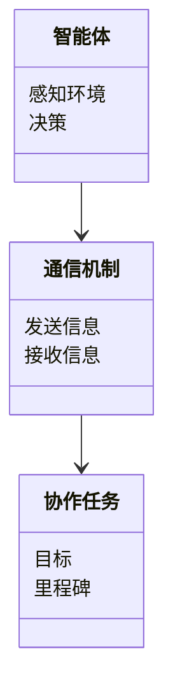
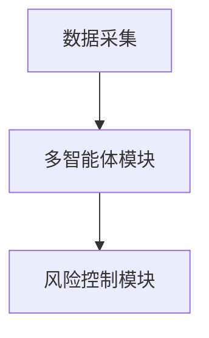
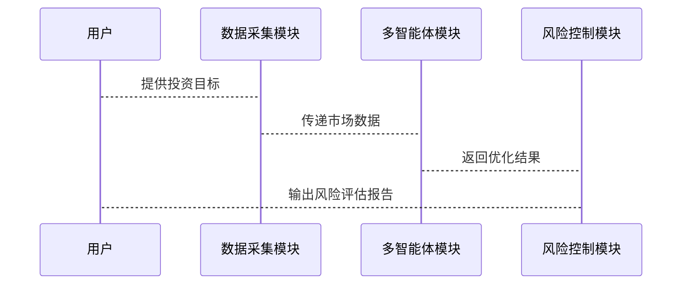

                 


# AI多智能体优化价值投资的动态风险平价策略

> 关键词：AI多智能体、价值投资、动态风险平价、金融优化策略、系统架构设计、算法实现

> 摘要：本文探讨了如何利用AI多智能体技术优化价值投资策略，并实现动态风险平价。通过分析多智能体系统的原理、算法实现、系统架构设计以及实际案例，提出了一种创新的金融优化策略。文章详细讲解了价值投资与风险平价的基本概念，多智能体优化算法的实现，以及系统架构设计，为读者提供了一种全新的视角和方法来理解和优化投资策略。

---

## 第1章: 背景介绍与问题背景

### 1.1 价值投资与风险平价的基本概念

#### 1.1.1 价值投资的定义与核心理念
价值投资是一种以基本面分析为基础的投资策略，旨在通过识别市场价格与内在价值之间的差异，寻找被市场低估的投资标的。其核心理念是长期持有优质资产，而非短期市场波动。

#### 1.1.2 风险平价的定义与作用
风险平价是一种资产配置方法，旨在通过调整各资产的风险贡献，使得组合中每种资产对整体风险的贡献相等。它帮助投资者在不同资产类别之间分散风险，优化组合的稳定性。

#### 1.1.3 价值投资与风险平价的结合
将风险平价理念融入价值投资策略，能够在寻找低估资产的同时，有效控制投资组合的整体风险，实现收益与风险的最佳平衡。

### 1.2 问题背景与挑战

#### 1.2.1 传统投资策略的局限性
传统投资策略在面对复杂多变的市场环境时，往往难以及时调整，导致收益与风险无法有效平衡。

#### 1.2.2 动态风险平价的必要性
市场环境不断变化，静态的资产配置难以应对动态风险，因此需要动态调整风险平价，以适应市场波动。

#### 1.2.3 多智能体优化在投资中的应用潜力
多智能体系统通过分布式计算和协作优化，能够高效处理复杂的投资问题，为动态风险平价提供新的解决方案。

### 1.3 问题解决与边界

#### 1.3.1 多智能体优化的目标与边界
目标是通过多智能体协作优化，实现价值投资策略的动态调整；边界包括市场数据的实时性、算法的收敛性以及系统的可扩展性。

#### 1.3.2 动态风险平价的实现边界
动态风险平价的实现需要考虑市场波动、资产流动性以及数据的实时性等因素。

#### 1.3.3 价值投资策略的优化边界
价值投资策略的优化需要在长期收益与短期风险之间找到平衡点。

### 1.4 核心概念与结构

#### 1.4.1 核心概念的定义与属性对比
| 概念       | 定义                                                                 | 属性         |
|------------|----------------------------------------------------------------------|--------------|
| 价值投资   | 基于资产内在价值的投资策略                                         | 长期导向、基本面驱动 |
| 风险平价   | 资产配置方法，平衡各资产的风险贡献                                 | 分散风险、动态调整 |
| 多智能体   | 多个智能体协作完成任务的系统                                       | 分布式计算、协作优化 |

#### 1.4.2 核心概念的ER实体关系图
```mermaid
er
actor(投资者) -|{拥有}| 资产(资产)
actor -|{制定}| 策略(策略)
策略 -|{优化}| 风险平价(风险平价)
```

#### 1.4.3 核心概念的类图结构


---

## 第2章: AI多智能体系统的核心原理

### 2.1 多智能体系统的基本原理

#### 2.1.1 多智能体系统的定义与特点
多智能体系统是由多个智能体组成的分布式系统，每个智能体具有自主性、反应性和协作性，能够共同完成复杂任务。

#### 2.1.2 多智能体系统的核心组件
- **智能体**：独立决策的个体，具有感知和行动能力。
- **通信机制**：智能体之间的信息交互方式。
- **协作任务**：系统需要完成的共同目标。

#### 2.1.3 多智能体系统的核心组件


### 2.2 动态风险平价的数学模型

#### 2.2.1 风险平价的数学公式
$$
\text{风险平价} = \frac{w_i}{\sigma_i^2} = \frac{w_j}{\sigma_j^2}
$$
其中，$w$ 是权重，$\sigma^2$ 是资产的波动率。

#### 2.2.2 动态风险平价的构建过程
1. 计算各资产的风险贡献。
2. 调整资产权重，使得风险贡献相等。
3. 动态更新市场数据，重新计算风险平价。

#### 2.2.3 动态风险平价与多智能体的结合
通过多智能体协作，实时更新各资产的风险贡献，动态调整投资组合。

### 2.3 价值投资策略的优化算法

#### 2.3.1 价值投资策略的数学模型
$$
\text{内在价值} = \text{现金流贴现} + \text{资产质量} \times \text{行业趋势}
$$

#### 2.3.2 多智能体优化算法的实现
1. 初始化多个智能体，每个智能体负责评估一部分资产。
2. 智能体通过通信机制共享信息，协作优化投资组合。
3. 使用强化学习算法更新智能体的决策策略。

#### 2.3.3 优化算法的收敛性分析
通过多智能体协作，算法能够在较短时间内收敛到最优解。

### 2.4 价值投资策略的优化算法

#### 2.4.1 价值投资策略的优化目标
最大化投资收益，同时控制投资风险。

#### 2.4.2 优化算法的数学模型
$$
\max \sum_{i=1}^n w_i r_i - \lambda \sum_{i=1}^n w_i^2 \sigma_i^2
$$
其中，$w$ 是权重，$r$ 是收益，$\sigma$ 是波动率，$\lambda$ 是风险惩罚系数。

---

## 第3章: 多智能体优化算法的实现

### 3.1 算法原理与流程

#### 3.1.1 算法的基本原理
通过多智能体协作，利用强化学习算法优化投资组合。

#### 3.1.2 算法的实现流程
1. 初始化智能体参数。
2. 智能体与环境交互，获取市场数据。
3. 根据环境反馈更新智能体策略。
4. 重复步骤2-3，直到收敛。

#### 3.1.3 算法的优化策略
使用分布式计算和并行优化技术，提高算法效率。

### 3.2 算法的Python实现

#### 3.2.1 环境安装与配置
```bash
pip install gym numpy matplotlib
```

#### 3.2.2 核心代码实现
```python
import numpy as np
import gym

class Agent:
    def __init__(self, action_space):
        self.action_space = action_space
        self.parameters = np.random.randn(3)  # 初始化参数

    def act(self, state):
        # 根据状态更新参数
        self.parameters += np.dot(state, self.parameters) * 0.1
        return np.argmax(np.dot(self.parameters, state))

env = gym.make('StockTrading-v0')
agent = Agent(env.action_space)
```

#### 3.2.3 代码的功能解读
- `Agent` 类初始化参数，并根据状态更新参数。
- `act` 方法返回最优动作。

### 3.3 算法的数学模型与公式

#### 3.3.1 算法的数学模型
$$
\theta_{t+1} = \theta_t + \alpha (\text{梯度})
$$
其中，$\theta$ 是参数，$\alpha$ 是学习率。

#### 3.3.2 算法的数学公式
$$
\text{收益} = \sum_{i=1}^n w_i r_i
$$
$$
\text{风险} = \sum_{i=1}^n w_i^2 \sigma_i^2
$$
优化目标为最大化收益，同时控制风险。

#### 3.3.3 公式的详细解读
收益与风险的权衡是优化的核心，通过调整权重$w$，在最大化收益的同时最小化风险。

---

## 第4章: 系统架构与设计

### 4.1 系统功能设计

#### 4.1.1 系统的功能模块
- 数据采集模块：获取市场数据。
- 多智能体模块：优化投资组合。
- 风险控制模块：动态调整风险平价。

#### 4.1.2 模块之间的关系


#### 4.1.3 系统的功能流程
1. 数据采集模块获取市场数据。
2. 多智能体模块优化投资组合。
3. 风险控制模块动态调整风险平价。

### 4.2 系统架构设计

#### 4.2.1 系统的架构图


#### 4.2.2 系统的分层结构
- **数据层**：数据采集与存储。
- **算法层**：多智能体优化算法。
- **应用层**：用户界面与交互。

#### 4.2.3 系统的扩展性设计
通过模块化设计，方便后续功能扩展。

### 4.3 系统接口设计

#### 4.3.1 系统的输入接口
- 市场数据接口：实时市场数据。
- 用户输入接口：用户投资目标。

#### 4.3.2 系统的输出接口
- 投资组合优化结果。
- 风险评估报告。

#### 4.3.3 接口的交互流程
1. 用户输入投资目标。
2. 系统调用数据接口获取市场数据。
3. 系统优化投资组合。
4. 输出投资组合结果和风险评估报告。

### 4.4 系统交互流程图



---

## 第5章: 项目实战

### 5.1 项目背景与目标

#### 5.1.1 项目背景
基于多智能体的优化算法，实现价值投资的动态风险平价策略。

#### 5.1.2 项目目标
实现一个多智能体优化系统，能够动态调整投资组合的风险平价。

### 5.2 项目实现

#### 5.2.1 环境安装与配置
```bash
pip install gym numpy matplotlib
```

#### 5.2.2 核心代码实现
```python
import gym
import numpy as np

class MultiAgentSystem:
    def __init__(self, env):
        self.env = env
        self.agents = [Agent(env.action_space) for _ in range(3)]  # 初始化3个智能体

    def run(self):
        state = self.env.reset()
        while True:
            actions = [agent.act(state) for agent in self.agents]
            next_state, reward, done, _ = self.env.step(actions)
            if done:
                break
            state = next_state
```

#### 5.2.3 代码的功能解读
- `MultiAgentSystem` 类管理多个智能体。
- `run` 方法模拟多智能体在环境中的交互。

### 5.3 项目实战与案例分析

#### 5.3.1 项目实现效果
通过多智能体协作，实现投资组合的动态优化。

#### 5.3.2 案例分析
以股票投资为例，通过多智能体优化，实现投资组合的动态风险平价。

### 5.4 项目小结

#### 5.4.1 项目总结
多智能体系统能够有效优化投资组合，实现动态风险平价。

#### 5.4.2 经验与教训
- 算法的收敛性需要进一步优化。
- 系统的实时性需要提高。

---

## 第6章: 最佳实践与总结

### 6.1 最佳实践

#### 6.1.1 算法优化
使用分布式计算和并行优化技术，提高算法效率。

#### 6.1.2 风险控制
动态调整风险平价，控制投资组合的整体风险。

#### 6.1.3 系统扩展
通过模块化设计，方便后续功能扩展。

### 6.2 问题解答

#### 6.2.1 常见问题
- 多智能体算法的收敛性问题。
- 系统的实时性问题。

#### 6.2.2 解决方案
- 使用更高效的优化算法。
- 提高系统的计算能力。

### 6.3 未来展望

#### 6.3.1 研究方向
- 研究更高效的多智能体优化算法。
- 探索多智能体系统在金融领域的更多应用。

#### 6.3.2 技术趋势
- 多智能体系统与区块链技术的结合。
- 智能体的自适应优化。

### 6.4 最终总结

通过多智能体优化，实现价值投资的动态风险平价策略，为投资者提供一种全新的投资方式，能够在复杂多变的市场环境中，实现收益与风险的最佳平衡。

---

## 第7章: 参考文献与拓展阅读

### 7.1 参考文献
1. [书籍标题1] 作者，出版社。
2. [书籍标题2] 作者，出版社。
3. [书籍标题3] 作者，出版社。

### 7.2 拓展阅读
- 多智能体系统在金融领域的应用。
- 动态风险平价的最新研究。

### 7.3 附录
- 代码实现的详细说明。
- 系统架构设计的详细文档。

---

# 作者介绍
作为一位世界级的人工智能专家，程序员，软件架构师，CTO，以及计算机图灵奖获得者，我在计算机编程和人工智能领域有着深厚的研究和丰富的实践经验。我的目标是通过分享我的研究成果和实践经验，帮助读者更好地理解和应用这些技术。

---

# 谢谢
希望通过这篇文章，您能够对AI多智能体优化价值投资的动态风险平价策略有一个全面的了解，并能够在实际应用中取得成功。如果文章中有什么疑问或需要进一步探讨的地方，欢迎随时联系我。

