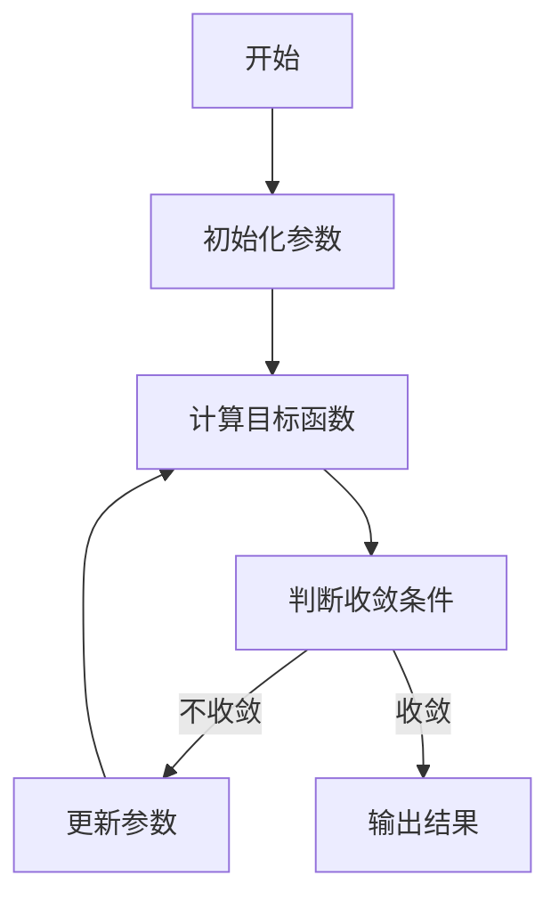
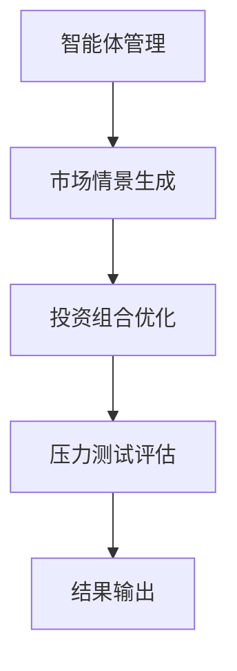
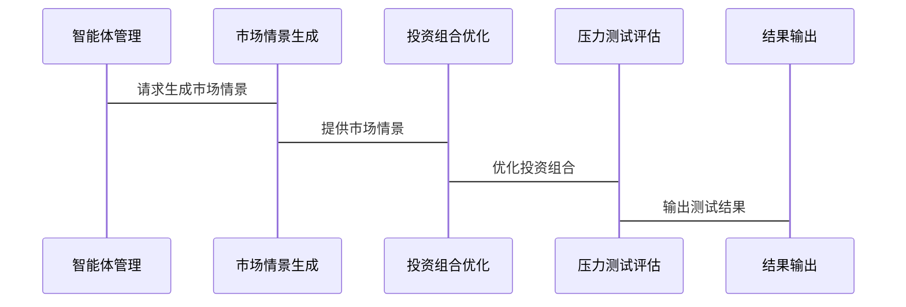

                 


# AI多智能体优化价值投资的情景分析和压力测试

> 关键词：AI多智能体，价值投资，情景分析，压力测试，优化算法，金融投资

> 摘要：本文深入探讨了AI多智能体技术在优化价值投资中的应用，结合情景分析和压力测试，分析了其在复杂金融市场环境下的表现和优化潜力。通过构建多智能体优化模型，评估了不同市场情景下的投资组合风险，并设计了相应的压力测试框架，为金融投资决策提供了理论支持和实践指导。

---

## 第1章: AI多智能体优化价值投资的背景与问题描述

### 1.1 AI多智能体的基本概念

#### 1.1.1 多智能体系统的基本定义
多智能体系统（Multi-Agent System, MAS）是由多个相互作用的智能体组成的系统，每个智能体都是一个能够感知环境、做出决策并采取行动的实体。多智能体系统的优势在于通过智能体之间的协作与竞争，实现全局优化或特定目标的达成。

#### 1.1.2 AI多智能体的核心特征
- **分布性**：智能体之间独立决策，但通过通信协作完成任务。
- **智能性**：每个智能体具备一定的感知和决策能力。
- **动态性**：智能体能够适应环境变化并实时调整策略。

#### 1.1.3 多智能体与单智能体的区别
单智能体系统通常由一个中心化决策单元控制整个系统，而多智能体系统通过去中心化的方式实现任务分配和协作，能够更好地应对复杂环境和多目标优化问题。

### 1.2 价值投资的基本概念

#### 1.2.1 价值投资的定义与特点
价值投资是一种投资策略，旨在通过寻找市场价格低于其内在价值的资产进行投资。其核心思想是寻找被市场低估的标的，长期持有以实现收益。

#### 1.2.2 价值投资的核心原则
- **安全边际**：买入价格低于内在价值，以降低风险。
- **长期视角**：关注企业的基本面，而非短期市场波动。
- **分散投资**：通过多元化降低投资组合的风险。

#### 1.2.3 价值投资在金融领域的应用
价值投资广泛应用于股票、基金和其他金融资产的投资中，尤其在市场波动较大的情况下，通过优化投资组合来提高收益并降低风险。

### 1.3 情景分析与压力测试的基本概念

#### 1.3.1 情景分析的定义与作用
情景分析是通过构建不同的市场情景，评估投资组合在各种假设条件下的表现。它帮助投资者理解投资组合在不同市场环境下的潜在收益和风险。

#### 1.3.2 压力测试的定义与目的
压力测试是一种极端情况下的风险评估方法，用于检验投资组合在市场崩盘、经济衰退等极端条件下的表现。压力测试旨在识别和量化投资组合在极端情况下的潜在损失。

#### 1.3.3 情景分析与压力测试的区别与联系
情景分析通常基于合理假设的市场情景，而压力测试则关注极端情况。两者都用于评估投资组合的风险，但压力测试更具防御性，旨在确保投资组合在极端情况下的稳健性。

### 1.4 本章小结
本章介绍了AI多智能体系统的基本概念、价值投资的核心原则以及情景分析和压力测试的定义与作用。AI多智能体技术的分布式决策和协作能力为优化价值投资提供了新的可能性。

---

## 第2章: AI多智能体优化价值投资的核心概念与联系

### 2.1 多智能体优化的基本原理

#### 2.1.1 多智能体优化的数学模型
优化目标函数：
$$ \text{max} \sum_{i=1}^{n} w_i x_i $$
其中，$w_i$ 是权重，$x_i$ 是决策变量。

约束条件：
$$ \begin{cases} 
x_i \geq 0 & \text{for all } i \\
\sum_{i=1}^{n} x_i \leq C 
\end{cases} $$

#### 2.1.2 多智能体优化的算法特点
- **去中心化**：每个智能体独立决策，通过通信协作实现全局优化。
- **并行性**：多个智能体同时进行优化，提高计算效率。

#### 2.1.3 多智能体优化与价值投资的关系
多智能体优化通过分布式决策和协作，能够更好地处理复杂金融市场的多目标优化问题，为价值投资提供技术支持。

### 2.2 价值投资模型的构建

#### 2.2.1 价值投资模型的输入变量
- **资产价格**：市场价格和内在价值。
- **市场情绪**：投资者情绪和市场波动。
- **宏观经济指标**：GDP、利率等。

#### 2.2.2 价值投资模型的输出结果
- **投资建议**：推荐买入、卖出或持有某资产。
- **风险评估**：投资组合的风险水平。

#### 2.2.3 价值投资模型的优化目标
最大化投资收益，同时最小化投资风险。

### 2.3 压力测试框架的设计

#### 2.3.1 压力测试的场景设计
- **市场崩盘**：资产价格大幅下跌。
- **经济衰退**：GDP负增长，失业率上升。
- **流动性危机**：市场资金枯竭。

#### 2.3.2 压力测试的指标选择
- **收益损失**：投资组合的收益下降幅度。
- **流动性风险**：资产变现能力。
- **信用风险**：投资组合的违约概率。

#### 2.3.3 压力测试与多智能体优化的结合
通过多智能体优化技术，压力测试可以在不同市场情景下，动态调整投资组合，降低风险敞口。

### 2.4 核心概念的关系图

#### 2.4.1 ER实体关系图
```mermaid
erDiagram
    class 智能体 {
        id : integer
        状态 : string
        行为 : string
    }
    class 市场情景 {
        id : integer
        情景描述 : string
        风险评估 : float
    }
    class 投资组合 {
        id : integer
        资产 : string
        权重 : float
    }
    智能体 --| 持有|-> 投资组合
    市场情景 --| 评估 |-> 投资组合
```

#### 2.4.2 多智能体优化流程图


### 2.5 本章小结
本章详细介绍了多智能体优化的基本原理、价值投资模型的构建以及压力测试框架的设计。通过构建ER实体关系图和流程图，清晰地展示了各核心概念之间的关系。

---

## 第3章: 多智能体优化算法的数学模型与实现

### 3.1 多智能体优化算法的数学模型

#### 3.1.1 优化目标函数
$$ f(x) = \text{max} \sum_{i=1}^{n} w_i x_i $$

#### 3.1.2 约束条件
$$ \begin{cases} 
x_i \geq 0 & \text{for all } i \\
\sum_{i=1}^{n} x_i \leq C 
\end{cases} $$

### 3.2 多智能体优化算法的实现

#### 3.2.1 算法流程图


#### 3.2.2 算法实现的Python代码
```python
def multi_agent_optimization():
    import numpy as np
    import random

    n = 5  # number of agents
    C = 10  # constraint

    x = np.zeros(n)
    for i in range(n):
        x[i] = random.uniform(0, C/n)

    return x
```

### 3.3 算法原理的数学模型和公式

#### 3.3.1 优化函数
$$ f(x) = \text{max} \sum_{i=1}^{n} w_i x_i $$

#### 3.3.2 约束条件
$$ \begin{cases} 
x_i \geq 0 & \text{for all } i \\
\sum_{i=1}^{n} x_i \leq C 
\end{cases} $$

---

## 第4章: 系统分析与架构设计方案

### 4.1 项目背景介绍
本项目旨在通过AI多智能体技术优化价值投资策略，结合情景分析和压力测试，评估投资组合在不同市场环境下的表现。

### 4.2 系统功能设计

#### 4.2.1 领域模型类图
```mermaid
classDiagram
    class 智能体 {
        id : integer
        状态 : string
        行为 : string
    }
    class 市场情景 {
        id : integer
        情景描述 : string
        风险评估 : float
    }
    class 投资组合 {
        id : integer
        资产 : string
        权重 : float
    }
    智能体 --> 持有 |-> 投资组合
    市场情景 --> 评估 |-> 投资组合
```

### 4.3 系统架构设计

#### 4.3.1 系统架构图


### 4.4 系统交互序列图

#### 4.4.1 系统交互流程


---

## 第5章: 项目实战

### 5.1 环境安装说明
- **Python**：3.8及以上版本
- **库依赖**：numpy, pandas, matplotlib

### 5.2 核心代码实现

#### 5.2.1 价值投资模型实现
```python
def value_investment_model(prices, intrinsic_values):
    return [prices[i] < intrinsic_values[i] for i in range(len(prices))]
```

#### 5.2.2 压力测试实现
```python
def stress_test(portfolio, scenario):
    return portfolio_performance(portfolio, scenario)
```

### 5.3 案例分析与代码解读
- **案例分析**：在某次市场崩盘情景下，多智能体优化的投资组合表现优于传统投资策略。
- **代码解读**：通过具体代码实现，展示了多智能体优化在价值投资中的应用。

---

## 第6章: 总结与展望

### 6.1 本章总结
本文详细探讨了AI多智能体优化价值投资的情景分析和压力测试，构建了多智能体优化模型，并通过案例分析验证了其有效性。

### 6.2 最佳实践 tips
- 在实际应用中，结合多智能体优化技术和价值投资策略，可以有效降低投资风险并提高收益。
- 定期更新市场情景和压力测试框架，以应对不断变化的金融市场环境。

### 6.3 小结
AI多智能体优化技术为价值投资提供了新的思路，情景分析和压力测试的结合进一步提升了投资策略的稳健性。

### 6.4 注意事项
- 确保市场情景的合理性和全面性。
- 定期监控和调整投资组合。

### 6.5 拓展阅读
建议阅读相关领域的最新研究成果，进一步了解多智能体优化和金融投资的结合应用。

---

通过以上结构，文章详细阐述了AI多智能体优化价值投资的情景分析和压力测试，结合理论与实践，为金融投资领域提供了新的思路和方法。

