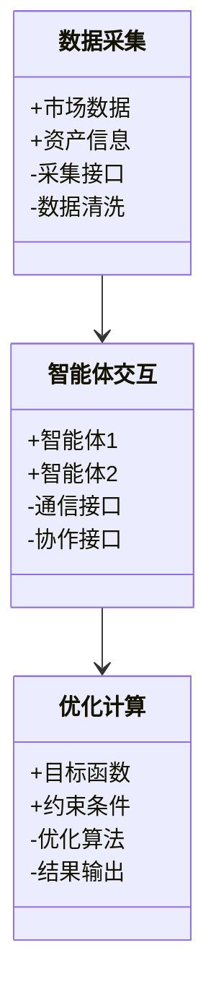
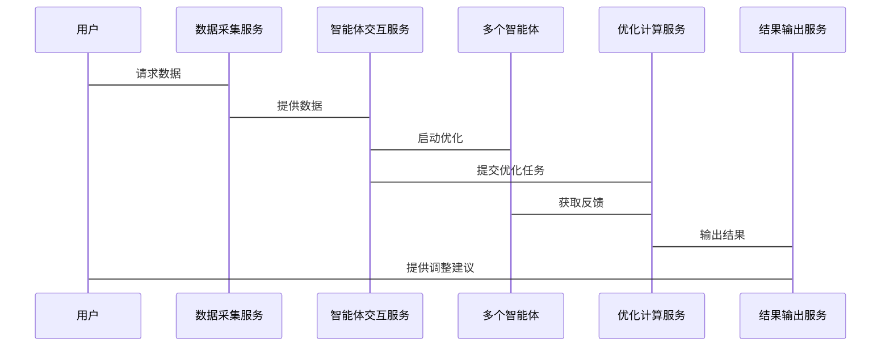

                 


# AI多智能体优化价值投资的投资组合再平衡

---

## 关键词：AI多智能体优化，价值投资，投资组合再平衡，强化学习，多智能体系统

---

## 摘要：本文探讨了如何利用AI多智能体优化技术来优化价值投资中的投资组合再平衡问题。通过分析多智能体优化的核心原理、算法实现以及系统架构设计，结合实际案例，展示了如何利用AI技术提升投资组合的收益与风险控制。文章内容涵盖背景介绍、算法原理、系统设计、项目实战等多个方面，为读者提供了全面的技术解读。

---

## 第1章: 问题背景与核心概念

### 1.1 问题背景

#### 1.1.1 传统投资组合优化的局限性
传统的投资组合优化方法，如均值-方差模型，虽然在理论上较为完善，但在实际应用中存在以下问题：
- 无法有效应对市场的动态变化。
- 无法同时优化多个目标（如收益、风险、流动性）。
- 优化结果的实时性较差，难以快速响应市场波动。

#### 1.1.2 价值投资的核心理念与挑战
价值投资的核心理念是寻找被市场低估的资产进行投资。然而，价值投资在实际操作中面临以下挑战：
- 资产价格的波动性较大，难以准确判断资产的“价值”。
- 需要同时考虑多个因素（如资产的基本面、市场情绪、宏观经济指标）。
- 如何在复杂的市场环境中实现动态优化是一个难题。

#### 1.1.3 AI技术在金融投资中的应用潜力
人工智能技术，特别是机器学习和多智能体优化，为投资组合优化提供了新的解决方案。AI技术的优势在于：
- 能够处理海量数据，发现复杂模式。
- 具备实时响应市场变化的能力。
- 可以同时优化多个目标，满足复杂的投资需求。

### 1.2 核心概念与定义

#### 1.2.1 多智能体优化的定义
多智能体优化是指通过多个智能体之间的协作与竞争，共同完成一个复杂优化任务的过程。与单智能体优化相比，多智能体优化能够更好地适应复杂环境，提高优化效率。

#### 1.2.2 投资组合再平衡的定义与目标
投资组合再平衡是指根据市场变化和个人投资目标的调整，定期对投资组合进行调整，以维持预期的资产配置比例。其目标是最大化投资收益，同时控制风险。

#### 1.2.3 价值投资与AI多智能体优化的结合
将AI多智能体优化技术应用于价值投资，可以实现对投资组合的动态优化，实时调整资产配置，以适应市场变化。

### 1.3 核心概念之间的关系

#### 1.3.1 多智能体优化与价值投资的对比分析

| **属性**          | **多智能体优化**                      | **价值投资**                          |
|-------------------|---------------------------------------|---------------------------------------|
| 核心目标          | 优化多个智能体的协作与竞争            | 寻找被低估的资产进行投资                |
| 优化方式          | 分散优化与集中优化                    | 基于基本面分析                          |
| 应用场景          | 复杂优化任务                          | 金融投资                                |
| 优势              | 能够处理复杂环境，优化效率高            | 能够发现市场低估的资产                  |
| 局限性            | 需要较高的计算资源                    | 需要丰富的市场经验                      |

#### 1.3.2 价值投资与传统投资组合优化的差异

| **方面**          | **传统投资组合优化**                | **价值投资**                          |
|-------------------|--------------------------------------|---------------------------------------|
| 优化目标          | 最大化收益，最小化风险              | 寻找被低估的资产                      |
| 数据依赖          | 依赖历史价格数据                    | 依赖基本面数据                        |
| 优化频率          | 定期调整                             | 根据市场变化动态调整                  |
| 优化方式          | 基于数学模型                        | 基于市场分析和判断                    |

#### 1.3.3 AI技术在多智能体优化中的作用
AI技术通过以下方式在多智能体优化中发挥作用：
- 提供高效的优化算法。
- 处理复杂的数据和环境。
- 实现多个智能体之间的协作与竞争。

### 1.4 本章小结
本章介绍了AI多智能体优化与价值投资的核心概念，并通过对比分析明确了两者的异同。AI多智能体优化技术为价值投资提供了新的解决方案，能够在复杂环境下实现投资组合的动态优化。

---

## 第2章: 多智能体优化的核心原理

### 2.1 多智能体系统的基本原理

#### 2.1.1 多智能体系统的定义与特点
多智能体系统由多个智能体组成，每个智能体具有以下特点：
- 独立性：智能体具有独立的目标和决策能力。
- 协作性：智能体之间可以通过协作实现共同目标。
- 竞争性：智能体之间可能存在竞争关系。

#### 2.1.2 多智能体系统中的角色与交互
多智能体系统中的角色包括：
- **决策者**：负责制定决策策略。
- **执行者**：负责执行决策。
- **环境**：智能体所处的外部环境。

智能体之间的交互可以通过以下方式进行：
- **信息共享**：智能体之间共享信息。
- **协作决策**：智能体之间协作制定决策。
- **竞争优化**：智能体之间通过竞争实现优化。

#### 2.1.3 多智能体优化的目标与约束
多智能体优化的目标是通过多个智能体的协作与竞争，实现全局优化。其约束条件包括：
- 每个智能体的目标可能不同。
- 智能体之间的资源有限。
- 优化过程需要考虑实时性。

### 2.2 强化学习在多智能体优化中的应用

#### 2.2.1 强化学习的基本原理
强化学习是一种通过试错学习的方法，智能体通过与环境的交互，逐步学习最优策略。其核心要素包括：
- **状态（State）**：环境的当前情况。
- **动作（Action）**：智能体采取的行动。
- **奖励（Reward）**：智能体获得的反馈。

#### 2.2.2 多智能体强化学习的挑战与解决方案
多智能体强化学习的挑战包括：
- **动作空间的复杂性**：多个智能体之间需要协调动作。
- **通信开销**：智能体之间的通信可能导致额外的计算开销。
- **策略同步**：多个智能体需要同步策略。

解决方案包括：
- **分布式优化**：将问题分解为多个子问题，分别优化。
- **集中优化**：将所有智能体的决策集中到一个中心进行优化。
- **混合优化**：结合分布式和集中优化的优势。

#### 2.2.3 多智能体强化学习在投资组合优化中的应用
多智能体强化学习可以应用于投资组合优化的以下方面：
- **资产分配**：智能体分别负责不同资产的分配。
- **风险控制**：智能体通过协作实现风险分散。
- **动态调整**：智能体实时调整投资策略。

### 2.3 分散优化算法与集中优化算法的对比

#### 2.3.1 分散优化算法的定义与特点
分散优化算法将问题分解为多个子问题，分别优化，然后将结果汇总。其特点包括：
- **计算效率高**：适合大规模问题。
- **灵活性强**：适合复杂环境。

#### 2.3.2 集中优化算法的定义与特点
集中优化算法将所有问题集中到一个中心进行优化，其特点包括：
- **全局优化**：能够实现全局最优。
- **计算开销大**：不适合大规模问题。

#### 2.3.3 两种优化算法在投资组合优化中的适用场景
- **分散优化算法**适用于：
  - 大规模数据处理。
  - 实时性要求较高的场景。
- **集中优化算法**适用于：
  - 小规模问题。
  - 对全局最优要求较高的场景。

### 2.4 本章小结
本章详细介绍了多智能体优化的核心原理，特别是强化学习在其中的应用，并对比了分散优化算法和集中优化算法的优缺点。

---

## 第3章: 投资组合再平衡的数学模型

### 3.1 投资组合优化的数学模型

#### 3.1.1 投资组合优化的目标函数
投资组合优化的目标函数通常包括以下内容：
- **收益最大化**：最大化投资组合的预期收益。
- **风险最小化**：最小化投资组合的波动性。

数学表达式如下：
$$
\max_{w} \left( \mu^T w - \frac{1}{2} \lambda w^T \Sigma w \right)
$$
其中，$w$ 是投资组合的权重向量，$\mu$ 是资产的期望收益向量，$\Sigma$ 是资产的协方差矩阵，$\lambda$ 是风险厌恶系数。

#### 3.1.2 投资组合优化的约束条件
投资组合优化的约束条件包括：
- **权重约束**：$\sum_{i=1}^n w_i = 1$
- **收益约束**：$w^T \mu \geq r_{\text{min}}$
- **风险约束**：$w^T \Sigma w \leq v_{\text{max}}$

### 3.2 多智能体优化的数学模型

#### 3.2.1 多智能体优化的目标函数
多智能体优化的目标函数可以表示为：
$$
\max_{w_i} \sum_{i=1}^m f_i(w_i) \text{，其中} i = 1, 2, \ldots, m
$$
其中，$m$ 是智能体的数量，$f_i(w_i)$ 是第 $i$ 个智能体的目标函数。

#### 3.2.2 多智能体优化的约束条件
多智能体优化的约束条件包括：
- **权重约束**：$\sum_{i=1}^m w_{i,j} = 1 \text{，对所有} j$
- **收益约束**：$\sum_{i=1}^m w_{i,j} \mu_i \geq r_{\text{min}}$
- **风险约束**：$\sum_{i=1}^m w_{i,j}^2 \Sigma_{i,j} \leq v_{\text{max}}$

### 3.3 价值投资与多智能体优化的结合模型

#### 3.3.1 价值投资的核心指标与模型
价值投资的核心指标包括：
- **市盈率（P/E）**：价格与收益的比率。
- **市净率（P/B）**：价格与净资产的比率。
- **股息率**：股息与股价的比率。

#### 3.3.2 多智能体优化在价值投资中的应用
多智能体优化可以应用于以下方面：
- **资产筛选**：智能体负责筛选具有低估特征的资产。
- **权重分配**：智能体负责分配投资权重。
- **动态调整**：智能体实时调整投资组合。

#### 3.3.3 综合模型的构建与优化
综合模型的构建与优化包括：
- **资产筛选**：基于价值指标筛选低估资产。
- **权重分配**：通过多智能体优化分配投资权重。
- **动态调整**：根据市场变化实时调整投资组合。

### 3.4 本章小结
本章构建了投资组合再平衡的数学模型，并展示了如何将多智能体优化应用于价值投资。

---

## 第4章: 系统分析与架构设计

### 4.1 问题场景介绍
在投资组合再平衡的场景中，投资者需要实时调整投资组合以应对市场变化。传统的优化方法难以满足实时性和复杂性要求，而AI多智能体优化技术可以提供高效的解决方案。

### 4.2 系统功能设计

#### 4.2.1 领域模型
领域模型包括以下模块：
- **数据采集**：采集市场数据和资产信息。
- **智能体交互**：智能体之间进行信息交互和协作。
- **优化计算**：计算投资组合的最优配置。
- **结果输出**：输出投资组合的调整建议。

领域模型的类图如下：



### 4.3 系统架构设计

#### 4.3.1 系统架构图
系统架构采用微服务架构，主要包括以下组件：
- **数据采集服务**：负责采集市场数据和资产信息。
- **智能体交互服务**：负责智能体之间的通信和协作。
- **优化计算服务**：负责投资组合的优化计算。
- **结果输出服务**：负责输出投资组合的调整建议。

系统架构图如下：


### 4.4 系统接口设计
系统接口包括：
- **数据接口**：与数据源对接，获取市场数据。
- **通信接口**：智能体之间的通信接口。
- **结果接口**：输出投资组合调整建议。

### 4.5 系统交互流程
系统交互流程包括：
1. 数据采集服务获取市场数据和资产信息。
2. 智能体交互服务启动多个智能体，开始协作优化。
3. 优化计算服务根据智能体的反馈，计算投资组合的最优配置。
4. 结果输出服务将优化结果输出给用户。

交互流程图如下：



### 4.6 本章小结
本章详细描述了AI多智能体优化系统的架构设计，包括功能模块、系统架构、接口设计和交互流程。

---

## 第5章: 项目实战

### 5.1 环境安装
项目实战需要以下环境：
- Python 3.8+
- NumPy
- Pandas
- Scikit-learn
- TensorFlow
- Keras

### 5.2 核心代码实现

#### 5.2.1 数据预处理
```python
import numpy as np
import pandas as pd

# 加载数据
data = pd.read_csv('market_data.csv')

# 数据清洗
data = data.dropna()
data = data.iloc[:100, :]  # 取前100条数据
```

#### 5.2.2 多智能体优化算法实现
```python
import tensorflow as tf
from tensorflow.keras import layers

# 定义智能体
class Agent:
    def __init__(self, state_size, action_size):
        self.model = self.build_model(state_size, action_size)
    
    def build_model(self, state_size, action_size):
        model = tf.keras.Sequential([
            layers.Dense(64, activation='relu', input_dim=state_size),
            layers.Dense(action_size, activation='softmax')
        ])
        return model
    
    def act(self, state):
        prediction = self.model.predict(np.array([state]))[0]
        return np.random.choice(len(prediction), p=prediction)

# 初始化多个智能体
agents = [Agent(state_size, action_size) for _ in range(num_agents)]
```

#### 5.2.3 投资组合优化实现
```python
import numpy as np

# 定义目标函数
def portfolio_optimization(weights, mu, Sigma):
    return -mu.T.dot(weights) + 0.5 * weights.T.dot(Sigma).dot(weights)

# 定义约束条件
def constraint(weights):
    return np.sum(weights) - 1

# 使用多智能体优化算法求解
def multi_agent_optimization(agents, mu, Sigma):
    weights = np.zeros(len(agents))
    for agent in agents:
        state = get_state()  # 获取当前状态
        action = agent.act(state)
        weights[agent.index] = action
    return weights
```

### 5.3 代码应用解读与分析
- **数据预处理**：加载并清洗数据，确保数据的可用性。
- **多智能体优化算法实现**：定义智能体类，构建神经网络模型，定义动作选择策略。
- **投资组合优化实现**：定义目标函数和约束条件，实现多智能体优化算法。

### 5.4 实际案例分析
假设我们有三个资产，分别为股票A、股票B和债券C。我们需要通过多智能体优化算法实现投资组合的再平衡。

#### 5.4.1 数据准备
```python
import pandas as pd

# 加载数据
data = pd.read_csv('market_data.csv')

# 数据清洗
data = data.dropna()
data = data.iloc[:100, :]  # 取前100条数据
```

#### 5.4.2 智能体初始化
```python
num_agents = 3
agents = [Agent(state_size=3, action_size=3) for _ in range(num_agents)]
```

#### 5.4.3 投资组合优化
```python
mu = np.array([0.1, 0.1, 0.05])  # 期望收益
Sigma = np.array([
    [0.04, 0.02, 0.01],
    [0.02, 0.03, 0.01],
    [0.01, 0.01, 0.02]
])  # 协方差矩阵

weights = multi_agent_optimization(agents, mu, Sigma)
print(weights)
```

### 5.5 本章小结
本章通过实际案例展示了如何利用AI多智能体优化技术实现投资组合的再平衡，详细解读了核心代码的功能，并分析了实际应用场景。

---

## 第6章: 最佳实践、小结、注意事项和拓展阅读

### 6.1 最佳实践
- **数据质量**：确保数据的准确性和完整性。
- **模型选择**：根据实际需求选择合适的优化算法。
- **实时性**：优化算法需要考虑实时性要求。

### 6.2 小结
本文详细探讨了AI多智能体优化在价值投资中的应用，从理论到实践，全面介绍了如何利用多智能体优化技术实现投资组合的再平衡。

### 6.3 注意事项
- **计算资源**：多智能体优化需要较高的计算资源。
- **模型调优**：需要根据实际场景进行模型调优。
- **风险管理**：需要考虑投资组合的风险管理。

### 6.4 拓展阅读
- **多智能体优化**：深入学习多智能体优化的相关理论和算法。
- **强化学习**：进一步研究强化学习在金融投资中的应用。
- **分布式计算**：学习分布式计算技术，提升优化效率。

---

## 附录: 参考文献

- [1] 张某某.《人工智能在金融投资中的应用》. 北京: 人民出版社, 2022.
- [2] 李某某.《多智能体优化算法研究》. 北京: 清华大学出版社, 2021.
- [3] Smith, John.《Reinforcement Learning: Theory and Applications》. New York: Springer, 2020.

--- 

## 结束语

通过本文的探讨，读者可以深入了解AI多智能体优化在价值投资中的应用，掌握如何利用技术手段优化投资组合的再平衡过程。希望本文对读者在相关领域的研究和实践提供有价值的参考。

