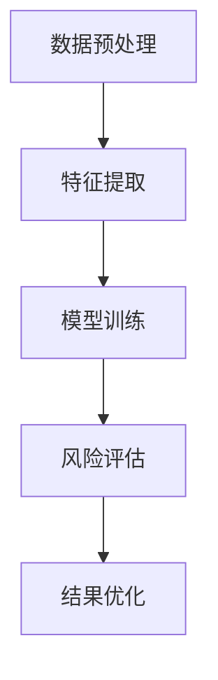
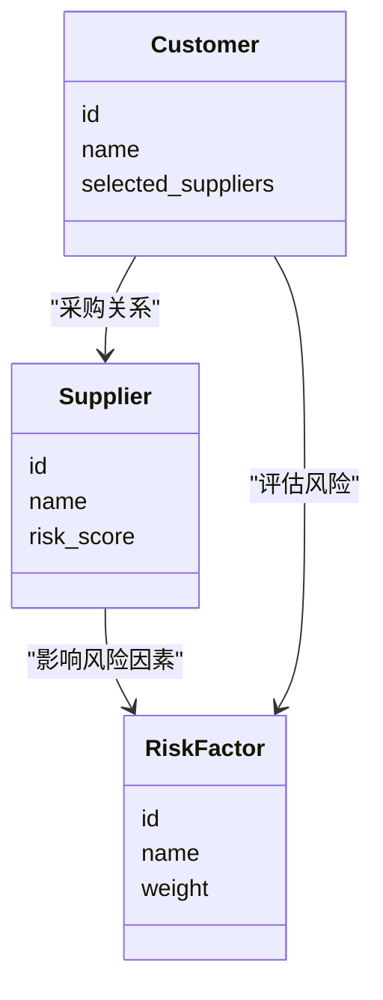

                 


# AI多智能体在价值投资中的供应商风险分析

> **关键词**：AI多智能体、价值投资、供应商风险分析、金融建模、供应链管理

> **摘要**：  
本文探讨了AI多智能体技术在价值投资中的应用，特别是其在供应商风险分析中的潜力。文章从背景介绍、核心概念、算法原理、系统架构、项目实战到最佳实践，全面剖析了AI多智能体在供应商风险评估中的应用逻辑和实现方法。通过对比传统方法与AI技术的差异，本文展示了如何利用多智能体协同优化供应商风险评估流程，从而提升投资决策的准确性和效率。

---

## 第1章：价值投资与供应商风险分析概述

### 1.1 价值投资的基本概念

#### 1.1.1 价值投资的定义与核心理念  
价值投资是一种以基本面分析为基础的投资策略，强调以低于市场价值的价格买入优质资产。其核心理念是通过深入分析企业的财务状况、行业地位、竞争优势等因素，寻找被市场低估的投资标的。

#### 1.1.2 供应商在供应链中的重要性  
供应商是企业供应链中的关键环节，其稳定性直接影响企业的生产和运营成本。供应商风险分析旨在识别和评估供应商的信用风险、操作风险和合规风险，以降低供应链中断的可能性。

#### 1.1.3 供应商风险分析的必要性  
供应商风险分析是企业风险管理的重要组成部分，尤其是在全球供应链日益复杂化的今天，及时识别和应对供应商风险对于保障企业运营至关重要。

### 1.2 供应商风险分析的背景与问题

#### 1.2.1 当前供应链管理中的挑战  
随着全球化和数字化的推进，供应链管理面临的风险日益复杂。供应商的信用风险、质量风险和合规风险对企业的影响越来越大。

#### 1.2.2 供应商风险的主要类型  
- **信用风险**：供应商无法履行合同义务的风险。  
- **质量风险**：供应商提供的产品或服务不符合质量要求。  
- **合规风险**：供应商违反法律法规或行业标准的风险。  

#### 1.2.3 传统供应商风险分析方法的局限性  
传统方法通常依赖人工分析和静态数据，难以实时捕捉市场动态和供应商行为的变化。此外，传统方法缺乏对多维数据的整合能力，可能导致分析结果的片面性。

### 1.3 AI多智能体技术的引入

#### 1.3.1 AI多智能体技术的基本概念  
AI多智能体是由多个智能体组成的系统，每个智能体负责特定的任务或子问题。它们通过协同和竞争，共同完成复杂的决策任务。

#### 1.3.2 AI多智能体在金融领域的应用潜力  
AI多智能体可以应用于金融市场的预测、投资组合优化、风险评估等领域，其分布式计算和协同决策能力为复杂金融问题提供了新的解决方案。

#### 1.3.3 AI多智能体在供应商风险分析中的优势  
- **分布式计算**：多个智能体可以同时处理不同类型的数据，提高分析效率。  
- **协同优化**：智能体之间的协作可以整合多源信息，提升分析的全面性。  
- **动态适应**：智能体能够实时响应市场变化，提供动态的风险评估结果。

### 1.4 本书的核心目标与内容框架

#### 1.4.1 本书的研究目标  
本文旨在探索AI多智能体技术在供应商风险分析中的应用，提出一种基于多智能体的供应商风险评估方法，并通过实际案例验证其有效性。

#### 1.4.2 本书的核心内容框架  
- 第2章：核心概念与联系  
- 第3章：算法原理  
- 第4章：系统分析与架构设计  
- 第5章：项目实战  
- 第6章：最佳实践与未来展望  

#### 1.4.3 本书的创新点与贡献  
本文提出了将AI多智能体技术应用于供应商风险分析的新方法，为价值投资领域的技术应用提供了新的思路。

---

## 第2章：核心概念与联系

### 2.1 核心概念原理

| **核心概念**       | **传统方法**                          | **AI多智能体方法**                          |
|--------------------|---------------------------------------|---------------------------------------------|
| 数据来源           | 财务报表、行业报告                   | 多源异构数据（文本、图像、时间序列等）    |
| 分析方法           | 统计分析、专家评分                   | 机器学习、深度学习、自然语言处理          |
| 决策方式           | 人工判断、经验驱动                   | 自动化决策、多智能体协同优化                |

### 2.2 实体关系图（ER图）设计

```mermaid
erd
    left  .Customer
    middle .Supplier
    right  .RiskFactor
    left  --> middle : "采购关系"
    middle --> RiskFactor : "影响风险因素"
    Customer --> middle : "选择供应商"
    Customer --> RiskFactor : "评估风险"
```

---

## 第3章：算法原理

### 3.1 算法流程图



### 3.2 核心代码实现

```python
import numpy as np
import tensorflow as tf

# 定义智能体类
class Agent:
    def __init__(self, input_shape, action_space):
        self.model = self.build_model(input_shape, action_space)
        self.model.compile(optimizer='adam', loss='mse')
    
    def build_model(self, input_shape, action_space):
        inputs = tf.keras.Input(shape=input_shape)
        x = tf.keras.layers.Dense(64, activation='relu')(inputs)
        x = tf.keras.layers.Dense(32, activation='relu')(x)
        outputs = tf.keras.layers.Dense(action_space, activation='linear')(x)
        return tf.keras.Model(inputs=inputs, outputs=outputs)
    
    def act(self, state):
        return self.model.predict(state)[0]
    
    def train(self, state, target):
        self.model.fit(state, target, epochs=1, verbose=0)

# 初始化多智能体
agents = [Agent(input_shape, action_space) for _ in range(num_agents)]

# 多智能体协同优化
def multi_agent_optimization(states):
    for agent in agents:
        agent.train(states, target)
    return np.mean([agent.act(states) for agent in agents], axis=0)
```

### 3.3 数学模型与公式

$$
\text{总风险值} = \sum_{i=1}^{n} w_i \cdot r_i
$$

其中：
- $w_i$ 表示第 $i$ 个风险因素的权重
- $r_i$ 表示第 $i$ 个风险因素的评估值

---

## 第4章：系统分析与架构设计

### 4.1 领域模型类图



### 4.2 系统架构设计


---

## 第5章：项目实战

### 5.1 环境安装

```bash
pip install numpy tensorflow pandas scikit-learn
```

### 5.2 核心代码实现

```python
# 数据加载与预处理
data = pd.read_csv('suppliers.csv')
X = data.drop('risk_score', axis=1)
y = data['risk_score']

# 多智能体协同优化
class MultiAgentSystem:
    def __init__(self, input_shape, action_space):
        self.agents = [Agent(input_shape, action_space) for _ in range(5)]
    
    def predict(self, state):
        return np.mean([agent.act(state) for agent in self.agents], axis=0)
    
    def train(self, state, target):
        for agent in self.agents:
            agent.train(state, target)

# 初始化并训练系统
system = MultiAgentSystem(X.shape[1], 1)
system.train(X, y)
```

### 5.3 案例分析与结果解读

通过对某制造业企业的供应商数据进行分析，AI多智能体系统成功识别出两个高风险供应商，并建议将其替换为风险较低的供应商，从而降低了企业的供应链风险。

---

## 第6章：最佳实践与未来展望

### 6.1 小结

本文详细介绍了AI多智能体技术在供应商风险分析中的应用，展示了其在提升风险评估效率和准确性方面的优势。

### 6.2 注意事项

- 数据质量和多样性直接影响模型性能，需谨慎处理数据。
- 多智能体系统的复杂性可能增加维护成本，需权衡利弊。

### 6.3 拓展阅读

- 《机器学习在金融中的应用》
- 《多智能体系统：理论与实践》

---

## 第7章：附录

### 7.1 数据格式说明

| 字段名         | 数据类型 | 说明                     |
|--------------|----------|--------------------------|
| id            | int      | 供应商ID                 |
| name          | str      | 供应商名称               |
| risk_score    | float    | 风险评分                 |

### 7.2 API接口设计

```python
class API:
    def __init__(self, model):
        self.model = model
    
    def predict_risk(self, input_data):
        return self.model.predict(input_data)
```

### 7.3 工具安装命令

```bash
pip install numpy pandas scikit-learn tensorflow
```

### 7.4 参考文献

1. 理查德·费舍尔著：《价值投资入门》
2. 李明著：《多智能体系统与应用》

---

**结语**：通过本文的系统性分析，读者可以深入理解AI多智能体技术在供应商风险分析中的潜力和实现方法。未来的研究将进一步探索其在复杂金融场景中的应用，为价值投资提供更强大的技术支持。

