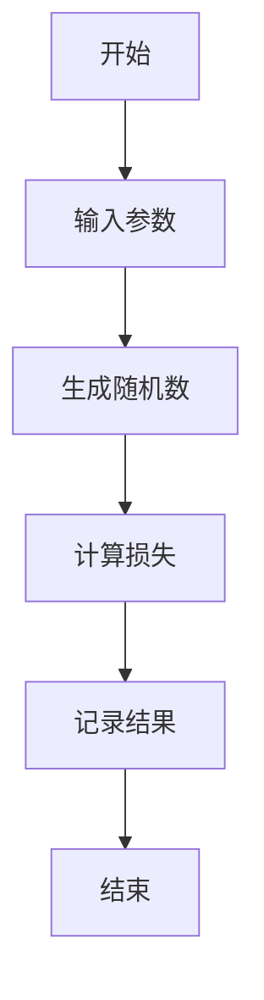
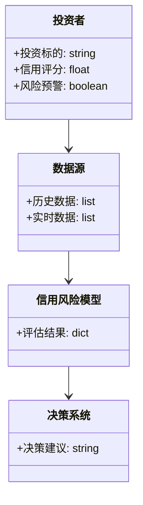
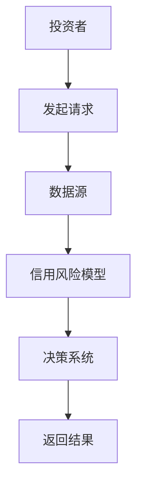

                 


# AI多智能体在价值投资中的信用风险分析

> 关键词：AI多智能体，信用风险分析，价值投资，金融系统，分布式计算

> 摘要：本文探讨AI多智能体技术在信用风险分析中的应用，特别是在价值投资领域。通过分析多智能体系统的结构与算法，结合实际案例，展示如何利用AI技术提升信用风险评估的效率与准确性，为投资者提供决策支持。

---

## 第一章：信用风险与价值投资的背景

### 1.1 信用风险的基本概念
- 1.1.1 信用风险的定义与特征
  - 信用风险是指债务人或交易对手未能履行其 contractual obligations 的可能性。
  - 主要特征包括传染性、系统性、多样性和不确定性。

- 1.1.2 信用风险的分类与影响
  - 分类：主权风险、企业风险、零售风险、交易对手风险。
  - 影响：可能导致金融机构的财务损失，影响市场稳定性。

- 1.1.3 信用风险在金融领域的应用
  - 信用评级、贷款审批、投资决策等场景。

### 1.2 价值投资的基本原理
- 1.2.1 价值投资的核心理念
  - 寻找被市场低估的投资标的，长期持有，等待价值回归。
  - 核心思想：安全边际、内在价值、市场先生。

- 1.2.2 价值投资与信用风险的关系
  - 信用风险是价值投资中不可忽视的风险之一，特别是在投资债券或其他固定收益产品时。

- 1.2.3 信用风险在价值投资中的重要性
  - 正确评估信用风险可以避免重大损失，提高投资组合的稳定性。

### 1.3 AI多智能体系统的基本概念
- 1.3.1 多智能体系统的定义与特点
  - 多智能体系统是由多个相互作用的智能体组成的分布式系统，每个智能体都有自己的目标和决策机制。

- 1.3.2 多智能体系统在金融领域的应用
  - 信用评分、风险预警、投资决策支持等。

- 1.3.3 AI多智能体系统的优势与挑战
  - 优势：高并发处理、分布式计算、自我学习。
  - 挑战：系统复杂性、数据隐私、协同决策的难度。

---

## 第二章：AI多智能体系统的核心原理

### 2.1 多智能体系统的组成与结构
- 2.1.1 实体关系图分析
  - 使用 Mermaid 绘制的实体关系图展示了投资者、投资标的、信用评级机构等之间的关系。


- 2.1.2 系统的层次结构
  - 分层设计：数据层、模型层、决策层。

- 2.1.3 实体间的交互关系
  - 投资者通过决策系统与投资标的交互，依赖信用评级机构和数据源提供支持。

### 2.2 AI多智能体系统的属性特征对比
- 2.2.1 核心概念与属性对比表
  | 概念 | 特性 | 说明 |
  |------|------|------|
  | 智能体 | 独立性 | 每个智能体独立决策 |
  | 系统 | 分布式 | 多个智能体协同工作 |
  | 算法 | 自适应 | 能够根据环境变化调整策略 |

- 2.2.2 系统的可扩展性与可维护性
  - 可扩展性：通过增加智能体数量扩展系统能力。
  - 可维护性：模块化设计便于维护和升级。

- 2.2.3 系统的实时性与响应速度
  - 实时性：快速处理数据，及时反馈决策。
  - 响应速度：优化算法减少处理时间。

---

## 第三章：信用风险分析的算法原理

### 3.1 信用风险分析的基本算法
- 3.1.1 蒙特卡洛模拟
  - 通过随机模拟方法评估信用风险。
  - 使用 Mermaid 绘制的流程图展示模拟步骤。



- 3.1.2 信用评分模型
  - 使用机器学习算法（如逻辑回归、随机森林）训练信用评分模型。

- 3.1.3 风险价值模型
  - 计算在给定置信水平下的潜在损失。

### 3.2 AI多智能体系统的算法实现
- 3.2.1 多智能体协作算法
  - 使用分布式计算技术实现智能体之间的协作。

- 3.2.2 分布式计算与并行处理
  - 通过并行计算提高系统的处理能力。

- 3.2.3 自适应学习算法
  - 系统能够根据新的数据自适应调整模型参数。

### 3.3 信用风险分析的数学模型
- 3.3.1 概率分布模型
  $$P(x) = \frac{1}{\sqrt{2\pi\sigma^2}} e^{-\frac{(x-\mu)^2}{2\sigma^2}}$$

- 3.3.2 损失模型
  $$\text{损失} = \sum_{i=1}^{n} \text{违约概率} \times \text{损失金额}$$

---

## 第四章：系统分析与架构设计

### 4.1 问题场景介绍
- 投资者需要实时监控投资标的的信用风险，做出及时的决策。

### 4.2 项目介绍
- 开发一个基于AI多智能体的信用风险分析系统，支持分布式计算和实时监控。

### 4.3 系统功能设计
- 使用 Mermaid 绘制的领域模型类图展示系统功能模块。



### 4.4 系统架构设计
- 使用 Mermaid 绘制的系统架构图展示模块之间的关系。


### 4.5 系统接口设计
- RESTful API 接口：提供数据查询、模型评估、决策建议等功能。

### 4.6 系统交互流程图
- 使用 Mermaid 绘制的交互流程图展示用户与系统的交互过程。



---

## 第五章：项目实战

### 5.1 环境安装
- 安装 Python、TensorFlow、Keras、Flask 等开发工具。

### 5.2 核心代码实现
- 使用 Python 实现信用风险模型的训练与评估。

```python
import numpy as np
from sklearn import linear_model

# 训练信用评分模型
model = linear_model.LogisticRegression()
model.fit(X_train, y_train)

# 预测信用评分
y_pred = model.predict(X_test)
```

### 5.3 代码应用解读与分析
- 解释代码的功能和实现细节，分析模型的性能。

### 5.4 实际案例分析
- 使用具体的投资案例展示系统如何进行信用风险分析和决策。

### 5.5 项目小结
- 总结项目的实现过程，提出改进建议。

---

## 第六章：最佳实践与小结

### 6.1 注意事项
- 数据隐私保护、系统稳定性、算法的可解释性。

### 6.2 小结
- 总结全文内容，强调AI多智能体在信用风险分析中的重要性。

### 6.3 拓展阅读
- 推荐相关书籍和论文，供读者深入学习。

---

以上是文章的完整目录结构和内容概要，涵盖了从理论到实践的各个方面，适合技术背景的读者阅读和理解。

