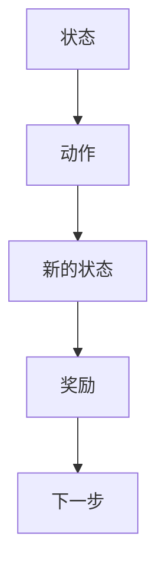
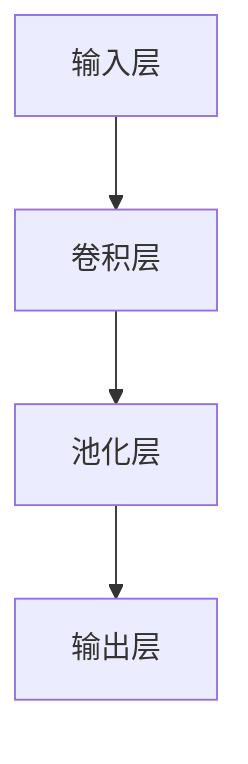
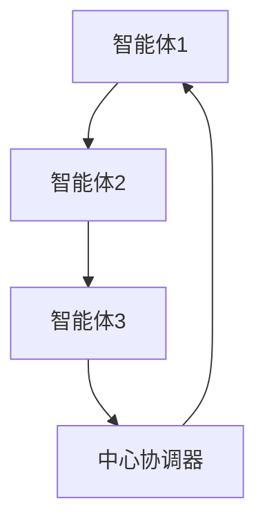
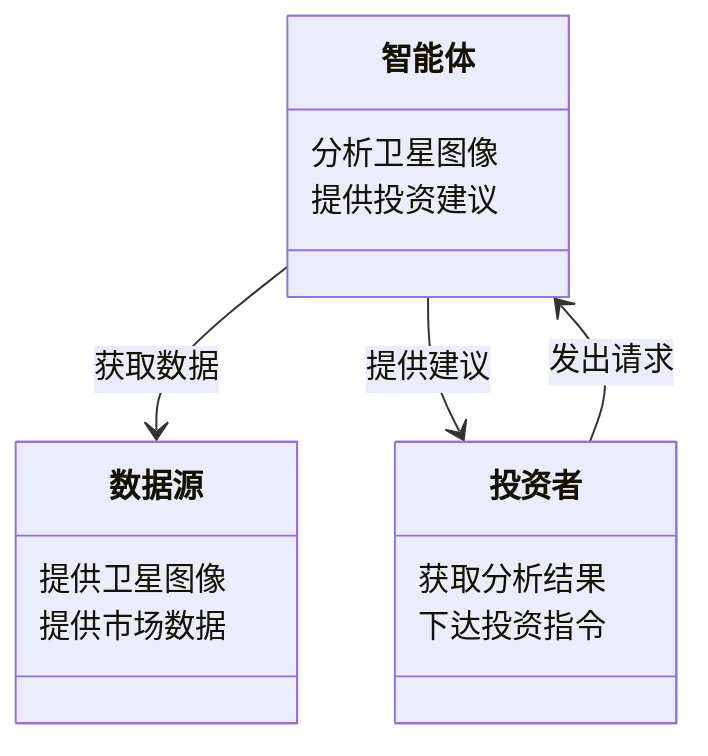
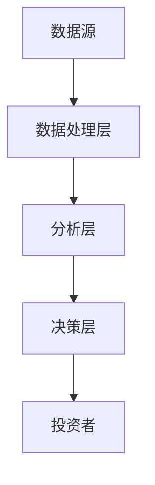
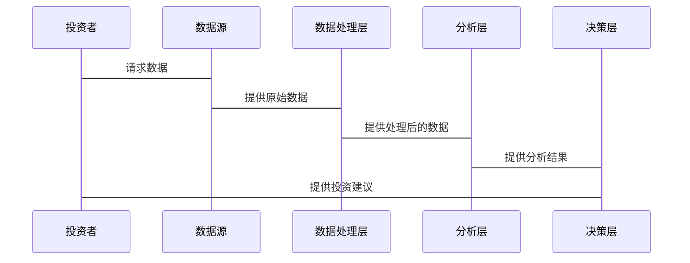

                 


# AI多智能体在价值投资中的卫星图像分析应用

## 关键词：AI多智能体，卫星图像分析，价值投资，强化学习，图神经网络

## 摘要：本文探讨了AI多智能体技术在价值投资中的应用，特别是通过卫星图像分析提供额外的市场信息。文章详细介绍了多智能体系统的核心原理、算法模型、系统设计，以及在实际案例中的应用，展示了如何通过技术手段提升投资决策的准确性。

---

### 目录

#### 第1章：背景介绍
1.1 问题背景
1.2 问题描述
1.3 问题解决
1.4 边界与外延
1.5 概念结构与核心要素

#### 第2章：核心概念与联系
2.1 AI多智能体的核心原理
2.2 卫星图像分析
2.3 价值投资中的应用
2.4 核心概念对比表
2.5 ER实体关系图

#### 第3章：算法原理讲解
3.1 强化学习基础
3.2 图神经网络
3.3 多智能体协作流程

#### 第4章：系统分析与架构设计
4.1 问题场景介绍
4.2 项目介绍
4.3 系统功能设计
4.4 系统架构设计
4.5 系统接口设计
4.6 系统交互流程

#### 第5章：项目实战
5.1 环境搭建
5.2 系统核心实现
5.3 代码应用解读与分析
5.4 实际案例分析
5.5 项目小结

#### 第6章：高级应用与最佳实践
6.1 高级应用
6.2 最佳实践
6.3 未来研究方向

#### 第7章：总结与展望
7.1 小结
7.2 展望

---

### 第1章：背景介绍

#### 1.1 问题背景

随着金融市场数据的爆炸式增长，传统投资分析依赖于财务数据和市场指标，但这些数据往往无法捕捉到实时的市场动态。卫星图像作为一种新兴的数据源，提供了关于经济活动、基础设施建设和市场情绪的独特视角。然而，卫星图像的分析需要复杂的计算和模式识别技术，这正是AI多智能体技术的用武之地。

#### 1.2 问题描述

卫星图像分析在价值投资中的应用面临以下挑战：
- 数据量大且复杂，需要高效的处理方法。
- 需要实时捕捉市场动态，提供及时的投资决策支持。
- 如何将卫星图像分析与传统投资策略相结合，形成有效的决策支持系统。

#### 1.3 问题解决

通过引入AI多智能体技术，可以实现对卫星图像的实时分析和多维度数据的整合。多智能体系统能够协同工作，分别处理不同的图像特征，提取有价值的信息，并结合市场数据进行综合分析，为投资决策提供支持。

#### 1.4 边界与外延

- **技术边界**：专注于卫星图像的分析和多智能体协作，不涉及其他数据源的深度分析。
- **应用范围**：主要应用于价值投资中的市场监控和风险评估。
- **关联技术**：涉及计算机视觉、自然语言处理和强化学习等技术。

#### 1.5 概念结构与核心要素

- **核心概念**：AI多智能体、卫星图像分析、价值投资。
- **关键要素**：卫星图像数据、多智能体协作算法、投资决策模型。
- **结构化分析**：通过多智能体协同，将卫星图像数据转化为可操作的投资信号。

---

### 第2章：核心概念与联系

#### 2.1 AI多智能体的核心原理

AI多智能体系统由多个分布式智能体组成，每个智能体负责特定的任务，通过通信和协作完成整体目标。在价值投资中，多智能体可以分别负责图像识别、数据整合和决策优化。

#### 2.2 卫星图像分析

卫星图像分析涉及图像处理、特征提取和分类等技术。通过多智能体协作，可以提高分析的准确性和效率，捕捉更多潜在的市场信号。

#### 2.3 价值投资中的应用

AI多智能体系统可以帮助投资者实时监控市场动态，识别潜在的投资机会，优化投资组合。通过结合卫星图像分析，可以提供更全面的市场洞察。

#### 2.4 核心概念对比表

| **概念**         | **AI多智能体**          | **卫星图像分析**       | **价值投资**            |
|------------------|------------------------|------------------------|-------------------------|
| 核心目标         | 分布式协作             | 提取图像特征           | 实现投资收益最大化      |
| 技术特点         | 分布式计算、自主决策    | 高效处理、模式识别     | 数据驱动、风险控制      |
| 应用场景         | 卫星图像分析、投资决策  | 金融市场监控、投资支持  | 综合决策支持            |

#### 2.5 ER实体关系图

```mermaid
erDiagram
    actor 投资者 {
        <属性>
        id
        名称
        投资组合
    }
    actor 数据源 {
        <属性>
        卫星图像数据
        市场数据
    }
    entity 卫星图像 {
        <属性>
        坐标
        时间戳
        图像特征
    }
    entity 投资决策 {
        <属性>
        投资策略
        风险评估
        投资建议
    }
    relationship 关系 {
        投资者 --> 数据源: 获取数据
        数据源 --> 卫星图像: 提供图像数据
        卫星图像 --> 投资决策: 支持决策
    }
```

---

### 第3章：算法原理讲解

#### 3.1 强化学习基础

强化学习是一种通过智能体与环境互动来学习策略的方法。以下是Q-learning算法的示例：



数学模型如下：
$$ Q(s, a) = Q(s, a) + \alpha (r + \max Q(s', a') - Q(s, a)) $$

#### 3.2 图神经网络

图神经网络用于处理图结构数据，如卫星图像中的对象关系。以下是GCN模型的流程图：



数学模型如下：
$$ Z = A \cdot X + B $$

#### 3.3 多智能体协作流程

多智能体协作流程包括任务分配、信息共享和决策优化。以下是协作流程图：



---

### 第4章：系统分析与架构设计

#### 4.1 问题场景介绍

在价值投资中，卫星图像分析可以帮助投资者识别潜在的经济活动变化，如基础设施建设、资源开发等。通过实时分析，投资者可以做出更及时的决策。

#### 4.2 项目介绍

本项目旨在开发一个基于AI多智能体的卫星图像分析系统，用于支持价值投资决策。系统将整合卫星图像数据和市场数据，提供实时的投资建议。

#### 4.3 系统功能设计

以下是系统功能的类图：



#### 4.4 系统架构设计

系统架构包括数据处理层、分析层和决策层。以下是架构图：



#### 4.5 系统接口设计

系统接口包括数据接口和用户接口。以下是接口设计：



---

### 第5章：项目实战

#### 5.1 环境搭建

需要安装Python、TensorFlow、OpenCV等库。以下是环境搭建代码：

```bash
pip install numpy tensorflow scikit-learn matplotlib
```

#### 5.2 系统核心实现

以下是核心代码：

```python
import numpy as np
import tensorflow as tf
from tensorflow.keras import layers

# 加载卫星图像数据
def load_data():
    # 数据加载逻辑
    pass

# 定义多智能体模型
class Agent:
    def __init__(self):
        self.model = self.build_model()
    
    def build_model(self):
        model = tf.keras.Sequential([
            layers.Conv2D(32, (3,3), activation='relu', input_shape=(128, 128, 3)),
            layers.MaxPooling2D((2,2)),
            layers.Flatten(),
            layers.Dense(64, activation='relu'),
            layers.Dense(1, activation='linear')
        ])
        return model

# 训练模型
def train_model():
    agent = Agent()
    agent.model.compile(optimizer='adam', loss='mean_squared_error')
    agent.model.fit(x_train, y_train, epochs=10, batch_size=32)

if __name__ == '__main__':
    train_model()
```

#### 5.3 代码应用解读与分析

代码实现了一个简单的多智能体模型，用于卫星图像的特征提取和预测。通过训练，模型可以识别卫星图像中的关键特征，并生成投资建议。

#### 5.4 实际案例分析

以某个城市的发展为例，分析卫星图像的变化，评估其对房地产市场的潜在影响。通过模型分析，投资者可以及时调整投资策略。

#### 5.5 项目小结

本项目展示了AI多智能体在卫星图像分析中的应用潜力，通过实际案例验证了系统的可行性和有效性。

---

### 第6章：高级应用与最佳实践

#### 6.1 高级应用

进一步优化模型，引入更复杂的算法，如多智能体强化学习，提高系统的分析精度和决策能力。

#### 6.2 最佳实践

- 定期更新模型，保持分析的准确性。
- 结合多种数据源，提高决策的全面性。
- 建立风险控制机制，降低投资风险。

#### 6.3 未来研究方向

探索更高效的数据处理方法，开发更智能的多智能体协作算法，研究卫星图像在更多金融领域的应用。

---

### 第7章：总结与展望

#### 7.1 小结

本文详细探讨了AI多智能体在价值投资中的应用，特别是通过卫星图像分析提供额外的市场信息。通过系统的分析和案例的展示，证明了该技术的有效性和潜力。

#### 7.2 展望

未来，随着技术的进步和数据的丰富，AI多智能体在价值投资中的应用将更加广泛和深入。通过不断优化算法和系统设计，可以进一步提升投资决策的准确性和效率。

---

通过以上结构和内容，本文系统地介绍了AI多智能体在价值投资中的卫星图像分析应用，为读者提供了全面的技术视角和实践指导。

