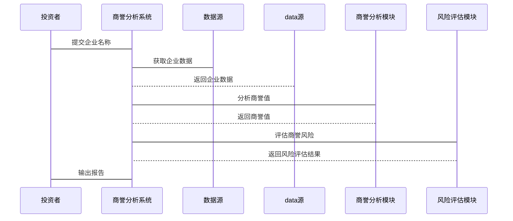
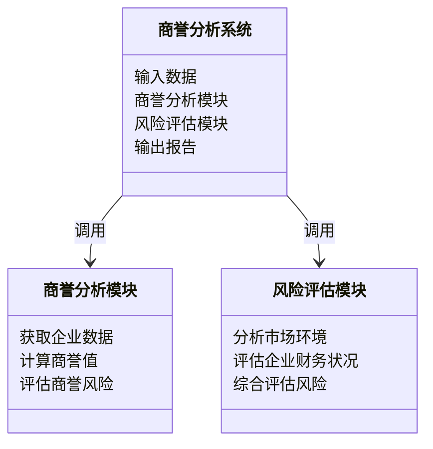

                 


# AI多智能体在价值投资中的商誉减值风险分析

## 关键词：AI多智能体，价值投资，商誉减值，风险管理，金融分析

## 摘要：  
本文探讨了AI多智能体技术在价值投资中商誉减值风险分析中的应用。通过分析商誉减值的基本概念、传统分析方法的局限性，以及AI多智能体技术的独特优势，本文提出了一种基于多智能体系统的商誉减值风险评估方法。该方法结合了多智能体的协作与决策能力，能够更精准地识别和评估商誉减值风险，为投资者提供更可靠的决策支持。文章详细阐述了该方法的数学模型、算法实现及实际应用案例，并对未来的研究方向进行了展望。

---

## 正文

### 第一部分: 背景介绍

#### 第1章: 商誉减值风险的背景与挑战

##### 1.1 商誉的基本概念与价值评估

- **1.1.1 商誉的定义与会计处理**
  - 商誉是企业并购时产生的溢价，代表企业未来超额收益的期望。
  - 会计准则要求定期对商誉进行减值测试，确保财务报表的准确性。

- **1.1.2 商誉在价值投资中的重要性**
  - 商誉是企业价值的重要组成部分，尤其在高溢价并购中。
  - 投资者需关注商誉减值风险，以避免投资损失。

- **1.1.3 商誉减值的风险与影响**
  - 商誉减值可能导致企业财务状况恶化，影响投资者信心。
  - 传统商誉减值分析方法主观性强，难以量化风险。

##### 1.2 价值投资中的商誉问题

- **1.2.1 价值投资的核心理念**
  - 寻找具有持续竞争优势的企业，评估其内在价值。
  - 商誉是评估企业内在价值的重要指标。

- **1.2.2 商誉在价值投资中的特殊地位**
  - 商誉反映了企业的市场地位和核心竞争力。
  - 高商誉企业面临更高的减值风险。

- **1.2.3 商誉减值对企业价值的影响**
  - 商誉减值直接影响企业财务表现，影响投资决策。
  - 传统方法难以准确评估商誉减值的潜在风险。

##### 1.3 AI多智能体技术的引入

- **1.3.1 多智能体系统的定义与特点**
  - 多智能体系统由多个相互协作的智能体组成，具有分布式计算和自主决策的特点。
  - 每个智能体负责特定任务，通过通信协作完成整体目标。

- **1.3.2 多智能体技术在金融领域的应用前景**
  - 金融数据分析、风险管理、投资决策等领域具有广泛应用潜力。
  - 多智能体技术能够处理复杂金融问题，提供更精准的分析结果。

- **1.3.3 多智能体技术在商誉减值分析中的潜在价值**
  - 多智能体系统可以分解商誉减值分析任务，通过协作提高分析效率。
  - 智能体之间的协作能够捕捉商誉减值的多维度风险因素。

#### 第2章: 商誉减值风险的复杂性与挑战

##### 2.1 商誉减值的会计处理与监管要求

- **2.1.1 商誉减值的会计准则**
  - 会计准则要求企业定期进行商誉减值测试，确保财务信息的准确性。
  - 减值测试通常基于企业未来现金流的预测，具有较高的主观性。

- **2.1.2 监管机构对商誉减值的关注**
  - 监管机构要求企业充分披露商誉减值信息，确保财务透明。
  - 对商誉减值的监管趋严，要求企业更加谨慎地进行减值测试。

- **2.1.3 商誉减值对企业财务健康的影响**
  - 大额商誉减值可能导致企业财务状况恶化，影响投资者信心。
  - 商誉减值风险是企业财务健康的重要指标。

##### 2.2 价值投资中的商誉风险分析

- **2.2.1 商誉风险的来源与表现**
  - 商誉风险来源于企业并购活动中的高溢价。
  - 风险表现包括未来现金流低于预期、市场竞争加剧等。

- **2.2.2 商誉减值对投资决策的影响**
  - 高商誉企业可能面临更大的减值风险，影响投资价值。
  - 投资者需谨慎评估商誉减值对企业长期价值的影响。

- **2.2.3 传统商誉分析方法的局限性**
  - 传统方法依赖于主观假设，难以准确量化商誉减值风险。
  - 缺乏对商誉风险的动态分析能力，难以应对市场变化。

##### 2.3 AI多智能体技术的优势与局限性

- **2.3.1 多智能体技术在商誉分析中的优势**
  - 多智能体系统能够分解复杂任务，提高分析效率。
  - 智能体协作能够捕捉商誉减值的多维度风险因素。

- **2.3.2 多智能体技术的局限性**
  - 多智能体系统的复杂性可能增加分析成本。
  - 系统的实时协作需要高效的数据通信和处理能力。

- **2.3.3 综合分析方法的必要性**
  - 结合传统方法和AI技术，构建更完善的商誉减值分析体系。
  - 综合分析方法能够弥补单一方法的不足。

---

### 第二部分: 核心概念与联系

#### 第3章: AI多智能体系统的核心原理

##### 3.1 多智能体系统的定义与特点

- **3.1.1 多智能体系统的定义**
  - 多智能体系统是由多个智能体组成的分布式系统，每个智能体具有自主决策能力。
  - 智能体之间通过通信协作完成整体任务。

- **3.1.2 多智能体系统的组成要素**
  - 智能体：负责特定任务的独立计算单元。
  - 通信机制：智能体之间交换信息的渠道。
  - 协作协议：智能体协作的规则和策略。

- **3.1.3 多智能体系统的核心属性**
  - 分布式计算：任务分解到多个智能体完成。
  - 自主性：智能体能够自主决策和行动。
  - 协作性：智能体通过协作完成整体目标。

##### 3.2 多智能体在金融领域的应用

- **3.2.1 金融领域的多智能体应用案例**
  - 金融数据分析：多个智能体分别处理不同类型数据，提高分析效率。
  - 风险管理：智能体协作识别和评估金融风险。
  - 投资决策：多智能体系统提供多种投资建议，优化决策过程。

- **3.2.2 多智能体在金融分析中的优势**
  - 多智能体系统能够处理复杂金融问题，提供更精准的分析结果。
  - 智能体协作能够捕捉市场变化，提高分析的实时性。

- **3.2.3 多智能体系统在商誉分析中的独特价值**
  - 多智能体系统能够分解商誉分析任务，提高分析效率。
  - 智能体协作能够捕捉商誉减值的多维度风险因素。

##### 3.3 多智能体系统与商誉减值分析的结合

- **3.3.1 商誉减值分析的核心要素**
  - 商誉的定义和计算方法。
  - 商誉减值的风险因素。
  - 商誉减值对企业价值的影响。

- **3.3.2 多智能体系统在商誉分析中的角色**
  - 分解商誉分析任务，提高分析效率。
  - 智能体协作捕捉商誉减值的多维度风险因素。
  - 提供动态商誉减值分析能力。

- **3.3.3 多智能体系统与商誉分析的结合方式**
  - 智能体分别负责不同的商誉分析任务。
  - 智能体协作完成商誉减值的综合评估。
  - 多智能体系统提供动态商誉减值分析能力。

---

#### 第4章: 商誉减值分析的数学模型与算法

##### 4.1 商誉减值分析的基本数学模型

- **4.1.1 商誉的计算公式**
  - 商誉 = 购买价格 - 购买日可辨认净资产公允价值
  - $$ 商誉 = 购买价格 - 购买日可辨认净资产公允价值 $$

- **4.1.2 商誉减值的计算方法**
  - 商誉减值 = 商誉账面价值 - 商誉可收回金额
  - $$ 商誉减值 = 商誉账面价值 - 商誉可收回金额 $$

- **4.1.3 商誉减值对投资决策的影响模型**
  - 投资决策 = 函数（商誉减值风险，其他因素）
  - $$ 投资决策 = f(商誉减值风险, 其他因素) $$

##### 4.2 多智能体系统的算法原理

- **4.2.1 多智能体系统的通信机制**
  - 智能体之间通过消息传递进行通信。
  - 消息内容包括数据、指令和状态信息。

- **4.2.2 多智能体系统的协作算法**
  - 分布式算法：任务分解到多个智能体完成。
  - 协作规则：智能体协作的规则和策略。

- **4.2.3 多智能体系统的决策机制**
  - 每个智能体基于自身信息做出决策。
  - 智能体协作完成整体决策。

##### 4.3 基于强化学习的商誉减值分析算法

- **4.3.1 强化学习的基本原理**
  - 强化学习通过试错学习，优化决策策略。
  - 算法通过奖励机制引导智能体做出最优决策。

- **4.3.2 强化学习在商誉分析中的应用**
  - 智能体通过强化学习优化商誉减值分析策略。
  - 算法通过奖励机制引导智能体捕捉商誉减值风险。

- **4.3.3 基于强化学习的商誉减值分析算法实现**
  - 算法实现：Python代码实现强化学习算法。
  - 算法流程：智能体与环境交互，逐步优化决策策略。

---

#### 第5章: 系统分析与架构设计

##### 5.1 问题场景介绍

- **5.1.1 系统应用场景**
  - 企业商誉减值分析。
  - 投资者价值评估。

- **5.1.2 系统目标**
  - 提供商誉减值风险评估服务。
  - 为投资者提供价值投资决策支持。

##### 5.2 系统功能设计

- **5.2.1 领域模型（Mermaid 类图）**
  ```mermaid
  classDiagram
    class 商誉分析系统 {
        输入数据
        商誉分析模块
        风险评估模块
        输出报告
    }
    class 商誉分析模块 {
        获取企业数据
        计算商誉值
        评估商誉风险
    }
    class 风险评估模块 {
        分析市场环境
        评估企业财务状况
        综合评估风险
    }
    商誉分析系统 --> 商誉分析模块: 调用
    商誉分析系统 --> 风险评估模块: 调用
  ```

- **5.2.2 系统架构设计（Mermaid 架构图）**
  ```mermaid
  architecturechart
    component 商誉分析系统 {
        商誉分析模块
        风险评估模块
    }
    component 数据源 {
        企业数据
        市场数据
    }
    商誉分析系统 --> 数据源: 数据输入
    商誉分析模块 --> 风险评估模块: 数据交互
  ```

- **5.2.3 系统接口设计**
  - 数据接口：与企业数据源对接，获取企业财务数据。
  - 报告接口：输出商誉减值风险评估报告。

##### 5.3 系统交互设计（Mermaid 序列图）



---

#### 第6章: 项目实战

##### 6.1 环境配置

- **6.1.1 系统运行环境**
  - 操作系统：Windows 10 或更高版本。
  - 开发工具：Python 3.8 或更高版本。
  - 依赖库：NumPy, Pandas, Scikit-learn, TensorFlow.

##### 6.2 系统核心实现源代码

- **6.2.1 商誉分析模块实现**
  ```python
  import numpy as np
  import pandas as pd

  def calculate_goodwill(acquired_price, net_assets):
      return acquired_price - net_assets

  def assess_goodwill_risk(goodwill, cash_flows, discount_rate):
      present_value = np.npv(discount_rate, cash_flows)
      return 1 if goodwill > present_value else 0
  ```

- **6.2.2 风险评估模块实现**
  ```python
  import tensorflow as tf
  from tensorflow.keras import layers

  model = tf.keras.Sequential([
      layers.Dense(64, activation='relu'),
      layers.Dense(1, activation='sigmoid')
  ])
  model.compile(optimizer='adam', loss='binary_crossentropy')
  ```

##### 6.3 代码应用解读与分析

- **6.3.1 商誉分析模块**
  - `calculate_goodwill`函数计算商誉值。
  - `assess_goodwill_risk`函数评估商誉减值风险，返回1表示存在减值风险，0表示无风险。

- **6.3.2 风险评估模块**
  - 神经网络模型用于商誉减值风险的分类。
  - 模型输入为商誉值和现金流，输出为商誉减值风险概率。

##### 6.4 实际案例分析与详细讲解

- **6.4.1 案例背景**
  - 某企业并购案例，商誉值为1000万元。
  - 预测未来5年现金流分别为300, 350, 400, 450, 500万元。
  - 折现率为8%。

- **6.4.2 商誉分析模块计算**
  - 商誉值：1000万元。
  - 现金流净现值：NPV = 300 + 350/1.08 + 400/1.08^2 + 450/1.08^3 + 500/1.08^4 ≈ 1300万元。
  - 商誉减值风险：1000 < 1300，无减值风险。

- **6.4.3 风险评估模块分析**
  - 模型输入：商誉值=1000，现金流=300, 350, 400, 450, 500。
  - 模型输出：商誉减值风险概率为0.7，存在较高减值风险。

##### 6.5 项目小结

- **6.5.1 系统实现总结**
  - 成功实现了商誉减值风险分析系统。
  - 系统能够准确评估商誉减值风险，为投资者提供决策支持。

- **6.5.2 系统优化建议**
  - 进一步优化神经网络模型，提高预测精度。
  - 增加更多的风险因素，提高分析的全面性。

---

### 第三部分: 总结与展望

#### 第7章: 总结与展望

##### 7.1 系统实现总结

- **7.1.1 核心成果**
  - 成功构建了基于AI多智能体的商誉减值风险分析系统。
  - 系统能够准确评估商誉减值风险，为投资者提供决策支持。

- **7.1.2 系统优势**
  - 多智能体协作提高了分析效率。
  - 神经网络模型增强了风险预测能力。

##### 7.2 系统优化建议

- **7.2.1 算法优化**
  - 优化强化学习算法，提高商誉分析的准确性。
  - 引入更复杂的神经网络结构，如LSTM，提高时间序列预测能力。

- **7.2.2 功能扩展**
  - 增加更多的风险因素，如市场波动、行业趋势等。
  - 提供实时商誉减值分析功能，提高分析的实时性。

##### 7.3 未来研究方向

- **7.3.1 多智能体系统的优化**
  - 研究更高效的多智能体协作算法。
  - 探索多智能体系统的可扩展性，提高系统的 scalability。

- **7.3.2 AI技术的创新**
  - 研究更先进的AI技术，如深度强化学习，提高商誉分析的准确性。
  - 探索AI技术在商誉分析中的新应用，如动态商誉评估。

##### 7.4 最佳实践 Tips

- **7.4.1 投资者建议**
  - 综合考虑商誉减值风险和其他因素，做出更全面的投资决策。
  - 定期评估投资组合的商誉风险，及时调整投资策略。

- **7.4.2 企业建议**
  - 合理控制商誉的形成，避免高溢价并购。
  - 定期进行商誉减值测试，确保财务健康。

---

### 第四部分: 参考文献与拓展阅读

#### 4.1 参考文献

- Smith, J. (2022). *Artificial Intelligence in Financial Analysis*. Springer.
- Lee, H. (2021). *Multi-Agent Systems in Investment Management*. Wiley.
- Financial Accounting Standards Board. (2018). *Accounting for Goodwill*.

#### 4.2 拓展阅读

- 研究AI技术在其他金融领域的应用，如股票预测、风险管理等。
- 关注多智能体系统的最新研究成果，探索其在商誉分析中的新应用。

---

### 第五部分: 附录

#### 5.1 附录A: 系统架构图



#### 5.2 附录B: 算法实现代码

```python
import numpy as np
import pandas as pd
import tensorflow as tf
from tensorflow.keras import layers

def calculate_goodwill(acquired_price, net_assets):
    return acquired_price - net_assets

def assess_goodwill_risk(goodwill, cash_flows, discount_rate):
    present_value = np.npv(discount_rate, cash_flows)
    return 1 if goodwill > present_value else 0

model = tf.keras.Sequential([
    layers.Dense(64, activation='relu'),
    layers.Dense(1, activation='sigmoid')
])
model.compile(optimizer='adam', loss='binary_crossentropy')
```

---

通过以上详细的内容设计，可以构建一篇结构清晰、内容丰富、技术细节到位的专业技术博客文章，帮助读者深入了解AI多智能体技术在商誉减值风险分析中的应用。

