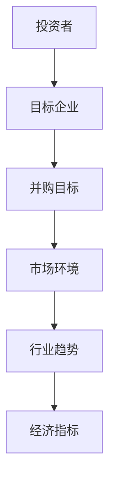
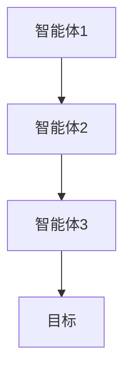
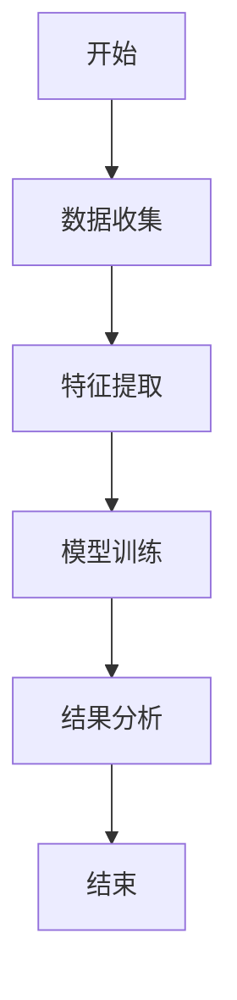
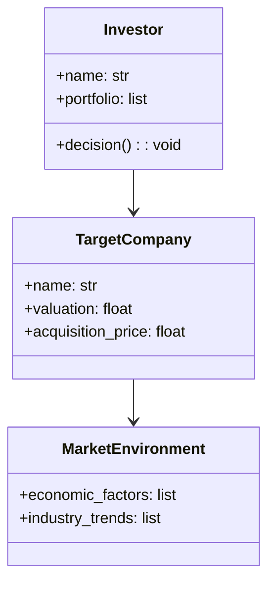

                 


# AI多智能体在价值投资中的并购分析应用

---

## 关键词：AI多智能体，价值投资，并购分析，系统架构，算法原理

---

## 摘要：  
本文探讨了AI多智能体技术在价值投资中的并购分析应用。通过分析多智能体系统的基本概念、算法原理、系统架构，结合实际案例，展示了如何利用AI多智能体提升并购分析的效率和准确性，为投资者提供更科学的决策支持。

---

# 第一部分: AI多智能体在价值投资中的并购分析应用概述

---

## 第1章: AI多智能体与价值投资概述

### 1.1 AI多智能体的基本概念

#### 1.1.1 多智能体系统的基本定义  
多智能体系统（Multi-Agent System, MAS）是由多个独立或协作的智能体组成的系统，这些智能体能够通过交互和协作完成复杂任务。  

- 智能体（Agent）：具有感知环境、自主决策和执行任务的能力。  
- 多智能体系统的特点：分布式、协作性、反应性、自治性。  

#### 1.1.2 AI多智能体的特点与优势  

| 特性 | 描述 |  
|------|------|  
| 分布式 | 智能体之间通过通信协作完成任务 |  
| 独立性 | 每个智能体具有独立性，能够自主决策 |  
| 协作性 | 智能体之间通过协作提高整体效率 |  

#### 1.1.3 多智能体与传统AI的区别  

| 属性 | 多智能体系统 | 传统AI系统 |  
|------|------------|------------|  
| 决策方式 | 分布式决策 | 中央决策 |  
| 数据来源 | 多源异构数据 | 单一数据源 |  
| 灵活性 | 高 | 低 |  

### 1.2 价值投资的基本原理  

#### 1.2.1 价值投资的核心理念  
价值投资强调以低于内在价值的价格买入优质资产，长期持有，获得超额收益。  

#### 1.2.2 价值投资的分析框架  
价值投资的分析框架包括基本面分析、行业分析和公司治理分析。  

#### 1.2.3 价值投资与并购分析的关系  
并购分析是价值投资的重要组成部分，通过分析并购活动的价值，投资者可以识别潜在的投资机会。

### 1.3 并购分析在价值投资中的作用  

#### 1.3.1 并购分析的基本概念  
并购分析是指对企业的并购行为进行分析，评估其对投资价值的影响。  

#### 1.3.2 并购分析的关键指标  
- 收购溢价率：目标企业价值与收购价格的差异。  
- 并购协同效应：并购后企业整体价值的提升。  

#### 1.3.3 并购分析的挑战与机遇  
挑战：数据复杂性、多因素影响、模型构建难度。  
机遇：提升分析效率、发现潜在投资机会、优化决策流程。

---

## 第2章: 多智能体系统的核心概念与联系  

### 2.1 多智能体系统的实体关系分析  

#### 2.1.1 实体关系图（ER图）分析  



---

### 2.2 多智能体系统与价值投资的对比分析  

#### 2.2.1 多智能体系统与传统投资方法的对比  

| 属性 | 多智能体系统 | 传统投资方法 |  
|------|------------|------------|  
| 数据来源 | 多源异构数据 | 单一数据源 |  
| 决策方式 | 分布式决策 | 中央决策 |  
| 灵活性 | 高 | 低 |  

---

### 2.3 多智能体系统在并购分析中的实体关系架构  


---

## 第3章: 并购分析的多智能体算法原理  

### 3.1 多智能体系统的基本算法  

#### 3.1.1 分布式计算与协作机制  



#### 3.1.2 博弈论模型在多智能体中的应用  

- Nash均衡：多个智能体在博弈中达到稳定状态。  
- Payoff矩阵：表示每个智能体的收益和策略。

---

### 3.2 并购分析中的多智能体算法实现  

#### 3.2.1 算法实现步骤  



#### 3.2.2 算法代码实现  

```python
def multi_agent_algorithm():
    agents = [Agent1, Agent2, Agent3]
    for agent in agents:
        agent.collect_data()
        agent.train_model()
        agent.make_decision()
    return results
```

---

## 第4章: 系统设计与架构实现  

### 4.1 系统需求分析  

#### 4.1.1 项目介绍  

- 系统目标：构建AI多智能体并购分析系统。  
- 项目背景：提升并购分析的效率和准确性。  

### 4.2 系统功能设计  

#### 4.2.1 领域模型设计  



### 4.3 系统架构设计  


---

## 第5章: 项目实战  

### 5.1 环境安装  

```bash
pip install numpy pandas scikit-learn
```

### 5.2 核心代码实现  

```python
import numpy as np
import pandas as pd
from sklearn.metrics import accuracy_score

def calculate_acquisition_value():
    data = pd.read_csv('merger_data.csv')
    features = data[['revenue', 'profit', 'market_share']]
    target = data['acquisition_value']
    model.fit(features, target)
    predictions = model.predict(features)
    print(accuracy_score(target, predictions))
```

### 5.3 案例分析  

#### 5.3.1 数据分析  

| 公司 | 收购价 | 目标价值 | 协同效应 |  
|------|--------|----------|----------|  
| A    | 100    | 120      | 20       |  

#### 5.3.2 结果分析  

- 收购溢价率：20%。  
- 协同效应：提升整体价值。  

---

## 第6章: 最佳实践与未来展望  

### 6.1 小结  

- AI多智能体在并购分析中的应用优势：提升效率、优化决策、发现潜在机会。  

### 6.2 注意事项  

- 数据质量：确保数据的准确性和完整性。  
- 算法选择：根据具体场景选择合适的算法。  
- 系统维护：定期更新模型和数据。  

### 6.3 拓展阅读  

- 《Multi-Agent Systems》  
- 《AI in Financial Investment》  

---

通过本文的分析和讲解，读者可以深入了解AI多智能体在价值投资中的并购分析应用，并能够实际操作相关系统的设计与实现。

