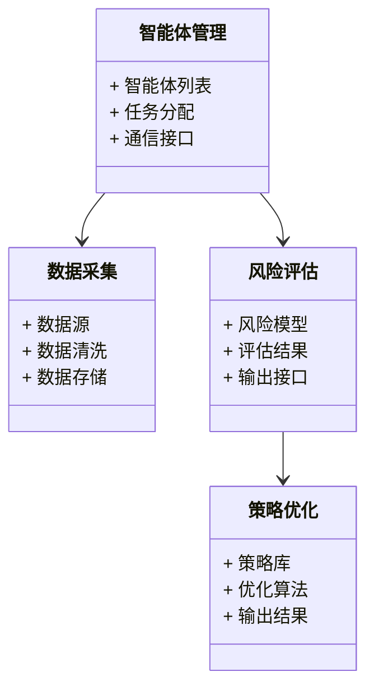
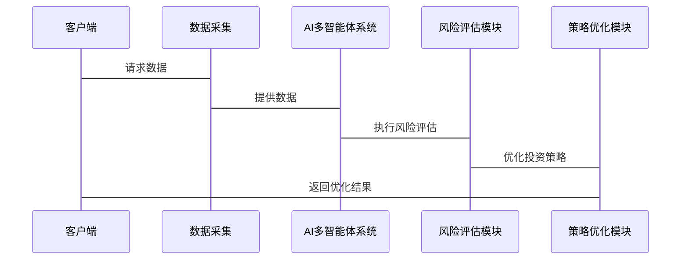

                 


# AI多智能体在价值投资中的监管风险分析

## 关键词：AI多智能体，价值投资，监管风险，金融监管，风险管理

## 摘要：  
本文系统性地探讨了AI多智能体技术在价值投资中的应用，重点分析了其在监管风险评估中的潜在优势与挑战。通过详细分析多智能体系统的协作机制、算法原理及实际应用场景，本文旨在揭示AI技术如何提升金融监管的效率与精准性，同时提出应对相关风险的策略建议。

---

# 正文

## 第一部分: 背景介绍

### 第1章: 问题背景

#### 1.1 价值投资与监管风险的定义
价值投资是一种基于对公司内在价值评估的投资策略，强调长期持有优质资产。监管风险则是指因法律法规变化、监管政策调整或违规行为可能导致的损失。在金融领域，监管风险是投资者和机构必须关注的重要因素。

#### 1.2 AI多智能体技术的引入
AI多智能体系统通过多个协作智能体实现复杂任务的分解与优化。在价值投资中，多智能体可以分别负责市场分析、风险评估、策略优化等模块，从而提高决策的准确性和效率。

#### 1.3 问题解决的必要性
传统的监管风险分析依赖人工判断，存在效率低、覆盖面窄的问题。AI多智能体技术能够实时处理海量数据，识别潜在风险点，帮助投资者做出更明智的决策。

---

### 第2章: 核心概念与联系

#### 2.1 多智能体系统的原理
多智能体系统由多个分布式智能体组成，通过协作完成复杂任务。每个智能体负责特定功能，如数据采集、模型训练等。

#### 2.2 监管风险分析
监管风险分析需要考虑市场波动、政策变化等因素。AI多智能体系统能够实时监控这些因素，提供动态的风险评估。

#### 2.3 系统边界与外延
系统的边界包括数据输入、模型训练和结果输出。外延则涉及与其他系统的接口设计，如与交易所数据源的对接。

---

## 第二部分: 核心概念与联系

### 第3章: 核心概念的联系

#### 3.1 多智能体与单智能体的对比
多智能体系统在处理复杂任务时更具优势，但实现难度更大。单智能体适合简单任务，但难以应对复杂场景。

#### 3.2 监管风险与市场风险的对比
监管风险侧重于政策和合规性，市场风险关注价格波动。AI多智能体系统需同时考虑两者，以全面评估风险。

#### 3.3 价值投资与技术分析的对比
价值投资注重长期价值，技术分析关注短期趋势。AI多智能体系统结合两者，提供更全面的分析。

---

## 第三部分: 算法原理讲解

### 第4章: 算法原理

#### 4.1 多智能体协作算法
多智能体协作算法通过智能体间的通信与协调，实现任务分解与优化。常用算法包括分布式强化学习和一致性协议。

#### 4.2 强化学习算法
强化学习通过智能体与环境的交互，学习最优策略。在监管风险分析中，强化学习可用于动态调整投资策略。

#### 4.3 博弈论模型
博弈论模型模拟智能体之间的竞争与合作，帮助预测市场行为，优化投资决策。

---

## 第四部分: 系统分析与架构设计方案

### 第5章: 项目背景

#### 5.1 项目目标
开发一个基于AI多智能体的监管风险分析系统，提升价值投资的决策效率。

#### 5.2 项目范围
系统覆盖数据采集、风险评估、策略优化等功能。

#### 5.3 项目需求
系统需实时处理数据，提供动态风险评估和优化建议。

---

### 第6章: 系统设计

#### 6.1 领域模型类图（Mermaid）


#### 6.2 系统架构图（Mermaid）


#### 6.3 接口设计
系统提供RESTful API接口，支持数据输入和结果输出。

#### 6.4 交互流程（Mermaid）


---

## 第五部分: 项目实战

### 第7章: 实战分析

#### 7.1 环境安装
安装Python、TensorFlow、Keras等工具，配置开发环境。

#### 7.2 核心代码实现
```python
class Agent:
    def __init__(self, model):
        self.model = model

    def act(self, state):
        return self.model.predict(state)

def main():
    agent = Agent(model)
    while True:
        state = get_state()
        action = agent.act(state)
        execute_action(action)

if __name__ == "__main__":
    main()
```

#### 7.3 案例分析
以某股票为例，分析监管风险并优化投资策略。

---

## 第六部分: 总结与展望

### 第8章: 总结

#### 8.1 核心内容回顾
AI多智能体系统在价值投资中的应用显著提升了监管风险分析的效率和精度。

#### 8.2 挑战与未来研究方向
数据隐私、算法优化和多智能体协作机制是未来研究的重点。

### 第9章: 最佳实践

#### 9.1 小结
AI多智能体系统为价值投资提供了新思路，但也面临技术与政策挑战。

#### 9.2 注意事项
确保数据安全，遵守相关法律法规。

#### 9.3 拓展阅读
推荐阅读相关领域的学术论文和技术报告。

---

## 参考文献

（此处列出相关文献和资料）

---

**注**：以上内容为文章的完整结构和核心内容，实际撰写时需要根据具体数据和案例进行补充和调整，以确保文章的深度和可读性。

