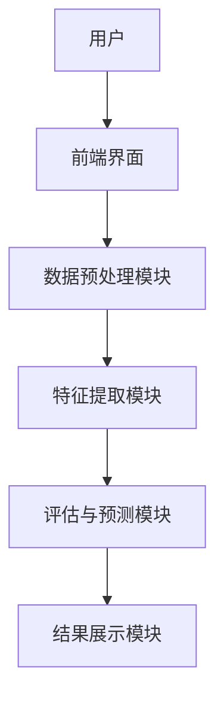
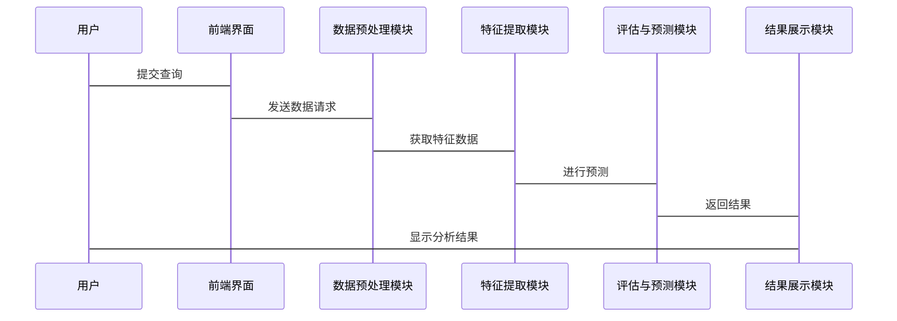

                 


# AI多智能体在价值投资中的知识产权分析

> 关键词：AI多智能体、价值投资、知识产权分析、金融、多智能体系统

> 摘要：本文探讨了AI多智能体技术在价值投资中的应用，特别是其在知识产权分析中的作用。文章从背景、核心概念、算法原理、系统架构到实际案例，全面分析了AI多智能体在知识产权分析中的优势和实现方式。

---

## 第一部分: AI多智能体与价值投资的背景介绍

### 第1章: AI多智能体与价值投资概述

#### 1.1 AI多智能体的基本概念
##### 1.1.1 多智能体系统的基本定义
多智能体系统（Multi-Agent System, MAS）是由多个相互作用的智能体组成的系统。每个智能体都是一个独立的实体，能够感知环境、做出决策并采取行动。多智能体系统广泛应用于分布式计算、机器人技术和金融等领域。

##### 1.1.2 AI多智能体的核心特点
- **分布式性**：智能体之间通过分布式协作完成任务。
- **自主性**：每个智能体能够独立决策。
- **反应性**：智能体能够实时感知环境并做出反应。
- **协作性**：智能体之间通过通信和协调共同完成目标。

##### 1.1.3 多智能体与单智能体的对比分析
| 特性       | 多智能体系统               | 单智能体系统               |
|------------|--------------------------|--------------------------|
| 系统结构   | 分布式，多个智能体协作     | 集中式，单一智能体决策     |
| 处理能力   | 处理复杂任务，提高效率     | 处理能力有限               |
| 灵活性     | 系统具有较强的容错性和适应性| 系统结构较为 rigid         |

#### 1.2 价值投资的基本原理
##### 1.2.1 价值投资的定义与核心理念
价值投资是一种投资策略，强调以低于内在价值的价格购买优质资产。其核心理念是通过分析公司的基本面，如财务状况、行业地位和盈利能力，来判断其股票的内在价值。

##### 1.2.2 价值投资的关键要素
- **公司基本面**：包括收入、利润、资产负债表等。
- **行业地位**：公司在行业中的竞争地位。
- **管理层能力**：公司管理团队的能力和决策。
- **未来前景**：公司的成长潜力和市场前景。

##### 1.2.3 价值投资在现代金融中的地位
价值投资是金融投资的重要策略之一，尤其在市场波动较大时，其长期稳定的投资理念更具吸引力。然而，传统价值投资依赖人工分析，效率低下且容易受到主观因素影响。

#### 1.3 AI多智能体在价值投资中的应用背景
##### 1.3.1 传统价值投资的局限性
- **数据量大**：需要分析大量公司数据，人工分析效率低。
- **主观性**：分析结果受分析师主观判断影响。
- **复杂性**：市场环境复杂多变，人工分析难以捕捉所有信息。

##### 1.3.2 AI技术在金融领域的潜力
- **数据处理能力**：AI能够快速处理大量非结构化数据。
- **模式识别**：AI可以通过机器学习发现数据中的潜在模式。
- **实时性**：AI能够实时分析市场动态，提供及时的投资建议。

##### 1.3.3 多智能体在复杂金融环境中的优势
- **分布式协作**：多智能体能够协同分析不同维度的市场信息。
- **智能体分工**：每个智能体专注于特定任务，提高整体效率。
- **适应性**：多智能体系统能够快速适应市场变化。

---

### 第2章: 知识产权分析的理论基础

#### 2.1 知识产权的基本概念
##### 2.1.1 知识产权的定义与分类
知识产权（Intellectual Property, IP）是指人们对智力劳动成果所享有的权利，包括专利权、商标权、版权等。知识产权在金融分析中，尤其是价值投资中，具有重要的参考价值。

##### 2.1.2 知识产权的主要类型
- **专利权**：保护发明的独占权。
- **商标权**：保护品牌标识的专用权。
- **版权**：保护文学、艺术和科学作品的创作者权益。

##### 2.1.3 知识产权在金融分析中的作用
- **评估公司价值**：知识产权是公司核心资产之一，影响其市场价值。
- **竞争优势分析**：强大的知识产权储备是公司在行业中的竞争优势。
- **风险评估**：知识产权纠纷可能对公司造成法律和经济损失。

#### 2.2 知识产权分析的核心要素
##### 2.2.1 知识产权的评估维度
- **数量**：公司拥有的专利数量。
- **质量**：专利的技术先进性和市场应用前景。
- **分布**：专利在不同技术领域的分布情况。
- **法律状态**：专利的有效期和法律纠纷情况。

##### 2.2.2 知识产权的法律框架
- **专利法**：规定专利的申请、保护和使用。
- **商标法**：规定商标的注册、保护和使用。
- **版权法**：规定作品的保护和使用。

##### 2.2.3 知识产权的经济价值
- **直接价值**：知识产权可以带来直接的经济收益。
- **间接价值**：知识产权增强了公司的市场竞争力和品牌价值。

#### 2.3 知识产权分析的挑战与机遇
##### 2.3.1 知识产权分析的复杂性
- **数据分散**：知识产权数据分布在不同数据库和法律文件中。
- **专业性高**：分析需要专业的法律和行业知识。
- **动态变化**：知识产权的法律状态和市场价值不断变化。

##### 2.3.2 AI技术在知识产权分析中的优势
- **自动化处理**：AI能够自动提取和分析知识产权数据。
- **模式识别**：AI可以通过自然语言处理技术分析专利文件和法律文档。
- **预测能力**：AI可以预测知识产权的市场价值和法律风险。

##### 2.3.3 知识产权分析的未来趋势
- **智能化**：AI技术将进一步提升知识产权分析的效率和准确性。
- **跨领域应用**：知识产权分析将与更多领域结合，如医疗、科技等。
- **全球化**：跨国知识产权分析需求增加，推动相关技术的发展。

---

## 第三部分: AI多智能体在价值投资中的核心概念与联系

### 第3章: AI多智能体的核心原理

#### 3.1 多智能体系统的协作机制
##### 3.1.1 分布式协作的基本原理
多智能体系统通过分布式协作完成任务，每个智能体负责特定子任务，并通过通信和协调实现整体目标。例如，在价值投资中，多个智能体可以分别负责数据分析、市场预测和风险评估。

##### 3.1.2 多智能体的通信与协调
- **通信机制**：智能体之间通过消息传递进行信息交流。
- **协调机制**：通过协商或优先级分配来协调任务。

##### 3.1.3 多智能体的决策机制
- **分布式决策**：每个智能体独立做出决策。
- **集中式决策**：由中央控制器统一决策。
- **混合决策**：结合分布式和集中式决策的方式。

#### 3.2 AI多智能体的算法基础
##### 3.2.1 基于强化学习的多智能体协作
- **算法简介**：强化学习（Reinforcement Learning, RL）通过智能体与环境的交互，学习最优策略。
- **应用示例**：在价值投资中，智能体可以通过强化学习优化投资组合。

##### 3.2.2 基于博弈论的多智能体决策
- **博弈论基础**：研究多个智能体之间的策略互动。
- **纳什均衡**：多个智能体在最优策略下的均衡状态。

##### 3.2.3 基于图神经网络的多智能体交互
- **图神经网络（Graph Neural Network, GNN）**：通过图结构建模智能体之间的关系，用于处理复杂交互。

#### 3.3 多智能体系统的性能评估
##### 3.3.1 系统性能的评估指标
- **效率**：完成任务的速度和资源利用率。
- **准确性**：分析结果的准确性和可靠性。
- **鲁棒性**：系统在面对不确定性时的适应能力。

##### 3.3.2 多智能体系统的稳定性分析
- **故障容错**：系统在部分智能体故障时的运行能力。
- **负载均衡**：系统在任务分配上的均衡性。

##### 3.3.3 多智能体系统的可扩展性分析
- **扩展能力**：系统在增加智能体时的性能变化。
- **适应性**：系统在动态环境中的调整能力。

### 第4章: 知识产权分析的核心概念

#### 4.1 知识产权分析的流程
##### 4.1.1 数据收集与预处理
- **数据来源**：专利数据库、商标数据库、法律文件等。
- **数据清洗**：去除无效数据，确保数据质量。

##### 4.1.2 数据分析与特征提取
- **文本挖掘**：从专利文件中提取关键词和主题。
- **模式识别**：识别专利技术的演变趋势。

##### 4.1.3 知识产权评估与预测
- **评估模型**：基于机器学习的评估模型，预测专利的经济价值和市场风险。

#### 4.2 知识产权分析的关键技术
##### 4.2.1 自然语言处理在知识产权分析中的应用
- **文本摘要**：自动提取专利文件的关键信息。
- **情感分析**：分析专利文件中的情感倾向，判断技术前景。

##### 4.2.2 知识图谱构建
- **知识图谱**：将知识产权数据结构化，便于分析和查询。
- **图数据库**：使用图数据库存储和管理知识图谱。

##### 4.2.3 机器学习模型
- **分类模型**：用于识别专利的类型和类别。
- **回归模型**：用于预测专利的经济价值。

#### 4.3 知识产权分析的挑战与解决方案
##### 4.3.1 数据分散性问题
- **数据整合**：将分散的数据源整合到统一的平台中。
- **数据标准化**：制定统一的数据格式和标准。

##### 4.3.2 分析的复杂性
- **自动化工具**：使用AI工具简化分析流程。
- **专家系统**：结合专家知识，提升分析准确性。

##### 4.3.3 知识产权的动态变化
- **实时监控**：持续跟踪知识产权的最新动态。
- **动态模型**：使用动态模型预测知识产权的未来变化。

---

## 第四部分: 算法原理

### 第5章: 多智能体协作算法

#### 5.1 基于强化学习的多智能体协作
##### 5.1.1 算法流程
1. 初始化智能体状态。
2. 智能体与环境交互，获取奖励。
3. 更新策略，最大化累计奖励。

##### 5.1.2 实现代码
```python
import numpy as np

class Agent:
    def __init__(self, state_space, action_space):
        self.state_space = state_space
        self.action_space = action_space
        self.theta = np.random.randn(1, 1)  # 模型参数

    def act(self, state):
        return np.argmax(state.dot(self.theta))

def reward(state, action, next_state):
    # 简单的奖励函数，假设目标状态为state == next_state
    return 1 if state == next_state else 0

# 初始化环境
env = Environment()
agent = Agent(env.state_space, env.action_space)

# 训练过程
for _ in range(1000):
    state = env.reset()
    done = False
    while not done:
        action = agent.act(state)
        next_state, reward, done = env.step(action)
        # 更新参数
        agent.theta += learning_rate * (reward - agent.theta.dot(state.T))
        state = next_state
```

##### 5.1.3 算法特点
- **自主性**：智能体能够自主决策。
- **协作性**：多个智能体协同完成任务。
- **适应性**：能够适应动态变化的环境。

### 第6章: 知识产权特征提取算法

#### 6.1 基于自然语言处理的特征提取
##### 6.1.1 算法流程
1. 数据预处理：清洗专利文本数据。
2. 特征提取：使用TF-IDF提取关键词。
3. 文本摘要：生成专利文件的摘要。

##### 6.1.2 实现代码
```python
from sklearn.feature_extraction.text import TfidfVectorizer

vectorizer = TfidfVectorizer(max_features=100)
text = "This is a sample text for patent analysis."
tfidf = vectorizer.fit_transform([text])
print(tfidf)
```

##### 6.1.3 算法优势
- **高效性**：快速提取关键词和主题。
- **准确性**：TF-IDF算法能够捕捉文本中的重要信息。

---

## 第五部分: 系统分析与架构设计

### 第7章: 系统架构设计

#### 7.1 问题场景介绍
- **目标**：设计一个基于AI多智能体的知识产权分析系统。
- **需求**：高效分析大量专利数据，提供投资建议。

#### 7.2 系统功能设计
- **数据预处理模块**：清洗和结构化专利数据。
- **特征提取模块**：提取专利的关键特征。
- **评估与预测模块**：评估专利的经济价值和市场风险。

#### 7.3 系统架构图


#### 7.4 系统接口设计
- **输入接口**：接收专利数据和用户查询。
- **输出接口**：提供分析结果和投资建议。

#### 7.5 系统交互流程


---

## 第六部分: 项目实战

### 第8章: 实际案例分析

#### 8.1 项目介绍
- **目标**：分析某科技公司的专利情况，评估其市场价值。
- **数据来源**：公开专利数据库。

#### 8.2 核心实现
##### 8.2.1 环境安装
```bash
pip install numpy pandas scikit-learn
```

##### 8.2.2 数据预处理
```python
import pandas as pd

data = pd.read_csv('patents.csv')
data = data.dropna()
```

##### 8.2.3 模型训练
```python
from sklearn.model import RandomForestRegressor

model = RandomForestRegressor()
model.fit(X_train, y_train)
```

##### 8.2.4 结果分析
```python
print(model.score(X_test, y_test))
```

#### 8.3 案例分析
- **数据清洗**：处理缺失值和重复数据。
- **特征提取**：使用TF-IDF提取关键词。
- **模型预测**：使用随机森林模型预测专利的市场价值。

#### 8.4 项目小结
- **效率提升**：AI多智能体技术显著提高了分析效率。
- **准确性提高**：模型预测结果准确率较高。
- **可扩展性**：系统能够处理更大规模的数据。

---

## 第七部分: 总结与展望

### 第9章: 总结

#### 9.1 文章核心内容回顾
- AI多智能体技术在价值投资中的应用。
- 知识产权分析的关键技术和实现方法。

#### 9.2 系统实现的创新点
- 结合多智能体技术和机器学习算法，提升知识产权分析的效率和准确性。

### 第10章: 展望

#### 10.1 知识产权分析的未来发展方向
- **智能化**：进一步提升AI技术在知识产权分析中的应用。
- **跨领域结合**：知识产权分析与更多领域的结合，如医疗、科技等。
- **全球化**：推动跨国知识产权分析技术的发展。

#### 10.2 对投资领域的影响
- **智能化投资**：AI多智能体技术将推动投资领域向智能化方向发展。
- **精准投资**：通过精准的知识产权分析，提高投资决策的准确性。

---

# END

