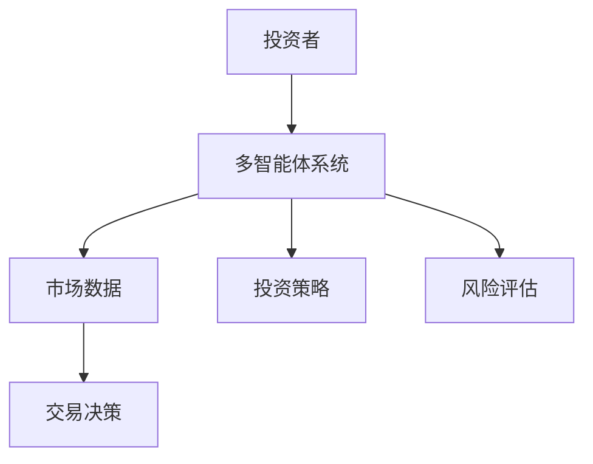
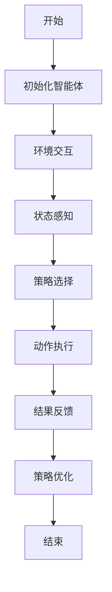
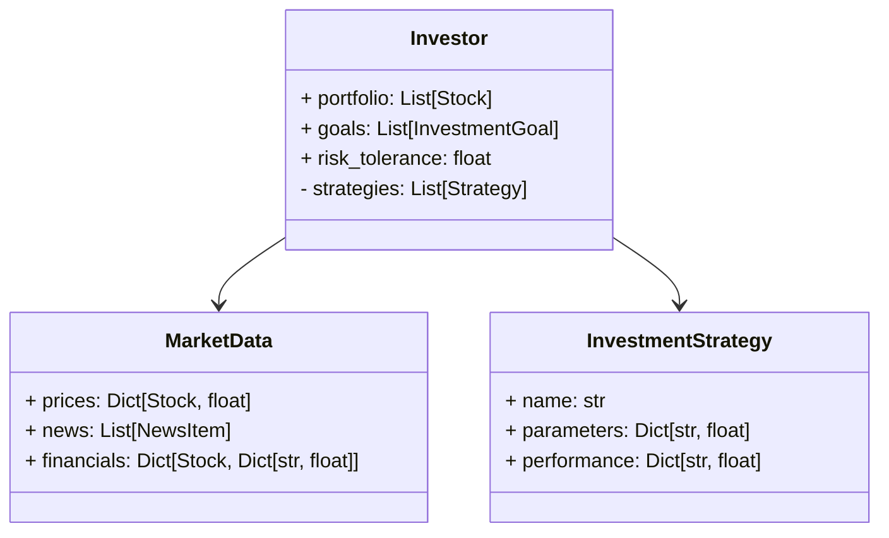

                 


# AI多智能体在价值投资中的竞争优势分析

## 关键词
AI多智能体，价值投资，强化学习，系统架构，投资策略

## 摘要
本文深入分析AI多智能体在价值投资中的竞争优势，探讨其在复杂金融市场中的应用潜力。通过介绍AI多智能体的基本原理、算法设计、系统架构，结合实际案例，展示其在提升投资决策中的独特优势。文章还讨论了当前的应用现状、面临的挑战及未来发展方向。

---

# 第一部分: AI多智能体在价值投资中的背景与概念

## 第1章: 问题背景与问题描述

### 1.1 问题背景
#### 1.1.1 传统价值投资的局限性
传统价值投资依赖于分析师的主观判断和经验，存在信息处理不全、决策滞后等问题。面对海量数据和复杂市场，传统方法难以高效应对。

#### 1.1.2 AI技术在金融领域的应用现状
AI技术在金融领域的应用日益广泛，尤其是在数据处理和预测方面。然而，单一智能体难以处理多维度的复杂投资决策问题。

#### 1.1.3 多智能体系统的核心优势
多智能体系统通过协作和分工，能够高效处理复杂问题，提升决策的准确性和响应速度。

### 1.2 问题描述
#### 1.2.1 价值投资中的信息处理挑战
金融市场数据复杂多样，传统方法难以有效整合和分析。

#### 1.2.2 多智能体在投资决策中的角色
多智能体系统能够模拟市场参与者行为，优化投资策略。

#### 1.2.3 当前AI多智能体在金融领域的应用痛点
现有系统缺乏协作机制，难以应对动态变化的市场环境。

### 1.3 问题解决与边界
#### 1.3.1 AI多智能体如何优化投资决策
通过协作和分工，提升信息处理和决策效率。

#### 1.3.2 系统边界与功能范围
定义系统的功能边界，确保其在特定场景下的有效应用。

#### 1.3.3 价值投资中的多智能体应用边界
明确多智能体在投资决策中的适用范围和限制。

## 第2章: 核心概念与联系

### 2.1 核心概念定义
#### 2.1.1 AI多智能体的定义
AI多智能体是由多个智能体组成的系统，能够协作完成复杂任务。

#### 2.1.2 价值投资的核心要素
价值投资注重资产的内在价值，强调长期稳定回报。

#### 2.1.3 多智能体系统与价值投资的结合点
通过多智能体协作，优化资产配置和风险控制。

### 2.2 核心概念属性对比
| **属性**       | **AI多智能体**             | **价值投资**              |
|----------------|--------------------------|---------------------------|
| 核心目标       | 提高决策效率和准确性       | 寻找被低估的资产            |
| 输入           | 多源数据                   | 市场数据和财务报表          |
| 输出           | 投资策略和行动建议         | 股票估值和投资建议          |
| 优势           | 高效协作，快速响应         | 强调基本面分析，长期稳定     |

### 2.3 实体关系图


---

# 第二部分: AI多智能体算法原理

## 第3章: 多智能体系统算法

### 3.1 算法原理
#### 3.1.1 多智能体系统的基本原理
多智能体系统通过分布式协作，共同完成任务。每个智能体负责特定部分，通过通信和协调实现整体目标。

#### 3.1.2 基于强化学习的多智能体协作
采用强化学习算法，智能体通过与环境交互，学习最优策略。

#### 3.1.3 联合策略与价值分解方法
智能体通过联合策略优化，分解任务，提升整体性能。

### 3.2 算法流程图


### 3.3 代码实现
#### 3.3.1 环境定义
```python
class InvestmentEnvironment:
    def __init__(self):
        self.stocks = [...]  # 初始化股票池
```

---

# 第三部分: 系统分析与架构设计方案

## 第4章: 系统分析与架构设计

### 4.1 问题场景介绍
系统旨在帮助投资者优化决策，通过多智能体协作，分析市场数据，制定投资策略。

### 4.2 系统功能设计
#### 4.2.1 领域模型


### 4.3 系统架构设计
#### 4.3.1 架构图


---

# 第四部分: 项目实战

## 第5章: 项目实战

### 5.1 环境安装
安装必要的库，如TensorFlow、Keras、NumPy、Pandas。

### 5.2 核心代码实现
```python
def train_multi_agent():
    # 初始化多智能体
    agents = [Agent() for _ in range(num_agents)]
    # 训练过程
    for episode in range(num_episodes):
        state = env.reset()
        while not done:
            actions = [agent.act(state) for agent in agents]
            next_state, reward, done = env.step(actions)
            # 更新智能体
            for i, agent in enumerate(agents):
                agent.remember(state, actions[i], reward, next_state)
                agent.train()
```

### 5.3 案例分析
分析实际投资案例，展示多智能体系统的应用效果。

---

# 第五部分: 最佳实践

## 第6章: 最佳实践

### 6.1 小结
AI多智能体在价值投资中具有显著优势，能够提升决策效率和准确性。

### 6.2 注意事项
确保数据质量和模型稳定性，避免过拟合和过度依赖技术。

### 6.3 拓展阅读
推荐相关书籍和论文，进一步深入学习AI在金融中的应用。

---

通过以上分析，可以清晰地看到AI多智能体在价值投资中的巨大潜力和竞争优势。未来随着技术进步，其应用将更加广泛和深入。

