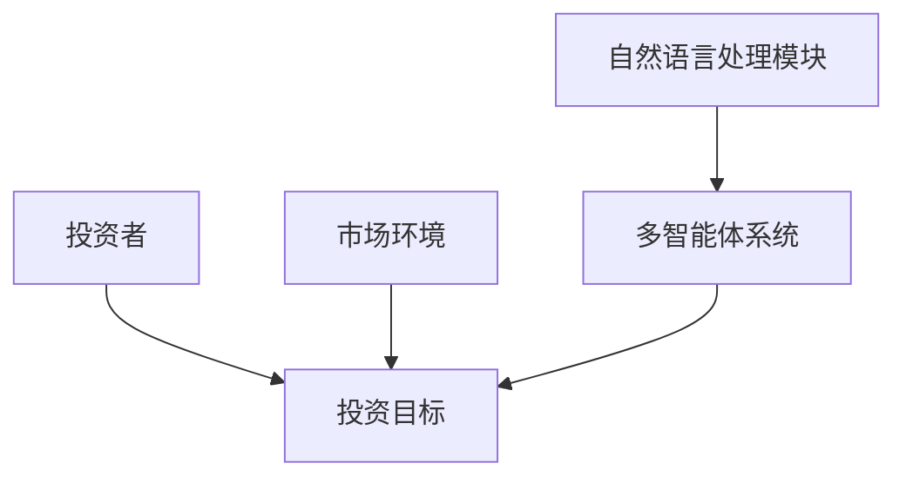
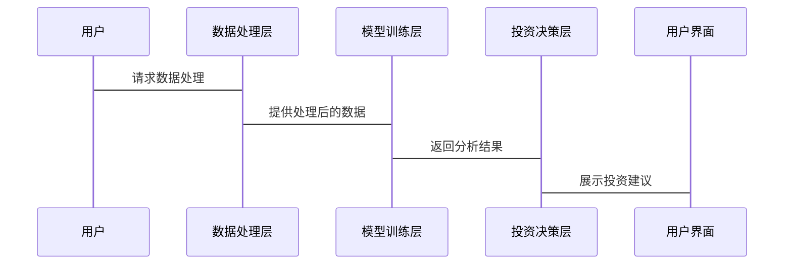

                 


# AI多智能体在价值投资中的自然语言处理应用

## 关键词：AI多智能体，价值投资，自然语言处理，金融分析，深度学习

## 摘要：本文探讨了AI多智能体系统在价值投资中的应用，重点分析了自然语言处理技术在金融文本分析中的作用。通过详细讲解多智能体协作机制、NLP模型原理及其实现，本文展示了如何利用这些技术辅助投资决策，并提供了实际案例分析和系统设计指导。

---

# 第1章: AI多智能体与价值投资的背景

## 1.1 问题背景与描述

### 1.1.1 价值投资的基本概念
价值投资是一种投资策略，旨在通过分析企业的基本面，如财务状况、行业地位和管理团队，找到被市场低估的投资标的。传统方法依赖分析师的主观判断，效率较低且受主观因素影响较大。

### 1.1.2 AI在金融领域的应用现状
人工智能（AI）技术在金融领域的应用日益广泛，包括算法交易、风险评估、市场预测等方面。然而，单一的AI模型在处理复杂金融问题时，难以兼顾多维度信息和决策过程。

### 1.1.3 多智能体系统在金融中的潜力
多智能体系统由多个协作或竞争的智能体组成，能够更好地处理复杂金融环境中的多任务和多目标问题。通过分工协作，多智能体系统可以更全面地分析市场信息，辅助投资决策。

---

## 1.2 问题解决与边界

### 1.2.1 多智能体系统如何辅助价值投资
多智能体系统可以分别负责数据收集、情感分析、财务指标评估等任务，协同工作以提供更全面的投资建议。

### 1.2.2 自然语言处理在金融分析中的作用
NLP技术能够从新闻、财报等文本数据中提取情感倾向、关键信息，帮助投资者理解市场情绪和公司动态。

### 1.2.3 系统的边界与外延
系统的边界包括数据来源、处理范围和决策范围；外延则涉及与其他金融系统的集成和扩展。

---

## 1.3 核心概念与结构

### 1.3.1 多智能体系统的组成要素
包括感知模块、决策模块、协作模块和学习模块。

### 1.3.2 自然语言处理的关键环节
包括文本预处理、特征提取、模型训练和结果分析。

### 1.3.3 系统的整体架构
系统由数据层、算法层和应用层组成，实现数据处理、模型训练和投资决策的闭环。

---

# 第2章: 核心概念与联系

## 2.1 多智能体系统的核心原理

### 2.1.1 多智能体的定义与特点
多智能体系统由多个智能体组成，具有分布式、协作性和自主性等特点。

### 2.1.2 多智能体的协作机制
基于任务分配、信息共享和协调一致的协作机制，确保各智能体高效协同。

### 2.1.3 多智能体的决策过程
通过信息收集、分析和决策，实现个体目标与整体目标的统一。

---

## 2.2 自然语言处理的核心原理

### 2.2.1 NLP的基本原理
通过文本预处理、特征提取和模型训练，实现对文本的理解和分析。

### 2.2.2 Transformer模型的原理
基于自注意力机制，能够捕捉文本中的长距离依赖关系，提升语义理解能力。

### 2.2.3 语言模型的应用场景
广泛应用于文本分类、情感分析和实体识别等领域，为金融分析提供支持。

---

## 2.3 多智能体与NLP的结合

### 2.3.1 多智能体如何利用NLP
通过NLP技术处理文本数据，提取有用信息，辅助智能体的决策。

### 2.3.2 NLP如何支持多智能体决策
NLP模型帮助智能体理解非结构化数据，提升整体系统的分析能力。

### 2.3.3 两者的协同效应
通过分工协作，多智能体系统和NLP技术相互促进，提升投资决策的准确性和效率。

---

## 2.4 概念属性对比表

| 对比维度 | 单智能体 | 多智能体 |
|----------|----------|----------|
| 分工 | 单一任务 | 多任务协作 |
| 决策 | 中央决策 | 分布式决策 |
| 灵活性 | 较低 | 较高 |

---

## 2.5 ER实体关系图



---

# 第3章: 多智能体系统与NLP算法原理

## 3.1 多智能体协作与竞争机制

### 3.1.1 协作机制的数学模型
$$C = \sum_{i=1}^{n} c_i$$
其中，$c_i$ 表示各智能体的协作贡献。

### 3.1.2 竞争机制的数学模型
$$D = \max_{i} d_i$$
其中，$d_i$ 表示各智能体的竞争表现。

### 3.1.3 协作与竞争的平衡点
通过调整权重系数，找到协作与竞争的最优平衡点，确保系统整体性能最大化。

---

## 3.2 NLP模型的训练与优化

### 3.2.1 Transformer模型的结构
- 输入层、自注意力层和前馈网络层。
- 通过自注意力机制捕捉文本中的长距离依赖关系。

### 3.2.2 模型训练的数学公式
$$L = \frac{1}{N} \sum_{i=1}^{N} \text{loss}(x_i, y_i)$$
其中，$N$ 是训练样本数量，$x_i$ 和 $y_i$ 分别是输入和标签。

### 3.2.3 模型优化的策略
采用Adam优化器和学习率衰减策略，提升模型的训练效果。

---

## 3.3 多智能体与NLP的联合优化

### 3.3.1 协作式优化
通过信息共享和任务分配，提升整体系统的优化效果。

### 3.3.2 对抗式优化
引入竞争机制，通过对抗训练提升系统的鲁棒性。

---

# 第4章: 系统分析与架构设计

## 4.1 问题场景介绍

### 4.1.1 项目介绍
构建一个基于多智能体和NLP的金融分析系统，辅助投资者进行价值投资。

### 4.1.2 系统功能设计
- 数据采集：收集市场数据、新闻等信息。
- 数据处理：清洗和预处理数据。
- 模型训练：训练NLP模型和多智能体系统。
- 投资决策：基于分析结果生成投资建议。

---

## 4.2 系统架构设计

### 4.2.1 系统架构图


### 4.2.2 系统接口设计
- 数据接口：负责数据的输入和输出。
- 模型接口：提供NLP模型和多智能体系统的调用接口。
- 用户接口：展示分析结果和投资建议。

---

## 4.3 系统交互序列图



---

# 第5章: 项目实战

## 5.1 环境安装

### 5.1.1 安装Python环境
使用Anaconda或虚拟环境，安装所需的Python版本。

### 5.1.2 安装依赖库
安装TensorFlow、Keras、Transformers等库。

```bash
pip install tensorflow transformers
```

---

## 5.2 系统核心实现

### 5.2.1 数据处理代码
```python
import pandas as pd

def preprocess_data(data):
    # 数据清洗和预处理
    return data
```

### 5.2.2 NLP模型实现
```python
from transformers import BertTokenizer, BertModel

tokenizer = BertTokenizer.from_pretrained('bert-base-uncased')
model = BertModel.from_pretrained('bert-base-uncased')
```

### 5.2.3 多智能体协作实现
```python
class Agent:
    def __init__(self, id):
        self.id = id
        self.state = None
    
    def receive(self, message):
        # 处理消息
        pass
    
    def act(self):
        # 执行动作
        pass
```

---

## 5.3 实际案例分析

### 5.3.1 案例分析
分析某公司的新闻和财报，利用NLP提取情感倾向和财务指标，辅助投资决策。

### 5.3.2 分析结果解读
通过模型输出的结果，生成投资建议，如买入、卖出或持有。

---

## 5.4 项目小结

### 5.4.1 项目总结
详细总结项目的实现过程和主要成果。

### 5.4.2 项目意义
强调项目在金融分析和投资决策中的实际应用价值。

---

# 第6章: 总结与展望

## 6.1 最佳实践 tips
- 数据质量是关键，确保数据来源可靠。
- 模型选择要结合具体任务需求。
- 系统设计要注重模块化和可扩展性。

## 6.2 小结
通过本文的介绍，读者可以了解AI多智能体在价值投资中的应用，掌握相关的技术实现和系统设计方法。

## 6.3 注意事项
- 注意数据隐私和合规性问题。
- 定期更新模型和系统，以适应市场变化。

## 6.4 拓展阅读
推荐相关领域的书籍和论文，供读者进一步学习和研究。

---

# 结语

通过系统的介绍和详细的讲解，本文为读者展示了AI多智能体在价值投资中的潜力和应用前景。希望本文能为相关领域的研究者和从业者提供有价值的参考和启示。

---

**全文完**

