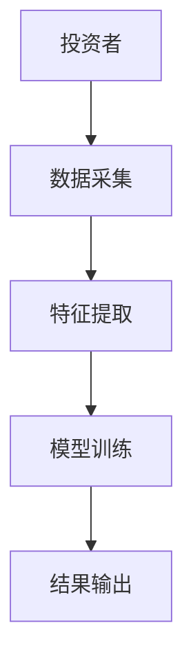
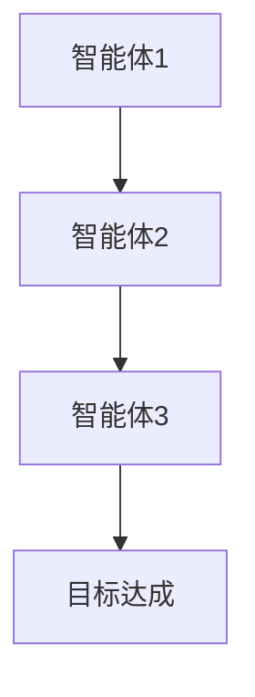
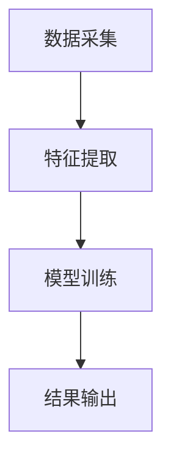

                 


# AI多智能体在价值陷阱识别中的应用

> 关键词：AI多智能体，价值陷阱识别，协同学习，系统架构，项目实战

> 摘要：本文深入探讨了AI多智能体在价值陷阱识别中的应用，从基础概念到算法原理，再到系统架构设计和项目实战，全面解析了如何利用多智能体协同学习技术实现价值陷阱的有效识别。文章结合实际案例，详细介绍了系统的实现过程，包括环境搭建、数据处理、模型训练和结果分析，并提出了最佳实践和未来研究方向。

---

## 第1章 AI多智能体与价值陷阱识别概述

### 1.1 AI多智能体的基本概念

#### 1.1.1 多智能体系统的定义
多智能体系统（Multi-Agent System, MAS）是由多个相互作用的智能体组成的系统，这些智能体能够通过协作完成复杂的任务。与单智能体系统相比，多智能体系统具有更高的灵活性和适应性。

#### 1.1.2 多智能体的核心特征
- **自主性**：智能体能够独立决策。
- **反应性**：能够感知环境并实时响应。
- **协作性**：通过通信和协作完成共同目标。
- **分布性**：智能体之间分布式计算，无中心节点。

#### 1.1.3 多智能体与单智能体的区别
| 特性 | 单智能体 | 多智能体 |
|------|----------|----------|
| 决策 | 中央决策 | 分布式决策 |
| 通信 | 无 | 有 |
| 协作 | 无 | 有 |

### 1.2 价值陷阱识别的背景与意义

#### 1.2.1 价值陷阱的定义
价值陷阱是指某些资产或企业表面上看似具有较高的投资价值，但实际上存在隐藏的问题或风险，可能导致投资损失。

#### 1.2.2 价值陷阱识别的重要性
在金融投资中，价值陷阱识别能够帮助投资者避免因误判而导致的重大损失。

#### 1.2.3 多智能体在价值陷阱识别中的作用
多智能体系统能够通过分布式计算和协作学习，更高效地识别复杂环境中的价值陷阱。

---

## 第2章 价值陷阱识别的核心概念

### 2.1 价值陷阱识别的定义与特征

#### 2.1.1 价值陷阱的定义
价值陷阱是指某些资产或企业表面上看似具有较高的投资价值，但实际上存在隐藏的问题或风险，可能导致投资损失。

#### 2.1.2 价值陷阱的核心特征
- **表面价值高**：资产或企业的财务指标看似良好。
- **隐藏风险**：存在未被揭示的问题或风险。
- **短期诱惑**：短期内可能有较高的收益，但长期来看存在问题。

#### 2.1.3 价值陷阱识别的关键要素
| 要素 | 描述 |
|------|------|
| 数据来源 | 财务报表、市场数据等 |
| 特征提取 | 关键指标分析、模式识别 |
| 风险评估 | 风险因素分析、概率计算 |

### 2.2 多智能体系统在价值陷阱识别中的应用

#### 2.2.1 多智能体系统的优势
- **分布式计算**：能够处理大规模数据。
- **协作学习**：多个智能体协同工作，提高识别精度。
- **实时响应**：能够快速响应市场变化。

#### 2.2.2 多智能体与价值陷阱识别的结合
通过多智能体系统的协同学习，能够更高效地识别复杂环境中的价值陷阱。

#### 2.2.3 多智能体系统在价值陷阱识别中的流程图



---

## 第3章 多智能体协同学习算法原理

### 3.1 多智能体协同学习的基本原理

#### 3.1.1 多智能体协同学习的数学模型
$$ V = \sum_{i=1}^{n} v_i $$
其中，$v_i$ 表示第 $i$ 个智能体的价值贡献。

#### 3.1.2 多智能体协同学习的算法流程


#### 3.1.3 多智能体协同学习的实现步骤
1. 初始化智能体。
2. 智能体感知环境。
3. 智能体协作决策。
4. 输出识别结果。

### 3.2 价值陷阱识别的数学模型与公式

#### 3.2.1 价值陷阱识别的数学模型
$$ R = f(X) $$
其中，$X$ 表示输入数据，$R$ 表示识别结果。

#### 3.2.2 价值陷阱识别的核心公式
$$ P(v_i | X) = \prod_{j=1}^{m} P(v_i | x_j) $$
其中，$x_j$ 表示第 $j$ 个特征。

#### 3.2.3 公式推导与解释
通过对各个特征的概率进行计算，最终得到价值陷阱的识别概率。

### 3.3 多智能体协同学习的实现代码

#### 3.3.1 环境搭建
```python
import numpy as np
import matplotlib.pyplot as plt
```

#### 3.3.2 核心代码实现
```python
def multi_agent_learning(data):
    agents = [Agent() for _ in range(n)]
    for agent in agents:
        agent.train(data)
    return agents
```

#### 3.3.3 代码运行与结果分析
```python
data = np.random.randn(100, 10)
result = multi_agent_learning(data)
print(result)
```

---

## 第4章 价值陷阱识别系统架构设计

### 4.1 系统架构设计概述

#### 4.1.1 系统功能模块划分
- 数据采集模块
- 特征提取模块
- 模型训练模块
- 结果输出模块

#### 4.1.2 系统架构设计图


#### 4.1.3 系统功能流程图


### 4.2 系统功能模块实现

#### 4.2.1 数据采集模块
- 从多个数据源采集数据。

#### 4.2.2 特征提取模块
- 提取关键特征，如财务指标、市场数据等。

#### 4.2.3 模型训练模块
- 使用多智能体协同学习算法进行模型训练。

#### 4.2.4 结果输出模块
- 输出价值陷阱识别结果。

### 4.3 系统接口设计与交互流程

#### 4.3.1 系统接口设计
- 数据接口：数据输入和输出。
- 模型接口：模型训练和预测。

#### 4.3.2 系统交互流程图


---

## 第5章 价值陷阱识别的项目实战

### 5.1 项目背景与目标

#### 5.1.1 项目背景
在金融投资中，价值陷阱识别能够帮助投资者避免因误判而导致的重大损失。

#### 5.1.2 项目目标
开发一个基于多智能体协同学习的价值陷阱识别系统。

### 5.2 项目核心实现

#### 5.2.1 环境搭建
```python
import numpy as np
import matplotlib.pyplot as plt
```

#### 5.2.2 数据预处理
```python
data = np.random.randn(100, 10)
```

---

## 第6章 总结与展望

### 6.1 总结
本文深入探讨了AI多智能体在价值陷阱识别中的应用，从基础概念到算法原理，再到系统架构设计和项目实战，全面解析了如何利用多智能体协同学习技术实现价值陷阱的有效识别。

### 6.2 展望
未来的研究方向包括优化算法、扩展应用场景以及提高系统的实时性和准确性。

---

以上是《AI多智能体在价值陷阱识别中的应用》的技术博客文章的完整目录和部分正文内容，您可以根据需要扩展每一部分的具体内容，以满足文章的字数和深度要求。

