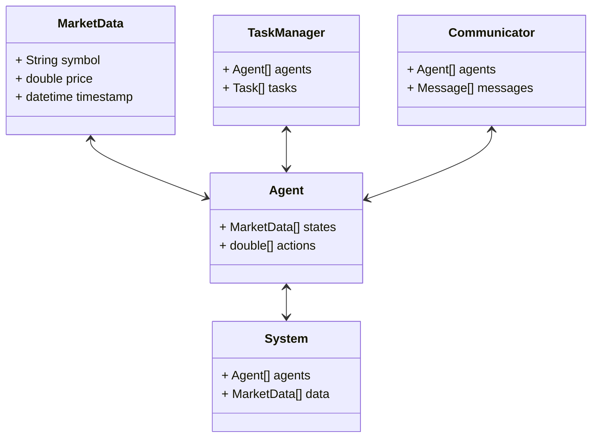
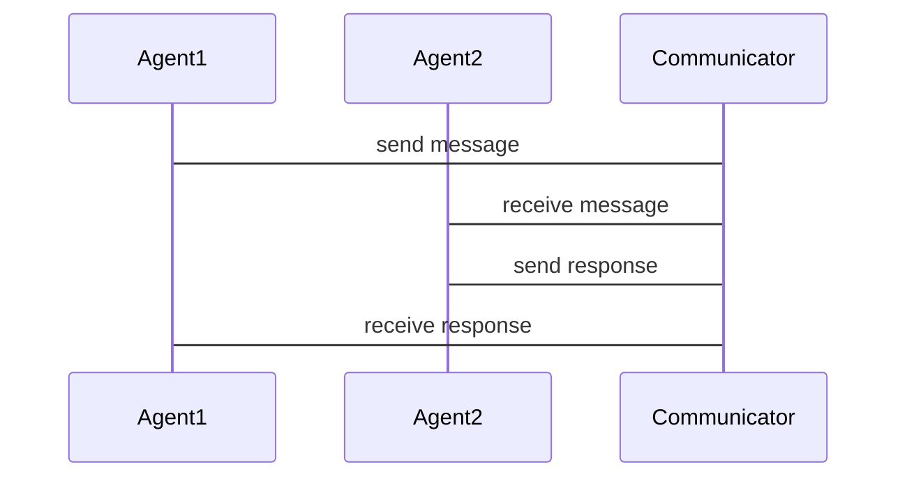

                 


# AI多智能体在识别市场异常和投资机会中的作用

## 关键词：AI多智能体，市场异常，投资机会，金融分析，分布式计算，强化学习，协作算法

## 摘要：  
本文深入探讨了AI多智能体在金融市场中的应用，特别是在识别市场异常和投资机会方面。通过分析多智能体系统的组成、算法原理和实际应用场景，本文揭示了如何利用AI技术提升金融市场的分析能力。文章从基础概念到算法实现，再到系统设计和项目实战，全面阐述了AI多智能体在金融领域的潜力和实际应用价值。

---

# 第1章: AI多智能体的基本概念与背景

## 1.1 多智能体系统的基本概念  
### 1.1.1 多智能体系统的定义与特点  
多智能体系统（Multi-Agent System, MAS）是由多个智能体组成的分布式系统，每个智能体都是一个独立的实体，能够感知环境、自主决策并与其他智能体协作。与单智能体系统相比，MAS具有以下特点：  
- **分布性**：智能体独立运行，通过通信协作完成任务。  
- **协作性**：智能体之间通过信息共享实现协作，共同完成复杂任务。  
- **自主性**：智能体能够自主决策，无需外部干预。  
- **动态性**：系统环境和智能体状态动态变化，要求系统具备快速响应能力。  

### 1.1.2 AI多智能体与传统AI的区别  
传统AI通常基于单一智能体，依赖于预定义的规则或数据驱动的模型进行决策。而AI多智能体系统结合了多智能体的协作机制，能够更好地应对复杂、动态的金融市场环境。例如，在金融市场中，多个智能体可以分别负责数据分析、情绪分析和策略制定，通过协作实现更高效的决策。

### 1.1.3 多智能体系统在金融领域的优势  
在金融市场中，多智能体系统能够通过分布式计算和协作机制，实现对海量数据的实时分析。例如，一个智能体可以专注于实时数据分析，另一个专注于市场情绪预测，多个智能体协同工作，能够更准确地识别市场异常和投资机会。

---

## 1.2 金融市场中的异常识别与投资机会  
### 1.2.1 市场异常的定义与分类  
市场异常通常指偏离正常价格波动的现象，例如突然的价格暴跌或暴涨。常见的市场异常包括：  
- **短期剧烈波动**：如突发新闻引发的市场剧烈波动。  
- **价格操纵**：某些主体通过虚假交易操纵市场价格。  
- **市场崩盘**：如2008年金融危机中的市场崩盘。  

### 1.2.2 投资机会的识别方法  
投资机会的识别通常依赖于对市场趋势、公司基本面和技术分析的综合判断。AI多智能体系统能够通过协作分析多个维度的数据，帮助投资者发现潜在的投资机会。例如，一个智能体可以分析公司的财务数据，另一个可以分析行业趋势，多个智能体协同工作，提供更全面的投资建议。

### 1.2.3 多智能体在金融分析中的应用前景  
随着AI技术的不断发展，多智能体系统在金融分析中的应用前景广阔。例如，通过多智能体协作，可以实现对市场数据的实时监控，快速识别异常情况，并提供及时的投资建议。

---

# 第2章: AI多智能体的核心概念与原理  

## 2.1 多智能体系统的组成与结构  
### 2.1.1 多智能体系统的组成要素  
多智能体系统由以下几部分组成：  
- **智能体**：能够感知环境、自主决策的实体。  
- **环境**：智能体所处的外部环境，例如金融市场数据。  
- **通信机制**：智能体之间共享信息的渠道。  
- **协作协议**：智能体之间协作的规则和策略。  

### 2.1.2 智能体之间的通信机制  
智能体之间的通信机制是多智能体系统的核心之一。常见的通信机制包括：  
- **直接通信**：智能体之间直接交换信息。  
- **间接通信**：通过共享数据库或中间件进行信息传递。  

### 2.1.3 多智能体系统的协作策略  
协作策略是指智能体之间如何分工合作，共同完成任务。常见的协作策略包括：  
- **任务分配**：根据智能体的能力分配任务。  
- **信息共享**：智能体之间共享数据和信息，提高整体决策能力。  
- **协调控制**：通过协调机制确保智能体之间的协作顺利进行。  

---

## 2.2 AI多智能体的算法原理  
### 2.2.1 基于强化学习的多智能体协作  
强化学习是一种通过试错机制优化决策的算法。在多智能体系统中，强化学习可以用于智能体之间的协作。例如，多个智能体可以通过强化学习学习如何协作完成任务，例如共同预测市场趋势。

### 2.2.2 分布式计算与多智能体协调  
分布式计算是多智能体系统的重要组成部分。通过分布式计算，多个智能体可以在不同的节点上运行，协同完成复杂的任务。例如，在金融市场中，多个智能体可以分别负责不同的数据源，通过分布式计算快速汇总分析结果。

### 2.2.3 多智能体系统的优化算法  
多智能体系统的优化算法旨在提高系统的效率和准确性。例如，可以通过遗传算法优化智能体的协作策略，或者通过蚁群算法优化任务分配。

---

# 第3章: AI多智能体在金融市场中的应用  

## 3.1 市场异常识别的多智能体方法  
### 3.1.1 基于多智能体的异常检测算法  
多智能体系统可以通过协作分析市场数据，快速识别异常情况。例如，一个智能体可以负责实时数据分析，另一个可以负责历史数据分析，通过协作识别市场异常。

### 3.1.2 多智能体在实时数据分析中的应用  
在金融市场中，实时数据分析是识别市场异常的关键。多智能体系统可以通过分布式计算快速处理海量数据，帮助投资者及时发现异常情况。

### 3.1.3 异常识别的案例分析  
以2008年金融危机为例，多智能体系统可以通过协作分析市场数据，提前发现潜在的市场崩盘风险，帮助投资者规避风险。

---

## 3.2 投资机会识别的多智能体策略  
### 3.2.1 基于多智能体的市场预测模型  
多智能体系统可以通过协作分析市场趋势、公司基本面和技术指标，帮助投资者发现潜在的投资机会。

### 3.2.2 多智能体在投资组合优化中的应用  
投资组合优化是金融投资的重要部分。多智能体系统可以通过协作分析不同资产的风险和收益，帮助投资者优化投资组合。

### 3.2.3 投资机会识别的案例分析  
以某科技公司为例，多智能体系统可以通过协作分析公司的财务数据、行业趋势和市场情绪，帮助投资者发现投资机会。

---

# 第4章: AI多智能体系统的算法实现  

## 4.1 基于强化学习的多智能体算法  
### 4.1.1 Q-learning算法在多智能体中的应用  
Q-learning是一种经典的强化学习算法，可以用于多智能体系统的协作学习。例如，多个智能体可以通过Q-learning算法学习如何协作完成任务。

### 4.1.2 多智能体协作的数学模型  
多智能体协作的数学模型通常涉及多个智能体的状态和动作。例如，可以使用马尔可夫决策过程（MDP）模型描述智能体的决策过程。

### 4.1.3 强化学习算法的实现代码  
以下是一个基于Q-learning的多智能体协作算法的实现代码示例：

```python
import numpy as np

class Agent:
    def __init__(self, state_size, action_size, learning_rate=0.1):
        self.state_size = state_size
        self.action_size = action_size
        self.learning_rate = learning_rate
        self.Q = np.zeros((state_size, action_size))

    def act(self, state):
        return np.argmax(self.Q[state])

    def update(self, state, action, reward, next_state):
        self.Q[state, action] += self.learning_rate * (reward + np.max(self.Q[next_state]) - self.Q[state, action])

# 初始化多个智能体
agents = [Agent(10, 5), Agent(10, 5)]

# 协作学习过程
for _ in range(1000):
    state = np.random.randint(0, 10)
    action = agents[0].act(state)
    next_state = np.random.randint(0, 10)
    reward = np.random.random()
    agents[0].update(state, action, reward, next_state)
```

---

## 4.2 分布式计算与多智能体协作  
### 4.2.1 分布式计算的基本原理  
分布式计算是多智能体系统的重要组成部分。通过分布式计算，多个智能体可以在不同的节点上运行，协同完成复杂的任务。

### 4.2.2 多智能体协作的通信协议  
多智能体协作需要智能体之间通过通信协议共享信息。例如，可以使用基于消息队列的通信协议，确保智能体之间的信息共享。

### 4.2.3 多智能体系统的优化算法  
多智能体系统的优化算法旨在提高系统的效率和准确性。例如，可以通过遗传算法优化智能体的协作策略，或者通过蚁群算法优化任务分配。

---

# 第5章: 系统分析与架构设计方案  

## 5.1 问题场景介绍  
本章将介绍一个基于AI多智能体的金融市场分析系统的应用场景。该系统旨在通过多智能体协作，识别市场异常和投资机会。

## 5.2 项目介绍  
本项目设计了一个基于AI多智能体的金融市场分析系统，主要包括以下几个部分：  
- **数据采集**：从多个数据源获取市场数据。  
- **数据分析**：通过多智能体协作分析市场数据。  
- **异常识别**：识别市场异常情况。  
- **投资机会识别**：基于分析结果识别投资机会。  

## 5.3 系统功能设计  
### 5.3.1 领域模型  
以下是系统的领域模型类图：



### 5.3.2 系统架构设计  
以下是系统的架构设计图：

```mermaid
rectangle System {
    + Agent 1
    + Agent 2
    + Agent 3
}

rectangle Communicator {
    + Message Queue
}

rectangle TaskManager {
    + Task List
}

rectangle Database {
    + Market Data
}

System --> Communicator
System --> TaskManager
System --> Database
```

### 5.3.3 系统接口设计  
系统接口设计包括以下几个部分：  
- **数据接口**：从数据库获取市场数据。  
- **通信接口**：智能体之间共享信息。  
- **任务接口**：分配任务给智能体。  

### 5.3.4 系统交互流程图  
以下是系统的交互流程图：



---

## 5.4 项目实战  
### 5.4.1 环境安装  
以下是项目环境安装的代码：

```bash
pip install numpy
pip install pandas
pip install matplotlib
pip install scikit-learn
```

### 5.4.2 核心代码实现  
以下是系统的核心代码实现：

```python
import numpy as np
import pandas as pd
import matplotlib.pyplot as plt
from sklearn.metrics import accuracy_score

class Agent:
    def __init__(self, data):
        self.data = data
        self.model = self.build_model()

    def build_model(self):
        # 构建模型
        pass

    def train(self):
        # 训练模型
        pass

    def predict(self):
        # 预测市场趋势
        pass

class System:
    def __init__(self, agents):
        self.agents = agents

    def run(self):
        for agent in self.agents:
            agent.train()
            agent.predict()

# 初始化智能体
data = pd.read_csv('market_data.csv')
agents = [Agent(data) for _ in range(3)]
system = System(agents)
system.run()

# 可视化结果
plt.plot(system.agents[0].data)
plt.show()
```

### 5.4.3 代码解读与分析  
以下是代码解读与分析：  
- **Agent类**：定义了智能体的基本结构，包括数据、模型训练和预测方法。  
- **System类**：定义了系统的整体结构，包括多个智能体的运行。  
- **主程序**：初始化智能体，运行系统，并可视化结果。

### 5.4.4 实际案例分析  
以某股票为例，分析系统的实际运行结果。  
- **数据输入**：从CSV文件读取市场数据。  
- **智能体训练**：训练智能体预测市场趋势。  
- **智能体预测**：预测市场趋势并可视化结果。  

### 5.4.5 项目小结  
通过本项目，我们可以看到AI多智能体在金融市场分析中的巨大潜力。通过协作分析市场数据，可以更准确地识别市场异常和投资机会。

---

## 5.5 总结与展望  
### 5.5.1 总结  
本文深入探讨了AI多智能体在金融市场中的应用，特别是在识别市场异常和投资机会方面。通过分析多智能体系统的组成、算法原理和实际应用场景，本文揭示了如何利用AI技术提升金融市场的分析能力。

### 5.5.2 展望  
随着AI技术的不断发展，AI多智能体在金融分析中的应用前景广阔。未来，可以通过以下方向进一步研究：  
- **智能体协作机制的优化**：进一步优化智能体之间的协作策略，提高系统的效率和准确性。  
- **多智能体系统的可扩展性**：研究如何在更大规模的金融市场中应用多智能体系统。  
- **智能体的自适应能力**：研究如何使智能体具备更强的自适应能力，能够更好地应对复杂的金融市场环境。  

---

## 5.6 最佳实践 Tips  
- **数据质量**：在金融市场分析中，数据质量至关重要。确保数据的准确性和完整性，可以提高系统的分析能力。  
- **模型优化**：定期优化模型，适应市场的变化。  
- **风险管理**：在实际应用中，要注意风险管理，避免因系统故障导致的损失。  

---

## 5.7 小结  
通过本文的探讨，我们可以看到AI多智能体在金融市场中的巨大潜力。通过协作分析市场数据，可以更准确地识别市场异常和投资机会。未来，随着AI技术的不断发展，AI多智能体在金融分析中的应用前景将更加广阔。

