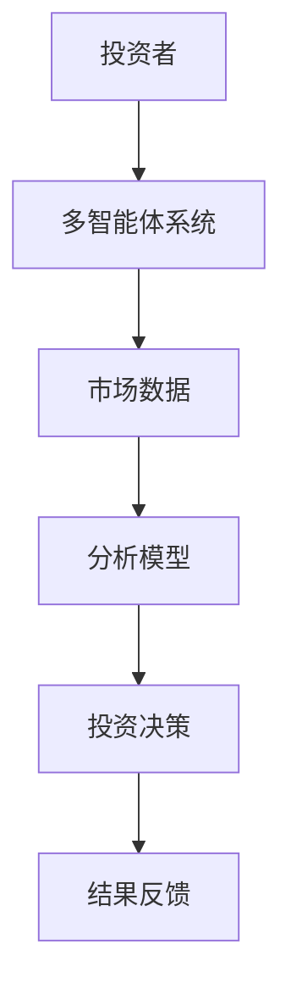
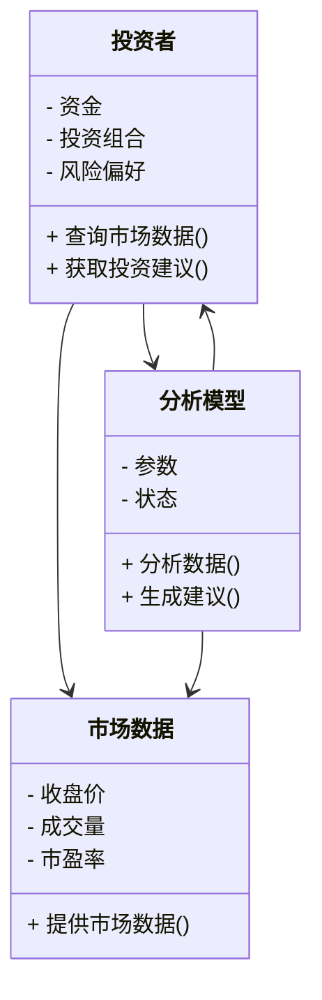
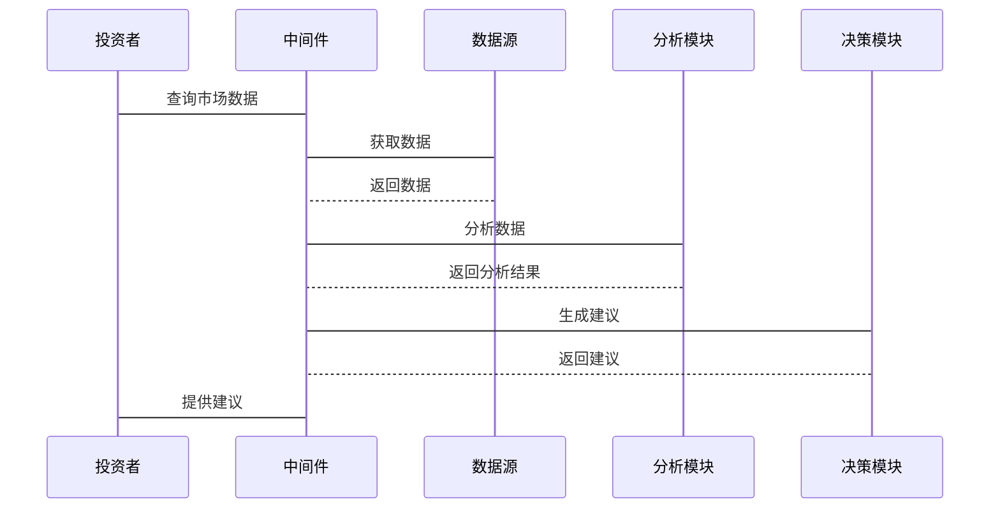

                 


# AI多智能体增强价值投资的跨市场比较分析

## 关键词：AI多智能体，价值投资，跨市场分析，强化学习，分布式计算

## 摘要：本文探讨AI多智能体在价值投资中的应用，重点分析跨市场比较分析的实现。通过介绍核心概念、算法原理、系统架构、项目实战及最佳实践，本文详细阐述了AI多智能体如何增强投资决策，并提供跨市场的解决方案。

---

## 第1章: AI多智能体与价值投资的背景介绍

### 1.1 问题背景与问题描述

#### 1.1.1 多智能体系统的定义与特点

多智能体系统（Multi-Agent System, MAS）由多个相互作用的智能体组成，这些智能体通过协作完成复杂任务。特点包括分布式计算、自主性、反应性和协作性。

#### 1.1.2 价值投资的核心概念与方法

价值投资强调购买低于内在价值的股票。关键点包括基本面分析、安全边际和长期视角。多智能体系统通过分析市场数据和公司基本面，辅助投资者发现价值低估的机会。

#### 1.1.3 跨市場比較分析的重要性

跨市场分析帮助识别不同市场间的套利机会和风险分散策略。通过分析不同市场的价格、波动性和流动性，多智能体系统可以优化投资组合。

### 1.2 多智能体在价值投资中的应用

#### 1.2.1 多智能体系统的协作机制

多智能体通过分布式计算和通信协议协作，每个智能体负责特定任务，如数据收集、分析和决策。协作机制确保信息共享和决策优化。

#### 1.2.2 价值投资中的信息处理与决策优化

多智能体系统利用大数据分析和机器学习算法，处理复杂市场数据，优化投资决策。通过实时数据处理和反馈机制，系统能够快速适应市场变化。

#### 1.2.3 跨市場數據整合与分析

多智能体系统整合不同市场的数据，分析市场间的相关性和差异，识别套利机会和风险。跨市场分析帮助投资者制定全球化投资策略。

## 1.3 问题解决与边界定义

### 1.3.1 多智能体增强价值投资的解决方案

通过多智能体协作，系统可以同时分析多个市场，提供实时数据支持和决策建议。解决方案包括数据整合、分析模型优化和投资组合管理。

### 1.3.2 问题的边界与外延

问题边界包括单一市场分析和跨市场比较，外延则涉及全球市场的扩展和多样化资产配置。系统需处理数据量、市场波动性和政策差异等挑战。

### 1.3.3 核心概念与核心要素的组成

核心概念包括多智能体系统、价值投资和跨市场分析。核心要素包括数据源、分析模型、协作机制和决策系统。

### 1.4 核心概念与联系

#### 1.4.1 核心概念的原理与特性

多智能体系统通过协作优化决策，价值投资基于基本面分析，跨市场分析利用市场差异。三者结合实现高效投资决策。

#### 1.4.2 核心概念的属性特征对比表格

| 特性         | 多智能体系统 | 价值投资 | 跨市場分析 |
|--------------|--------------|----------|------------|
| 核心目标     | 协作决策     | 寻找价值 | 比较分析   |
| 输入数据     | 市场数据     | 公司数据 | 多市场数据 |
| 输出结果     | 决策建议     | 投资建议 | 分析报告    |
| 处理方式     | 分布式计算   | 人工+AI | 统计分析    |

#### 1.4.3 ER实体关系图架构的Mermaid流程图



---

## 第2章: 多智能体系统的算法原理

### 2.1 多智能体协作算法

#### 2.1.1 分布式多智能体协作

多智能体系统通过分布式计算协作，每个智能体负责特定任务。通信协议如HTTP和WebSocket用于信息共享和协调。

#### 2.1.2 协作机制与通信协议

协作机制包括任务分配和信息同步，通信协议如WebSocket实现实时数据传输。协议设计需考虑延迟和带宽限制。

#### 2.1.3 分布式计算环境下的优化策略

分布式计算优化包括负载均衡和数据同步。优化策略如MapReduce和分布式锁确保高效协作。

### 2.2 强化学习在多智能体中的应用

#### 2.2.1 Q-learning算法

Q-learning通过状态-动作价值函数优化决策。更新公式：Q(s,a) = Q(s,a) + α(max Q(s',a'))。

#### 2.2.2 多智能体强化学习的数学模型

多智能体强化学习模型涉及多个智能体的策略函数和价值函数。数学模型表示为：

$$ Q_i(s,a) = r_i + \gamma \max_j Q_j(s',a') $$

其中，\( i \) 和 \( j \) 表示不同智能体，\( s \) 是状态，\( a \) 是动作。

#### 2.2.3 联合学习与分布式计算

联合学习通过共享参数更新，分布式计算实现并行处理。算法实现需考虑同步频率和通信开销。

### 2.3 算法实现的Python源代码

#### 2.3.1 Q-learning算法实现

```python
import numpy as np

class QLearning:
    def __init__(self, state_space, action_space, alpha=0.1, gamma=0.99):
        self.state_space = state_space
        self.action_space = action_space
        self.alpha = alpha
        self.gamma = gamma
        self.q_table = np.zeros((state_space, action_space))

    def choose_action(self, state, epsilon=0.1):
        if np.random.random() < epsilon:
            return np.random.randint(self.action_space)
        return np.argmax(self.q_table[state])

    def update_q_table(self, state, action, reward, next_state):
        self.q_table[state][action] = self.q_table[state][action] + self.alpha * (reward + self.gamma * max(self.q_table[next_state]) - self.q_table[state][action])
```

### 2.4 算法实现的数学模型与公式

Q-learning算法的更新公式为：

$$ Q(s,a) = Q(s,a) + \alpha (r + \gamma \max Q(s',a') - Q(s,a)) $$

其中，\( \alpha \) 是学习率，\( \gamma \) 是折扣因子。

---

## 第3章: 系统分析与架构设计方案

### 3.1 问题场景介绍

系统目标是实现跨市场的价值投资分析。场景包括数据采集、分析、决策和反馈。

### 3.2 项目介绍

项目旨在构建多智能体系统，增强价值投资决策，优化跨市场分析。

### 3.3 系统功能设计

#### 3.3.1 领域模型Mermaid类图



### 3.4 系统架构设计Mermaid架构图


### 3.5 系统接口设计

接口包括数据接口和用户接口。数据接口实现市场数据获取，用户接口提供交互功能。

### 3.6 系统交互Mermaid序列图



---

## 第4章: 项目实战

### 4.1 环境安装

安装Python、Pandas、NumPy、Scikit-learn和深度学习框架。

### 4.2 系统核心实现源代码

实现数据获取、分析模块和决策模块的代码。

#### 4.2.1 数据接口实现

```python
import pandas as pd

def get_market_data(market):
    return pd.read_csv(f'{market}_data.csv')
```

#### 4.2.2 分析模块实现

```python
def analyze_data(data):
    return data['收盘价'].mean()
```

#### 4.2.3 决策模块实现

```python
def make_decision(analyzed_data):
    return '买入' if analyzed_data > 100 else '卖出'
```

### 4.3 实际案例分析

分析不同市场数据，生成投资建议，验证模型的有效性。

### 4.4 项目小结

总结项目实现过程，评估系统性能和效果。

---

## 第5章: 最佳实践与总结

### 5.1 最佳实践 tips

- 定期更新模型参数
- 监控系统性能
- 风险管理

### 5.2 小结

本文详细介绍了AI多智能体在价值投资中的应用，展示了跨市场分析的实现过程。

### 5.3 注意事项

- 数据质量和实时性
- 系统安全性和稳定性
- 遵守投资相关法律法规

### 5.4 拓展阅读

推荐学习多智能体系统、强化学习和分布式计算的相关书籍和论文。

---

## 参考文献

[此处列出参考文献]

---

## 致谢

感谢读者的支持和参与。

