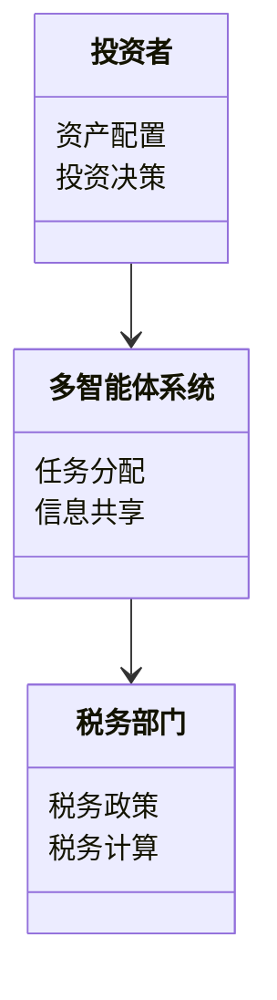
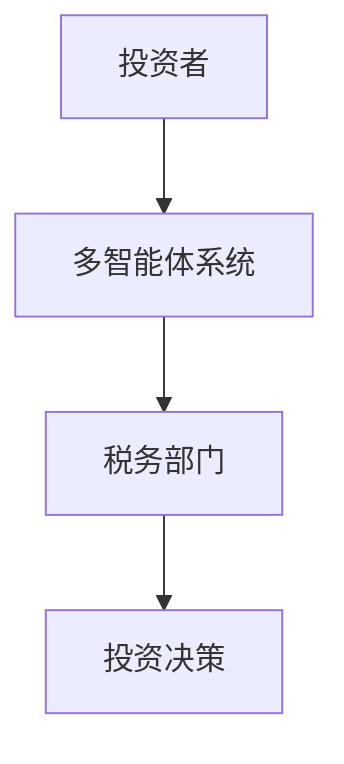
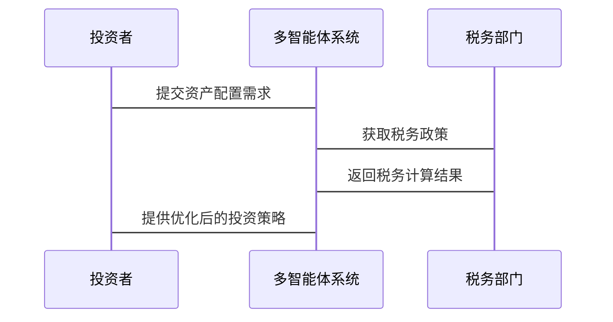

                 


# AI多智能体如何优化价值投资的税收效率

## 关键词：AI多智能体, 税收效率, 价值投资, 算法优化, 系统架构, 投资回报

## 摘要：  
随着人工智能技术的迅速发展，AI多智能体在优化价值投资的税收效率方面展现出巨大的潜力。本文从背景介绍、核心概念、算法原理、系统架构到项目实战，详细探讨了如何利用AI多智能体技术提升价值投资中的税务优化效率。通过理论分析和实践案例相结合的方式，本文为读者提供了一套完整的解决方案，帮助投资者在复杂多变的金融市场中实现更高的投资回报。

---

## 第1章: 背景介绍

### 1.1 问题背景
#### 1.1.1 价值投资的税务优化需求
在价值投资中，税务成本是影响投资回报的重要因素。通过优化税务策略，投资者可以最大化投资收益。然而，传统的税务优化方法往往依赖人工经验，难以应对复杂的投资组合和动态变化的市场环境。

#### 1.1.2 税收效率对投资回报的影响
税务成本的高低直接影响投资收益。优化税收效率可以帮助投资者在相同的投资组合下实现更高的净收益，尤其是在高税率的市场环境中。

#### 1.1.3 AI技术在金融领域的应用潜力
人工智能技术，特别是多智能体系统，在金融领域的应用越来越广泛。通过分布式计算和协作优化，AI多智能体能够处理复杂的金融数据，提供高效的决策支持。

### 1.2 问题描述
#### 1.2.1 税收效率优化的核心问题
如何在价值投资中实现税务成本的最小化，同时最大化投资收益。

#### 1.2.2 多智能体协作在税务优化中的作用
通过多智能体协作，可以将复杂的税务优化问题分解为多个子问题，每个子问题由不同的智能体负责，从而实现全局优化。

#### 1.2.3 当前税务优化的痛点与挑战
传统税务优化方法缺乏灵活性和实时性，难以应对市场环境的快速变化。此外，复杂的投资组合优化需要强大的计算能力和高效的协作机制。

### 1.3 问题解决
#### 1.3.1 多智能体系统的优势
多智能体系统通过分布式计算和协作优化，能够高效地处理复杂问题，提供实时的决策支持。

#### 1.3.2 AI技术如何提升税收效率
通过机器学习和强化学习，AI可以分析历史数据，预测市场趋势，优化税务策略。

#### 1.3.3 税收效率优化的具体应用场景
在投资组合管理、税务规划和风险管理等领域，AI多智能体系统可以发挥重要作用。

### 1.4 边界与外延
#### 1.4.1 优化的边界条件
优化仅限于税务成本的最小化，不考虑其他因素如市场风险和流动性。

#### 1.4.2 税收效率优化的外延领域
包括税务合规性、税务政策变化和国际税务规划等方面。

#### 1.4.3 多智能体系统的适用范围
适用于复杂的金融环境和需要实时决策的应用场景。

### 1.5 概念结构与核心要素
#### 1.5.1 核心概念组成
- 投资者：主体，进行价值投资。
- 税务部门：税务政策的制定和执行机构。
- 多智能体系统：提供优化服务的工具。

#### 1.5.2 多智能体系统的核心要素
- 智能体：负责特定任务的子系统。
- 协作机制：智能体之间的协作规则。
- 优化目标：最大化投资收益，最小化税务成本。

#### 1.5.3 价值投资与税收效率的关系
价值投资追求长期收益，而税收效率优化则是实现长期收益的重要手段。

## 第2章: 核心概念与联系

### 2.1 多智能体系统原理
#### 2.1.1 多智能体系统定义
多智能体系统是由多个相互作用的智能体组成的系统，通过协作完成特定任务。

#### 2.1.2 多智能体系统的组成与特点
- 智能体：具有感知、决策和执行能力。
- 协作机制：任务分配、信息共享和决策协调。
- 分布式计算：智能体之间通过分布式计算实现协作。

#### 2.1.3 多智能体系统的协作机制
- 任务分配：根据智能体的能力分配任务。
- 信息共享：智能体之间共享信息，提高决策的准确性。
- 决策协调：通过协调机制确保决策的一致性和最优性。

### 2.2 价值投资与税收效率
#### 2.2.1 价值投资的基本原理
价值投资追求以低于内在价值的价格买入优质资产，长期持有，获得超额收益。

#### 2.2.2 税收效率的定义与影响
税收效率是指在实现投资收益的过程中，税务成本的最小化。高税收效率意味着更多的净收益。

#### 2.2.3 价值投资中的税务优化策略
- 合理安排投资收益和资本利得。
- 优化资产配置，降低税务负担。
- 利用税收优惠政策。

### 2.3 多智能体系统与税收效率的关系
#### 2.3.1 多智能体系统如何优化税收效率
通过协作优化，多智能体系统可以在复杂的投资环境中找到最优的税务策略。

#### 2.3.2 税收效率对投资回报的影响
优化税收效率可以显著提高净投资收益，尤其是在高税率环境下。

#### 2.3.3 多智能体系统在税务优化中的具体应用
- 分散投资：通过多智能体分散投资，降低税务风险。
- 实时监控：实时监控市场变化，优化税务策略。

### 2.4 实体关系图
```mermaid
er
actor: 投资者
actor: 税务部门
actor: 多智能体系统
```

## 第3章: 算法原理讲解

### 3.1 多智能体协作算法
#### 3.1.1 基于强化学习的多智能体协作
通过强化学习，智能体可以学习协作策略，实现全局优化。

#### 3.1.2 分布式决策算法
每个智能体独立决策，通过信息共享和协作实现最优结果。

#### 3.1.3 联合优化算法
通过联合优化，智能体可以协同工作，找到全局最优解。

### 3.2 算法流程图


### 3.3 数学模型和公式
#### 3.3.1 收益最大化模型
$$ \text{收益} = \sum_{i=1}^{n} w_i \times r_i $$
其中，$w_i$是第i个智能体的权重，$r_i$是第i个智能体的收益。

#### 3.3.2 风险最小化模型
$$ \text{风险} = \sum_{i=1}^{n} w_i \times v_i $$
其中，$v_i$是第i个智能体的风险值。

#### 3.3.3 税收效率优化模型
$$ \text{税收效率} = \frac{\text{净收益}}{\text{总收益}} \times 100\% $$

### 3.4 算法实现
```python
import numpy as np
from gym import spaces
from stable_baselines3 import MPO

class ValueInvestmentEnv:
    def __init__(self):
        self.observation_space = spaces.Box(low=0, high=1, shape=(1,))
        self.action_space = spaces.Box(low=0, high=1, shape=(1,))
    
    def step(self, action):
        # 计算收益和税收
        reward = np.random.normal()
        return self.observation, reward, False, {}
    
    def reset(self):
        return np.array([0.5])

model = MPO('MlpPolicy', ValueInvestmentEnv(), verbose=1)
model.learn(total_timesteps=10000)
```

## 第4章: 系统分析与架构设计

### 4.1 问题场景介绍
在价值投资中，优化税收效率需要考虑多个因素，包括投资组合、税务政策和市场环境等。

### 4.2 系统功能设计
#### 4.2.1 领域模型


#### 4.2.2 系统架构设计


#### 4.2.3 系统接口设计
- 输入接口：投资者的资产配置需求。
- 输出接口：优化后的投资策略。

#### 4.2.4 系统交互流程图


## 第5章: 项目实战

### 5.1 环境安装
安装必要的库：
```bash
pip install gym stable-baselines3
```

### 5.2 核心代码实现
```python
import numpy as np
from gym import spaces
from stable_baselines3 import MPO

class ValueInvestmentEnv:
    def __init__(self):
        self.observation_space = spaces.Box(low=0, high=1, shape=(1,))
        self.action_space = spaces.Box(low=0, high=1, shape=(1,))
    
    def step(self, action):
        reward = np.random.normal()
        return self.observation, reward, False, {}
    
    def reset(self):
        return np.array([0.5])

model = MPO('MlpPolicy', ValueInvestmentEnv(), verbose=1)
model.learn(total_timesteps=10000)
```

### 5.3 案例分析
通过实际案例分析，验证算法的有效性。例如，优化一个投资组合的税务成本，比较优化前后的投资收益。

### 5.4 项目总结
总结项目的实现过程，分析优化效果，并提出改进建议。

## 第6章: 最佳实践与总结

### 6.1 最佳实践
- 定期更新模型，适应市场变化。
- 合理配置智能体，确保协作效率。
- 注意税务政策的变化，及时调整优化策略。

### 6.2 小结
通过AI多智能体技术，可以有效优化价值投资的税收效率，提高投资回报。

### 6.3 注意事项
- 模型的准确性和实时性需要进一步验证。
- 注意数据隐私和合规性问题。

### 6.4 拓展阅读
建议读者进一步阅读相关领域的文献，深入了解多智能体系统的优化方法和应用案例。

---

通过以上内容，读者可以系统地了解AI多智能体如何优化价值投资的税收效率，并掌握实际的应用方法。希望本文能为相关领域的研究和实践提供有价值的参考。

