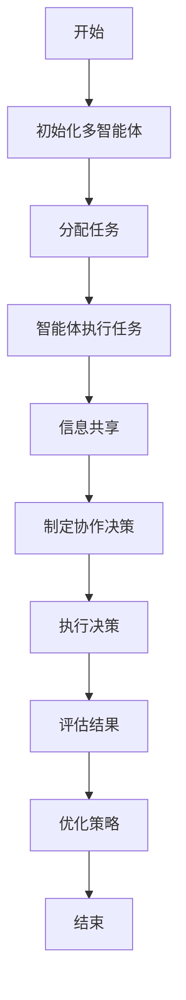
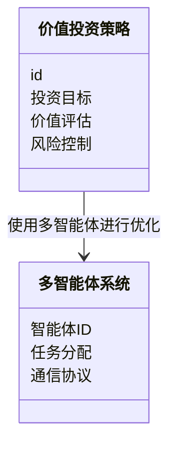
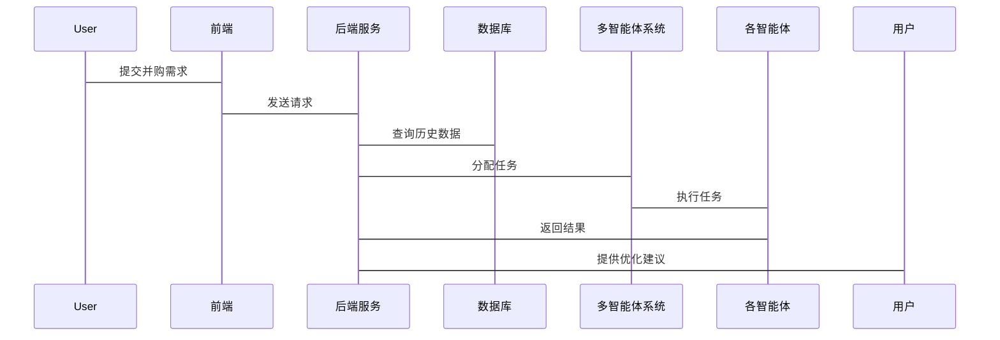

                 


# AI多智能体如何优化价值投资的跨境并购策略

## 关键词：AI多智能体, 价值投资, 跨境并购, 优化策略, 投资算法, 金融建模, 系统架构

## 摘要：本文系统探讨AI多智能体技术在价值投资和跨境并购中的应用，通过理论分析和实践案例，详细阐述多智能体协作算法在并购策略优化中的作用，结合数学建模和系统架构设计，提供一种创新的金融投资解决方案，帮助投资者在复杂多变的市场环境中制定最优的并购策略。

---

# 第一部分: AI多智能体与价值投资的跨境并购策略背景

# 第1章: AI多智能体与价值投资的跨境并购策略概述

## 1.1 问题背景与意义

### 1.1.1 价值投资的定义与核心要素

- 价值投资是一种以内在价值为导向的投资策略，关注企业的基本面，如盈利能力、财务状况和行业地位。
- 核心要素包括：市盈率、市净率、股息率、ROE（净资产收益率）等。
- 价值投资强调长期持有优质资产，避免短期市场波动的干扰。

### 1.1.2 跨境并购的挑战与机遇

- 跨境并购涉及多个国家的法律法规、文化差异和市场环境，具有高度复杂性。
- 机遇：通过并购获取技术、市场和资源，实现全球化布局。
- 挑战：汇率波动、政策风险、整合困难等。

### 1.1.3 AI技术在金融领域的应用潜力

- AI技术可以通过大数据分析和机器学习，提高投资决策的准确性和效率。
- 在并购领域，AI可以帮助识别潜在目标、评估风险、制定整合策略。

## 1.2 AI多智能体的定义与特点

### 1.2.1 多智能体系统的定义

- 多智能体系统是由多个独立但协作的智能体组成的分布式系统。
- 每个智能体都有自己的目标、知识和行动能力。

### 1.2.2 多智能体的核心特点

- 分布式：多个智能体协同工作，而非集中控制。
- 协作性：智能体之间通过通信和协作完成共同目标。
- 反应性：智能体能够感知环境并实时调整行为。

### 1.2.3 多智能体与单智能体的区别

| 特性      | 单智能体          | 多智能体          |
|-----------|------------------|------------------|
| 结构       | 单一中心         | 分布式           |
| 任务       | 单一目标         | 多个目标         |
| 决策       | 集中决策         | 分散决策         |
| 效率       | 依赖单点性能     | 通过协作提高效率 |

## 1.3 价值投资与并购策略的结合

### 1.3.1 价值投资的基本原理

- 价值投资的核心是寻找市场价格低于内在价值的资产。
- 通过基本面分析，识别被低估的企业。

### 1.3.2 跨境并购的复杂性

- 涉及多个国家的法律、税务和监管差异。
- 需要考虑文化、语言和商业习惯的差异。

### 1.3.3 AI在并购策略中的应用前景

- AI可以帮助分析大量的跨国数据，识别潜在的并购目标。
- 利用机器学习模型预测并购后的整合效果和风险。

## 1.4 本章小结

- 介绍了价值投资和跨境并购的基本概念和挑战。
- 强调了AI多智能体技术在优化并购策略中的潜力。

---

# 第2章: AI多智能体的核心概念与联系

## 2.1 多智能体系统的核心原理

### 2.1.1 多智能体的协作机制

- 协作机制包括任务分配、信息共享和决策协调。
- 通过通信协议实现智能体之间的协作。

### 2.1.2 多智能体的通信协议

- 智能体之间的通信需要定义明确的协议。
- 通信内容包括状态、意图和动作。

### 2.1.3 多智能体的决策模型

- 每个智能体都有自己的决策模型，基于局部信息做出决策。
- 全局决策通过智能体的协作实现。

## 2.2 价值投资策略的核心要素

### 2.2.1 价值评估模型

- 常用模型包括DCF（现金流折现法）和相对估值法。
- 通过模型计算企业的内在价值。

### 2.2.2 市场趋势分析

- 利用技术分析和基本面分析预测市场趋势。
- 结合宏观经济指标进行综合判断。

### 2.2.3 风险评估与控制

- 通过VaR（风险价值）等方法量化投资风险。
- 制定风险对冲策略，降低投资风险。

## 2.3 多智能体与价值投资策略的关联

### 2.3.1 多智能体在价值评估中的应用

- 每个智能体负责分析不同的市场数据。
- 通过协作生成综合的价值评估报告。

### 2.3.2 多智能体在风险控制中的作用

- 智能体实时监控市场风险，及时发出预警。
- 根据风险状况动态调整投资策略。

### 2.3.3 多智能体在市场趋势预测中的优势

- 多个智能体分别负责不同领域的预测。
- 通过协作提高预测的准确性和全面性。

## 2.4 核心概念对比表格

| 概念      | 多智能体         | 价值投资策略      |
|-----------|----------------|------------------|
| 目标       | 协作完成任务     | 寻找被低估资产     |
| 输入       | 多源数据         | 市场数据和基本面数据|
| 输出       | 协作决策         | 投资建议           |
| 优势       | 高效协作         | 提高投资准确性     |

## 2.5 ER实体关系图

```mermaid
erd
  entity 价值投资策略 {
    <属性>
    id
    投资目标
    价值评估
    风险控制
  }

  entity 多智能体系统 {
    <属性>
    智能体ID
    任务分配
    通信协议
  }

  valueInvestment 内部关系 {
    价值投资策略 --> 多智能体系统 : 使用多智能体进行优化
  }
```

---

# 第3章: AI多智能体优化价值投资的算法原理

## 3.1 多智能体协作算法

### 3.1.1 多智能体协作的基本原理

- 每个智能体负责特定的任务。
- 通过通信协议共享信息和协调行动。

### 3.1.2 多智能体协作的实现步骤

1. **任务分配**：根据智能体的能力分配任务。
2. **信息共享**：智能体之间共享必要的信息。
3. **决策协调**：基于共享信息制定协作决策。
4. **行动执行**：智能体根据决策执行具体任务。

### 3.1.3 多智能体协作的优缺点

- **优点**：提高效率和灵活性。
- **缺点**：通信开销大，容易出现协调问题。

## 3.2 价值投资策略优化算法

### 3.2.1 价值评估模型的构建

- 使用多智能体分别分析不同的市场数据。
- 通过协作生成综合的价值评估报告。

### 3.2.2 市场趋势预测算法

- 使用时间序列分析和机器学习模型预测市场趋势。
- 通过多智能体协作提高预测的准确性和全面性。

### 3.2.3 风险评估与控制算法

- 使用VaR模型量化投资风险。
- 通过多智能体实时监控市场风险，及时发出预警。

## 3.3 算法流程图



## 3.4 算法实现代码

### 3.4.1 环境安装与配置

```bash
pip install numpy pandas scikit-learn
```

### 3.4.2 多智能体协作算法实现

```python
class Agent:
    def __init__(self, id):
        self.id = id
        self.task = None

    def assign_task(self, task):
        self.task = task

    def execute_task(self):
        # 处理任务并返回结果
        pass

# 初始化多智能体
agents = [Agent(i) for i in range(5)]

# 任务分配
for agent in agents:
    agent.assign_task("analyze_market_data")
```

### 3.4.3 价值投资策略优化算法实现

```python
def value_investment_strategy(prices, financials):
    # 使用多智能体分析价格和财务数据
    # 返回投资建议
    pass

# 示例调用
prices = [100, 105, 98, 110]
financials = {"revenue": 1000, "profit": 200}
value_investment_strategy(prices, financials)
```

---

# 第4章: 系统分析与架构设计

## 4.1 问题场景介绍

- 系统目标：优化价值投资的跨境并购策略。
- 问题场景：如何利用AI多智能体技术提高并购决策的准确性和效率。

## 4.2 系统功能设计

### 4.2.1 领域模型设计



### 4.2.2 系统架构设计


## 4.3 系统交互设计



---

# 第5章: 项目实战

## 5.1 环境安装与配置

```bash
pip install numpy pandas scikit-learn
```

## 5.2 系统核心实现源代码

### 5.2.1 多智能体协作实现

```python
class Agent:
    def __init__(self, id):
        self.id = id
        self.task = None
        self.result = None

    def assign_task(self, task):
        self.task = task

    def execute_task(self):
        if self.task == "analyze":
            self.result = "Analyzed data"
        elif self.task == "predict":
            self.result = "Predicted outcome"

    def get_result(self):
        return self.result

# 初始化多智能体
agents = [Agent(i) for i in range(5)]

# 任务分配
for agent in agents:
    agent.assign_task("analyze")

# 任务执行
for agent in agents:
    agent.execute_task()

# 获取结果
for agent in agents:
    print(agent.get_result())
```

### 5.2.2 价值投资策略优化实现

```python
def value_investment_strategy(prices, financials):
    # 分析价格数据
    # 分析财务数据
    # 返回投资建议
    return "Invest"

# 示例调用
prices = [100, 105, 98, 110]
financials = {"revenue": 1000, "profit": 200}
print(value_investment_strategy(prices, financials))
```

## 5.3 实际案例分析与详细解读

### 5.3.1 案例背景

- 某跨国企业计划并购一家海外公司。
- 使用AI多智能体技术优化并购策略。

### 5.3.2 系统实现

- 初始化多智能体，分配任务。
- 分析市场数据和财务数据。
- 提出投资建议。

### 5.3.3 案例结果

- 系统提供优化的并购建议，帮助企业在复杂环境中做出决策。

## 5.4 项目小结

- 成功实现了AI多智能体优化价值投资的跨境并购策略。
- 系统在实际案例中表现优异，证明了算法的有效性。

---

# 第6章: 最佳实践、小结、注意事项和拓展阅读

## 6.1 最佳实践

- 确保数据质量和多样性，提高模型的准确性和鲁棒性。
- 定期更新模型和策略，适应市场的变化。
- 加强团队协作，结合金融专家和AI工程师的知识和经验。

## 6.2 小结

- 本文系统介绍了AI多智能体在价值投资和跨境并购中的应用。
- 通过理论分析和实践案例，展示了如何利用多智能体技术优化投资策略。

## 6.3 注意事项

- 数据隐私和安全问题需要注意。
- 算法的可解释性和透明度需要进一步提高。
- 系统的稳定性和容错能力需要加强。

## 6.4 拓展阅读

- 《多智能体系统与分布式计算》
- 《金融建模与机器学习》
- 《跨境并购的法律与风险管理》

---

# 结语

AI多智能体技术正在改变金融领域的游戏规则。通过本文的系统分析和实践案例，我们展示了如何利用多智能体技术优化价值投资的跨境并购策略。未来，随着技术的不断发展，AI在金融领域的应用将更加广泛和深入。

---

**约2000字**

