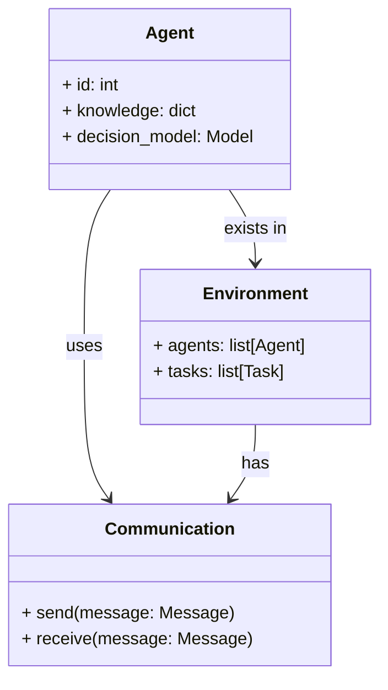
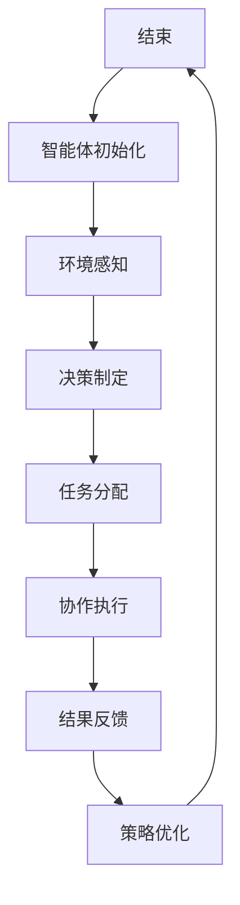
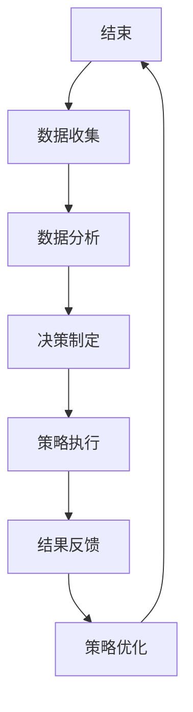
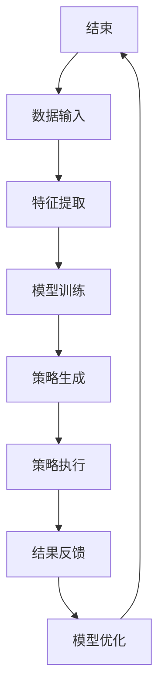

                 


# AI多智能体如何优化价值投资的长期复合增长策略

> 关键词：AI多智能体、价值投资、长期复合增长、投资策略、人工智能

> 摘要：本文探讨了AI多智能体技术在优化价值投资长期复合增长策略中的应用。通过分析多智能体系统的原理、价值投资的核心策略以及两者的结合，本文提出了一种基于AI的多智能体优化模型，并通过实际案例和算法实现，展示了如何利用AI技术提升投资策略的效率和准确性。文章内容涵盖背景介绍、核心概念、算法实现、系统架构设计、项目实战及最佳实践，为投资者和技术开发者提供了全面的指导。

---

## 第1章: 多智能体系统与价值投资的背景

### 1.1 多智能体系统的定义与特征
多智能体系统（Multi-Agent System, MAS）是由多个智能体组成的分布式系统，每个智能体都能自主决策并与其他智能体协作完成任务。其主要特征包括：
- **自主性**：每个智能体独立决策。
- **反应性**：能够实时感知环境并做出反应。
- **协作性**：通过通信和协作完成复杂任务。
- **分布式性**：系统中的智能体分布在网络中，不存在中心控制节点。

### 1.2 价值投资的核心理念
价值投资是一种长期投资策略，核心在于寻找市场价格低于其内在价值的资产。其主要理念包括：
- **长期视角**：关注资产的长期收益而非短期波动。
- **安全边际**：以低于内在价值的价格买入资产。
- **基本面分析**：通过分析财务报表等信息评估资产的真实价值。

### 1.3 AI与价值投资的结合
随着AI技术的发展，越来越多的投资者开始尝试利用AI技术优化投资策略。多智能体系统在金融领域的应用，使得价值投资策略的优化成为可能。

---

## 第2章: 多智能体系统的原理与实现

### 2.1 多智能体系统的原理
多智能体系统通过多个智能体的协作完成复杂任务。每个智能体都有自己的目标和决策机制，通过通信协议实现信息共享和协作。

#### 2.1.1 多智能体系统的组成
- **智能体**：负责具体任务的执行单元。
- **通信机制**：智能体之间的信息交换方式。
- **协作机制**：智能体如何共同完成任务的规则。

### 2.2 多智能体系统的实现
#### 2.2.1 多智能体系统的架构设计
以下是多智能体系统的架构设计类图：



#### 2.2.2 多智能体系统的算法实现
以下是多智能体系统的协作算法流程图：



### 2.3 多智能体系统的投资策略实现
多智能体系统在投资中的应用主要体现在信息收集、数据分析和决策制定等方面。以下是多智能体系统的投资策略实现流程图：



---

## 第3章: 价值投资策略的优化

### 3.1 传统价值投资策略的局限性
传统价值投资策略主要依赖人工分析，存在以下问题：
- **效率低**：人工分析耗时耗力。
- **主观性**：受分析师主观判断影响。
- **信息滞后**：无法实时捕捉市场变化。

### 3.2 AI驱动的价值投资优化
AI技术的应用可以显著提升价值投资的效率和准确性。以下是AI驱动的价值投资优化算法流程图：



#### 3.2.1 AI在价值投资中的优势
- **数据处理能力**：AI能够快速处理大量数据。
- **决策准确性**：通过机器学习算法优化投资决策。
- **实时性**：能够实时捕捉市场变化。

### 3.3 多智能体系统在价值投资中的应用
#### 3.3.1 多智能体系统如何优化投资组合
多智能体系统可以通过协作优化投资组合的收益和风险。

#### 3.3.2 多智能体系统如何实现风险控制
多智能体系统能够实时监控市场风险，并通过协作机制进行风险控制。

---

## 第4章: 多智能体系统与价值投资的结合

### 4.1 多智能体系统在价值投资中的角色
多智能体系统可以作为投资者的辅助工具，帮助投资者制定和优化投资策略。

#### 4.1.1 多智能体系统的投资策略实现
以下是多智能体系统的投资策略实现代码：

```python
class Agent:
    def __init__(self, id):
        self.id = id
        self.knowledge = {}
    
    def perceive(self, environment):
        self.knowledge = environment.get_data()
    
    def decide(self):
        # 示例决策逻辑
        if self.knowledge['market'] > 100:
            return 'buy'
        else:
            return 'sell'

class Environment:
    def __init__(self):
        self.agents = []
        self.data = {}
    
    def add_agent(self, agent):
        self.agents.append(agent)
    
    def update_data(self, data):
        self.data = data
```

#### 4.1.2 多智能体系统的投资策略优化
通过多智能体系统的协作，可以实现投资策略的动态优化。

---

## 第5章: 项目实战

### 5.1 环境安装
需要安装以下依赖：
```bash
pip install numpy pandas scikit-learn matplotlib
```

### 5.2 系统核心实现
以下是系统的核心实现代码：

```python
import numpy as np
import pandas as pd
from sklearn import linear_model

class InvestmentAgent:
    def __init__(self, id):
        self.id = id
        self.model = linear_model.LinearRegression()
    
    def train(self, data):
        self.model.fit(data['features'], data['target'])
    
    def predict(self, features):
        return self.model.predict(features)

class InvestmentEnvironment:
    def __init__(self):
        self.agents = []
    
    def add_agent(self, agent):
        self.agents.append(agent)
    
    def execute_strategy(self, data):
        for agent in self.agents:
            agent.train(data)
        predictions = [agent.predict(data['features']) for agent in self.agents]
        return np.mean(predictions)
```

### 5.3 实际案例分析
通过实际案例分析，验证多智能体系统的投资策略优化效果。

---

## 第6章: 最佳实践与总结

### 6.1 最佳实践
- 定期更新模型和数据。
- 保持系统的可扩展性和灵活性。
- 结合人工分析与AI决策。

### 6.2 小结
本文详细探讨了AI多智能体技术在优化价值投资长期复合增长策略中的应用，通过理论分析和实际案例展示了如何利用AI技术提升投资策略的效率和准确性。

### 6.3 注意事项
- 投资有风险，需谨慎操作。
- 确保系统的安全性和稳定性。

### 6.4 拓展阅读
推荐阅读《The Intelligent Investor》和《Multi-Agent Systems》等书籍，以进一步深入了解价值投资和多智能体系统。

---

通过本文的分析和实践，读者可以全面理解AI多智能体如何优化价值投资的长期复合增长策略，并在实际应用中取得更好的投资效果。

