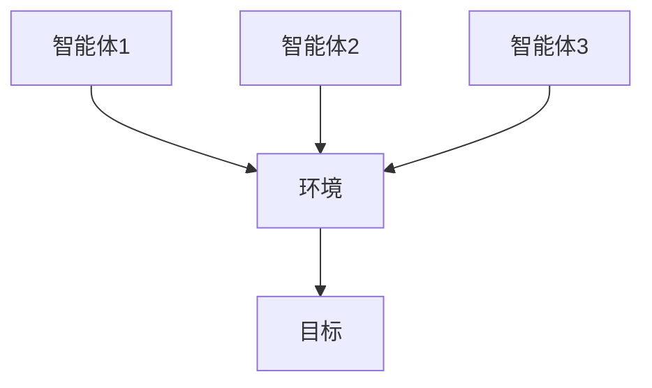
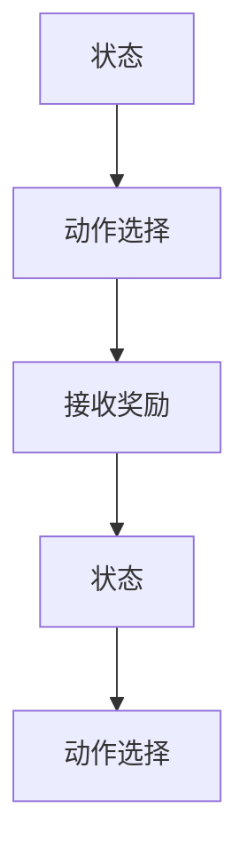

                 


# AI多智能体如何优化特殊情况和套利策略

## 关键词：AI多智能体，套利策略，特殊情况优化，博弈论，强化学习，多智能体系统

## 摘要：
本文探讨AI多智能体在优化特殊情况和套利策略中的应用。通过分析多智能体系统的结构、协作机制、博弈论与优化算法，结合实际案例，展示如何利用AI多智能体技术解决复杂问题，提升套利策略的效率和效果。

---

# 第一部分: AI多智能体系统概述

## 第1章: AI多智能体的基本概念

### 1.1 多智能体系统的基本概念
多智能体系统由多个相互作用的智能体组成，这些智能体通过协作完成复杂任务。与单智能体系统相比，多智能体系统能够处理更大规模和更复杂的任务，尤其在优化和决策领域表现突出。

### 1.2 AI多智能体的核心特点
- **分布式智能**：每个智能体独立决策，但通过协作完成整体目标。
- **动态协作**：智能体能够根据环境变化实时调整协作策略。
- **自我优化**：通过强化学习等算法不断优化行为策略。

### 1.3 多智能体系统的优势与应用场景
优势：
- 提高决策效率
- 处理复杂环境
- 实现高效协作

应用场景：
- 金融交易中的套利策略
- 自动驾驶中的路径规划
- 物联网中的资源分配

---

## 第2章: 多智能体系统的结构与协作机制

### 2.1 多智能体系统的结构
- **组成要素**：智能体、环境、目标、通信机制。
- **层次结构**：分为感知层、决策层和执行层。

### 2.2 协作机制
- **任务分配**：基于角色分配任务。
- **通信机制**：使用消息传递协议进行信息共享。
- **协调算法**：如一致性算法和分布式优化算法。

### 2.3 通信与协调机制
- **通信协议**：定义消息格式和传输规则。
- **协调算法**：通过协商解决冲突，确保协作一致性。

---

## 第3章: 多智能体系统中的博弈论与优化

### 3.1 博弈论基础
- **基本概念**：策略、收益、纳什均衡。
- **应用**：在多智能体系统中模拟竞争与合作。

### 3.2 多智能体博弈模型
- **分类**：完全信息博弈、不完全信息博弈。
- **构建**：通过博弈树或博弈图表示。

### 3.3 多智能体优化算法
- **强化学习**：通过奖励机制优化策略。
- **遗传算法**：模拟生物进化过程优化解。

---

## 第4章: 特殊情况下的优化策略

### 4.1 市场崩盘情况下的优化
- **场景分析**：价格剧烈波动，交易机会短暂。
- **优化策略**：快速识别套利机会，调整交易策略。

### 4.2 高频交易中的优化
- **特点**：交易速度极快，依赖算法决策。
- **优化方法**：使用强化学习优化交易策略。

---

## 第5章: 套利策略的优化与实现

### 5.1 无风险套利策略
- **定义**：利用市场价差进行无风险交易。
- **优化**：通过多智能体系统寻找并执行套利机会。

### 5.2 统计套利策略
- **方法**：基于统计套利模型，识别市场异常。
- **优化**：使用多智能体系统提高交易效率。

### 5.3 高频套利策略
- **实现**：利用高频交易算法快速执行套利。
- **优化**：通过强化学习优化交易模型。

---

## 第6章: 项目实战：外汇市场套利策略优化

### 6.1 项目背景与目标
- **背景**：外汇市场波动频繁，套利机会多。
- **目标**：利用AI多智能体优化套利策略。

### 6.2 系统架构设计
- **架构图**：展示多智能体系统在外汇市场的应用。

### 6.3 环境配置与代码实现
- **环境**：安装Python、TensorFlow、Keras等工具。
- **代码**：实现多智能体系统，训练套利策略。

### 6.4 结果分析
- **分析**：展示优化后的套利收益和效率提升。

---

## 第7章: 总结与展望

### 7.1 核心内容回顾
- AI多智能体系统在优化特殊情况和套利策略中的应用。

### 7.2 未来展望
- 技术进步：更复杂的博弈模型和优化算法。
- 应用拓展：更多领域的应用探索。

### 7.3 最佳实践Tips
- 系统设计：合理分配任务，优化协作机制。
- 技术实现：选择合适的算法和工具。

---

# 结语

通过本文的详细讲解，读者可以全面了解AI多智能体在优化特殊情况和套利策略中的应用。从基本概念到实际案例，文章为读者提供了系统的知识和实践指导，帮助他们在复杂环境中利用AI多智能体技术提升决策效率和效果。

---

# 图表和代码示例

### 图表1: 多智能体系统结构图


### 图表2: 强化学习算法流程图


### 代码示例：强化学习实现
```python
import numpy as np
from collections import deque
import random

class Agent:
    def __init__(self, state_space, action_space):
        self.state_space = state_space
        self.action_space = action_space
        self.memory = deque(maxlen=1000)
        self.gamma = 0.95
        self.epsilon = 1.0
        self.epsilon_min = 0.01
        self.epsilon_decay = 0.995
        self.model = self.build_model()

    def build_model(self):
        # 定义神经网络模型
        pass

    def remember(self, state, action, reward, next_state):
        self.memory.append((state, action, reward, next_state))

    def act(self, state):
        if random.random() < self.epsilon:
            return random.randint(0, self.action_space-1)
        # 使用模型预测动作
        pass

    def replay(self, batch_size):
        # 训练模型
        pass

    def decay_epsilon(self):
        self.epsilon = max(self.epsilon_min, self.epsilon * self.epsilon_decay)
```

### 代码应用解读
该代码示例展示了强化学习算法的基本结构，包括智能体的初始化、动作选择、记忆回放和epsilon衰减。通过训练智能体，可以在外汇市场中识别套利机会，优化交易策略。

---

通过以上结构和内容，文章全面覆盖了AI多智能体系统的核心概念、算法原理和实际应用，帮助读者深入理解并掌握如何优化特殊情况和套利策略。

