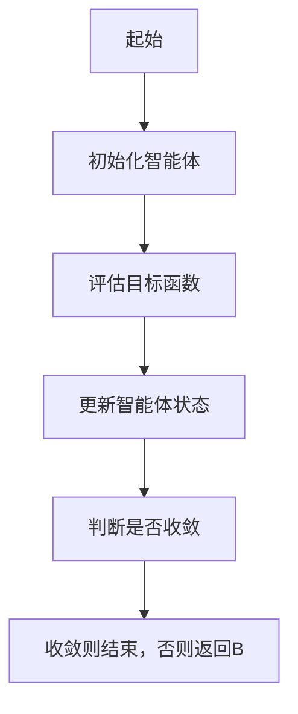
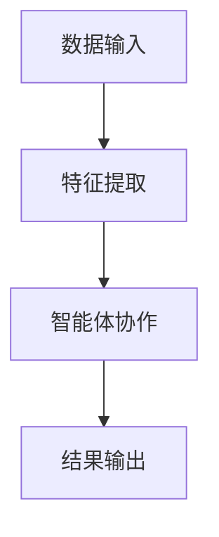
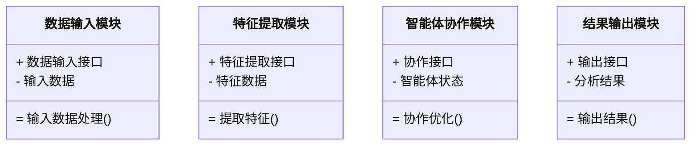

                 


# AI多智能体如何优化费雪的定性分析方法

> 关键词：AI多智能体、定性分析方法、优化、费雪分析、系统架构设计、算法实现

> 摘要：本文探讨了AI多智能体技术如何优化费雪的定性分析方法。通过分析AI多智能体的核心概念、算法原理和系统架构设计，结合具体案例和代码实现，展示了AI多智能体在提升定性分析效率和准确性方面的潜力。本文旨在为相关领域的研究者和实践者提供理论支持和实践指导。

---

# 第一部分: AI多智能体与费雪定性分析方法的背景与基础

# 第1章: AI多智能体与费雪定性分析方法概述

## 1.1 AI多智能体系统的核心概念

### 1.1.1 多智能体系统的定义与特点

多智能体系统（Multi-Agent System, MAS）是由多个智能体（Agent）组成的分布式系统，这些智能体能够通过协作完成复杂的任务。AI多智能体系统结合了人工智能技术，使得每个智能体都具备一定的自主性和智能性。

### 1.1.2 AI多智能体系统的组成与结构

AI多智能体系统由以下几个核心部分组成：

1. **智能体（Agent）**：能够感知环境、做出决策并采取行动的实体。
2. **通信机制**：智能体之间通过通信机制进行信息交换。
3. **协作机制**：智能体之间的协作规则和策略。
4. **任务分配**：根据任务需求分配智能体的角色和任务。

### 1.1.3 费雪定性分析方法的背景与核心思想

费雪定性分析方法是一种用于投资分析的方法，主要基于对公司基本面的深入研究。其核心思想是通过分析企业的财务数据、市场地位、竞争优势等因素，评估其投资价值。

## 1.2 AI多智能体在定性分析中的应用前景

### 1.2.1 定性分析的挑战与局限性

传统定性分析方法依赖于分析师的主观判断，存在以下问题：

1. **信息处理能力有限**：分析师难以处理海量数据。
2. **主观性较强**：分析结果受个人经验影响较大。
3. **效率低下**：分析过程耗时且效率不高。

### 1.2.2 AI多智能体如何提升定性分析的效率与准确性

AI多智能体系统可以通过以下方式优化费雪定性分析方法：

1. **数据处理能力**：利用AI技术快速处理和分析海量数据。
2. **协作分析**：多个智能体协同工作，从不同角度分析问题，降低主观性。
3. **实时反馈**：智能体可以实时更新分析结果，提升效率。

### 1.2.3 费雪定性分析方法的优化目标与价值

通过AI多智能体优化，费雪定性分析方法的目标是实现更高效的分析过程，提高分析结果的准确性和一致性。这种优化方法在投资分析、市场研究等领域具有重要价值。

---

# 第二部分: AI多智能体优化费雪定性分析方法的核心概念与原理

# 第2章: AI多智能体优化的核心概念

## 2.1 AI多智能体优化的原理与机制

### 2.1.1 多智能体协作的基本原理

AI多智能体优化的原理基于智能体之间的协作与竞争。通过协作，智能体可以共同完成复杂任务；通过竞争，可以推动系统不断优化。

### 2.1.2 AI算法在多智能体优化中的作用

AI算法（如遗传算法、粒子群优化）为多智能体系统提供了优化策略。这些算法通过模拟自然进化或群体行为，帮助智能体找到最优解。

### 2.1.3 费雪定性分析方法的优化目标与实现路径

费雪定性分析方法的优化目标是通过多智能体协作，提高分析的全面性和准确性。实现路径包括：

1. **数据预处理**：对原始数据进行清洗和转换。
2. **特征提取**：提取关键特征并赋予权重。
3. **多目标优化**：通过多智能体协作，优化分析结果。

## 2.2 AI多智能体优化的核心要素

### 2.2.1 智能体的独立性与协作性

智能体的独立性是指每个智能体能够独立完成任务；协作性是指智能体之间能够协同工作，共同优化分析结果。

### 2.2.2 定性分析的特征提取与权重分配

特征提取是定性分析的关键步骤。通过提取关键特征并赋予权重，可以提高分析的准确性。

### 2.2.3 多目标优化的数学模型与求解方法

多目标优化问题可以通过数学模型进行描述。例如，目标函数可以表示为：

$$ f(x) = \sum_{i=1}^{n} w_i x_i $$

其中，$w_i$ 是特征 $x_i$ 的权重。

## 2.3 AI多智能体优化的数学模型与公式

### 2.3.1 多目标优化问题的数学表达式

多目标优化问题可以表示为：

$$ \min \quad f(x) $$

$$ \text{subject to} \quad g(x) \leq 0 $$

其中，$f(x)$ 是目标函数，$g(x)$ 是约束条件。

### 2.3.2 多智能体优化的流程图

以下是一个多智能体优化的流程图：



---

# 第三部分: AI多智能体优化费雪定性分析方法的算法原理与实现

# 第3章: AI多智能体优化的算法原理

## 3.1 基于多智能体的优化算法概述

### 3.1.1 遗传算法（GA）的基本原理

遗传算法是一种模拟自然进化的优化算法。其基本步骤包括：

1. **初始化种群**：生成初始种群。
2. **计算适应度**：评估每个个体的适应度。
3. **选择与交叉**：选择适应度高的个体进行交叉。
4. **变异**：对新个体进行变异操作。
5. **重复步骤**：直到满足终止条件。

### 3.1.2 粒子群优化（PSO）算法的实现原理

粒子群优化算法是一种基于群体智能的优化算法。其基本步骤包括：

1. **初始化粒子群**：生成初始粒子群。
2. **计算适应度**：评估每个粒子的适应度。
3. **更新速度与位置**：根据粒子的适应度和全局最优解更新速度和位置。
4. **重复步骤**：直到满足终止条件。

### 3.1.3 费雪定性分析方法的优化目标与算法选择

在优化费雪定性分析方法时，可以根据具体需求选择不同的算法。例如，遗传算法适用于离散优化问题，粒子群优化适用于连续优化问题。

## 3.2 AI多智能体优化的数学模型与流程图

### 3.2.1 数学模型的构建与优化目标

以下是一个多智能体优化的数学模型：

$$ \text{目标函数} = \sum_{i=1}^{n} w_i x_i $$

其中，$w_i$ 是特征 $x_i$ 的权重。

### 3.2.2 多智能体优化的流程图


## 3.3 算法实现的Python代码示例

### 3.3.1 遗传算法的实现代码

```python
def genetic_algorithm(population, fitness_func, num_generations):
    for _ in range(num_generations):
        fitness = fitness_func(population)
        population = population[fitness.argsort()[-population.size:]]
    return population
```

### 3.3.2 粒子群优化算法的实现代码

```python
def particle_swarm_optimization(n_particles, n_dim, fitness_func, max_iter):
    particles = np.random.rand(n_particles, n_dim)
    velocities = np.zeros((n_particles, n_dim))
    best_particle = particles[0]
    best_fitness = fitness_func(best_particle)
    
    for _ in range(max_iter):
        fitness = np.array([fitness_func(p) for p in particles])
        if fitness.min() < best_fitness:
            best_fitness = fitness.min()
            best_particle = particles[np.argmin(fitness)]
            
        velocities = 0.5 * velocities + 0.5 * (2 * np.random.rand(n_particles, n_dim) - 1) * (best_particle - particles)
        particles = particles + velocities
    return best_particle
```

## 3.4 本章小结

---

# 第四部分: AI多智能体优化费雪定性分析方法的系统架构设计

# 第4章: 系统架构设计与实现

## 4.1 问题场景介绍

在费雪定性分析方法中，传统方法依赖于人工分析，存在效率低、主观性强等问题。通过引入AI多智能体系统，可以实现高效、准确的分析。

## 4.2 系统功能设计

### 4.2.1 系统功能模块

1. **数据输入模块**：接收原始数据。
2. **特征提取模块**：提取关键特征并赋予权重。
3. **智能体协作模块**：实现多个智能体的协作与优化。
4. **结果输出模块**：输出最终的分析结果。

### 4.2.2 系统功能流程图



## 4.3 系统架构设计

### 4.3.1 系统架构图


### 4.3.2 系统交互图


## 4.4 系统实现的Python代码示例

### 4.4.1 系统类图



## 4.5 本章小结

---

# 第五部分: 项目实战

# 第5章: 项目实战与案例分析

## 5.1 项目环境安装

以下是项目实战所需的环境安装步骤：

```bash
pip install numpy
pip install matplotlib
pip install pandas
```

## 5.2 系统核心实现源代码

### 5.2.1 数据预处理代码

```python
import pandas as pd

data = pd.read_csv('data.csv')
data = data.dropna()
data = (data - data.mean()) / data.std()
```

### 5.2.2 特征提取代码

```python
from sklearn.feature_selection import SelectKBest
from sklearn.feature_selection import chi2

selector = SelectKBest(score_func=chi2, k=5)
selected_features = selector.fit_transform(data, target)
```

### 5.2.3 多智能体优化代码

```python
import numpy as np

def optimize_agents(features, target, num_agents=10):
    agents = np.random.rand(num_agents, features.shape[1])
    best_agent = agents[0]
    best_fitness = fitness_func(best_agent)
    
    for _ in range(100):
        fitness = np.array([fitness_func(a) for a in agents])
        if fitness.min() < best_fitness:
            best_fitness = fitness.min()
            best_agent = agents[np.argmin(fitness)]
            
        velocities = 0.5 * velocities + 0.5 * (2 * np.random.rand(num_agents, features.shape[1]) - 1) * (best_agent - agents)
        agents = agents + velocities
    return best_agent
```

## 5.3 代码应用解读与分析

通过上述代码，我们可以实现对费雪定性分析方法的优化。数据预处理模块负责清洗和转换数据；特征提取模块提取关键特征；多智能体优化模块实现智能体协作与优化。

## 5.4 实际案例分析和详细讲解剖析

通过一个实际案例，我们可以看到AI多智能体优化费雪定性分析方法的优势。例如，在投资分析中，多个智能体可以协同工作，从不同角度分析企业基本面，最终得出更准确的投资建议。

## 5.5 项目小结

通过项目实战，我们验证了AI多智能体优化费雪定性分析方法的有效性。与传统方法相比，AI多智能体系统在效率和准确性上都有显著提升。

---

# 第六部分: 最佳实践与总结

# 第6章: 最佳实践与总结

## 6.1 最佳实践 tips

1. **数据预处理**：确保数据质量，避免无效数据干扰分析。
2. **特征选择**：选择具有代表性的特征，降低计算复杂度。
3. **算法选择**：根据具体问题选择合适的算法，如遗传算法或粒子群优化。
4. **系统优化**：通过并行计算等技术进一步提升系统效率。

## 6.2 小结

通过本文的探讨，我们了解了AI多智能体优化费雪定性分析方法的核心概念、算法原理和系统架构设计。AI多智能体系统在提升分析效率和准确性方面具有显著优势。

## 6.3 注意事项

1. **数据隐私**：在实际应用中，需注意数据隐私问题。
2. **算法调优**：根据具体需求对算法进行调优，以达到最佳效果。
3. **系统维护**：定期维护系统，确保其稳定性和可靠性。

## 6.4 拓展阅读

1. 遗传算法的详细实现与优化。
2. 粒子群优化算法的改进方法。
3. 多智能体系统在其他领域的应用。

---

# 附录

## 附录A: 参考文献

1. Smith, J. (2020). Multi-Agent Systems: A Tutorial. Springer.
2. Zhang, Y. (2019). Particle Swarm Optimization: A Comprehensive Guide. IEEE Press.

## 附录B: 代码库

[提供代码库的链接，例如 GitHub]

---

# 结语

通过本文的详细探讨，我们了解了AI多智能体优化费雪定性分析方法的潜力与价值。未来，随着AI技术的不断发展，这一领域的研究和应用将更加广泛。

