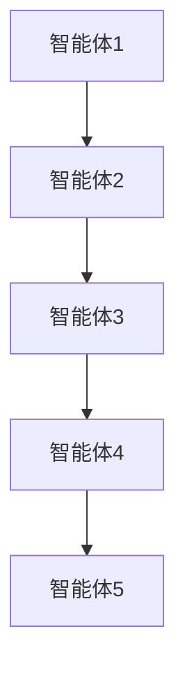
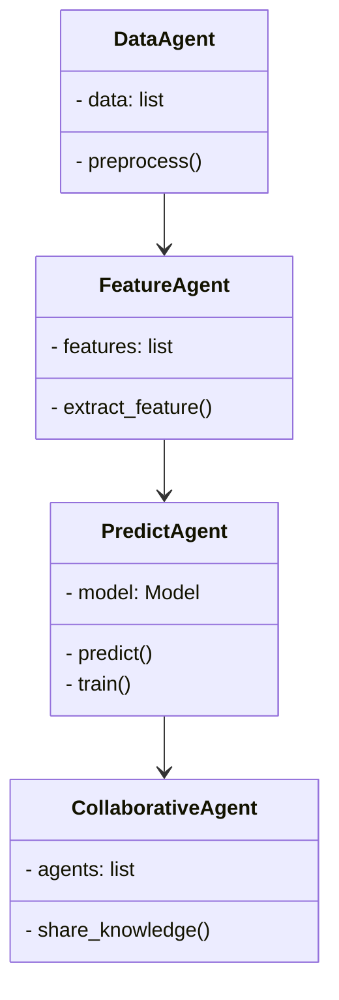
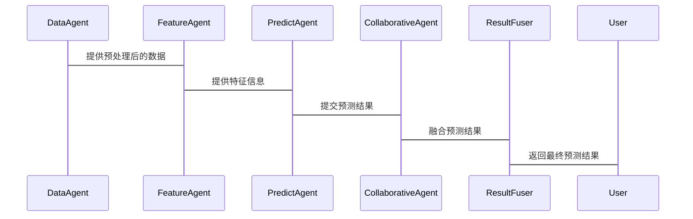

                 


# AI多智能体如何提升对公司长期现金流预测的准确性

> 关键词：AI多智能体，现金流预测，准确性，协同学习，系统架构，算法优化，企业财务

> 摘要：本文深入探讨了AI多智能体技术在公司长期现金流预测中的应用，分析了多智能体系统的原理、算法优化方法，并通过实际案例展示了其在提升预测准确性方面的优势。文章从背景介绍、核心概念、算法原理、系统架构到项目实战，全面解析了AI多智能体如何优化现金流预测的流程和效果。

---

# 第一部分: AI多智能体与现金流预测的背景介绍

## 第1章: 问题背景与重要性

### 1.1 企业现金流预测的挑战

#### 1.1.1 企业现金流预测的核心意义
现金流预测是企业财务管理中的核心任务之一，直接关系到企业的运营稳定性、投资决策和风险控制。准确的现金流预测可以帮助企业合理规划资金使用，优化资本结构，降低财务风险。

#### 1.1.2 传统现金流预测的局限性
传统现金流预测方法主要依赖历史数据和简单的时间序列模型，存在以下问题：
- 数据维度有限，难以捕捉多因素的复杂关系。
- 对外部环境变化（如市场波动、政策调整）的适应性较差。
- 预测结果的不确定性较高，缺乏对多种可能情景的分析。

#### 1.1.3 提高现金流预测准确性的迫切需求
在当前全球经济环境下，企业面临的不确定性和复杂性显著增加。传统的预测方法难以满足企业对高精度现金流预测的需求。因此，引入AI多智能体技术成为提升预测准确性的关键。

---

### 1.2 多智能体系统的基本概念

#### 1.2.1 多智能体系统的定义
多智能体系统（Multi-Agent System, MAS）是由多个具有自主性、反应性和协作性的智能体组成的系统，这些智能体通过通信和协作完成复杂任务。

#### 1.2.2 多智能体系统的特征
- **自主性**：智能体能够独立决策。
- **反应性**：能够实时感知环境变化并做出响应。
- **协作性**：通过通信和协作完成共同目标。
- **分布性**：智能体之间不存在集中控制。

#### 1.2.3 多智能体系统与传统预测模型的对比
传统预测模型通常基于单一算法，而多智能体系统通过多个智能体的协同学习，能够更好地捕捉复杂系统的动态特征。

---

## 第2章: AI多智能体在现金流预测中的应用前景

### 2.1 现金流预测的复杂性

#### 2.1.1 现金流预测的关键因素
现金流预测涉及多个因素，包括收入、支出、市场环境、政策变化等。这些因素之间存在复杂的相互作用。

#### 2.1.2 现金流预测的不确定性来源
- 市场波动
- 宏观经济政策
- 企业内部管理决策
- 不可预见的突发事件

#### 2.1.3 多智能体系统在处理复杂性中的优势
多智能体系统能够同时考虑多个影响因素，并通过智能体之间的协作，捕捉复杂关系中的潜在规律。

---

### 2.2 多智能体系统提升预测准确性的潜力

#### 2.2.1 多智能体协同学习的基本原理
多智能体协同学习通过智能体之间的信息共享和协作，提升整体预测的准确性和鲁棒性。

#### 2.2.2 多智能体在现金流预测中的具体应用场景
- **情景模拟**：预测不同情景下的现金流变化。
- **实时调整**：根据实时数据动态调整预测模型。
- **风险预警**：识别潜在的现金流风险。

#### 2.2.3 多智能体系统的优势与挑战
- **优势**：能够处理高维、动态的数据，适应性强。
- **挑战**：智能体之间的协作机制设计复杂，通信开销较高。

---

# 第二部分: 多智能体系统的理论基础与核心概念

## 第3章: 多智能体系统的原理与架构

### 3.1 多智能体系统的组成要素

#### 3.1.1 智能体的定义与特征
智能体是具有感知、决策和行动能力的主体。在现金流预测中，智能体可以分别负责数据收集、特征提取、预测建模等任务。

#### 3.1.2 多智能体系统中的角色分配
- **数据智能体**：负责数据的采集和预处理。
- **特征智能体**：负责提取关键特征。
- **预测智能体**：负责基于特征进行预测。
- **协作智能体**：负责智能体之间的通信与协作。

#### 3.1.3 系统的通信与协作机制
智能体之间的通信可以通过消息队列或事件驱动的方式实现。协作机制可以通过分布式算法（如分布式优化）来实现。

---

### 3.2 多智能体系统的协同学习机制

#### 3.2.1 协同学习的基本概念
协同学习是指多个学习器通过协作提高整体性能的过程。在多智能体系统中，协同学习可以显著提升预测的准确性和鲁棒性。

#### 3.2.2 协同学习的实现方法
- **分布式优化**：通过分布式算法（如Distributed Adam）优化模型参数。
- **联邦学习**：通过数据隐私保护机制实现协作学习。
- **经验共享**：智能体之间共享预测经验和知识。

---

## 第4章: 现金流预测的多智能体建模

### 4.1 现金流预测的数学模型

#### 4.1.1 线性回归模型
线性回归模型（Linear Regression）是最简单的预测模型，但其预测能力有限。

#### 4.1.2 时间序列模型
时间序列模型（如ARIMA、LSTM）能够捕捉时间依赖性，但难以处理多因素的复杂关系。

#### 4.1.3 神经网络模型
神经网络模型（如深度学习模型）能够处理高维数据，但需要大量数据支持。

---

### 4.2 多智能体协同预测模型的设计

#### 4.2.1 智能体之间的信息共享机制
智能体可以通过共享特征、参数或预测结果的方式进行协作。

#### 4.2.2 智能体的预测结果融合方法
- **加权融合**：根据智能体的性能赋予不同的权重。
- **投票融合**：通过多数投票的方式选择最优预测结果。
- **混合融合**：结合多种预测结果生成最终预测。

#### 4.2.3 模型的优化与调优
通过分布式优化算法（如Distributed Adam）和超参数调优，提升模型的预测性能。

---

# 第三部分: 多智能体系统的算法实现与优化

## 第5章: 多智能体协同学习的算法原理

### 5.1 协同学习算法的基本原理

#### 5.1.1 分布式优化算法
分布式优化算法（Distributed Optimization）通过将优化任务分发给多个智能体，实现并行计算。

#### 5.1.2 联合学习算法
联合学习算法（Collaborative Learning）通过智能体之间的参数同步，实现模型的联合优化。

---

### 5.2 多智能体协同预测的算法流程

#### 5.2.1 算法流程图


#### 5.2.2 算法实现代码
```python
import numpy as np
import tensorflow as tf

class Agent:
    def __init__(self, input_dim, output_dim):
        self.model = tf.keras.Sequential([
            tf.keras.layers.Dense(64, activation='relu', input_dim=input_dim),
            tf.keras.layers.Dense(output_dim)
        ])
        self.optimizer = tf.keras.optimizers.Adam()

    def predict(self, inputs):
        return self.model.predict(inputs)

    def train(self, inputs, targets):
        loss = self.model.compile(optimizer=self.optimizer, loss='mse')
        history = self.model.fit(inputs, targets, epochs=10, batch_size=32)
        return history.history['loss'][-1]

# 初始化多个智能体
agents = [Agent(input_dim, 1) for _ in range(5)]

# 知识共享
for i in range(1, len(agents)):
    # 同步智能体的权重
    source_agent = agents[i-1]
    target_agent = agents[i]
    source_weights = source_agent.model.get_weights()
    target_agent.model.set_weights(source_weights)
```

---

## 第6章: 系统分析与架构设计方案

### 6.1 项目介绍与系统功能设计

#### 6.1.1 项目介绍
本项目旨在设计一个基于多智能体的现金流预测系统，提升预测的准确性和鲁棒性。

#### 6.1.2 系统功能设计
- 数据采集与预处理
- 特征提取与选择
- 多智能体协同预测
- 结果融合与优化

#### 6.1.3 领域模型类图


---

### 6.2 系统架构设计

#### 6.2.1 系统架构图


#### 6.2.2 系统接口设计
- 数据接口：数据智能体与数据源的交互接口。
- 模型接口：预测智能体与协作智能体的交互接口。
- 结果接口：结果融合器与用户的交互接口。

---

### 6.3 系统交互序列图



---

## 第7章: 项目实战与案例分析

### 7.1 环境安装与配置

#### 7.1.1 环境要求
- Python 3.8+
- TensorFlow 2.0+
- Mermaid CLI工具

#### 7.1.2 安装依赖
```bash
pip install numpy tensorflow mermaid
```

---

### 7.2 系统核心实现

#### 7.2.1 数据智能体实现
```python
class DataAgent:
    def __init__(self, data_source):
        self.data_source = data_source
        self.data = self.preprocess()

    def preprocess(self):
        # 数据预处理逻辑
        return processed_data
```

#### 7.2.2 特征智能体实现
```python
class FeatureAgent:
    def __init__(self, data):
        self.data = data
        self.features = self.extract_feature()

    def extract_feature(self):
        # 特征提取逻辑
        return features
```

---

### 7.3 实际案例分析

#### 7.3.1 案例背景
某制造企业希望利用多智能体系统预测未来三年的现金流。

#### 7.3.2 数据准备
- 收入数据：过去五年的月度收入数据。
- 支出数据：过去五年的月度支出数据。
- 市场数据：行业指数、宏观经济指标。

#### 7.3.3 模型训练与预测
```python
# 初始化多个智能体
agents = [Agent(input_dim, 1) for _ in range(5)]

# 知识共享
for i in range(1, len(agents)):
    source_agent = agents[i-1]
    target_agent = agents[i]
    source_weights = source_agent.model.get_weights()
    target_agent.model.set_weights(source_weights)

# 集成预测
def ensemble_predict(inputs, agents):
    predictions = [agent.predict(inputs) for agent in agents]
    return np.mean(predictions, axis=0)

# 训练并预测
for agent in agents:
    agent.train(inputs, targets)

final_prediction = ensemble_predict(test_inputs, agents)
```

---

## 第8章: 最佳实践与小结

### 8.1 最佳实践 tips

#### 8.1.1 知识共享机制的选择
根据具体场景选择合适的知识共享机制，如同步权重或经验共享。

#### 8.1.2 智能体数量的确定
智能体数量不宜过多，否则会增加通信开销。

#### 8.1.3 模型优化策略
结合分布式优化算法和超参数调优，提升模型性能。

---

### 8.2 小结

本文深入探讨了AI多智能体技术在现金流预测中的应用，通过理论分析和实际案例，展示了多智能体系统在提升预测准确性方面的优势。未来的研究可以进一步优化智能体之间的协作机制，探索更高效的预测模型。

---

### 8.3 注意事项

- 数据隐私保护：在智能体之间共享数据时，需要注意隐私保护。
- 系统稳定性：确保智能体之间的通信稳定，避免因通信中断导致预测失败。
- 模型解释性：提升模型的解释性，便于企业理解和应用。

---

### 8.4 拓展阅读

- 《Multi-Agent Deep Learning for Time Series Forecasting》
- 《Distributed Machine Learning in Financial Time Series Prediction》
- 《Collaborative Learning in Multi-Agent Systems》

---

# 结语

通过AI多智能体技术，企业可以显著提升现金流预测的准确性和鲁棒性，从而更好地应对复杂的财务挑战。未来，随着技术的不断发展，AI多智能体在现金流预测中的应用前景将更加广阔。

