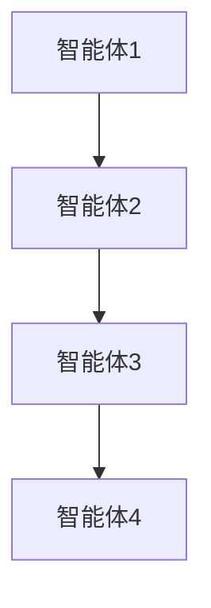
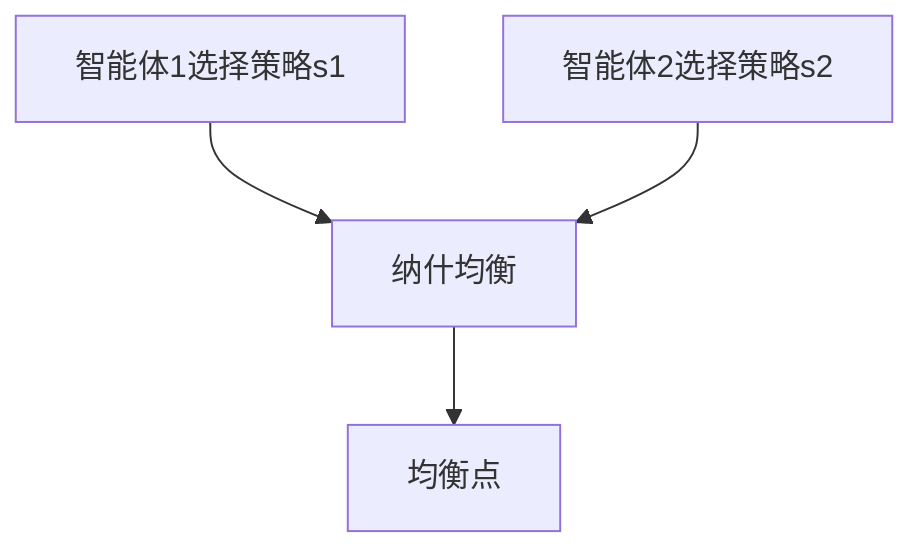
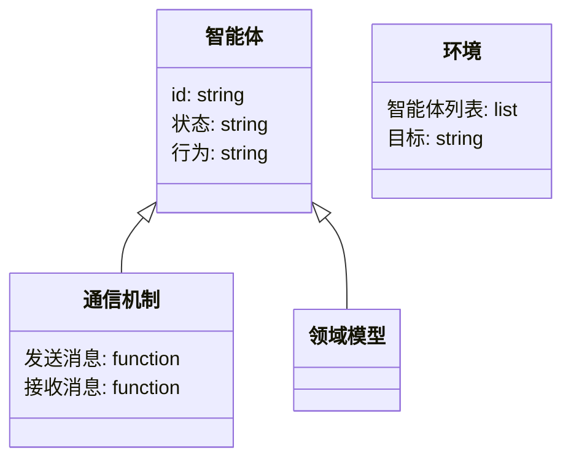
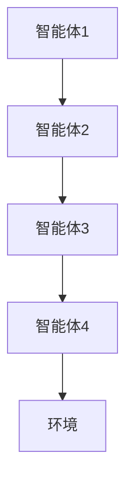
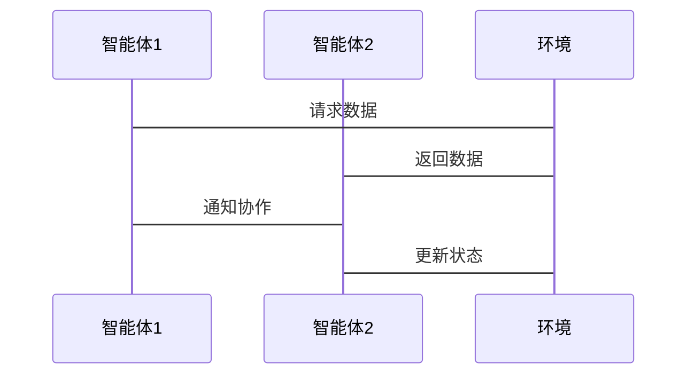
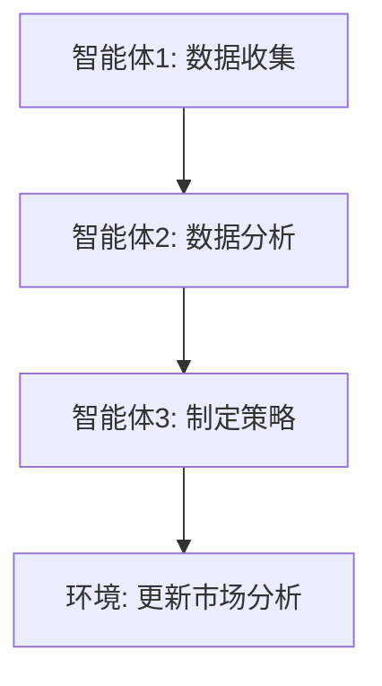

                 


# AI多智能体如何提升对公司长期竞争力的评估

> 关键词：AI多智能体、企业竞争力、算法原理、系统架构、项目实战

> 摘要：本文探讨了AI多智能体技术如何通过协作与优化提升企业竞争力，从基础概念到算法实现，再到系统设计和项目实战，系统地分析了AI多智能体在企业竞争力评估中的应用潜力和实际价值。

---

# 第一部分: AI多智能体与公司长期竞争力评估基础

## 第1章: AI多智能体概述

### 1.1 AI多智能体的核心概念

#### 1.1.1 多智能体系统（Multi-Agent System, MAS）的定义

多智能体系统（MAS）是由多个智能体（Agent）组成的分布式系统，这些智能体能够通过协作完成复杂的任务。智能体是具有感知、决策和执行能力的实体，可以是软件程序、机器人或其他智能系统。

**图1-1: 多智能体系统的结构**



多智能体系统的优点在于智能体之间的协作能够实现单个智能体无法完成的任务，提升系统的整体性能。

#### 1.1.2 多智能体系统的结构与特点

多智能体系统的结构通常包括以下部分：

1. **智能体**：具备感知、决策、规划和执行能力的实体。
2. **通信机制**：智能体之间通过通信机制进行信息交换。
3. **协作机制**：智能体之间通过协作机制共同完成任务。
4. **环境**：智能体所处的外部环境，可以是物理环境或虚拟环境。

**表1-1: 多智能体系统的特点对比**

| 特性      | 分布式系统 | 集中式系统 |
|-----------|------------|------------|
| 控制方式  | 去中心化   | 中心化     |
| 故障容错性 | 高         | 低         |
| 可扩展性   | 高         | 低         |

#### 1.1.3 多智能体系统在企业中的应用潜力

多智能体系统在企业中的应用潜力主要体现在以下几个方面：

1. **协同优化**：通过智能体之间的协作，优化企业的资源配置和运营效率。
2. **动态适应**：智能体能够快速响应环境变化，适应市场波动。
3. **复杂任务处理**：通过多智能体协作，处理复杂的业务流程和决策问题。

---

## 第2章: AI多智能体的核心概念

### 2.1 多智能体系统的协作机制

#### 2.1.1 协作机制的定义

协作机制是指智能体之间通过某种规则或协议进行协作的机制。协作机制的核心在于如何让多个智能体在目标一致的情况下，通过合理的分工与合作，实现整体目标的最优。

#### 2.1.2 协作机制的分类

多智能体系统的协作机制可以分为以下几种：

1. **基于博弈论的协作机制**：通过博弈论模型，分析智能体之间的策略选择和收益分配。
2. **基于规则的协作机制**：通过预定义的规则，指导智能体的行为。
3. **基于学习的协作机制**：通过机器学习算法，智能体之间动态调整协作策略。

---

## 第3章: AI多智能体协作算法原理

### 3.1 多智能体协作算法

#### 3.1.1 基于博弈论的协作算法

**博弈论是研究多智能体协作的重要理论基础。** 在博弈论中，纳什均衡是一个重要的概念。纳什均衡是指在一个策略组合中，每个智能体的策略都是最优的，即没有智能体能够通过单方面改变策略而获得更好的结果。

**公式1-1: 纳什均衡的定义**

$$ \text{对于策略组合} (s_1, s_2, ..., s_n), \text{如果对于每个智能体} i, s_i \text{是其在给定其他智能体策略下的最优策略} $$

**图1-2: 纳什均衡示意图**



#### 3.1.2 基于分布式计算的协作算法

分布式计算是多智能体协作的重要技术手段。在分布式系统中，智能体通过通信机制交换信息，并通过分布式计算完成任务。

**公式1-2: 分布式任务分配模型**

$$ \text{任务分配问题可以转化为一个优化问题，目标是最小化总成本或最大化收益。} $$

#### 3.1.3 基于强化学习的协作算法

强化学习是一种通过试错方式优化决策策略的算法。在多智能体系统中，智能体通过与环境和其他智能体的交互，逐步优化自身的策略。

**公式1-3: Q-learning算法更新公式**

$$ Q(s, a) = Q(s, a) + \alpha [r + \max_{a'} Q(s', a') - Q(s, a)] $$

---

## 第4章: 系统分析与架构设计

### 4.1 问题场景分析

在企业竞争力评估中，多智能体系统可以应用于以下场景：

1. **市场分析**：通过多个智能体实时监控市场动态，提供精准的市场分析报告。
2. **风险评估**：通过智能体之间的协作，评估企业的风险敞口，制定风险应对策略。
3. **资源配置优化**：通过多智能体协作，优化企业的资源配置，提高运营效率。

### 4.2 系统功能设计

#### 4.2.1 领域模型设计

**图4-1: 领域模型类图**



#### 4.2.2 系统架构设计

**图4-2: 系统架构图**



#### 4.2.3 系统交互设计

**图4-3: 系统交互序列图**



---

## 第5章: 项目实战

### 5.1 环境安装

在本项目中，我们需要安装以下工具和库：

1. **Python 3.8+**
2. **PyTorch 1.9+**
3. **Mermaid CLI**
4. **安装依赖：pip install torch matplotlib numpy**

### 5.2 系统核心实现

#### 5.2.1 智能体类的实现

```python
class Agent:
    def __init__(self, id, environment):
        self.id = id
        self.environment = environment
        self.state = "idle"
    
    def perceive(self):
        # 获取环境信息
        return self.environment.get_state()
    
    def decide(self, state):
        # 根据状态做出决策
        pass
    
    def act(self):
        # 执行动作
        pass
```

#### 5.2.2 环境类的实现

```python
class Environment:
    def __init__(self):
        self.agents = []
    
    def add_agent(self, agent):
        self.agents.append(agent)
    
    def get_state(self):
        # 返回环境状态
        return "market_trend"
```

#### 5.2.3 通信机制的实现

```python
class Communication:
    def __init__(self):
        self.channels = {}
    
    def send(self, sender, receiver, message):
        if receiver not in self.channels:
            self.channels[receiver] = []
        self.channels[receiver].append((sender, message))
    
    def receive(self, receiver):
        messages = self.channels.get(receiver, [])
        self.channels[receiver] = []
        return messages
```

### 5.3 实际案例分析

假设我们有一个市场分析的场景，智能体1负责收集市场数据，智能体2负责分析数据，智能体3负责制定策略。

**图5-1: 多智能体协作流程图**



---

## 第6章: 最佳实践与总结

### 6.1 最佳实践

1. **明确协作目标**：在设计多智能体系统时，首先要明确每个智能体的目标和任务。
2. **选择合适的协作机制**：根据具体场景选择合适的协作机制，如基于规则或基于学习的机制。
3. **确保通信机制的可靠性**：智能体之间的通信是协作的关键，需要设计可靠的通信机制。

### 6.2 小结

AI多智能体技术通过协作与优化，能够显著提升企业的长期竞争力。通过本文的分析和实战案例，我们展示了如何设计和实现一个多智能体系统，并将其应用于企业竞争力评估中。

---

## 第7章: 参考文献与拓展阅读

### 7.1 参考文献

1. 纳什, J. (1950). The Bargaining Problem. Econometrica.
2. Littman, M. (2001). A Modern Approach to Multi-Agent Systems. Artificial Intelligence Review.

### 7.2 拓展阅读

1. 《Multi-Agent Systems: Algorithm and Applications》
2. 《Game Theory and its Applications in Computer Science》

---

以上是《AI多智能体如何提升对公司长期竞争力的评估》的技术博客文章目录大纲，您可以根据需要进一步扩展每一部分的具体内容。

