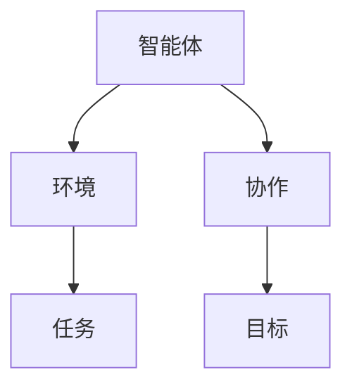

                 


# AI多智能体如何提升对新兴行业价值链的分析

> 关键词：AI多智能体，价值链分析，行业应用，协作机制，系统架构

> 摘要：本文探讨了AI多智能体技术在新兴行业价值链分析中的应用。通过系统化的分析，本文详细介绍了多智能体系统的架构设计、协作机制、算法原理及其在实际场景中的应用。文章结合理论与实践，展示了AI多智能体如何优化新兴行业的价值链分析，提升效率和决策能力。

---

# 第1章: AI多智能体系统概述

## 1.1 多智能体系统的基本概念

### 1.1.1 多智能体系统的定义

多智能体系统（Multi-Agent System, MAS）是由多个智能体（Agent）组成的分布式系统。每个智能体是一个能够感知环境、自主决策并执行任务的实体。这些智能体可以是软件程序、机器人或其他具备智能行为的实体。

**图1-1：多智能体系统概念图**



### 1.1.2 多智能体系统的组成要素

多智能体系统由以下要素组成：
- **智能体（Agent）**：具有感知、决策和执行能力的实体。
- **环境（Environment）**：智能体所处的外部世界，包括任务、目标和约束。
- **通信机制（Communication）**：智能体之间交换信息的方式。
- **协作机制（Collaboration）**：智能体之间协同完成任务的方式。
- **目标（Goal）**：智能体或系统的最终目标。

### 1.1.3 多智能体系统的特点与优势

多智能体系统具有以下特点：
- **分布性**：智能体分布在网络中，各自独立运行。
- **协作性**：智能体通过协作完成复杂任务。
- **智能性**：每个智能体具备一定的智能决策能力。
- **适应性**：系统能够动态调整以应对环境变化。

---

## 1.2 AI在多智能体系统中的应用

### 1.2.1 AI驱动的多智能体系统

人工智能（AI）技术为多智能体系统注入了智能决策能力。AI驱动的多智能体系统通过强化学习、机器学习等技术，提升智能体的协作效率和决策准确性。

### 1.2.2 AI在多智能体协作中的作用

AI技术在多智能体协作中的作用包括：
- **智能体行为预测**：通过机器学习模型预测其他智能体的行为。
- **动态调整策略**：根据环境变化动态调整协作策略。
- **优化决策过程**：利用强化学习优化智能体的决策过程。

### 1.2.3 多智能体系统的智能化升级

AI技术的引入使多智能体系统实现了智能化升级，能够更好地应对复杂环境和任务需求。

---

## 1.3 新兴行业价值链分析的重要性

### 1.3.1 行业价值链的基本概念

行业价值链是指从原材料供应到最终产品交付的完整流程，包括生产、加工、分销等多个环节。

### 1.3.2 新兴行业价值链的特点

新兴行业价值链的特点包括：
- **创新性**：新兴行业通常伴随着新技术和新模式的应用。
- **复杂性**：价值链涉及多个环节和参与者。
- **动态性**：价值链容易受到市场变化和技术进步的影响。

### 1.3.3 价值链分析的挑战与机遇

价值链分析的挑战包括：
- **数据复杂性**：新兴行业涉及大量复杂数据。
- **动态变化**：价值链容易受到市场变化的影响。
- **协作需求**：价值链分析需要多部门协作。

---

## 1.4 多智能体技术在价值链分析中的应用前景

### 1.4.1 多智能体技术的优势

多智能体技术在价值链分析中的优势包括：
- **高效协作**：多智能体能够快速协作完成复杂任务。
- **智能决策**：通过AI技术提升决策的准确性和效率。
- **灵活性**：多智能体系统能够灵活应对环境变化。

### 1.4.2 多智能体技术在新兴行业的潜力

多智能体技术在新兴行业的潜力包括：
- **优化生产流程**：通过智能体协作优化生产流程。
- **提升供应链效率**：通过智能体协作提升供应链管理效率。
- **增强创新能力**：通过智能体协作推动技术创新。

### 1.4.3 多智能体技术的未来发展趋势

多智能体技术的未来发展趋势包括：
- **智能化升级**：进一步提升智能体的智能决策能力。
- **分布式协作**：增强智能体之间的分布式协作能力。
- **跨领域应用**：将多智能体技术应用到更多新兴行业。

---

# 第2章: 多智能体系统的核心原理

## 2.1 多智能体系统的架构设计

### 2.1.1 分层架构

分层架构将系统划分为多个层次，每个层次负责不同的功能。例如：
- **感知层**：负责感知环境信息。
- **决策层**：负责决策和规划。
- **执行层**：负责执行任务。

### 2.1.2 分布式架构

分布式架构将智能体分布在不同的节点上，通过通信机制实现协作。

### 2.1.3 混合架构

混合架构结合了分层架构和分布式架构的优势，适用于复杂的系统设计。

---

## 2.2 多智能体协作机制

### 2.2.1 通信机制

通信机制是智能体之间交换信息的方式。例如：
- **直接通信**：智能体之间直接交换信息。
- **间接通信**：通过中间节点进行信息交换。

### 2.2.2 协作协议

协作协议是智能体之间协作的规则和协议。例如：
- **任务分配协议**：用于分配任务。
- **信息共享协议**：用于共享信息。

### 2.2.3 决策机制

决策机制是智能体根据环境信息做出决策的方式。例如：
- **基于规则的决策**：根据预设规则做出决策。
- **基于学习的决策**：通过机器学习模型做出决策。

---

## 2.3 多智能体系统的智能体行为模型

### 2.3.1 行为决策模型

行为决策模型描述了智能体如何根据环境信息做出决策。例如：
- **基于强化学习的行为决策模型**：通过奖励机制优化决策。

### 2.3.2 状态转移模型

状态转移模型描述了智能体状态的变化过程。例如：
- **马尔可夫决策过程（MDP）**：描述智能体在不同状态下的决策过程。

### 2.3.3 学习与优化模型

学习与优化模型描述了智能体如何通过学习优化决策过程。例如：
- **Q-learning算法**：通过Q值更新优化决策。

---

## 2.4 多智能体系统的协同学习

### 2.4.1 联合学习

联合学习是多个智能体共同学习的过程。例如：
- **分布式Q-learning**：多个智能体在分布式环境中共同学习。

### 2.4.2 对抗学习

对抗学习是智能体之间通过对抗优化决策的过程。例如：
- **纳什均衡**：在博弈论中，对抗学习的目标是找到纳什均衡。

### 2.4.3 联合优化

联合优化是多个智能体通过协作优化整体目标的过程。例如：
- **多智能体强化学习（MARL）**：通过协作优化整体目标。

---

# 第3章: 多智能体系统的算法原理

## 3.1 多智能体协作算法

### 3.1.1 基于强化学习的协作算法

基于强化学习的协作算法通过智能体与环境的交互来优化决策。例如：
- **Q-learning算法**：通过Q值更新优化决策。

### 3.1.2 基于博弈论的协作算法

基于博弈论的协作算法通过分析智能体之间的博弈关系来优化决策。例如：
- **纳什均衡**：在博弈论中，智能体通过寻找纳什均衡优化决策。

### 3.1.3 基于图神经网络的协作算法

基于图神经网络的协作算法通过图结构分析智能体之间的关系。例如：
- **图注意力网络（GAT）**：通过注意力机制优化协作过程。

---

## 3.2 多智能体系统的数学模型

### 3.2.1 状态空间模型

状态空间模型描述了智能体可能处的状态。例如：
- **MDP模型**：描述智能体在不同状态下的决策过程。

### 3.2.2 动作空间模型

动作空间模型描述了智能体可能采取的动作。例如：
- **动作空间**：智能体在每个状态下可以采取的动作集合。

### 3.2.3 奖励函数模型

奖励函数模型描述了智能体在每个动作下的奖励。例如：
- **Q-learning奖励函数**：描述智能体在每个动作下的奖励。

---

## 3.3 多智能体系统的优化算法

### 3.3.1 基于梯度的优化算法

基于梯度的优化算法通过梯度下降优化决策。例如：
- **随机梯度下降（SGD）**：通过梯度下降优化决策。

### 3.3.2 基于强化学习的优化算法

基于强化学习的优化算法通过强化学习优化决策。例如：
- **Actor-Critic算法**：通过Actor和Critic网络优化决策。

### 3.3.3 分布式优化算法

分布式优化算法通过分布式计算优化决策。例如：
- **分布式Q-learning**：通过分布式计算优化决策。

---

# 第4章: 多智能体系统在新兴行业中的应用

## 4.1 新兴行业价值

### 4.1.1 新兴行业的特点

新兴行业的特点包括：
- **创新性**：新兴行业通常伴随着新技术和新模式的应用。
- **复杂性**：新兴行业涉及多个环节和参与者。
- **动态性**：新兴行业容易受到市场变化和技术进步的影响。

### 4.1.2 多智能体技术在新兴行业中的应用

多智能体技术在新兴行业中的应用包括：
- **优化生产流程**：通过智能体协作优化生产流程。
- **提升供应链效率**：通过智能体协作提升供应链管理效率。
- **增强创新能力**：通过智能体协作推动技术创新。

---

## 4.2 多智能体系统的实际案例分析

### 4.2.1 案例背景介绍

案例背景介绍包括：
- **行业选择**：选择一个新兴行业作为案例。
- **问题描述**：描述该行业在价值链分析中遇到的问题。
- **解决方案**：提出多智能体技术的解决方案。

### 4.2.2 系统设计与实现

系统设计与实现包括：
- **系统架构设计**：设计多智能体系统的架构。
- **算法实现**：实现多智能体协作算法。
- **案例分析**：分析案例的实现过程和效果。

### 4.2.3 实际效果与优化建议

实际效果与优化建议包括：
- **实际效果**：描述案例的实现效果。
- **优化建议**：提出进一步优化的建议。

---

## 4.3 多智能体系统的系统设计

### 4.3.1 系统功能设计

系统功能设计包括：
- **智能体行为设计**：设计智能体的行为模型。
- **协作机制设计**：设计智能体之间的协作机制。
- **决策算法设计**：设计智能体的决策算法。

### 4.3.2 系统架构设计

系统架构设计包括：
- **分层架构设计**：设计系统的分层架构。
- **分布式架构设计**：设计系统的分布式架构。
- **混合架构设计**：设计系统的混合架构。

### 4.3.3 系统接口设计

系统接口设计包括：
- **智能体接口设计**：设计智能体之间的接口。
- **用户接口设计**：设计用户与系统的接口。
- **外部系统接口设计**：设计与外部系统的接口。

---

## 4.4 多智能体系统的系统交互

### 4.4.1 系统交互流程

系统交互流程包括：
- **初始化阶段**：智能体初始化并进入环境。
- **协作阶段**：智能体通过协作完成任务。
- **终止阶段**：智能体完成任务并退出环境。

### 4.4.2 交互机制设计

交互机制设计包括：
- **直接通信机制**：设计智能体之间的直接通信机制。
- **间接通信机制**：设计智能体之间的间接通信机制。
- **信息共享机制**：设计智能体之间的信息共享机制。

### 4.4.3 交互效果分析

交互效果分析包括：
- **协作效率**：分析协作效率的提升效果。
- **决策准确性**：分析决策准确性的提升效果。
- **系统稳定性**：分析系统的稳定性效果。

---

## 4.5 多智能体系统的项目实战

### 4.5.1 环境安装与配置

环境安装与配置包括：
- **Python安装**：安装Python编程语言。
- **框架安装**：安装所需的框架（如TensorFlow、PyTorch）。
- **依赖管理**：安装所需的依赖库。

### 4.5.2 系统核心实现

系统核心实现包括：
- **智能体实现**：实现智能体的行为模型。
- **协作机制实现**：实现智能体之间的协作机制。
- **决策算法实现**：实现智能体的决策算法。

### 4.5.3 代码应用与解读

代码应用与解读包括：
- **代码解读**：解读实现的代码。
- **功能测试**：测试系统的核心功能。
- **性能优化**：优化系统的性能。

---

## 4.6 多智能体系统的实际案例分析

### 4.6.1 案例分析背景

案例分析背景包括：
- **行业选择**：选择一个新兴行业作为案例。
- **问题描述**：描述该行业在价值链分析中遇到的问题。
- **解决方案**：提出多智能体技术的解决方案。

### 4.6.2 案例实现与分析

案例实现与分析包括：
- **系统设计**：设计系统的架构和功能。
- **算法实现**：实现多智能体协作算法。
- **案例分析**：分析案例的实现过程和效果。

### 4.6.3 案例总结与优化建议

案例总结与优化建议包括：
- **案例总结**：总结案例的实现效果。
- **优化建议**：提出进一步优化的建议。

---

## 4.7 多智能体系统的注意事项与拓展阅读

### 4.7.1 注意事项

注意事项包括：
- **系统稳定性**：确保系统的稳定性。
- **数据隐私**：注意数据隐私问题。
- **系统扩展性**：确保系统的扩展性。

### 4.7.2 拓展阅读

拓展阅读包括：
- **多智能体技术的最新研究**：阅读多智能体技术的最新研究论文。
- **相关书籍推荐**：推荐相关的书籍和资源。
- **行业动态**：关注新兴行业的动态和发展趋势。

---

# 第5章: 总结与展望

## 5.1 本章总结

本章总结了AI多智能体技术在新兴行业价值链分析中的应用。通过系统的分析，展示了AI多智能体技术在优化生产流程、提升供应链效率和增强创新能力方面的优势。

## 5.2 未来展望

未来展望包括：
- **技术进步**：随着AI技术的进步，多智能体系统将更加智能化。
- **行业应用**：多智能体技术将在更多新兴行业得到应用。
- **研究方向**：未来的研究方向包括多智能体系统的协作优化和分布式计算。

---

# 附录

## 附录A: 相关代码示例

```python
import numpy as np

class Agent:
    def __init__(self, state_space, action_space):
        self.state_space = state_space
        self.action_space = action_space
        self.q_table = np.zeros((state_space, action_space))
    
    def perceive(self, state):
        # 根据当前状态选择动作
        if np.random.random() < 0.9:
            action = np.argmax(self.q_table[state])
        else:
            action = np.random.randint(self.action_space)
        return action
    
    def update_q_table(self, state, action, reward):
        # 更新Q表
        self.q_table[state][action] = self.q_table[state][action] * 0.9 + reward
```

## 附录B: 图表说明

### 图B-1: 多智能体系统概念图


---

# 结束语

通过本文的系统分析，读者可以深入了解AI多智能体技术在新兴行业价值链分析中的应用。未来，随着AI技术的进步，多智能体系统将在更多新兴行业得到广泛应用，为行业价值链分析带来更大的价值。

