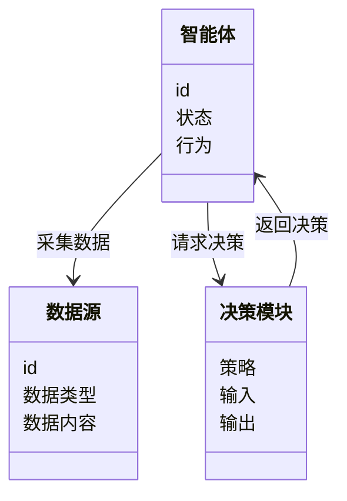
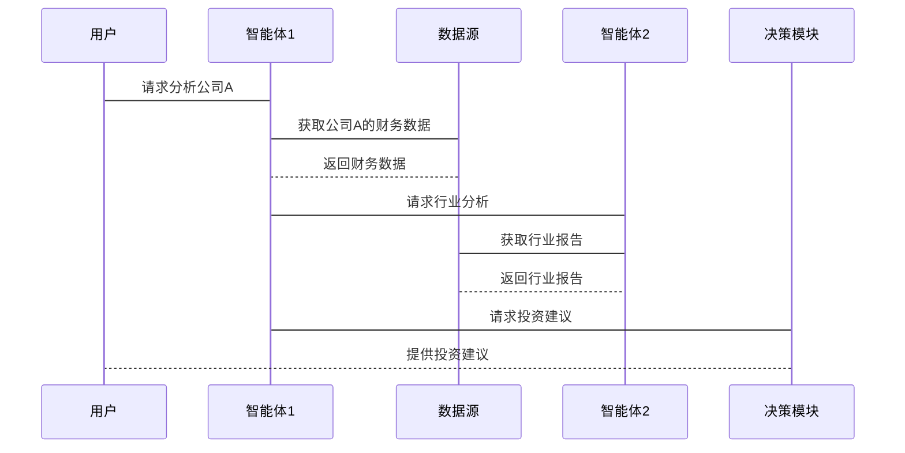

                 


# AI多智能体如何改进传统的价值投资尽职调查流程

> 关键词：AI多智能体，价值投资，尽职调查，强化学习，系统架构

> 摘要：本文详细探讨了如何利用AI多智能体技术改进传统的价值投资尽职调查流程。通过分析多智能体系统的协同机制、强化学习算法、系统架构设计以及实际项目实现，本文展示了AI多智能体在提升尽职调查效率和准确性方面的巨大潜力。文章最后总结了多智能体技术在实际应用中的优势和挑战，并展望了未来的发展方向。

---

# 正文

## 第一部分：AI多智能体与价值投资尽职调查的背景与概念

### 1.1 多智能体系统的基本概念

#### 1.1.1 多智能体系统的定义
多智能体系统（Multi-Agent System，MAS）是由多个智能体（Agent）组成的分布式系统，这些智能体能够通过协作完成复杂的任务。每个智能体都具有一定的自主性、反应性和社会性，能够与其他智能体或环境进行交互。

**关键特征：**
- **自主性**：智能体能够自主决策，无需外部干预。
- **反应性**：智能体能够感知环境并实时响应。
- **协作性**：智能体之间可以协同完成任务。
- **分布性**：智能体独立运行，但通过通信协作完成目标。

#### 1.1.2 多智能体系统的特征
- **异构性**：智能体可以有不同的功能和能力。
- **动态性**：环境和任务可能随时变化。
- **复杂性**：多个智能体的协作可能导致复杂的行为。

#### 1.1.3 多智能体系统与单智能体的区别
- **单智能体**：集中式决策，单点故障风险较高。
- **多智能体**：分布式决策，任务分解更合理，容错性更强。

### 1.2 价值投资的基本原理

#### 1.2.1 价值投资的定义
价值投资是一种投资策略，旨在通过分析公司的基本面，如财务状况、行业地位和管理团队，找到被市场低估的股票进行投资。

#### 1.2.2 价值投资的核心理念
- **长期投资**：关注企业的长期价值，而非短期价格波动。
- **安全边际**：买入价格低于内在价值。
- **基本面分析**：通过财务报表、行业趋势等信息评估企业的价值。

#### 1.2.3 传统尽职调查流程
传统尽职调查流程通常包括以下几个步骤：
1. **初步筛选**：通过财务指标（如市盈率、市净率）筛选潜在投资标的。
2. **行业分析**：分析行业趋势、竞争格局。
3. **公司分析**：深入研究公司的财务状况、管理团队、竞争优势。
4. **风险评估**：评估潜在风险，如行业风险、财务风险等。
5. **投资决策**：基于以上分析做出最终投资决策。

---

## 第二部分：多智能体系统的核心原理与算法

### 1.3 多智能体系统的协同机制

#### 1.3.1 多智能体系统的通信与协作
智能体之间的通信可以通过以下方式实现：
- **直接通信**：智能体之间直接交换信息。
- **间接通信**：通过共享数据库或消息中间件进行信息传递。

协作任务的分配可以通过以下机制实现：
- **基于角色分配**：根据智能体的能力分配任务。
- **基于优先级分配**：根据任务的重要性和紧急程度分配任务。

冲突解决策略可以采用以下方法：
- **协商机制**：智能体之间通过协商解决冲突。
- **仲裁机制**：引入仲裁者（如算法或规则）解决冲突。

#### 1.3.2 多智能体系统的决策机制
分布式决策的基本原理是每个智能体根据局部信息做出决策，同时通过通信协调行动。基于共识的决策方法通过达成一致来避免冲突。基于博弈论的决策模型则通过模拟竞争和合作来优化决策。

### 1.4 基于强化学习的多智能体算法

#### 1.4.1 强化学习的基本原理
强化学习是一种机器学习范式，通过智能体与环境的交互，学习如何通过决策（动作）来最大化累计奖励。核心要素包括：
- **状态（State）**：环境的当前情况。
- **动作（Action）**：智能体的行为。
- **奖励（Reward）**：智能体行为的反馈。

经典的强化学习算法包括Q-learning和Deep Q-Networks（DQN）。Q-learning通过更新Q值表来学习最优策略，而DQN则使用深度神经网络近似Q值函数。

#### 1.4.2 多智能体强化学习的挑战
- **策略协调**：多个智能体之间的策略需要协调一致。
- **值函数分解**：如何分解值函数以实现协作。
- **并行计算效率**：多智能体系统需要高效的并行计算能力。

#### 1.4.3 实际应用中的优化策略
- **策略共享**：多个智能体共享相同的策略网络。
- **层次化决策**：将任务分解为多个层次，分别进行决策。
- **经验回放**：通过经验回放技术提高学习效率。

---

## 第三部分：价值投资尽职调查中的多智能体系统设计

### 1.5 多智能体在价值投资中的应用

#### 1.5.1 数据收集与分析
- **多源数据融合**：从财务数据、行业报告、新闻等多源数据中提取信息。
- **特征提取**：通过自然语言处理（NLP）提取公司新闻的关键特征。

#### 1.5.2 风险评估
- **风险建模**：基于多智能体系统的协同，评估不同风险因素的影响。
- **情景模拟**：模拟不同市场条件下投资组合的风险和收益。

#### 1.5.3 投资决策
- **多目标优化**：在收益、风险、流动性等多个目标之间进行优化。
- **动态调整**：根据市场变化实时调整投资策略。

---

## 第四部分：基于多智能体的尽职调查系统实现

### 1.6 项目背景与需求分析

#### 1.6.1 项目背景
随着金融市场的复杂化，传统尽职调查方法逐渐暴露出效率低下、信息孤岛等问题。多智能体技术的引入为解决这些问题提供了新的思路。

#### 1.6.2 系统功能需求
- **数据采集**：从多种数据源采集数据。
- **数据分析**：对数据进行清洗、分析和建模。
- **决策支持**：提供智能化的决策支持。

### 1.7 系统设计与实现

#### 1.7.1 领域模型设计
使用Mermaid绘制领域模型类图，展示系统中的主要实体及其关系。



#### 1.7.2 系统架构设计
使用Mermaid绘制系统架构图，展示系统的分层结构。

```mermaid
--- 智能体协同层 ---
智能体1 <-> 智能体2 <-> 智能体3
                |
                v
--- 数据处理层 ---
数据采集模块 <-> 数据分析模块 <-> 数据建模模块
                |
                v
--- 应用层 ---
用户界面 <-> 决策支持模块
```

#### 1.7.3 接口与交互设计
使用Mermaid绘制交互序列图，展示系统中的典型交互流程。



---

## 第五部分：多智能体系统的实际应用与展望

### 1.8 项目实战与结果展示

#### 1.8.1 环境安装
安装必要的库和工具，如TensorFlow、Keras、Python等。

#### 1.8.2 核心代码实现
以下是基于强化学习的多智能体算法的Python实现示例：

```python
import numpy as np
import tensorflow as tf

# 定义智能体类
class Agent:
    def __init__(self, state_dim, action_dim):
        self.state_dim = state_dim
        self.action_dim = action_dim
        self.model = self.build_model()
    
    def build_model(self):
        model = tf.keras.Sequential([
            tf.keras.layers.Dense(64, activation='relu', input_dim=self.state_dim),
            tf.keras.layers.Dense(self.action_dim, activation='linear')
        ])
        return model

# 定义环境类
class Environment:
    def __init__(self):
        self.state_dim = 4  # 状态空间维度
        self.action_dim = 2  # 动作空间维度

    def get_state(self):
        # 返回当前环境状态
        pass

    def step(self, action):
        # 执行动作并返回新的状态和奖励
        pass

# 初始化智能体和环境
agent = Agent(state_dim=4, action_dim=2)
env = Environment()

# 训练过程
for episode in range(1000):
    state = env.get_state()
    action = agent.model.predict(state)
    next_state, reward = env.step(action)
    # 更新智能体模型
    agent.model.fit(state, reward)
```

#### 1.8.3 案例分析
通过具体案例分析，展示多智能体系统在价值投资中的实际应用效果。例如，比较传统方法与多智能体方法在投资决策中的表现。

#### 1.8.4 结果展示
展示系统的输出结果，包括投资建议、风险评估等。

### 1.9 最佳实践与小结

#### 1.9.1 最佳实践
- **数据质量**：确保数据的准确性和完整性。
- **模型优化**：根据实际效果不断优化模型参数。
- **系统维护**：定期更新模型和数据，保持系统的有效性。

#### 1.9.2 小结
本文详细探讨了AI多智能体技术在价值投资尽职调查中的应用，从理论到实践，展示了其在提升效率和准确率方面的巨大潜力。

#### 1.9.3 注意事项
- **数据隐私**：注意保护投资者的隐私数据。
- **算法透明度**：确保算法的透明性和可解释性。
- **市场适应性**：根据市场变化及时调整系统参数。

#### 1.9.4 拓展阅读
推荐相关领域的书籍和论文，供读者深入学习。

---

## 附录：参考文献与工具列表

- **参考文献**
  1. Russell, S. J., & Norvig, P. (2010). Artificial Intelligence: A Modern Approach.
  2. Lapan, S. (2018). Deep Reinforcement Learning in Python.

- **工具列表**
  - Python
  - TensorFlow
  - Keras
  - Mermaid

---

通过以上步骤，本文系统地介绍了AI多智能体技术如何改进传统的价值投资尽职调查流程。从理论分析到实际应用，从系统设计到代码实现，为读者提供了一个全面的视角。希望本文能够为相关领域的研究和实践提供有价值的参考。

