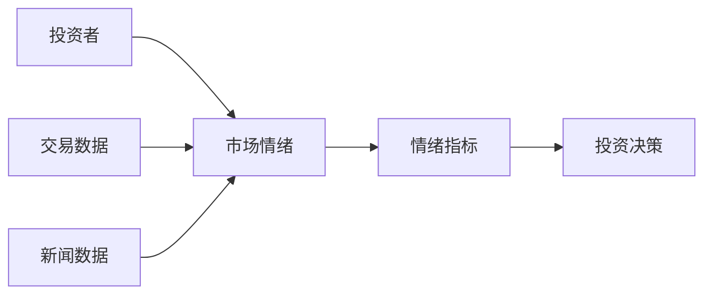
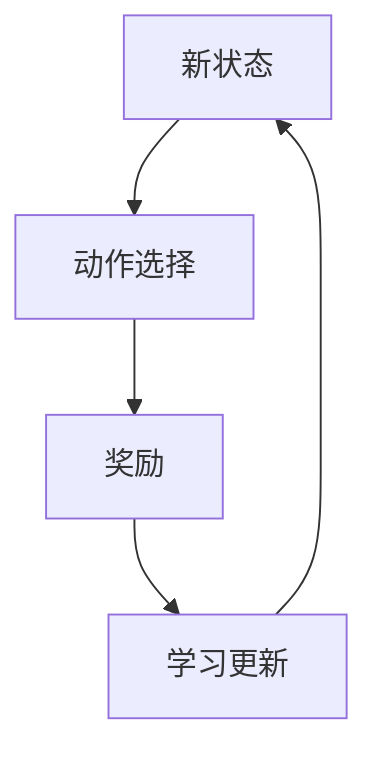
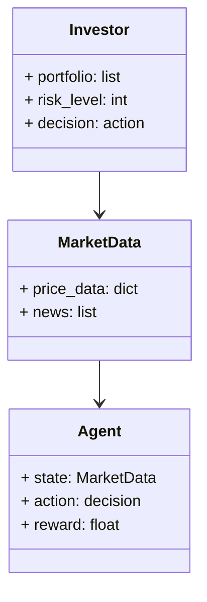
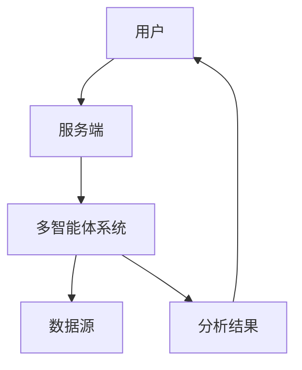
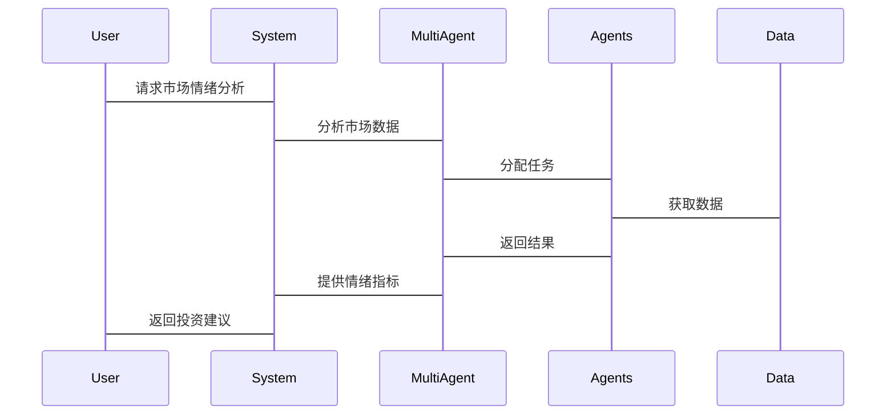

                 


# AI多智能体提升价值投资的市场情绪判断

## 关键词：AI多智能体，价值投资，市场情绪，强化学习，金融数据分析

## 摘要：本文探讨如何利用AI多智能体技术来分析和判断市场情绪，从而优化价值投资策略。通过结合强化学习算法和协同决策机制，多智能体系统能够更准确地捕捉市场情绪变化，为投资者提供科学的决策支持。

---

## 第1章 背景介绍

### 1.1 问题背景

#### 1.1.1 传统价值投资的局限性
传统价值投资依赖于对财务数据和市场趋势的分析，但忽视了市场情绪的动态变化。投资者往往难以及时捕捉市场情绪的波动，导致投资决策的滞后性和片面性。

#### 1.1.2 市场情绪对投资决策的影响
市场情绪是投资者行为的重要驱动因素。过度乐观或悲观的情绪会导致市场波动，影响资产价格，进而影响投资收益。

#### 1.1.3 AI技术在金融领域的应用潜力
人工智能技术在金融数据分析、预测和交易策略优化方面展现出巨大潜力。通过AI技术，可以更高效地处理复杂数据，发现潜在规律。

### 1.2 问题描述

#### 1.2.1 市场情绪的多维度特征
市场情绪具有复杂性，涉及多个维度，如投资者情绪、市场波动性等。单一维度的分析难以全面捕捉市场情绪的变化。

#### 1.2.2 多智能体在情绪分析中的优势
多智能体系统能够协同工作，从不同角度分析市场情绪，提供更全面的判断。通过分布式计算和协同决策，多智能体系统能够更高效地处理复杂任务。

#### 1.2.3 当前市场情绪判断的技术挑战
传统的情绪分析方法难以应对复杂多变的市场环境，且缺乏对多维度数据的综合分析能力。

### 1.3 问题解决

#### 1.3.1 多智能体协同工作的基本原理
多智能体系统通过协同工作，利用分布式计算和通信机制，实现对市场情绪的全面分析。每个智能体负责特定任务，通过信息共享和协同决策，提供更准确的市场情绪判断。

#### 1.3.2 基于AI的情绪分析模型构建
构建基于AI的情绪分析模型，利用自然语言处理和深度学习技术，从新闻、社交媒体等多源数据中提取情绪特征，进行综合分析。

#### 1.3.3 多智能体在价值投资中的应用场景
多智能体系统可以应用于风险评估、投资组合优化等领域，帮助投资者做出更科学的投资决策。

### 1.4 边界与外延

#### 1.4.1 多智能体系统的边界条件
多智能体系统需要考虑数据来源的可靠性、系统的实时性以及计算资源的限制。

#### 1.4.2 市场情绪分析的适用范围
市场情绪分析适用于短期投资决策，但需要结合长期基本面分析，避免过度依赖情绪指标。

#### 1.4.3 与其他投资策略的结合
多智能体系统可以与其他投资策略结合，如技术分析、基本面分析等，形成综合的投资决策支持系统。

### 1.5 核心概念结构与要素

#### 1.5.1 多智能体系统的组成要素
- 智能体：负责特定任务的独立实体
- 通信机制：智能体之间信息共享的方式
- 协同决策：智能体共同制定决策的过程

#### 1.5.2 市场情绪分析的指标体系
- 投资者情绪指数
- 市场波动性指标
- 市场参与度指标

#### 1.5.3 价值投资与市场情绪的关系
价值投资注重长期基本面分析，但市场情绪会影响短期资产价格波动，两者结合可以优化投资决策。

---

## 第2章 核心概念与联系

### 2.1 多智能体系统原理

#### 2.1.1 多智能体系统的定义
多智能体系统是由多个智能体组成的分布式系统，通过协同工作完成复杂任务。

#### 2.1.2 多智能体系统的特性
- 分布式计算
- 协同决策
- 自适应性

#### 2.1.3 多智能体与单智能体的对比
| 特性 | 单智能体 | 多智能体 |
|------|----------|----------|
| 计算能力 | 单一计算资源 | 多个计算资源 |
| 任务处理 | 单一任务 | 多任务协同 |
| 决策方式 | 单点决策 | 分布式决策 |

### 2.2 市场情绪分析原理

#### 2.2.1 市场情绪的定义
市场情绪是投资者对市场状况的总体感受，影响市场行为和资产价格。

#### 2.2.2 市场情绪的分类
- 过度乐观
- 过度悲观
- 理性预期

#### 2.2.3 市场情绪分析的技术路线
1. 数据采集：获取新闻、社交媒体、交易数据等多源数据。
2. 数据处理：清洗、预处理数据。
3. 情绪分析：利用NLP技术提取情绪特征。
4. 综合判断：基于多维度数据，进行市场情绪综合判断。

### 2.3 多智能体与市场情绪的关系

#### 2.3.1 多智能体如何影响市场情绪
多智能体通过协同工作，提供更全面的市场分析，影响投资者情绪。

#### 2.3.2 市场情绪如何反馈到多智能体
市场情绪的变化会影响多智能体的决策过程，调整其行为策略。

#### 2.3.3 多智能体协同优化市场情绪分析
多智能体系统能够从不同角度分析市场情绪，提高判断的准确性和全面性。

### 2.4 核心概念对比表

#### 表2.1: 多智能体与单智能体对比
| 特性 | 单智能体 | 多智能体 |
|------|----------|----------|
| 计算能力 | 单一计算资源 | 多个计算资源 |
| 任务处理 | 单一任务 | 多任务协同 |
| 决策方式 | 单点决策 | 分布式决策 |

#### 表2.2: 不同市场情绪分析方法的对比
| 方法 | 优点 | 缺点 |
|------|------|------|
| 基于统计的方法 | 简单易行 | 精度较低 |
| 基于机器学习的方法 | 高精度 | 需大量数据 |
| 基于多智能体的方法 | 全面性 | 实施复杂 |

### 2.5 实体关系图



---

## 第3章 算法原理讲解

### 3.1 算法概述
基于强化学习的多智能体系统，通过协同工作，优化市场情绪分析。

### 3.2 算法流程



### 3.3 算法实现

```python
class MultiAgent:
    def __init__(self, num_agents):
        self.num_agents = num_agents
        self.agents = [Agent() for _ in range(num_agents)]
    
    def step(self, state):
        actions = []
        for agent in self.agents:
            actions.append(agent.act(state))
        next_state = state.update(actions)
        rewards = [state.get_reward(agent) for agent in self.agents]
        for agent, reward in zip(self.agents, rewards):
            agent.learn(reward)
        return next_state
```

### 3.4 数学模型

$$ V(s) = \max_a Q(s, a) $$

$$ Q(s, a) = r + \gamma \max_{a'} Q(s', a') $$

---

## 第4章 系统分析与架构设计

### 4.1 问题场景介绍
构建一个基于多智能体的市场情绪分析系统，辅助投资者做出更好的投资决策。

### 4.2 项目介绍
开发一个实时市场情绪监测系统，利用多智能体技术分析新闻、社交媒体等数据。

### 4.3 系统功能设计



### 4.4 系统架构设计



### 4.5 系统接口设计

#### 4.5.1 数据接口
- 输入：市场数据
- 输出：情绪指标

#### 4.5.2 用户接口
- 输入：投资目标
- 输出：投资建议

### 4.6 系统交互



---

## 第5章 项目实战

### 5.1 环境安装
安装必要的库，如Python、TensorFlow、Keras等。

### 5.2 核心代码实现

```python
import numpy as np
from tensorflow.keras import layers

class Agent:
    def __init__(self):
        self.model = self.build_model()
    
    def build_model(self):
        model = keras.Sequential([
            layers.Dense(64, activation='relu'),
            layers.Dense(1, activation='linear')
        ])
        return model

    def act(self, state):
        return self.model.predict(state)
```

### 5.3 代码功能解读
- `Agent`类：定义一个智能体，包含一个深度学习模型。
- `act`方法：根据当前状态，预测下一步动作。

### 5.4 实际案例分析
通过具体案例，展示多智能体系统如何分析市场情绪，优化投资决策。

### 5.5 项目小结
总结项目的关键点和收获，指出未来改进的方向。

---

## 第6章 最佳实践

### 6.1 小结
简要回顾文章内容，强调多智能体技术在市场情绪分析中的优势。

### 6.2 注意事项
- 数据质量的重要性
- 系统实时性的保障
- 风险控制的必要性

### 6.3 拓展阅读
推荐相关领域的书籍和论文，供读者进一步学习。

---

## 结论

本文详细探讨了AI多智能体技术在价值投资中的应用，展示了如何通过多智能体协同工作，提升市场情绪分析的准确性和全面性。通过实际案例和代码实现，为读者提供了丰富的参考和实践指导。

