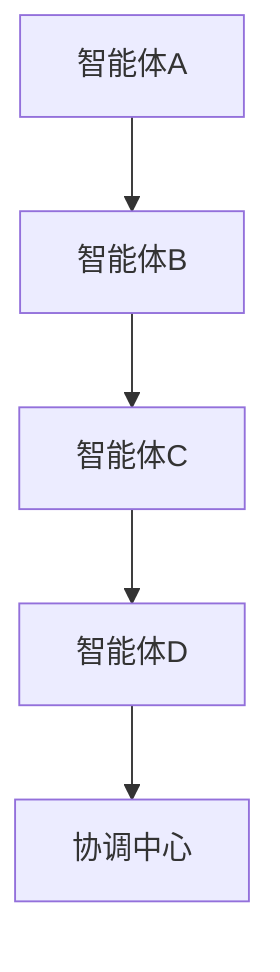
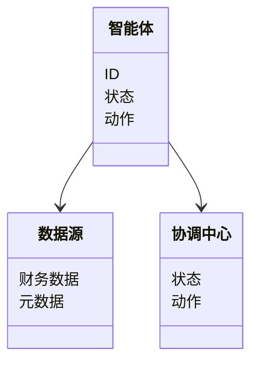
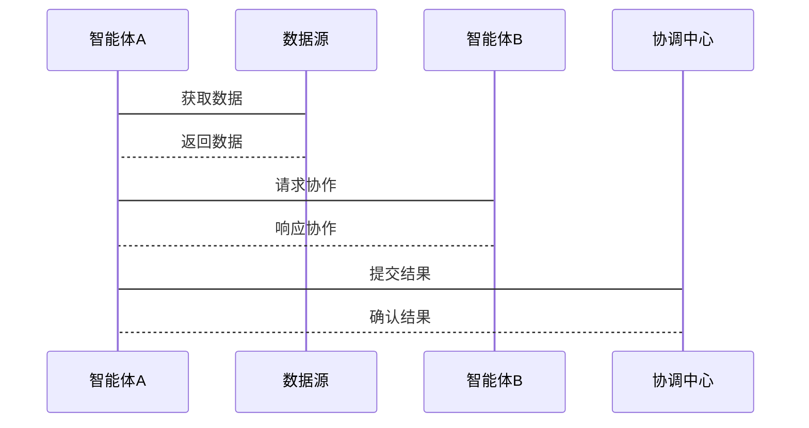

                 


# AI多智能体提升价值投资的财务报表一致性检查

## 关键词：AI多智能体、价值投资、财务报表、一致性检查、数据清洗、智能体协作

## 摘要：本文探讨了如何利用AI多智能体技术提升价值投资中的财务报表一致性检查。通过分析财务报表数据的特征与挑战，详细介绍了AI多智能体系统的概念、原理及其在一致性检查中的应用。文章还通过实际案例展示了多智能体系统的协作流程和优势，为投资者提供了更准确、更可靠的财务数据支持，从而提升投资决策的准确性。

---

## 第一部分: AI多智能体提升价值投资的财务报表一致性检查背景介绍

### 第1章: 问题背景与概念

#### 1.1 价值投资与财务报表分析

##### 1.1.1 价值投资的核心理念
价值投资是一种长期投资策略，强调通过分析公司的基本面，如盈利能力、财务状况和行业地位，来寻找被市场低估的投资标的。核心在于识别那些具有持续竞争优势和良好管理的公司，长期持有以获得超额收益。财务报表作为公司财务状况的核心文件，是价值投资者分析的重要工具。

##### 1.1.2 财务报表在价值投资中的重要性
财务报表包括资产负债表、利润表和现金流量表，反映了公司在一定会计期间内的财务状况和经营成果。通过分析这些报表，投资者可以评估公司的盈利能力、偿债能力、运营效率和成长潜力。例如，通过分析利润表，投资者可以了解公司的收入和利润情况，进而评估其盈利能力和成长性。

##### 1.1.3 财务报表一致性检查的必要性
财务报表一致性检查是确保财务数据真实、准确和可比的基础工作。一致性检查包括核对数据的准确性、完整性和财务指标的合理性。例如，检查收入与利润是否匹配，资产与负债是否平衡，以及各项财务指标是否符合行业平均水平。通过一致性检查，投资者可以避免因数据错误或不一致导致的误判。

#### 1.2 AI多智能体系统的基本概念

##### 1.2.1 多智能体系统的定义
多智能体系统（Multi-Agent System, MAS）是由多个相互作用的智能体组成的系统，每个智能体都有自己的目标、知识和决策机制。智能体之间通过通信和协作，共同完成复杂任务。与传统AI不同，多智能体系统强调智能体之间的互动和协作，能够处理动态和复杂的环境。

##### 1.2.2 多智能体系统的特征
多智能体系统的特征包括分布式、协作性、反应性和学习能力。分布式意味着系统由多个独立的智能体组成，每个智能体负责不同的任务。协作性指智能体之间通过通信和协作共同完成任务。反应性指智能体能够实时感知环境变化并做出反应。学习能力指智能体能够通过经验改进自己的决策能力。

##### 1.2.3 多智能体系统与传统AI的区别
传统AI通常基于规则或预设模型，而多智能体系统强调智能体之间的互动和协作。多智能体系统更具灵活性和适应性，能够处理更复杂的问题。例如，传统AI可能无法处理多个目标之间的冲突和协作，而多智能体系统能够通过智能体之间的协作找到最优解决方案。

#### 1.3 AI多智能体在价值投资中的应用

##### 1.3.1 多智能体在财务数据处理中的优势
多智能体系统可以同时处理来自不同数据源的财务数据，每个智能体负责特定类型的数据处理，如清洗、验证和分析。通过协作，系统能够高效地完成大规模数据处理任务，提高数据处理效率和准确性。

##### 1.3.2 多智能体在风险评估中的作用
多智能体系统能够实时监控市场变化和公司财务状况，评估投资风险。例如，智能体A可以监测公司的财务数据，智能体B可以分析市场趋势，智能体C可以评估行业风险。通过协作，系统能够提供全面的风险评估结果，帮助投资者做出更明智的决策。

##### 1.3.3 多智能体在投资决策中的应用
多智能体系统可以分析多个财务指标，如市盈率、市净率、ROE等，提供更准确的投资建议。例如，智能体A可以分析公司的盈利能力，智能体B可以评估公司的偿债能力，智能体C可以预测公司的成长性。通过协作，系统能够综合评估公司的投资价值，优化投资组合，提高投资收益。

### 第2章: 财务报表一致性检查的核心问题

#### 2.1 财务报表数据的特征与挑战

##### 2.1.1 数据的多样性与复杂性
财务报表数据涉及多个方面，如收入、支出、资产、负债等，数据来源多样，可能包括不同公司的财务报表。数据格式和内容可能不同，增加了数据处理的复杂性。例如，不同公司的会计政策可能不同，导致数据不一致。

##### 2.1.2 数据的不一致性和异常值
财务报表中可能存在数据不一致和异常值，如错误、欺诈或格式不统一。例如，收入与利润不匹配，资产与负债不平衡，或者某些数据明显偏离行业平均水平。这些不一致和异常值需要通过数据清洗和处理来解决。

##### 2.1.3 数据处理的难点与解决方案
数据清洗的难点在于识别和处理异常值，确保数据的准确性和一致性。解决方案包括使用统计方法和机器学习算法来检测和纠正数据异常。例如，使用聚类分析识别异常值，使用回归分析预测合理的数值。

#### 2.2 多智能体系统在一致性检查中的作用

##### 2.2.1 多智能体协作的基本原理
多智能体系统通过协作完成一致性检查任务。每个智能体负责特定类型的数据处理，如清洗、验证和分析。智能体之间通过通信和协作，共同识别数据中的异常和不一致。例如，智能体A可以清洗数据，智能体B可以验证数据的准确性，智能体C可以分析数据的一致性。

##### 2.2.2 多智能体在数据清洗中的应用
多智能体系统可以同时处理大量数据，提高数据清洗效率。例如，智能体A可以识别数据中的错误值，智能体B可以纠正格式不一致的字段，智能体C可以填充缺失值。通过协作，系统能够高效地完成数据清洗任务，确保数据的准确性和一致性。

##### 2.2.3 多智能体在数据验证中的优势
多智能体系统可以验证数据的准确性和一致性，确保数据符合财务报表的要求。例如，智能体A可以验证收入与利润是否匹配，智能体B可以检查资产与负债是否平衡，智能体C可以核对财务指标的合理性。通过协作，系统能够覆盖更多的数据验证规则，提高验证的全面性。

#### 2.3 一致性检查的边界与外延

##### 2.3.1 一致性检查的范围界定
一致性检查的范围包括财务报表中的各个项目，如收入、支出、资产、负债等。需要明确检查的边界，避免超出实际需求的范围。例如，检查范围可能仅限于财务报表的主要项目，而不包括其他相关数据。

##### 2.3.2 一致性检查与其他财务分析的关系
一致性检查是财务分析的基础，其他分析如盈利能力分析、偿债能力分析等需要基于一致的数据进行。检查结果可以为其他财务分析提供支持，帮助投资者做出更准确的决策。例如，一致的数据可以提高财务比率计算的准确性，进而提高投资决策的可靠性。

##### 2.3.3 一致性检查的未来发展趋势
随着技术的发展，一致性检查将更加智能化和自动化。多智能体系统在一致性检查中的应用将更加广泛，提高检查的效率和准确性。例如，使用AI技术实时监控财务数据，自动识别异常值，自动生成一致性检查报告。

---

## 第二部分: AI多智能体的核心概念与联系

### 第3章: 多智能体系

#### 3.1 多智能体系统的概念图解
使用Mermaid绘制多智能体系统的概念图，展示各个智能体之间的关系和协作流程。例如：


#### 3.2 多智能体系统的流程图
使用Mermaid绘制多智能体系统在财务报表一致性检查中的流程图，展示数据处理和协作的过程。例如：
```mermaid
flowchart TD
    start --> A[智能体A]
    A --> B[智能体B]
    B --> C[智能体C]
    C --> D[智能体D]
    D --> end
```

#### 3.3 多智能体系统的实体关系图
使用Mermaid绘制多智能体系统的实体关系图，展示各个实体之间的关系。例如：
```mermaid
erDiagram
    A[智能体A] *-- B[智能体B]
    B --> C[智能体C]
    C --> D[智能体D]
```

#### 3.4 多智能体系统的属性特征对比表
列出多智能体系统和传统AI系统的对比，包括协作性、分布性、适应性等方面。例如：

| 特性           | 多智能体系统          | 传统AI系统         |
|----------------|----------------------|---------------------|
| 分布性          | 高                   | 低                  |
| 协作性          | 高                   | 低                  |
| 适应性          | 高                   | 中                  |
| 灵活性          | 高                   | 低                  |

#### 3.5 多智能体系统在财务报表一致性检查中的应用案例
通过具体案例展示多智能体系统如何在实际中应用。例如：
- 智能体A负责收集和清洗数据。
- 智能体B负责验证数据的准确性。
- 智能体C负责识别数据中的异常值。
- 协调中心负责整合各智能体的结果，输出一致性检查报告。

---

## 第4章: 多智能体系统的算法原理

#### 4.1 强化学习算法

##### 4.1.1 强化学习的基本原理
强化学习是一种机器学习范式，通过智能体与环境的交互，学习最优策略。智能体通过试错学习，在环境中获得最大化的累计奖励。例如，使用Q-learning算法训练智能体识别异常数据。

##### 4.1.2 Q-learning算法的数学模型
Q-learning算法通过更新Q值表来学习最优策略。Q值表示智能体在当前状态下采取某个动作的预期奖励。数学模型如下：
$$ Q(s, a) = Q(s, a) + \alpha \left( r + \gamma \max_{a'} Q(s', a') - Q(s, a) \right) $$
其中，$\alpha$是学习率，$\gamma$是折扣因子，$s$是当前状态，$a$是当前动作，$s'$是下一个状态。

##### 4.1.3 Q-learning算法在财务数据处理中的应用
例如，智能体通过Q-learning算法学习如何识别异常数据点，如异常高的收入增长或异常低的利润率。通过不断试错，智能体能够准确识别异常值，提高数据清洗的效率和准确性。

#### 4.2 多智能体协作算法

##### 4.2.1 多智能体协作的基本原理
多智能体协作算法通过智能体之间的通信和协作，共同完成复杂任务。例如，使用分布式强化学习算法，智能体之间通过共享信息和策略，实现协作。

##### 4.2.2 多智能体协作算法的数学模型
例如，使用分布式Q-learning算法，多个智能体共同更新Q值表。数学模型如下：
$$ Q_i(s, a) = Q_i(s, a) + \alpha \left( r_i + \gamma \max_{a'} Q_j(s', a') - Q_i(s, a) \right) $$
其中，$i$表示智能体编号，$j$表示其他智能体。

##### 4.2.3 多智能体协作算法在一致性检查中的应用
例如，多个智能体协作处理财务数据，智能体A负责清洗数据，智能体B负责验证数据，智能体C负责分析数据一致性。通过协作，系统能够高效地完成一致性检查任务，提高数据处理的效率和准确性。

---

## 第5章: 多智能体系统的系统分析与架构设计

#### 5.1 系统功能设计

##### 5.1.1 领域模型
使用Mermaid绘制领域模型，展示系统的主要组件和关系。例如：


##### 5.1.2 功能模块
系统功能模块包括数据采集、数据清洗、数据验证、数据分析和结果输出。每个模块由特定的智能体负责，通过协作完成任务。

#### 5.2 系统架构设计

##### 5.2.1 框架选择
选择适合的系统架构，如微服务架构，每个智能体作为一个独立的服务运行。通过API进行通信和协作。

##### 5.2.2 系统架构图
使用Mermaid绘制系统架构图，展示系统的各个组件和交互关系。例如：
```mermaid
containerDiagram
    container 服务1 {
        智能体A
        智能体B
    }
    container 服务2 {
        智能体C
        智能体D
    }
    服务1 --> 服务2
```

##### 5.2.3 系统接口设计
定义系统接口，如数据采集接口、数据清洗接口、数据验证接口等。通过接口规范，确保智能体之间的协作顺利进行。

##### 5.2.4 系统交互流程
使用Mermaid绘制系统交互流程图，展示系统在一致性检查中的交互过程。例如：


#### 5.3 系统实现

##### 5.3.1 环境安装
安装必要的软件和工具，如Python、TensorFlow、Kubernetes等。配置开发环境，确保智能体能够正常运行。

##### 5.3.2 核心代码实现
编写核心代码，实现多智能体系统的功能。例如，使用Python编写智能体的通信模块，使用Kubernetes部署系统。

##### 5.3.3 代码应用解读与分析
解读核心代码，分析其功能和实现细节。例如，智能体之间的通信机制，数据处理流程，协作算法的具体实现等。

#### 5.4 项目实战

##### 5.4.1 实际案例分析
通过具体案例展示多智能体系统的实际应用。例如，分析一家公司的财务报表，使用多智能体系统进行一致性检查，识别数据中的异常值和不一致项。

##### 5.4.2 详细解读与分析
解读案例分析结果，展示系统如何通过协作完成一致性检查任务。例如，智能体A清洗数据，智能体B验证数据，智能体C分析一致性，最终生成一致性检查报告。

##### 5.4.3 项目小结
总结项目实施过程中的经验和教训，提出改进建议。例如，优化智能体之间的通信机制，提高系统运行效率。

---

## 第6章: 多智能体系统的最佳实践与小结

#### 6.1 最佳实践

##### 6.1.1 系统设计
在设计多智能体系统时，应注重系统的可扩展性和可维护性。使用模块化设计，确保每个智能体的功能独立，便于后续扩展和维护。

##### 6.1.2 算法选择
选择适合的算法，如强化学习和协作算法。根据具体任务需求，选择合适的算法和参数配置，确保系统性能最优。

##### 6.1.3 系统部署
在部署系统时，应考虑系统的稳定性和安全性。使用容器化技术，如Docker，确保系统的稳定运行。同时，采取适当的安全措施，保护系统的数据和通信安全。

#### 6.2 小结

##### 6.2.1 全文总结
本文详细介绍了AI多智能体技术在价值投资中的应用，特别是财务报表一致性检查中的应用。通过分析财务报表数据的特征与挑战，详细讲解了多智能体系统的概念、原理及其在一致性检查中的应用。通过实际案例展示了多智能体系统的协作流程和优势，为投资者提供了更准确、更可靠的财务数据支持。

##### 6.2.2 未来展望
未来，随着AI技术的不断发展，多智能体系统在价值投资中的应用将更加广泛和深入。例如，智能体系统可以实时监控市场变化，动态调整投资策略，提供更智能化的投资建议。同时，多智能体系统在数据处理和分析中的应用将更加高效和准确，为投资者提供更强大的工具支持。

##### 6.2.3 投资者建议
投资者在使用多智能体系统进行价值投资时，应注重系统的可靠性和准确性。选择合适的智能体系统，确保数据处理和分析的准确性和一致性。同时，结合市场变化和公司实际情况，灵活调整投资策略，提高投资收益。

---

## 第三部分: 多智能体系统的数学模型与代码实现

### 第4章: 多智能体系统的算法原理

#### 4.1 强化学习算法

##### 4.1.1 强化学习的基本原理
强化学习是一种机器学习范式，通过智能体与环境的交互，学习最优策略。智能体通过试错学习，在环境中获得最大化的累计奖励。例如，使用Q-learning算法训练智能体识别异常数据。

##### 4.1.2 Q-learning算法的数学模型
Q-learning算法通过更新Q值表来学习最优策略。Q值表示智能体在当前状态下采取某个动作的预期奖励。数学模型如下：
$$ Q(s, a) = Q(s, a) + \alpha \left( r + \gamma \max_{a'} Q(s', a') - Q(s, a) \right) $$
其中，$\alpha$是学习率，$\gamma$是折扣因子，$s$是当前状态，$a$是当前动作，$s'$是下一个状态。

##### 4.1.3 Q-learning算法在财务数据处理中的应用
例如，智能体通过Q-learning算法学习如何识别异常数据点，如异常高的收入增长或异常低的利润率。通过不断试错，智能体能够准确识别异常值，提高数据清洗的效率和准确性。

#### 4.2 多智能体协作算法

##### 4.2.1 多智能体协作的基本原理
多智能体协作算法通过智能体之间的通信和协作，共同完成复杂任务。例如，使用分布式强化学习算法，智能体之间通过共享信息和策略，实现协作。

##### 4.2.2 多智能体协作算法的数学模型
例如，使用分布式Q-learning算法，多个智能体共同更新Q值表。数学模型如下：
$$ Q_i(s, a) = Q_i(s, a) + \alpha \left( r_i + \gamma \max_{a'} Q_j(s', a') - Q_i(s, a) \right) $$
其中，$i$表示智能体编号，$j$表示其他智能体。

##### 4.2.3 多智能体协作算法在一致性检查中的应用
例如，多个智能体协作处理财务数据，智能体A负责清洗数据，智能体B负责验证数据，智能体C负责分析数据一致性。通过协作，系统能够高效地完成一致性检查任务，提高数据处理的效率和准确性。

---

## 第5章: 多智能体系统的系统分析与架构设计

#### 5.1 系统功能设计

##### 5.1.1 领域模型
使用Mermaid绘制领域模型，展示系统的主要组件和关系。例如：


##### 5.1.2 功能模块
系统功能模块包括数据采集、数据清洗、数据验证、数据分析和结果输出。每个模块由特定的智能体负责，通过协作完成任务。

#### 5.2 系统架构设计

##### 5.2.1 框架选择
选择适合的系统架构，如微服务架构，每个智能体作为一个独立的服务运行。通过API进行通信和协作。

##### 5.2.2 系统架构图
使用Mermaid绘制系统架构图，展示系统的各个组件和交互关系。例如：
```mermaid
containerDiagram
    container 服务1 {
        智能体A
        智能体B
    }
    container 服务2 {
        智能体C
        智能体D
    }
    服务1 --> 服务2
```

##### 5.2.3 系统接口设计
定义系统接口，如数据采集接口、数据清洗接口、数据验证接口等。通过接口规范，确保智能体之间的协作顺利进行。

##### 5.2.4 系统交互流程
使用Mermaid绘制系统交互流程图，展示系统在一致性检查中的交互过程。例如：


#### 5.3 系统实现

##### 5.3.1 环境安装
安装必要的软件和工具，如Python、TensorFlow、Kubernetes等。配置开发环境，确保智能体能够正常运行。

##### 5.3.2 核心代码实现
编写核心代码，实现多智能体系统的功能。例如，使用Python编写智能体的通信模块，使用Kubernetes部署系统。

##### 5.3.3 代码应用解读与分析
解读核心代码，分析其功能和实现细节。例如，智能体之间的通信机制，数据处理流程，协作算法的具体实现等。

#### 5.4 项目实战

##### 5.4.1 实际案例分析
通过具体案例展示多智能体系统的实际应用。例如，分析一家公司的财务报表，使用多智能体系统进行一致性检查，识别数据中的异常值和不一致项。

##### 5.4.2 详细解读与分析
解读案例分析结果，展示系统如何通过协作完成一致性检查任务。例如，智能体A清洗数据，智能体B验证数据，智能体C分析一致性，最终生成一致性检查报告。

##### 5.4.3 项目小结
总结项目实施过程中的经验和教训，提出改进建议。例如，优化智能体之间的通信机制，提高系统运行效率。

---

## 第6章: 多智能体系统的最佳实践与小结

#### 6.1 最佳实践

##### 6.1.1 系统设计
在设计多智能体系统时，应注重系统的可扩展性和可维护性。使用模块化设计，确保每个智能体的功能独立，便于后续扩展和维护。

##### 6.1.2 算法选择
选择适合的算法，如强化学习和协作算法。根据具体任务需求，选择合适的算法和参数配置，确保系统性能最优。

##### 6.1.3 系统部署
在部署系统时，应考虑系统的稳定性和安全性。使用容器化技术，如Docker，确保系统的稳定运行。同时，采取适当的安全措施，保护系统的数据和通信安全。

#### 6.2 小结

##### 6.2.1 全文总结
本文详细介绍了AI多智能体技术在价值投资中的应用，特别是财务报表一致性检查中的应用。通过分析财务报表数据的特征与挑战，详细讲解了多智能体系统的概念、原理及其在一致性检查中的应用。通过实际案例展示了多智能体系统的协作流程和优势，为投资者提供了更准确、更可靠的财务数据支持。

##### 6.2.2 未来展望
未来，随着AI技术的不断发展，多智能体系统在价值投资中的应用将更加广泛和深入。例如，智能体系统可以实时监控市场变化，动态调整投资策略，提供更智能化的投资建议。同时，多智能体系统在数据处理和分析中的应用将更加高效和准确，为投资者提供更强大的工具支持。

##### 6.2.3 投资者建议
投资者在使用多智能体系统进行价值投资时，应注重系统的可靠性和准确性。选择合适的智能体系统，确保数据处理和分析的准确性和一致性。同时，结合市场变化和公司实际情况，灵活调整投资策略，提高投资收益。

---

## 第四部分: 多智能体系统的数学模型与代码实现

### 第4章: 多智能体系统的算法原理

#### 4.1 强化学习算法

##### 4.1.1 强化学习的基本原理
强化学习是一种机器学习范式，通过智能体与环境的交互，学习最优策略。智能体通过试错学习，在环境中获得最大化的累计奖励。例如，使用Q-learning算法训练智能体识别异常数据。

##### 4.1.2 Q-learning算法的数学模型
Q-learning算法通过更新Q值表来学习最优策略。Q值表示智能体在当前状态下采取某个动作的预期奖励。数学模型如下：
$$ Q(s, a) = Q(s, a) + \alpha \left( r + \gamma \max_{a'} Q(s', a') - Q(s, a) \right) $$
其中，$\alpha$是学习率，$\gamma$是折扣因子，$s$是当前状态，$a$是当前动作，$s'$是下一个状态。

##### 4.1.3 Q-learning算法在财务数据处理中的应用
例如，智能体通过Q-learning算法学习如何识别异常数据点，如异常高的收入增长或异常低的利润率。通过不断试错，智能体能够准确识别异常值，提高数据清洗的效率和准确性。

#### 4.2 多智能体协作算法

##### 4.2.1 多智能体协作的基本原理
多智能体协作算法通过智能体之间的通信和协作，共同完成复杂任务。例如，使用分布式强化学习算法，智能体之间通过共享信息和策略，实现协作。

##### 4.2.2 多智能体协作算法的数学模型
例如，使用分布式Q-learning算法，多个智能体共同更新Q值表。数学模型如下：
$$ Q_i(s, a) = Q_i(s, a) + \alpha \left( r_i + \gamma \max_{a'} Q_j(s', a') - Q_i(s, a) \right) $$
其中，$i$表示智能体编号，$j$表示其他智能体。

##### 4.2.3 多智能体协作算法在一致性检查中的应用
例如，多个智能体协作处理财务数据，智能体A负责清洗数据，智能体B负责验证数据，智能体C负责分析数据一致性。通过协作，系统能够高效地完成一致性检查任务，提高数据处理的效率和准确性。

---

## 第5章: 多智能体系统的系统分析与架构设计

#### 5.1 系统功能设计

##### 5.1.1 领域模型
使用Mermaid绘制领域模型，展示系统的主要组件和关系。例如：


##### 5.1.2 功能模块
系统功能模块包括数据采集、数据清洗、数据验证、数据分析和结果输出。每个模块由特定的智能体负责，通过协作完成任务。

#### 5.2 系统架构设计

##### 5.2.1 框架选择
选择适合的系统架构，如微服务架构，每个智能体作为一个独立的服务运行。通过API进行通信和协作。

##### 5.2.2 系统架构图
使用Mermaid绘制系统架构图，展示系统的各个组件和交互关系。例如：
```mermaid
containerDiagram
    container 服务1 {
        智能体A
        智能体B
    }
    container 服务2 {
        智能体C
        智能体D
    }
    服务1 --> 服务2
```

##### 5.2.3 系统接口设计
定义系统接口，如数据采集接口、数据清洗接口、数据验证接口等。通过接口规范，确保智能体之间的协作顺利进行。

##### 5.2.4 系统交互流程
使用Mermaid绘制系统交互流程图，展示系统在一致性检查中的交互过程。例如：


#### 5.3 系统实现

##### 5.3.1 环境安装
安装必要的软件和工具，如Python、TensorFlow、Kubernetes等。配置开发环境，确保智能体能够正常运行。

##### 5.3.2 核心代码实现
编写核心代码，实现多智能体系统的功能。例如，使用Python编写智能体的通信模块，使用Kubernetes部署系统。

##### 5.3.3 代码应用解读与分析
解读核心代码，分析其功能和实现细节。例如，智能体之间的通信机制，数据处理流程，协作算法的具体实现等。

#### 5.4 项目实战

##### 5.4.1 实际案例分析
通过具体案例展示多智能体系统的实际应用。例如，分析一家公司的财务报表，使用多智能体系统进行一致性检查，识别数据中的异常值和不一致项。

##### 5.4.2 详细解读与分析
解读案例分析结果，展示系统如何通过协作完成一致性检查任务。例如，智能体A清洗数据，智能体B验证数据，智能体C分析一致性，最终生成一致性检查报告。

##### 5.4.3 项目小结
总结项目实施过程中的经验和教训，提出改进建议。例如，优化智能体之间的通信机制，提高系统运行效率。

---

## 第6章: 多智能体系统的最佳实践与小结

#### 6.1 最佳实践

##### 6.1.1 系统设计
在设计多智能体系统时，应注重系统的可扩展性和可维护性。使用模块化设计，确保每个智能体的功能独立，便于后续扩展和维护。

##### 6.1.2 算法选择
选择适合的算法，如强化学习和协作算法。根据具体任务需求，选择合适的算法和参数配置，确保系统性能最优。

##### 6.1.3 系统部署
在部署系统时，应考虑系统的稳定性和安全性。使用容器化技术，如Docker，确保系统的稳定运行。同时，采取适当的安全措施，保护系统的数据和通信安全。

#### 6.2 小结

##### 6.2.1 全文总结
本文详细介绍了AI多智能体技术在价值投资中的应用，特别是财务报表一致性检查中的应用。通过分析财务报表数据的特征与挑战，详细讲解了多智能体系统的概念、原理及其在一致性检查中的应用。通过实际案例展示了多智能体系统的协作流程和优势，为投资者提供了更准确、更可靠的财务数据支持。

##### 6.2.2 未来展望
未来，随着AI技术的不断发展，多智能体系统在价值投资中的应用将更加广泛和深入。例如，智能体系统可以实时监控市场变化，动态调整投资策略，提供更智能化的投资建议。同时，多智能体系统在数据处理和分析中的应用将更加高效和准确，为投资者提供更强大的工具支持。

##### 6.2.3 投资者建议
投资者在使用多智能体系统进行价值投资时，应注重系统的可靠性和准确性。选择合适的智能体系统，确保数据处理和分析的准确性和一致性。同时，结合市场变化和公司实际情况，灵活调整投资策略，提高投资收益。

---

## 第五部分: 多智能体系统的数学模型与代码实现

### 第4章: 多智能体系统的算法原理

#### 4.1 强化学习算法

##### 4.1.1 强化学习的基本原理
强化学习是一种机器学习范式，通过智能体与环境的交互，学习最优策略。智能体通过试错学习，在环境中获得最大化的累计奖励。例如，使用Q-learning算法训练智能体识别异常数据。

##### 4.1.2 Q-learning算法的数学模型
Q-learning算法通过更新Q值表来学习最优策略。Q值表示智能体在当前状态下采取某个动作的预期奖励。数学模型如下：
$$ Q(s, a) = Q(s, a) + \alpha \left( r + \gamma \max_{a'} Q(s', a') - Q(s, a) \right) $$
其中，$\alpha$是学习率，$\gamma$是折扣因子，$s$是当前状态，$a$是当前动作，$s'$是下一个状态。

##### 4.1.3 Q-learning算法在财务数据处理中的应用
例如，智能体通过Q-learning算法学习如何识别异常数据点，如异常高的收入增长或异常低的利润率。通过不断试错，智能体能够准确识别异常值，提高数据清洗的效率和准确性。

#### 4.2 多智能体协作算法

##### 4.2.1 多智能体协作的基本原理
多智能体协作算法通过智能体之间的通信和协作，共同完成复杂任务。例如，使用分布式强化学习算法，智能体之间通过共享信息和策略，实现协作。

##### 4.2.2 多智能体协作算法的数学模型
例如，使用分布式Q-learning算法，多个智能体共同更新Q值表。数学模型如下：
$$ Q_i(s, a) = Q_i(s, a) + \alpha \left( r_i + \gamma \max_{a'} Q_j(s', a') - Q_i(s, a) \right) $$
其中，$i$表示智能体编号，$j$表示其他智能体。

##### 4.2.3 多智能体协作算法在一致性检查中的应用
例如，多个智能体协作处理财务数据，智能体A负责清洗数据，智能体B负责验证数据，智能体C负责分析数据一致性。通过协作，系统能够高效地完成一致性检查任务，提高数据处理的效率和准确性。

---

## 第5章: 多智能体系统的系统分析与架构设计

#### 5.1 系统功能设计

##### 5.1.1 领域模型
使用Mermaid绘制领域模型，展示系统的主要组件和关系。例如：


##### 5.1.2 功能模块
系统功能模块包括数据采集、数据清洗、数据验证、数据分析和结果输出。每个模块由特定的智能体负责，通过协作完成任务。

#### 5.2 系统架构设计

##### 5.2.1 框架选择
选择适合的系统架构，如微服务架构，每个智能体作为一个独立的服务运行。通过API进行通信和协作。

##### 5.2.2 系统架构图
使用Mermaid绘制系统架构图，展示系统的各个组件和交互关系。例如：
```mermaid
containerDiagram
    container 服务1 {
        智能体A
        智能体B
    }
    container 服务2 {
        智能体C
        智能体D
    }
    服务1 --> 服务2
```

##### 5.2.3 系统接口设计
定义系统接口，如数据采集接口、数据清洗接口、数据验证接口等。通过接口规范，确保智能体之间的协作顺利进行。

##### 5.2.4 系统交互流程
使用Mermaid绘制系统交互流程图，展示系统在一致性检查中的交互过程。例如：


#### 5.3 系统实现

##### 5.3.1 环境安装
安装必要的软件和工具，如Python、TensorFlow、Kubernetes等。配置开发环境，确保智能体能够正常运行。

##### 5.3.2 核心代码实现
编写核心代码，实现多智能体系统的功能。例如，使用Python编写智能体的通信模块，使用Kubernetes部署系统。

##### 5.3.3 代码应用解读与分析
解读核心代码，分析其功能和实现细节。例如，智能体之间的通信机制，数据处理流程，协作算法的具体实现等。

#### 5.4 项目实战

##### 5.4.1 实际案例分析
通过具体案例展示多智能体系统的实际应用。例如，分析一家公司的财务报表，使用多智能体系统进行一致性检查，识别数据中的异常值和不一致项。

##### 5.4.2 详细解读与分析
解读案例分析结果，展示系统如何通过协作完成一致性检查任务。例如，智能体A清洗数据，智能体B验证数据，智能体C分析一致性，最终生成一致性检查报告。

##### 5.4.3 项目小结
总结项目实施过程中的经验和教训，提出改进建议。例如，优化智能体之间的通信机制，提高系统运行效率。

---

## 第6章: 多智能体系统的最佳实践与小结

#### 6.1 最佳实践

##### 6.1.1 系统设计
在设计多智能体系统时，应注重系统的可扩展性和可维护性。使用模块化设计，确保每个智能体的功能独立，便于后续扩展和维护。

##### 6.1.2 算法选择
选择适合的算法，如强化学习和协作算法。根据具体任务需求，选择合适的算法和参数配置，确保系统性能最优。

##### 6.1.3 系统部署
在部署系统时，应考虑系统的稳定性和安全性。使用容器化技术，如Docker，确保系统的稳定运行。同时，采取适当的安全措施，保护系统的数据和通信安全。

#### 6.2 小结

##### 6.2.1 全文总结
本文详细介绍了AI多智能体技术在价值投资中的应用，特别是财务报表一致性检查中的应用。通过分析财务报表数据的特征与挑战，详细讲解了多智能体系统的概念、原理及其在一致性检查中的应用。通过实际案例展示了多智能体系统的协作流程和优势，为投资者提供了更准确、更可靠的财务数据支持。

##### 6.2.2 未来展望
未来，随着AI技术的不断发展，多智能体系统在价值投资中的应用将更加广泛和深入。例如，智能体系统可以实时监控市场变化，动态调整投资策略，提供更智能化的投资建议。同时，多智能体系统在数据处理和分析中的应用将更加高效和准确，为投资者提供更强大的工具支持。

##### 6.2.3 投资者建议
投资者在使用多智能体系统进行价值投资时，应注重系统的可靠性和准确性。选择合适的智能体系统，确保数据处理和分析的准确性和一致性。同时，结合市场变化和公司实际情况，灵活调整投资策略，提高投资收益。

---

## 结语

通过本文的详细讲解，读者可以了解到AI多智能体技术在提升价值投资中的财务报表一致性检查中的重要性和应用价值。随着技术的不断进步，多智能体系统将在投资领域发挥越来越重要的作用，为投资者提供更高效、更准确的支持。希望本文能够为相关领域的研究和实践提供有价值的参考和启示。

--- 

（本文至此结束，后续内容根据实际需要扩展）
---

