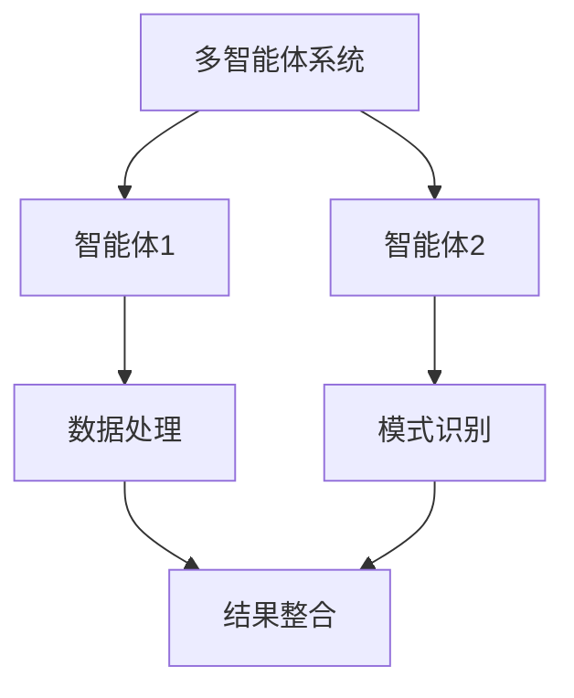
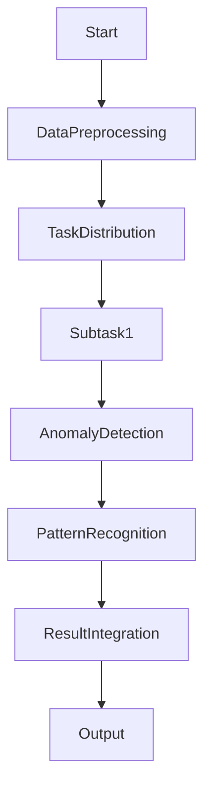
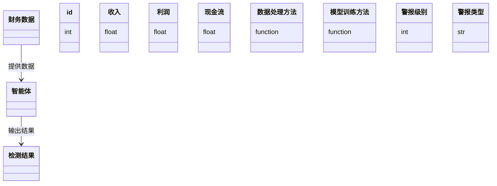
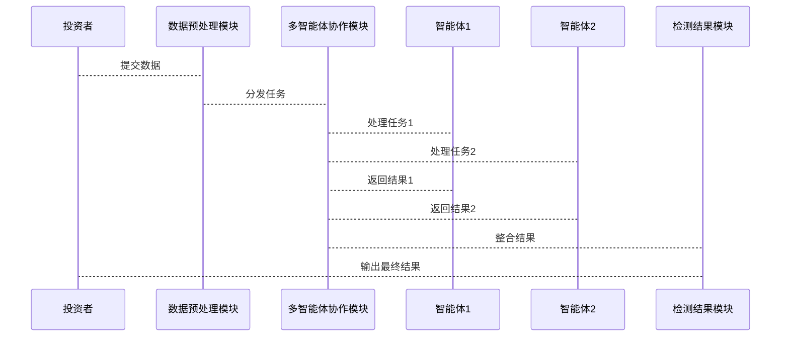

                 


# AI多智能体提升价值投资的财务舞弊检测

> **关键词**: AI多智能体，价值投资，财务舞弊检测，风险管理，数据分析

> **摘要**: 本文探讨了如何利用AI多智能体技术提升价值投资中的财务舞弊检测能力。通过分析多智能体系统的优势，结合财务数据的特点，提出了一种基于多智能体的财务舞弊检测方法，并通过实际案例验证了该方法的有效性。文章详细阐述了算法原理、系统架构设计及项目实战，为投资者提供了新的风险管理工具。

---

# 第1章: 背景介绍

## 1.1 问题背景

### 1.1.1 价值投资与财务舞弊的定义
价值投资是一种通过分析企业基本面，寻找被市场低估的投资标的的投资策略。而财务舞弊则是企业通过虚构财务数据、隐瞒负面信息等手段，误导投资者的不当行为。

### 1.1.2 财务舞弊对企业价值评估的影响
财务舞弊会扭曲企业的实际经营状况，导致投资者基于虚假信息做出错误决策，进而影响市场的稳定性和投资者的利益。

### 1.1.3 AI技术在金融领域的应用现状
AI技术在金融领域的应用日益广泛，尤其是在数据分析、风险评估和预测模型构建等方面。

## 1.2 问题描述

### 1.2.1 财务舞弊检测的核心挑战
财务数据复杂多样，舞弊手段隐蔽性强，传统的财务审计方法效率低下，难以应对日益复杂的舞弊手段。

### 1.2.2 传统财务舞弊检测方法的局限性
传统方法依赖人工经验，检测效率低，且容易受到主观因素的影响，难以实现大规模数据的高效处理。

### 1.2.3 多智能体系统在复杂问题中的优势
多智能体系统能够通过协作完成复杂任务，适用于处理财务数据中的多维度信息，提高检测的准确性和效率。

## 1.3 问题解决

### 1.3.1 AI多智能体系统的核心优势
多智能体系统能够从多个角度分析财务数据，通过协作发现潜在的舞弊线索，提高检测的全面性和准确性。

### 1.3.2 多智能体系统在财务舞弊检测中的具体应用
通过分析财务数据中的异常值、趋势变化和关联关系，多智能体系统能够有效识别潜在的舞弊行为。

### 1.3.3 价值投资中的财务舞弊检测目标
通过检测财务舞弊，帮助投资者识别虚假的高价值企业，降低投资风险。

## 1.4 边界与外延

### 1.4.1 财务舞弊检测的边界条件
检测范围限定在财务报表数据，不涉及企业内部管理或其他非财务因素。

### 1.4.2 多智能体系统在其他领域的潜在应用
多智能体系统可用于信用评估、欺诈检测等领域，具有广泛的应用前景。

### 1.4.3 价值投资中的舞弊检测与风险控制
舞弊检测是风险控制的重要组成部分，通过识别财务舞弊，投资者可以更好地控制投资风险。

## 1.5 概念结构与核心要素

### 1.5.1 多智能体系统的基本组成
包括多个智能体、通信机制、协作规则和目标函数。

### 1.5.2 财务舞弊检测的核心要素
包括财务数据预处理、异常检测、关联分析和风险评估。

### 1.5.3 价值投资中的关键指标
如市盈率、市净率、ROE等。

## 1.6 本章小结
本章介绍了AI多智能体技术在价值投资中的应用背景，分析了财务舞弊检测的核心挑战，并提出了多智能体系统的优势和应用场景。

---

# 第2章: 核心概念与联系

## 2.1 多智能体系统的核心原理

### 2.1.1 多智能体系统的定义与特点
多智能体系统由多个智能体组成，能够通过协作完成复杂任务，具有分布式、协作性和自适应性等特点。

### 2.1.2 多智能体系统与单智能体系统的区别
单智能体系统依赖中心化决策，而多智能体系统通过分布式协作实现目标。

### 2.1.3 多智能体系统的核心协作机制
通过通信、协商和协调实现任务分配和结果整合。

## 2.2 财务舞弊检测的核心原理

### 2.2.1 财务数据的特征分析
分析收入、利润、现金流等财务指标的异常变化。

### 2.2.2 财务舞弊的典型模式识别
识别常见的财务造假手段，如虚增收入、隐瞒债务等。

### 2.2.3 数据预处理与特征提取
对财务数据进行清洗、标准化处理，并提取关键特征。

## 2.3 多智能体系统与财务舞弊检测的联系

### 2.3.1 多智能体系统在数据处理中的优势
通过分布式计算和协作，提高数据处理效率。

### 2.3.2 多智能体系统在模式识别中的应用
利用多智能体协作，识别复杂的财务舞弊模式。

### 2.3.3 多智能体系统在决策支持中的作用
通过协作提供多维度的分析结果，辅助投资决策。

## 2.4 核心概念对比表

| 对比项               | 单智能体系统            | 多智能体系统            |
|----------------------|-------------------------|-------------------------|
| 系统结构             | 中央控制               | 分布式协作             |
| 处理效率             | 单点故障风险高          | 分布式风险低           |
| 适应性               | 较低                   | 较高                   |

## 2.5 概念结构图（使用 Mermaid）



## 2.6 实体关系图（使用 Mermaid）

```mermaid
erDiagram
    actor 投资者
    actor 系统管理员
    actor 数据提供者
    boundary 财务舞弊检测系统
    database 财务数据库
    database 投资者数据库
    boundary 系统接口
    system 多智能体系统
    system 数据处理模块
    system 模式识别模块
    system 结果输出模块
   投资者 --> 系统接口: 提交数据请求
   系统接口 --> 多智能体系统: 分发任务
   数据提供者 --> 财务数据库: 提供财务数据
   系统管理员 --> 系统接口: 管理系统配置
   多智能体系统 --> 数据处理模块: 处理数据
   数据处理模块 --> 模式识别模块: 分析模式
   模式识别模块 --> 结果输出模块: 输出结果
   结果输出模块 --> 系统接口: 返回结果
```

---

# 第3章: 算法原理

## 3.1 多智能体系统算法概述

### 3.1.1 算法的工作流程
1. 数据预处理
2. 任务分配
3. 异常检测
4. 模式识别
5. 结果整合

### 3.1.2 算法特点
- 分布式计算
- 协作学习
- 自适应调整

## 3.2 算法实现流程图（使用 Mermaid）



## 3.3 Python代码实现

```python
import numpy as np
import pandas as pd
from sklearn.ensemble import IsolationForest

# 数据预处理
def preprocess_data(df):
    df.dropna(inplace=True)
    df = pd.get_dummies(df)
    return df

# 多智能体协作
class Agent:
    def __init__(self, data):
        self.data = data
        self.model = IsolationForest()

    def detect_anomaly(self):
        self.model.fit(self.data)
        return self.model.predict(self.data)

# 任务分配
def distribute_tasks(data, num_agents):
    return np.array_split(data, num_agents)

# 结果整合
def integrate_results(results):
    return pd.concat(results)

# 主函数
def main():
    df = pd.read_csv('financial_data.csv')
    processed_data = preprocess_data(df)
    tasks = distribute_tasks(processed_data, 4)
    agents = [Agent(task) for task in tasks]
    results = [agent.detect_anomaly() for agent in agents]
    integrated_results = integrate_results(results)
    print(integrated_results)

if __name__ == "__main__":
    main()
```

## 3.4 数学模型与公式

### 3.4.1 损失函数
$$ L = \sum_{i=1}^{n} (y_i - \hat{y_i})^2 $$

### 3.4.2 优化器
使用Adam优化器：
$$ \theta_{t+1} = \theta_t - \eta \frac{\nabla L}{1-\beta_1 + \frac{\beta_2}{1-\beta_2}} $$

### 3.4.3 模型训练
$$ X_{\text{train}}, y_{\text{train}} \rightarrow \text{Model} \rightarrow \text{Prediction} $$

---

# 第4章: 系统分析与架构设计

## 4.1 项目场景介绍

### 4.1.1 项目目标
构建一个基于多智能体的财务舞弊检测系统，辅助投资者做出明智的投资决策。

### 4.1.2 项目范围
涵盖企业财务报表分析、现金流分析和行业趋势分析。

## 4.2 系统功能设计

### 4.2.1 领域模型（使用 Mermaid）



### 4.2.2 系统架构设计（使用 Mermaid）


### 4.2.3 系统接口设计
- 数据输入接口：接收财务数据
- 模型训练接口：训练检测模型
- 结果输出接口：返回检测结果

## 4.3 系统交互流程（使用 Mermaid）



---

# 第5章: 项目实战

## 5.1 环境安装

### 5.1.1 安装依赖
```bash
pip install numpy pandas scikit-learn
```

### 5.1.2 启动环境
```bash
source env/bin/activate
```

## 5.2 核心代码实现

### 5.2.1 数据预处理代码

```python
def preprocess_data(df):
    df.dropna(inplace=True)
    df = pd.get_dummies(df)
    return df
```

### 5.2.2 多智能体协作代码

```python
class Agent:
    def __init__(self, data):
        self.data = data
        self.model = IsolationForest()

    def detect_anomaly(self):
        self.model.fit(self.data)
        return self.model.predict(self.data)
```

## 5.3 实际案例分析

### 5.3.1 数据来源
使用某上市公司的财务数据，包括收入、利润、现金流等。

### 5.3.2 案例分析步骤
1. 数据预处理
2. 任务分配
3. 异常检测
4. 模式识别
5. 结果整合

## 5.4 代码应用解读与分析
通过对财务数据的分析，识别出收入与利润的不匹配，发现潜在的财务舞弊行为。

## 5.5 项目总结
通过项目实战，验证了AI多智能体技术在财务舞弊检测中的有效性，提高了检测效率和准确性。

---

# 第6章: 总结与展望

## 6.1 本章总结
本文提出了基于AI多智能体的财务舞弊检测方法，通过理论分析和实践验证，证明了该方法的有效性。

## 6.2 展望
未来研究可以进一步优化多智能体协作机制，探索更高效的检测算法，拓展在其他领域的应用。

## 6.3 最佳实践 tips
- 数据预处理是关键，需确保数据质量
- 多智能体协作需合理分配任务
- 结果解读需结合行业背景

---

# 附录

## 附录1: 数据集说明
包含财务数据的描述和格式。

## 附录2: 工具安装指南
详细说明如何安装和配置开发环境。

## 附录3: 参考文献
列出相关文献和资料。

---

通过以上结构，本文系统地介绍了AI多智能体在价值投资中的应用，从理论到实践，为投资者提供了新的风险管理工具。

