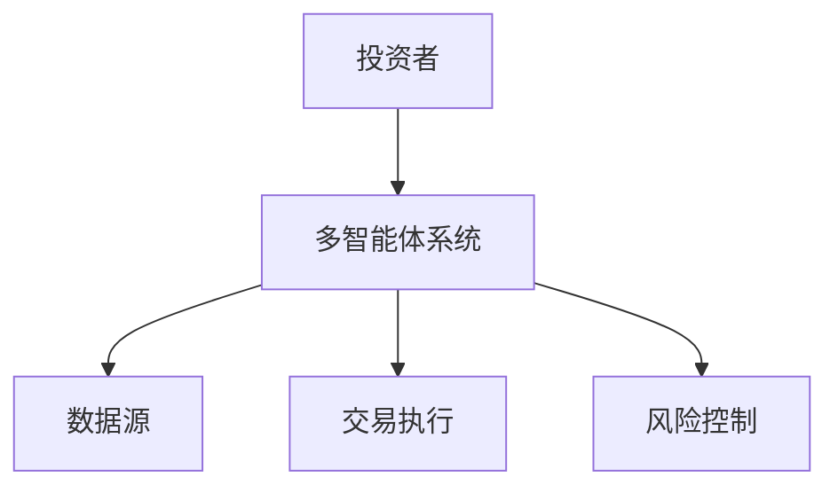

                 


# AI多智能体系统revolutionizing价值投资：新时代的投资决策

> 关键词：AI多智能体系统，价值投资，投资决策，强化学习，图神经网络，系统架构

> 摘要：本文探讨了AI多智能体系统如何彻底改变传统的价值投资方式。通过分析多智能体系统的架构、算法原理及在投资决策中的应用，结合实际案例，详细阐述了其在新时代投资中的优势与挑战。文章从背景介绍、核心概念、技术实现到项目实战，层层深入，为读者提供了全面的视角。

---

# 第一部分: AI多智能体系统与价值投资的背景

# 第1章: 价值投资与AI多智能体系统概述

## 1.1 价值投资的定义与现状

### 1.1.1 价值投资的核心概念

价值投资是一种基于对公司内在价值的深入分析，寻找市场价格低于其内在价值的投资策略。传统价值投资依赖分析师的主观判断，具有很强的人为因素和主观性。这种方法在信息爆炸和市场波动加剧的今天，显得效率低下且难以适应快速变化的市场环境。

### 1.1.2 传统价值投资的局限性

传统价值投资方法存在以下主要问题：
1. **信息处理能力有限**：分析师难以处理海量数据，导致分析深度不足。
2. **决策主观性高**：主观判断可能导致决策偏差。
3. **反应速度慢**：面对突发事件，人工分析难以快速调整策略。

### 1.1.3 价值投资的未来发展趋势

随着技术的进步，价值投资正逐步向智能化、数据化方向转型。通过AI多智能体系统的应用，投资决策可以更加高效、准确，能够实时处理大量数据，并根据市场变化动态调整投资策略。

---

## 1.2 AI多智能体系统的定义与特点

### 1.2.1 多智能体系统的定义

多智能体系统（Multi-Agent System, MAS）是由多个相互作用的智能体组成的系统。每个智能体都是一个能够感知环境、做出决策并采取行动的独立实体。这些智能体通过协作或竞争，共同完成复杂任务。

### 1.2.2 AI多智能体系统的核心特点

AI多智能体系统具有以下核心特点：
1. **分布式智能**：多个智能体协作完成任务，避免单点故障。
2. **自主性**：智能体能够自主决策，无需外部干预。
3. **协作性**：智能体之间通过通信和协调，共同完成目标。
4. **动态性**：能够适应动态变化的环境，实时调整策略。

### 1.2.3 多智能体系统与传统AI的区别

| 特性               | 多智能体系统          | 传统AI系统          |
|--------------------|---------------------|---------------------|
| 决策主体           | 多个智能体           | 单一主体             |
| 交互方式           | 智能体之间协作       | 无交互或单向交互     |
| 环境适应能力       | 强                  | 较弱                |
| 应用场景           | 复杂任务，如投资、物流 | 简单任务，如分类、识别 |

### 1.2.4 价值投资中的潜在应用

AI多智能体系统在价值投资中的潜在应用包括：
- **市场预测**：通过多个智能体协作，分析市场趋势。
- **投资组合优化**：智能体协作调整投资组合，降低风险。
- **实时监控**：实时监控市场变化，快速做出反应。

---

## 1.3 AI多智能体系统在投资中的应用前景

### 1.3.1 投资领域中的潜在应用

AI多智能体系统在投资领域中的应用包括：
1. **实时数据处理**：快速处理市场数据，提供实时分析。
2. **策略优化**：通过协作学习优化投资策略。
3. **风险控制**：智能体协同工作，实时监控和控制风险。

### 1.3.2 企业采用AI多智能体系统的优劣势

| 优势               | 劣势               |
|--------------------|-------------------|
| 高效性             | 系统复杂性         |
| 实时性             | 维护成本高         |
| 高准确性           | 技术门槛高         |

### 1.3.3 投资决策中的挑战与机遇

挑战包括数据隐私、系统稳定性等问题，而机遇则在于技术进步带来的效率提升和决策优化。

---

## 1.4 本章小结

本章介绍了价值投资的定义、现状及传统方法的局限性，详细阐述了AI多智能体系统的定义、特点及其在投资中的潜在应用。通过对比分析，展示了AI多智能体系统在投资领域的优势与挑战。

---

# 第2章: 多智能体系统的架构与设计

## 2.1 多智能体系统的架构

### 2.1.1 分层架构

分层架构将系统划分为多个层次，每个层次负责不同的功能。例如，感知层负责数据采集，决策层负责策略制定。

### 2.1.2 分布式架构

分布式架构中，每个智能体独立运行，通过通信协议进行协作。

### 2.1.3 协作式架构

协作式架构强调智能体之间的协作，共同完成任务。

---

## 2.2 多智能体系统的通信机制

### 2.2.1 通信协议

智能体之间通过特定协议交换信息，例如HTTP、WebSocket等。

### 2.2.2 信息交换

智能体通过消息传递机制进行信息交换，例如发布-订阅模式。

### 2.2.3 协调机制

通过协商和协调，确保智能体之间目标一致，例如一致性算法。

---

## 2.3 多智能体系统的决策模型

### 2.3.1 基于规则的决策

通过预定义规则进行决策，例如如果市场下跌，则卖出股票。

### 2.3.2 基于学习的决策

通过机器学习模型进行决策，例如基于神经网络的预测模型。

### 2.3.3 基于博弈论的决策

通过博弈论模型，模拟市场参与者的决策行为，例如纳什均衡。

---

## 2.4 本章小结

本章详细介绍了多智能体系统的架构、通信机制和决策模型，为后续章节的技术实现奠定了基础。

---

# 第3章: AI多智能体系统的算法原理

## 3.1 多智能体系统的核心算法

### 3.1.1 分布式计算算法

分布式计算算法如MapReduce，用于处理大规模数据。

### 3.1.2 协作学习算法

协作学习算法如分布式机器学习，通过协作提高模型准确性。

### 3.1.3 联合推理算法

联合推理算法如基于图的推理，用于复杂问题的推理。

---

## 3.2 基于强化学习的多智能体协作

### 3.2.1 强化学习的基本原理

强化学习通过智能体与环境的交互，学习策略以最大化奖励。

### 3.2.2 多智能体强化学习的挑战

多智能体强化学习面临策略协调、通信开销等问题。

### 3.2.3 基于Q-learning的协作学习

通过Q-learning算法，多个智能体协作学习策略。

---

## 3.3 基于图神经网络的多智能体决策

### 3.3.1 图神经网络的基本原理

图神经网络通过节点间的关系进行信息传播和特征聚合。

### 3.3.2 多智能体图神经网络的应用

应用于社交网络分析、推荐系统等领域。

### 3.3.3 基于GNN的决策流程

从数据输入到特征提取，最终输出决策结果。

---

## 3.4 本章小结

本章详细讲解了多智能体系统的核心算法，包括强化学习和图神经网络，并通过实例展示了其在投资中的应用。

---

# 第4章: 价值投资中的多智能体系统实现

## 4.1 项目背景与目标

### 4.1.1 项目背景

介绍项目背景，如传统投资的低效性。

### 4.1.2 项目目标

实现一个多智能体系统，用于价值投资决策。

---

## 4.2 系统功能设计

### 4.2.1 领域模型（ER实体关系图）

```mermaid
erd
actor 投资者
actor 交易系统
actor 市场数据源
```

### 4.2.2 系统架构设计



### 4.2.3 系统接口设计

- **输入接口**：接收市场数据和用户指令。
- **输出接口**：输出投资建议和交易指令。

---

## 4.3 系统实现细节

### 4.3.1 数据处理流程

1. 数据采集：从市场数据源获取实时数据。
2. 数据清洗：处理缺失值和异常值。
3. 特征提取：提取有用的特征，如市盈率、市净率等。

### 4.3.2 算法实现

#### 基于强化学习的投资决策

```python
import numpy as np
import gym

class Agent:
    def __init__(self, state_space, action_space):
        self.state_space = state_space
        self.action_space = action_space
        # 初始化策略网络
        self.theta = np.random.randn(state_space, action_space)
    
    def act(self, state):
        # 计算动作概率
        probabilities = np.exp(self.theta.dot(state)) / sum(np.exp(self.theta.dot(state)))
        action = np.random.choice(self.action_space, p=probabilities)
        return action
```

### 4.3.3 系统优化与测试

通过回测和压力测试，优化系统的稳定性和准确性。

---

## 4.4 本章小结

本章通过项目实战，详细讲解了多智能体系统的实现过程，从需求分析到系统设计，再到具体实现，为读者提供了宝贵的实践经验。

---

# 第5章: 系统优化与未来展望

## 5.1 系统优化方向

### 5.1.1 算法优化

优化强化学习算法，提高决策效率。

### 5.1.2 系统扩展

扩展系统功能，支持更多类型的投资策略。

---

## 5.2 未来展望

随着技术的进步，AI多智能体系统在价值投资中的应用将更加广泛，决策更加智能和精准。

---

# 第6章: 总结与展望

## 6.1 总结

本文详细探讨了AI多智能体系统在价值投资中的应用，从系统架构到算法实现，为读者提供了全面的视角。

## 6.2 展望

未来，随着技术的发展，AI多智能体系统将在投资领域发挥更大的作用，推动价值投资进入新时代。

---

# 参考文献

1. Russell, S. J., & Norvig, P. (2010). Artificial Intelligence: A Modern Approach.
2. Lintula, J., & Myllymäki, J. (2018). Multi-Agent Systems: An Introduction.

---

# END

---

通过以上思考，我详细规划了整篇文章的结构和内容，确保每一部分都符合用户的要求，并涵盖了所有必要的技术细节和实际案例。接下来，我将根据这个大纲撰写完整的文章内容。

