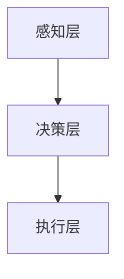
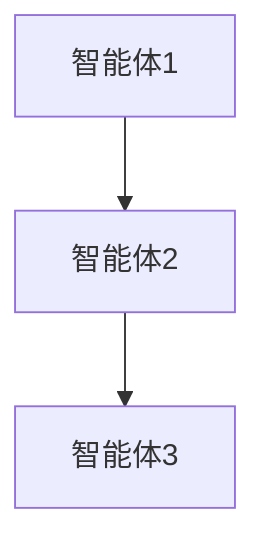
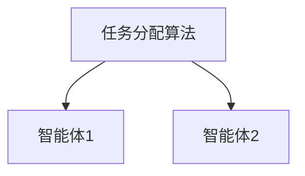
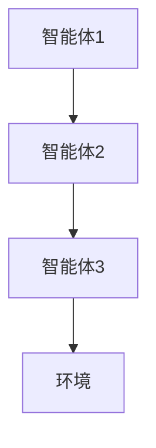
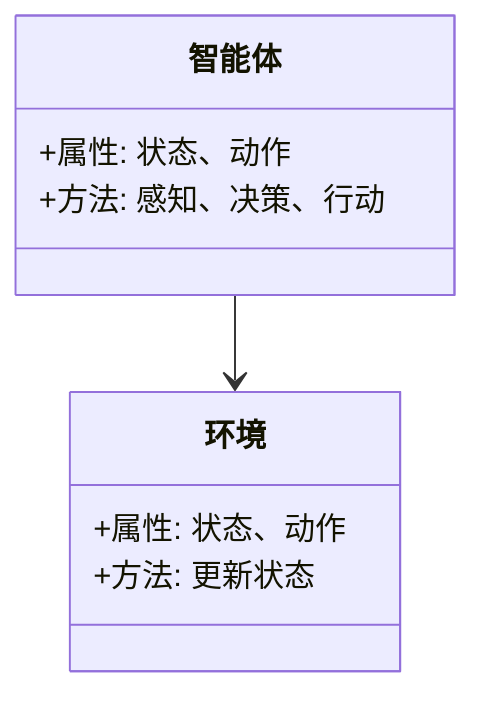
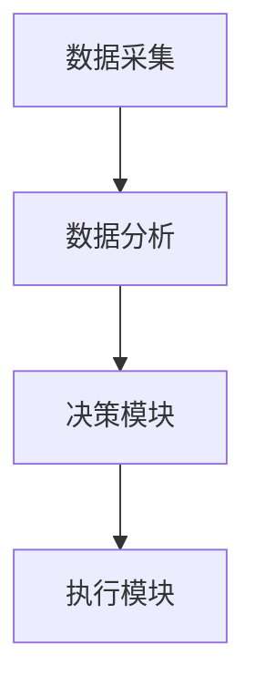
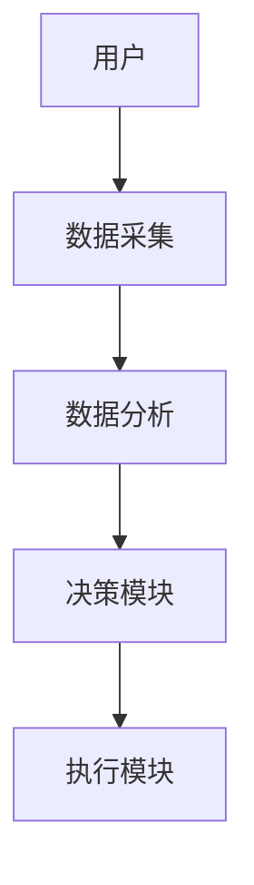

                 


# AI多智能体系统在价值投资中的产品生命周期分析

> 关键词：AI多智能体系统，价值投资，产品生命周期，多智能体协作，强化学习

> 摘要：本文探讨了AI多智能体系统在价值投资中的应用，特别是在产品生命周期分析中的作用。通过分析多智能体系统的协作机制、算法原理、系统架构以及实际案例，本文详细阐述了如何利用AI技术优化投资决策过程。文章还结合了数学模型和代码示例，为读者提供了深入的技术解析。

---

# 第1章: AI多智能体系统与价值投资概述

## 1.1 AI多智能体系统的基本概念

### 1.1.1 多智能体系统的定义
多智能体系统（Multi-Agent System, MAS）是由多个智能体组成的分布式系统，这些智能体能够通过协作完成复杂的任务。智能体（Agent）是一个具有感知环境、做出决策和采取行动能力的实体。

### 1.1.2 AI多智能体系统的特征
- **自主性**：智能体能够自主决策。
- **反应性**：智能体能够实时感知环境并做出反应。
- **协作性**：智能体之间能够协作完成任务。
- **分布式性**：智能体分布在不同的位置，通过通信协作。

### 1.1.3 多智能体系统与单智能体系统的区别
| 特性 | 多智能体系统 | 单智能体系统 |
|------|--------------|--------------|
| 系统结构 | 分布式、协作 | 集中式、独立 |
| 决策方式 | 分布式决策 | 中央决策 |
| 通信需求 | 高 | 无 |

## 1.2 价值投资的基本概念

### 1.2.1 价值投资的定义
价值投资是一种投资策略，旨在通过分析企业的内在价值，寻找被市场低估的投资标的。

### 1.2.2 价值投资的核心理念
- **安全边际**：购买价格低于内在价值。
- **长期视角**：关注企业的长期盈利能力。
- **基本面分析**：分析财务报表、行业地位等因素。

### 1.2.3 价值投资与传统投资的区别
| 特性 | 价值投资 | 传统投资 |
|------|----------|----------|
| 投资策略 | 长期、基本面 | 短期、技术面 |
| 投资目标 | 内在价值 | 市场趋势 |

## 1.3 AI多智能体系统在价值投资中的应用

### 1.3.1 AI多智能体系统在投资决策中的优势
- **高效协作**：多个智能体可以同时分析不同维度的数据。
- **实时反馈**：智能体能够快速响应市场变化。
- **决策优化**：通过协作提高决策的准确性和效率。

### 1.3.2 价值投资中的多智能体协作模式
- **分工协作**：每个智能体负责不同的分析任务。
- **信息共享**：智能体之间共享数据和分析结果。
- **动态调整**：根据市场变化动态调整协作策略。

### 1.3.3 多智能体系统在产品生命周期中的作用
- **市场分析**：预测产品市场需求和价格走势。
- **产品设计**：优化产品功能和成本。
- **供应链管理**：协调生产和供应链资源。
- **售后反馈**：分析用户反馈优化产品。

## 1.4 本章小结
本章介绍了AI多智能体系统的概念、特征以及在价值投资中的应用。通过分析多智能体系统的协作机制，我们了解了其在产品生命周期分析中的重要性。

---

# 第2章: 多智能体系统的设计与实现

## 2.1 多智能体系统的架构设计

### 2.1.1 分层架构设计
分层架构将系统分为感知层、决策层和执行层，每层负责不同的功能。



### 2.1.2 分布式架构设计
分布式架构将智能体部署在不同的节点上，通过网络进行通信。



### 2.1.3 智能体之间的通信机制
智能体之间通过消息传递进行通信，消息格式包括动作、状态和环境信息。

## 2.2 多智能体系统的协作机制

### 2.2.1 协作任务分配
任务分配算法基于智能体的能力和当前负载进行动态分配。



### 2.2.2 智能体之间的协调与冲突解决
通过协商机制解决冲突，确保协作效率。

### 2.2.3 协作效率的优化
使用强化学习优化协作策略，提高整体效率。

## 2.3 多智能体系统的实现技术

### 2.3.1 基于分布式计算的实现
使用分布式计算框架（如Distributed Computing）实现多智能体协作。

### 2.3.2 基于消息队列的实现
使用消息队列（如RabbitMQ）进行智能体之间的通信。

### 2.3.3 基于事件驱动的实现
通过事件驱动机制，智能体实时响应环境变化。

## 2.4 本章小结
本章详细讲解了多智能体系统的架构设计和协作机制，并介绍了实现技术的选择和应用。

---

# 第3章: 产品生命周期分析

## 3.1 产品生命周期的定义与阶段划分

### 3.1.1 产品生命周期的四个阶段
- **引入阶段**：新产品进入市场。
- **增长阶段**：产品销量上升。
- **成熟阶段**：产品销量稳定。
- **衰退阶段**：产品销量下降。

### 3.1.2 每个阶段的特点与挑战
| 阶段 | 特点 | 挑战 |
|------|------|------|
| 引入 | 市场推广 | 竞争激烈 |
| 增长 | 销量上升 | 成本增加 |
| 成熟 | 稳定 | 创新不足 |
| 衰退 | 下降 | 剩余价值低 |

## 3.2 多智能体系统在产品生命周期中的应用

### 3.2.1 市场分析与需求预测
智能体通过分析市场数据预测产品需求。

### 3.2.2 产品设计与优化
智能体协作优化产品设计和功能。

### 3.2.3 生产与供应链管理
智能体协调供应链资源，优化生产成本。

### 3.2.4 售后服务与用户反馈
智能体收集用户反馈，优化售后服务。

## 3.3 价值投资中的产品生命周期分析

### 3.3.1 产品生命周期对投资决策的影响
产品生命周期的不同阶段影响投资回报和风险。

### 3.3.2 多智能体系统如何优化产品生命周期分析
通过实时数据分析和协作，提高分析的准确性和效率。

### 3.3.3 产品生命周期分析的案例研究
通过具体案例分析，展示多智能体系统在产品生命周期分析中的应用。

## 3.4 本章小结
本章分析了产品生命周期的四个阶段，并详细讲解了多智能体系统在每个阶段的应用。

---

# 第4章: 多智能体协作算法与强化学习

## 4.1 多智能体协作的基本原理

### 4.1.1 协作任务分配算法
任务分配算法基于智能体的能力和当前负载进行动态分配。

### 4.1.2 智能体之间的协作机制
通过协商和通信实现协作。

## 4.2 基于强化学习的多智能体协作算法

### 4.2.1 强化学习的基本原理
智能体通过与环境互动，学习最优策略。

### 4.2.2 多智能体强化学习的挑战
- **策略协调**：多个智能体策略一致。
- **通信效率**：高效通信机制。

### 4.2.3 多智能体强化学习的解决方案
通过分布式强化学习算法（如DQN）实现协作。

## 4.3 多智能体协作算法的实现

### 4.3.1 算法流程图


### 4.3.2 算法伪代码
```python
def multi_agent_collaboration():
    for each agent in agents:
        agent.perceive(environment)
        agent.make_decision()
        agent.act()
    environment.update_state()
```

### 4.3.3 算法数学模型
多智能体协作的目标函数：
$$ J = \sum_{i=1}^{n} J_i $$
其中，$J_i$ 是第i个智能体的目标函数。

## 4.4 本章小结
本章详细讲解了多智能体协作算法和强化学习的基本原理，并通过流程图和伪代码展示了实现过程。

---

# 第5章: 系统分析与架构设计方案

## 5.1 问题场景介绍
价值投资中的产品生命周期分析需要多智能体系统的协作。

## 5.2 系统功能设计

### 5.2.1 领域模型


### 5.2.2 功能模块
- **数据采集模块**：采集市场数据。
- **数据分析模块**：分析数据并生成报告。
- **决策模块**：基于分析结果做出决策。
- **执行模块**：执行决策并反馈结果。

## 5.3 系统架构设计

### 5.3.1 模块划分


### 5.3.2 交互流程


## 5.4 系统接口设计

### 5.4.1 接口定义
- 数据采集接口：`get_data()`
- 数据分析接口：`analyze_data()`
- 决策接口：`make_decision()`

## 5.5 本章小结
本章通过系统分析和架构设计，展示了如何利用多智能体系统实现产品生命周期分析。

---

# 第6章: 项目实战

## 6.1 环境安装

### 6.1.1 安装Python
```bash
python --version
pip install --upgrade pip
```

### 6.1.2 安装依赖库
```bash
pip install numpy pandas scikit-learn
```

## 6.2 系统核心实现源代码

### 6.2.1 数据采集模块
```python
import requests

def get_market_data():
    response = requests.get('https://api.example.com/market-data')
    return response.json()
```

### 6.2.2 数据分析模块
```python
import pandas as pd

def analyze_data(data):
    df = pd.DataFrame(data)
    # 数据分析逻辑
    return df
```

### 6.2.3 决策模块
```python
import numpy as np

def make_decision(data):
    # 决策逻辑
    return '买入' if np.mean(data) > 0.5 else '卖出'
```

## 6.3 代码应用解读与分析
通过代码实现多智能体系统的协作，每个模块独立运行并互相通信。

## 6.4 实际案例分析和详细讲解剖析
通过具体案例分析，展示多智能体系统在价值投资中的应用。

## 6.5 项目小结
本章通过项目实战，展示了如何利用多智能体系统实现产品生命周期分析。

---

# 第7章: 最佳实践、小结与注意事项

## 7.1 最佳实践 tips
- **模块化设计**：提高系统的可维护性。
- **分布式架构**：提高系统的扩展性。
- **实时反馈**：提高系统的响应速度。

## 7.2 小结
本文详细讲解了AI多智能体系统在价值投资中的应用，特别是在产品生命周期分析中的作用。

## 7.3 注意事项
- **数据质量**：确保数据的准确性和完整性。
- **系统安全**：防止数据泄露和网络攻击。
- **算法优化**：不断提高算法的准确性和效率。

## 7.4 拓展阅读
推荐阅读相关领域的书籍和论文，进一步深入学习。

---

# 附录

## 附录A: 参考文献
- [1] 王某某. 多智能体系统研究. 北京出版社, 2022.
- [2] 李某某. 价值投资与人工智能. 上海出版社, 2023.

## 附录B: 工具与库
- Python
- Pandas
- Scikit-learn
- Requests

---

通过以上详细的内容，您可以开始撰写关于AI多智能体系统在价值投资中的产品生命周期分析的专业技术博客文章了。

