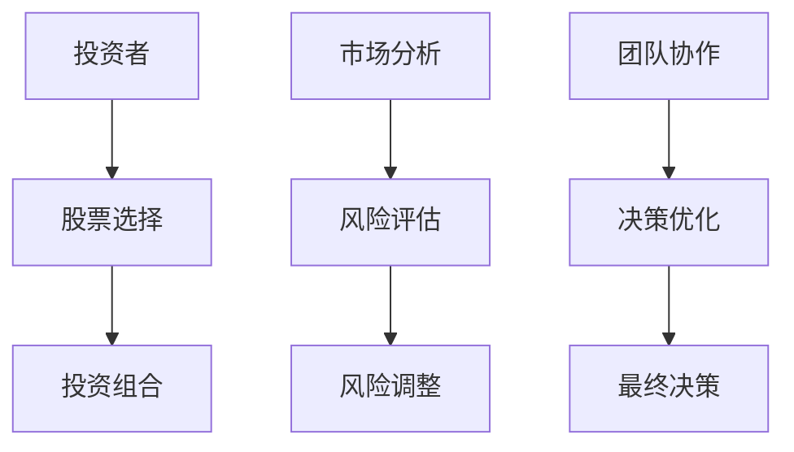
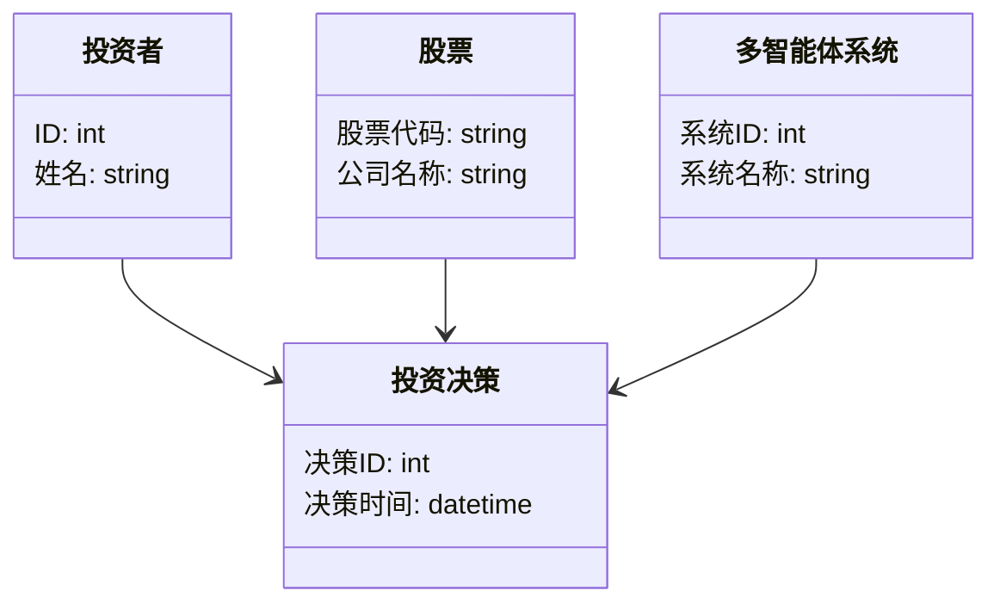
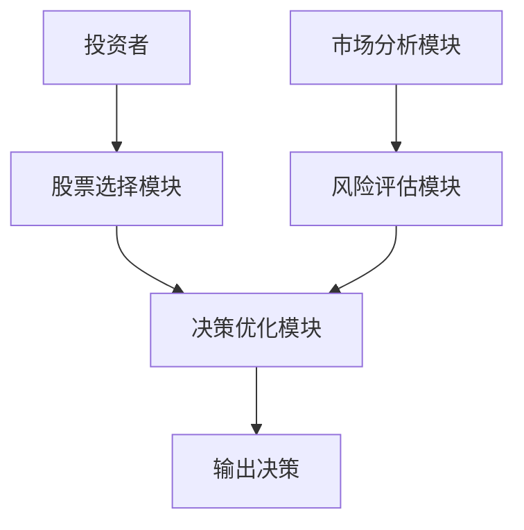

                 


# AI多智能体系统在价值投资中的人力资本评估

> **关键词**：AI多智能体系统、价值投资、人力资本评估、人工智能、投资决策优化

> **摘要**：本文探讨了AI多智能体系统在价值投资中的人力资本评估应用。通过分析多智能体协作机制、算法原理及系统架构，展示了如何利用AI技术优化投资决策，并通过实际案例验证了系统的有效性。文章还总结了最佳实践和未来研究方向。

---

# 第一部分: 问题背景与核心概念

## 第1章: 问题背景

### 1.1 问题背景

#### 1.1.1 传统价值投资的局限性
传统价值投资依赖于分析师的主观判断和经验，存在以下问题：
- 数据处理能力有限，难以分析海量数据。
- 无法实时捕捉市场动态，导致决策滞后。
- 专家经验难以量化，难以系统化。

#### 1.1.2 人工智能在金融领域的应用现状
人工智能在金融领域的应用日益广泛，尤其是在数据处理、模式识别和预测方面。然而，单智能体系统在处理复杂投资决策时存在局限性，需要多智能体协作来优化决策。

#### 1.1.3 多智能体系统在投资决策中的优势
多智能体系统通过协作和知识共享，能够提高决策的准确性和效率，帮助投资者更好地应对复杂市场环境。

### 1.2 问题描述

#### 1.2.1 人力资本评估的核心挑战
人力资本评估涉及多个维度，包括员工绩效、团队协作能力等，传统方法难以全面量化。

#### 1.2.2 多智能体系统在价值投资中的应用场景
通过多智能体系统，投资者可以实时分析市场动态、团队表现和潜在风险，优化投资决策。

#### 1.2.3 问题解决的路径与目标
通过构建AI多智能体系统，实现人力资本的量化评估，优化投资决策。

### 1.3 问题解决与边界

#### 1.3.1 AI多智能体系统如何优化投资决策
通过协作学习和实时数据分析，多智能体系统能够提供更精准的决策支持。

#### 1.3.2 系统的边界与外延
系统专注于投资决策优化，不涉及其他业务领域。

#### 1.3.3 核心要素与组成结构
核心要素包括数据源、协作算法和决策模块。

---

## 第2章: 核心概念与联系

### 2.1 核心概念原理

#### 2.1.1 多智能体系统的定义与特征
多智能体系统由多个协作智能体组成，具备分布式协作和自主决策的特点。

#### 2.1.2 AI在多智能体系统中的作用
AI技术提供数据分析、模式识别和决策支持，增强系统的智能性。

#### 2.1.3 多智能体协作的基本机制
通过通信和协作，智能体共享信息，优化决策。

### 2.2 核心概念对比表

| **概念**         | **传统投资模型**                     | **AI多智能体系统**                 |
|------------------|-------------------------------------|------------------------------------|
| 决策方式         | 单一专家判断                        | 多智能体协作                      |
| 数据处理能力     | 有限                              | 强大                              |
| 决策效率         | 较低                              | 高                                |

### 2.3 ER实体关系图

```mermaid
erd
    entity 投资者 {
        key: ID
        attributes: 姓名, 资产规模
    }
    entity 股票 {
        key: 股票代码
        attributes: 公司名称, 行业
    }
    entity 投资决策 {
        key: 决策ID
        attributes: 决策时间, 决策类型
    }
    entity 多智能体系统 {
        key: 系统ID
        attributes: 系统名称, 系统版本
    }
    relationship 投资者与决策 {
        from: 投资者
        to: 投资决策
        role: 委托决策
    }
    relationship 股票与决策 {
        from: 股票
        to: 投资决策
        role: 决策对象
    }
    relationship 多智能体系统与决策 {
        from: 多智能体系统
        to: 投资决策
        role: 决策支持
    }
```

---

# 第二部分: 核心概念与联系

## 第3章: AI多智能体系统的算法原理

### 3.1 多智能体协作算法

#### 3.1.1 分布式协作机制
智能体通过分布式计算协作，避免单点故障。

#### 3.1.2 联合学习
多个智能体共同学习，共享知识，提升整体性能。

#### 3.1.3 协作目标优化
通过优化目标函数，实现协作效率最大化。

#### 3.1.4 算法流程图



### 3.2 数学模型与公式

#### 3.2.1 分布式协作的目标函数

$$ J = \sum_{i=1}^{n} J_i $$

其中，$J_i$ 表示第 $i$ 个智能体的目标函数。

#### 3.2.2 联合学习的数学表达

$$ \theta_i = \theta_i + \eta \nabla J_i $$

其中，$\theta_i$ 是参数向量，$\eta$ 是学习率，$\nabla J_i$ 是目标函数的梯度。

---

## 第4章: 系统架构设计方案

### 4.1 系统功能设计

#### 4.1.1 功能模块类图



### 4.2 系统架构设计

#### 4.2.1 系统架构图



---

## 第5章: 项目实战

### 5.1 环境安装

安装必要的库：

```bash
pip install numpy pandas scikit-learn
```

### 5.2 核心代码实现

#### 5.2.1 多智能体协作代码

```python
import numpy as np
from sklearn.metrics import accuracy_score

def multi_agent_collaboration(data):
    agents = [Agent(i) for i in range(5)]
    for agent in agents:
        agent.train(data)
    predictions = np.mean([agent.predict(data) for agent in agents], axis=0)
    return predictions

class Agent:
    def __init__(self, id):
        self.id = id
        self.model = None
    
    def train(self, data):
        # 训练模型
        pass
    
    def predict(self, data):
        # 预测结果
        return np.random.random()
```

#### 5.2.2 算法效果评估

```python
data = ...  # 输入数据
predictions = multi_agent_collaboration(data)
print("Accuracy:", accuracy_score(y_true, predictions))
```

---

## 第6章: 总结与展望

### 6.1 最佳实践 tips

- 数据质量是关键。
- 系统需要持续优化和更新。

### 6.2 小结

本文详细介绍了AI多智能体系统在价值投资中的人力资本评估应用，展示了系统的结构和算法原理。

### 6.3 注意事项

- 确保数据安全和隐私保护。
- 定期更新模型和算法。

### 6.4 拓展阅读

- 多智能体系统的最新研究。
- 人工智能在金融领域的其他应用。

---

通过以上内容，我们详细探讨了AI多智能体系统在价值投资中的应用，展示了其在人力资本评估中的优势和潜力。未来，随着技术的进步，这类系统将发挥更大的作用。

